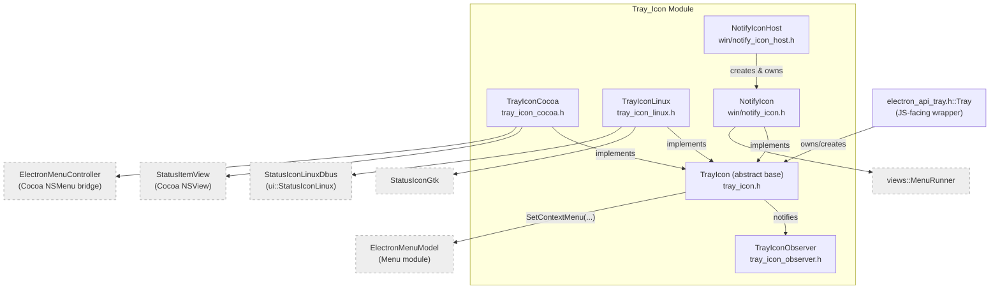
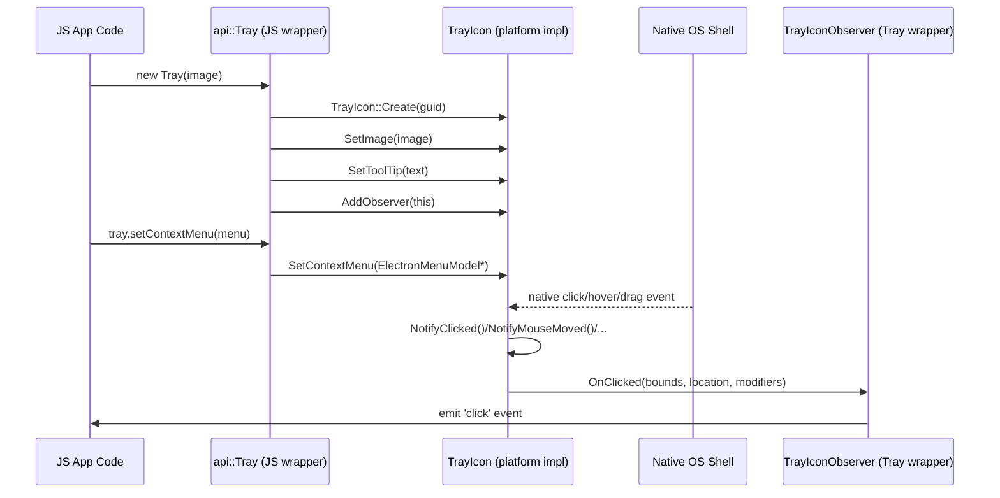

# Tray Icon Module

## 1. Purpose

The **Tray Icon** module implements Electron's cross-platform *system tray* (a.k.a. "status bar" / "notification area") support. It defines a single abstract interface, `electron::TrayIcon`, and provides a concrete implementation for each supported desktop platform:

| Platform | Implementation | Backing Native API |
|---|---|---|
| macOS | `TrayIconCocoa` | `NSStatusItem` / Cocoa |
| Linux | `TrayIconLinux` | GTK `StatusIconGtk` or D-Bus `StatusIconLinuxDbus` (via `ui::StatusIconLinux`) |
| Windows | `NotifyIcon` (managed by `NotifyIconHost`) | Win32 Shell Notification Icon API (`Shell_NotifyIcon`) |

This module sits underneath the public `Tray` JS API (`shell/browser/api/electron_api_tray.h`, documented in the [Native Window & Menu UI module](shell_browser_api_window_ui_tray.md)), which is what application/renderer code interacts with through `new Tray(icon)`. The `Tray_Icon` module itself contains no V8/gin bindings — it is pure C++ platform-abstraction code invoked by the JS-facing `Tray` wrapper.

## 2. Architecture Overview

**Key design points:**

- `TrayIcon` is a factory-constructed (`TrayIcon::Create(guid)`), platform-selected abstract base class. Callers program against this interface only.
- All user interaction (clicks, drags, balloon events, mouse move) is funneled through the `Notify*` methods on `TrayIcon`, which broadcast to registered `TrayIconObserver` instances via a `base::ObserverList`. This decouples the platform-specific event source from the (JS-facing) consumer.
- Context menus are represented platform-independently via `ElectronMenuModel` (see the [Menu (Model & Views)](Menu_%28Model_%26_Views%29.md) documentation), letting each platform backend render/host the menu using its native widget toolkit (Cocoa `NSMenu`, GTK menu, or `views::MenuRunner`).
- Windows uniquely requires a **host/multiplexer** (`NotifyIconHost`) because all tray icons on that platform share a single hidden message-only window (`HWND`) that receives the tray's Win32 messages; the host dispatches each message to the correct `NotifyIcon` instance by icon ID.
- macOS additionally supports `SetTitle`/`GetTitle` and double-click suppression (`SetIgnoreDoubleClickEvents`), which are macOS-only affordances of `NSStatusItem` and are declared as `#if BUILDFLAG(IS_MAC)`-guarded virtuals on the base class.

## 3. Sub-modules

| Sub-module | Description | Documentation |
|---|---|---|
| **Core & Observer** | The abstract `TrayIcon` interface, its nested `BalloonOptions`/`TitleOptions` structs, event notification plumbing, and the `TrayIconObserver` callback interface implemented by consumers. | [Tray_Icon_core.md](Tray_Icon_core.md) |
| **macOS Backend** | `TrayIconCocoa`, wrapping `NSStatusItem` via the `StatusItemView` custom view and `ElectronMenuController` for native context menus. | [Tray_Icon_macos.md](Tray_Icon_macos.md) |
| **Linux Backend** | `TrayIconLinux`, delegating to either GTK (`StatusIconGtk`) or D-Bus StatusNotifierItem (`StatusIconLinuxDbus`) depending on desktop environment support. | [Tray_Icon_linux.md](Tray_Icon_linux.md) |
| **Windows Backend** | `NotifyIcon` + `NotifyIconHost`, implementing the tray icon on top of the Win32 Shell notification-area API with a shared message window and mouse enter/exit detection. | [Tray_Icon_windows.md](Tray_Icon_windows.md) |

## 4. Typical Lifecycle / Data Flow

## 5. Relationship to Other Modules

- **[Native Window & Menu Management](Native_Window_%26_Menu_Management.md)** — hosts the JS-facing `Tray` gin wrapper (`electron_api_tray.h`) that owns a `TrayIcon` instance and forwards JS calls (`setImage`, `setToolTip`, `setContextMenu`, `popUpContextMenu`, …) to it; also the source of `ElectronMenuModel`, `Handle<T>`, and `Image` types used by the tray context menu and icon image.
- **[Menu (Model & Views)](Menu_%28Model_%26_Views%29.md)** — supplies `ElectronMenuModel`, the cross-platform menu representation passed to `SetContextMenu`/`PopUpContextMenu`.
- **[Common Native Gin Infrastructure](Common_Native_Gin_Infrastructure.md)** — supplies `gfx` geometry converters (`Point`, `Rect`), image types (`NativeImage`/`gfx::Image`), and general gin/V8 plumbing used indirectly by the JS `Tray` wrapper that sits atop this module.
- **[GTK UI](GTK_UI.md)** — `TrayIconLinux` reuses `StatusIconGtk` and `MenuGtk` from the GTK UI module for its GTK backend.
- **[Desktop UI Widgets & Dialogs](Desktop_UI_Widgets_%26_Dialogs.md)** (parent module) — Tray_Icon is one of several native UI widget families (alongside dialogs, DevTools UI, frame views, etc.) that make up Electron's native desktop UI layer.
