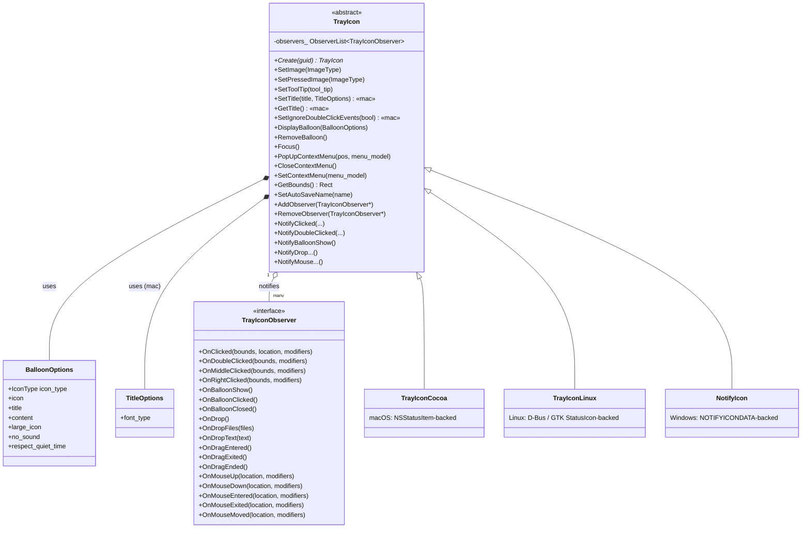
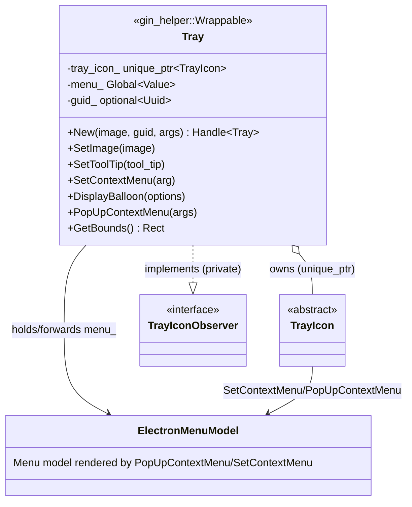
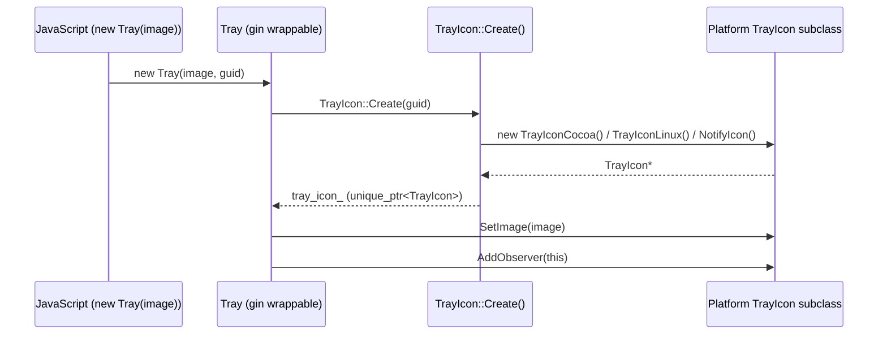
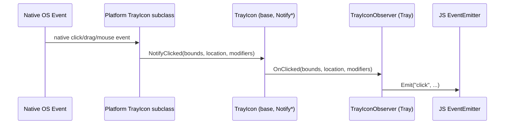
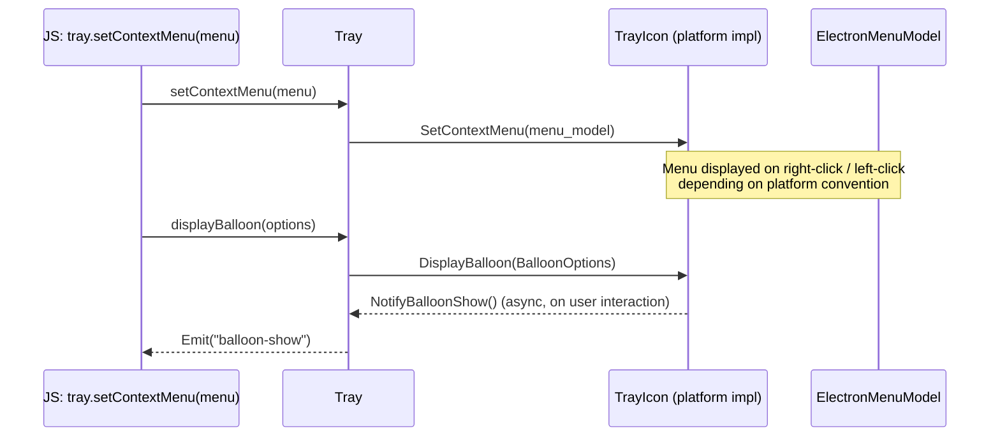

# Tray Icon Core

## Introduction

**Tray Icon Core** defines the platform-agnostic contract for Electron's system tray ("status bar") icon feature. It lives at `shell/browser/ui/tray_icon.h` and `shell/browser/ui/tray_icon_observer.h`, and consists of two primary pieces:

- **`TrayIcon`** — an abstract base class describing every operation a tray icon must support (setting an image/tooltip, showing balloons, popping up a context menu, reporting its screen bounds, etc.) plus a set of `Notify*` methods that translate low-level platform events into a uniform observer callback API.
- **`TrayIconObserver`** — the observer interface implemented by consumers (chiefly the JS-facing `Tray` API object) that receive click, drag, balloon, and mouse events from a `TrayIcon` instance.

This module is the **core contract** of the broader [Tray_Icon](Tray_Icon.md) subsystem. It contains no platform-specific rendering code; instead it is subclassed by one concrete implementation per platform:

| Platform | Implementation | Documentation |
|---|---|---|
| macOS | `TrayIconCocoa` | [Tray_Icon_macos.md](Tray_Icon_macos.md) |
| Linux | `TrayIconLinux` | [Tray_Icon_linux.md](Tray_Icon_linux.md) |
| Windows | `NotifyIcon` | [Tray_Icon_windows.md](Tray_Icon_windows.md) |

The module is consumed by the `Tray` gin-wrapped object (`shell/browser/api/electron_api_tray.h`), which is documented as part of [Native_Window_&_Menu_Management](Native_Window_&_Menu_Management.md) (sub-module `shell_browser_api_window_ui_tray`). `Tray` is the JavaScript-visible class exposed to Electron app developers via the public `Tray` API.

---

## Purpose & Responsibilities

1. **Abstract platform differences.** Windows, macOS, and Linux each have wildly different native APIs for system tray icons (`NOTIFYICONDATA` + Win32 messages on Windows, `NSStatusItem` on macOS, `libappindicator`/D-Bus/GTK `StatusIcon` on Linux). `TrayIcon` defines one C++ interface so the rest of Electron (and the JS `Tray` binding) doesn't need to know which platform it's running on.
2. **Define a uniform event model.** Native platforms deliver mouse/click/drag events through very different mechanisms. `TrayIcon` centralizes this via `Notify*()` methods that fan out to registered `TrayIconObserver`s, giving callers (like `Tray`) a single, consistent event surface (`OnClicked`, `OnDoubleClicked`, `OnDrop`, `OnMouseMoved`, etc.).
3. **Own small platform-conditional value types.** `BalloonOptions` (notification balloon parameters, Windows/Linux-focused) and `TitleOptions` (macOS-only status bar title font) are declared here as simple option/parameter structs, keeping shared code independent of the platform implementations that consume them.
4. **Provide the factory entry point.** The static `TrayIcon::Create(guid)` method is the single construction point used by higher layers; the actual returned type depends on the build platform (compiled-in via `#if BUILDFLAG(...)` at the `.cc` level, resolved to one of `TrayIconCocoa`, `TrayIconLinux`, or `NotifyIcon`).

---

## Component Reference

### `TrayIcon` (abstract base class)

Declared in `shell/browser/ui/tray_icon.h`. Key characteristics:

- **Non-copyable**, reference-counted lifetime is *not* built in — ownership is managed externally (typically as a `std::unique_ptr<TrayIcon>` inside `Tray`).
- **`ImageType`** is a platform-dependent alias: `HICON` on Windows, `const gfx::Image&` elsewhere. This lets `SetImage`/`SetPressedImage` avoid an extra conversion layer on Windows where icons are handles rather than bitmaps.
- **Pure virtual required overrides:** `SetImage`, `SetToolTip`, `SetContextMenu`.
- **Virtual overrides with default no-op behavior:** `SetPressedImage`, `DisplayBalloon`, `RemoveBalloon`, `Focus`, `PopUpContextMenu`, `CloseContextMenu` — platforms opt in to only the behaviors they support.
- **macOS-only API surface** (guarded by `BUILDFLAG(IS_MAC)`): `SetIgnoreDoubleClickEvents`/`GetIgnoreDoubleClickEvents`, and `SetTitle`/`GetTitle` (paired with the nested `TitleOptions` struct).
- **Observer management:** `AddObserver`/`RemoveObserver` maintain a `base::ObserverList<TrayIconObserver>`.
- **Event fan-out methods** (`NotifyClicked`, `NotifyDoubleClicked`, `NotifyRightClicked`, `NotifyMiddleClicked`, `NotifyBalloonShow/Clicked/Closed`, `NotifyDrop/DropFiles/DropText`, `NotifyDragEntered/Exited/Ended`, `NotifyMouse{Up,Down,Entered,Exited,Moved}`) — called by platform subclasses when native events occur; each forwards to the corresponding `On*` method on every registered observer.
- **`GetBounds()`** — returns the tray icon's on-screen bounds (default no-op returning an empty rect unless overridden).
- **`SetAutoSaveName(name)`** — allows a platform icon to persist its position/identity across restarts (primarily meaningful on Linux/GTK).

#### Nested types

- **`IconType`** enum: `kNone`, `kInfo`, `kWarning`, `kError`, `kCustom` — classifies the icon shown alongside a balloon notification.
- **`BalloonOptions`** struct: `icon_type`, a platform-conditional `icon` (`HICON` or `gfx::Image`), `title`, `content` (as `std::u16string`), and boolean flags `large_icon`, `no_sound`, `respect_quiet_time`. Used by `DisplayBalloon()` — implemented meaningfully only on Windows ([Tray_Icon_windows.md](Tray_Icon_windows.md)) and to a lesser extent Linux.
- **`TitleOptions`** struct (macOS only): `font_type` — controls the font style of the text shown next to the tray icon in the macOS menu bar. Used by `TrayIconCocoa::SetTitle`.

### `TrayIconObserver` (interface)

Declared in `shell/browser/ui/tray_icon_observer.h`. A `base::CheckedObserver` with an all-default-implementation virtual interface, meaning implementers only need to override the events they care about:

- Click family: `OnClicked`, `OnDoubleClicked`, `OnMiddleClicked`, `OnRightClicked` (each receives `gfx::Rect bounds` [+ `gfx::Point location` for `OnClicked`] and integer event `modifiers`).
- Balloon family: `OnBalloonShow`, `OnBalloonClicked`, `OnBalloonClosed`.
- Drag-and-drop family: `OnDrop`, `OnDropFiles`, `OnDropText`, `OnDragEntered`, `OnDragExited`, `OnDragEnded`.
- Mouse family: `OnMouseUp`, `OnMouseDown`, `OnMouseEntered`, `OnMouseExited`, `OnMouseMoved` — each with `gfx::Point location` and `int modifiers`.

### `Point` / `Rect` (forward declarations)

`shell/browser/ui/tray_icon_observer.h` forward-declares `gfx::Point` and `gfx::Rect` purely to avoid pulling in heavy geometry headers in the observer interface; the real types are part of Chromium's `ui/gfx` geometry library and are also used throughout [Gin_Converters](Common_Native_Gin_Infrastructure.md) (`gfx_converter.h`) when marshaling coordinates to/from JavaScript.

---

## Architecture

### Relationship to the `Tray` JS API object

`Tray` (documented under [Native_Window_&_Menu_Management](Native_Window_&_Menu_Management.md)) is the sole in-tree consumer of `TrayIcon`/`TrayIconObserver`:

- It **owns** a `std::unique_ptr<TrayIcon>` created via `TrayIcon::Create(guid)`.
- It **privately implements `TrayIconObserver`**, so every native event notified by the platform `TrayIcon` subclass is converted directly into a corresponding JS `EventEmitter` emission (e.g. `OnClicked` → emits `'click'` to script).
- It forwards menu operations (`SetContextMenu`, `PopUpContextMenu`, `CloseContextMenu`) to the owned `TrayIcon`, passing an `ElectronMenuModel*`/`base::WeakPtr<ElectronMenuModel>` — see [Menu (Model & Views)](Desktop_UI_Widgets_&_Dialogs.md) for how that model is built from JS-defined menu templates.

---

## Data & Control Flow

### Construction

`TrayIcon::Create` is declared in the shared header but implemented per-platform (compiled conditionally), so exactly one implementation is linked into any given binary. The returned pointer is platform-specific but only ever accessed through the `TrayIcon` base interface by `Tray`.

### Event Notification

Native platform code (e.g. a Win32 window procedure in `NotifyIcon`, an `NSStatusItem` target-action callback in `TrayIconCocoa`, or a GTK/D-Bus signal handler in `TrayIconLinux`) calls one of the `Notify*` methods on `TrayIcon`. These methods are **not virtual** — they're implemented once in the base class and iterate the shared `ObserverList`:

This pattern is repeated uniformly for every notification type (`NotifyDoubleClicked` → `OnDoubleClicked`, `NotifyDropFiles` → `OnDropFiles`, `NotifyMouseMoved` → `OnMouseMoved`, etc.), giving JS listeners a consistent event vocabulary regardless of the underlying platform quirks.

### Menu & Balloon Interaction

---

## Platform Implementation Notes

Full detail for each platform lives in its own document; this section only summarizes how each maps back onto the core contract.

- **[Tray_Icon_macos.md](Tray_Icon_macos.md)** — `TrayIconCocoa` backs the icon with an `NSStatusItem` (via a custom `StatusItemView`) and a `ElectronMenuController` for context menus. It is the only platform that implements the `TitleOptions`/`SetTitle`/`GetTitle` and `SetIgnoreDoubleClickEvents` portions of the base interface.
- **[Tray_Icon_linux.md](Tray_Icon_linux.md)** — `TrayIconLinux` implements `ui::StatusIconLinux::Delegate` in addition to `TrayIcon`, delegating actual rendering to either a D-Bus-based `StatusIconLinuxDbus` or a GTK-based `StatusIconGtk`, selected at runtime (`StatusIconType`).
- **[Tray_Icon_windows.md](Tray_Icon_windows.md)** — `NotifyIcon` (paired with `NotifyIconHost`) implements the interface on top of the Win32 `NOTIFYICONDATA` shell-notification API, including full `BalloonOptions` support and a `views::MenuRunner`-backed context menu, and is the only implementation using the `HICON`-based `ImageType` alias.

---

## Related Modules

- **[Desktop_UI_Widgets_&_Dialogs.md](Desktop_UI_Widgets_&_Dialogs.md)** — parent module grouping `Tray_Icon` alongside other desktop UI widgets (dialogs, menus, frame views).
- **[Native_Window_&_Menu_Management.md](Native_Window_&_Menu_Management.md)** — home of the `Tray` gin-wrappable JS API class that is the primary consumer of this module, and of `ElectronMenuModel`'s window-related peers.
- **Menu (Model & Views)**, part of [Desktop_UI_Widgets_&_Dialogs.md](Desktop_UI_Widgets_&_Dialogs.md) — defines `ElectronMenuModel`, the menu representation passed into `SetContextMenu`/`PopUpContextMenu`.
- **[Common_Native_Gin_Infrastructure.md](Common_Native_Gin_Infrastructure.md)** — provides the `gin_helper` wrapper machinery (`DeprecatedWrappable`, `EventEmitterMixin`, `Constructible`, etc.) used by `Tray` to expose this module's functionality to JavaScript, and the `gfx_converter.h` gin converters used to marshal `gfx::Point`/`gfx::Rect` values across the native/JS boundary.
