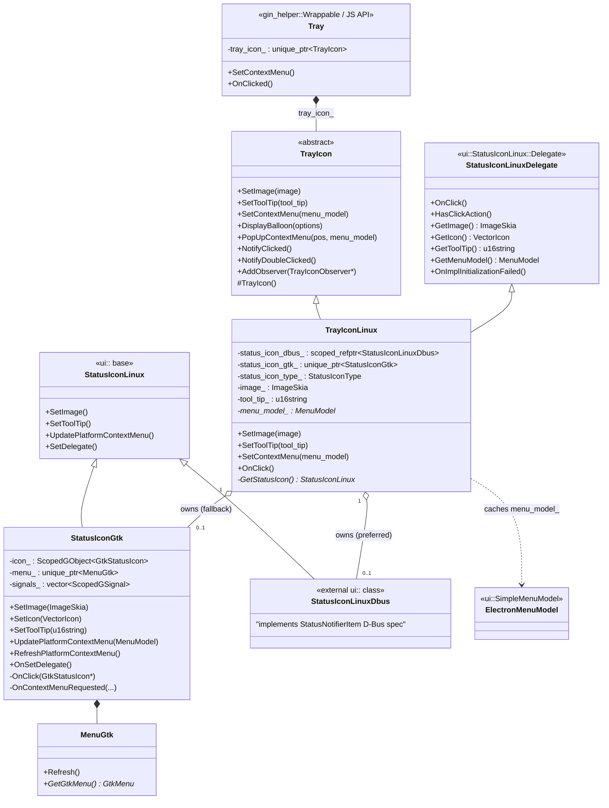
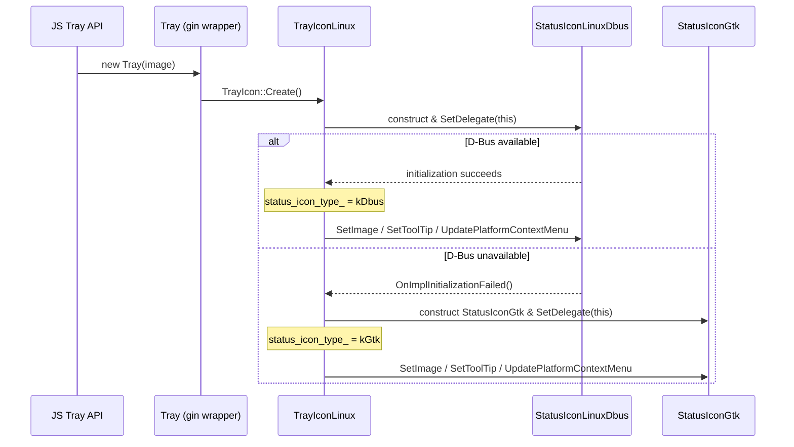
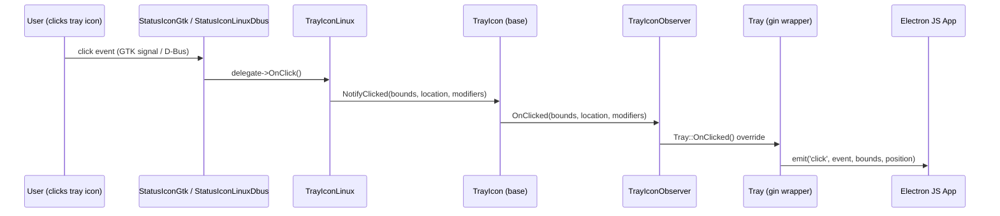
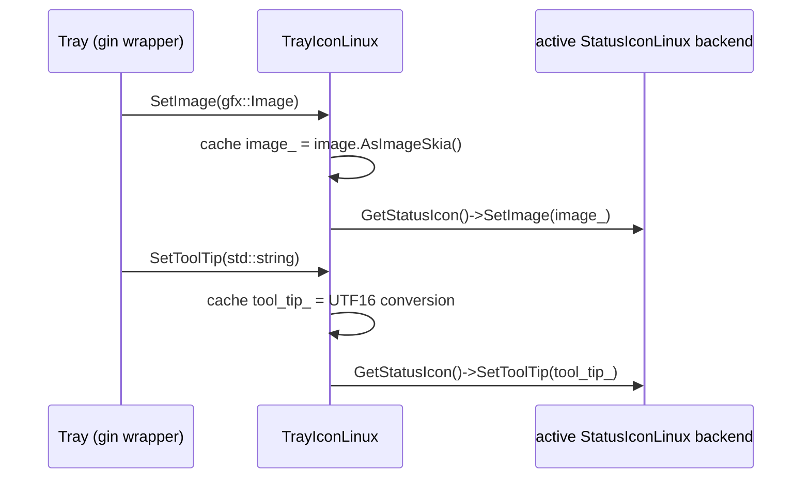
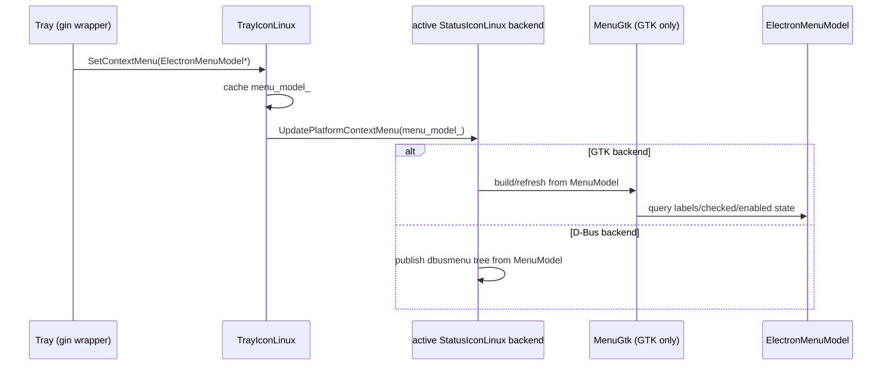

# Tray Icon (Linux)

## Introduction

The **Tray_Icon_linux** module provides the Linux-specific implementation of Electron's system tray ("status") icon feature. It bridges Electron's cross-platform `TrayIcon` abstraction (see [Tray_Icon.md](Tray_Icon.md)) to the two competing Linux desktop integration mechanisms available in Chromium's `ui` layer:

1. **StatusNotifierItem / D-Bus** (`StatusIconLinuxDbus`) — the modern freedesktop.org tray protocol used by most contemporary desktop environments (GNOME Shell extensions, KDE Plasma, etc.).
2. **GTK `GtkStatusIcon`** (`StatusIconGtk`) — the legacy X11/GTK tray icon API, used as a fallback for environments that do not support the D-Bus protocol (e.g., some lightweight window managers).

`TrayIconLinux` automatically selects and manages whichever backend is available at runtime, exposing a single, unified interface to the rest of Electron so that upper layers (like the JS-facing `Tray` API) do not need to know which underlying Linux tray mechanism is in use.

This module is one of four platform backends for the tray-icon feature; see also:
- [Tray_Icon.md](Tray_Icon.md) — the abstract, cross-platform `TrayIcon` base class and its notification/observer contract.
- [Tray_Icon_macos.md](Tray_Icon_macos.md) — the Cocoa/`NSStatusItem` implementation.
- [Tray_Icon_windows.md](Tray_Icon_windows.md) — the Win32 `Shell_NotifyIcon`-based implementation.

---

## Purpose & Core Functionality

`TrayIconLinux` implements the `TrayIcon` interface (defined in `shell/browser/ui/tray_icon.h`) and additionally implements `ui::StatusIconLinux::Delegate`, which is the callback interface Chromium's `ui::StatusIconLinux` subclasses (`StatusIconLinuxDbus`, `StatusIconGtk`) use to query icon/tooltip/menu state and to report click events.

Key responsibilities:
- **Backend selection**: On construction, `TrayIconLinux` attempts to create a D-Bus-based `StatusIconLinuxDbus`. If that succeeds, it is used; if D-Bus initialization fails (reported via `OnImplInitializationFailed()`), the class falls back to constructing a `StatusIconGtk` instance.
- **State caching**: Since either backend may be recreated or may query state lazily, `TrayIconLinux` caches the current icon (`gfx::ImageSkia`), tooltip (`std::u16string`), and context menu model (`ui::MenuModel*`) so it can answer the `Delegate` getter callbacks (`GetImage()`, `GetToolTip()`, `GetMenuModel()`, etc.) regardless of which backend is active.
- **Event forwarding**: Click events reported by the active backend (`OnClick()`) are forwarded up through the shared `TrayIcon::NotifyClicked()` / observer mechanism, which ultimately notifies the JS-facing `Tray` object (see [Desktop_UI_Widgets_&_Dialogs.md](Desktop_UI_Widgets_%26_Dialogs.md) for the `Tray` gin wrapper).
- **Context menu rendering**: `SetContextMenu()` stores the `ElectronMenuModel*` and propagates it to the active status icon backend, which is responsible for rendering it (via GTK's native menu widgets for `StatusIconGtk`, or via the D-Bus `dbusmenu` protocol for `StatusIconLinuxDbus`).

## Component Overview

| Component | Type | Role |
|---|---|---|
| `TrayIconLinux` | class (`electron` namespace) | Concrete `TrayIcon` implementation for Linux; owns/selects the active backend and implements `ui::StatusIconLinux::Delegate`. |
| `StatusIconGtk` | class (`electron` namespace) | GTK/X11 legacy tray icon backend wrapping `GtkStatusIcon`; renders context menus via `gtkui::MenuGtk`. |
| `StatusIconLinuxDbus` | class (forward-declared, external to `electron` namespace) | Chromium `ui`-layer backend implementing the StatusNotifierItem D-Bus specification. Reference-counted (`scoped_refptr`). |

### `TrayIconLinux`

```
shell/browser/ui/tray_icon_linux.h
```

Inherits:
- `TrayIcon` (cross-platform base, see [Tray_Icon.md](Tray_Icon.md))
- `ui::StatusIconLinux::Delegate` (Chromium UI abstraction)

Internal state:
- `status_icon_dbus_` — `scoped_refptr<StatusIconLinuxDbus>`, non-null when the D-Bus backend is active.
- `status_icon_gtk_` — `std::unique_ptr<StatusIconGtk>`, non-null when the GTK fallback is active.
- `status_icon_type_` — enum `StatusIconType { kDbus, kGtk, kNone }` tracking which backend (if any) is currently in use.
- `image_`, `tool_tip_`, `menu_model_` — cached state served to the active backend via the `Delegate` interface.

Public surface (from `TrayIcon`):
- `SetImage(const gfx::Image&)`
- `SetToolTip(const std::string&)`
- `SetContextMenu(raw_ptr<ElectronMenuModel>)`

Public surface (from `ui::StatusIconLinux::Delegate`):
- `OnClick()`
- `HasClickAction()`
- `GetImage() const`
- `GetIcon() const`
- `GetToolTip() const`
- `GetMenuModel() const`
- `OnImplInitializationFailed()`

Private helper:
- `GetStatusIcon()` — returns a pointer to whichever backend (`ui::StatusIconLinux*`) is currently active, abstracting away the `status_icon_type_` switch for internal use.

### `StatusIconGtk`

```
shell/browser/ui/status_icon_gtk.h
```

Inherits `ui::StatusIconLinux`. Wraps a native `GtkStatusIcon` (`icon_`, a `ScopedGObject<GtkStatusIcon>`) and manages GTK signal connections (`signals_`, a vector of `ScopedGSignal`) for click and context-menu-request events.

Responsibilities:
- `SetImage(const gfx::ImageSkia&)` / `SetIcon(const gfx::VectorIcon&)` — updates the icon pixmap shown in the system tray.
- `SetToolTip(const std::u16string&)` — updates the GTK tooltip text.
- `UpdatePlatformContextMenu(ui::MenuModel*)` / `RefreshPlatformContextMenu()` — (re)builds the native GTK menu (`gtkui::MenuGtk`, see [Desktop_UI_Widgets_&_Dialogs.md](Desktop_UI_Widgets_%26_Dialogs.md#gtk-ui)) from the supplied `ui::MenuModel`.
- `OnSetDelegate()` — called once a `Delegate` (i.e., `TrayIconLinux`) is attached, used to pull initial icon/tooltip state.
- `OnClick(GtkStatusIcon*)` / `OnContextMenuRequested(GtkStatusIcon*, guint, guint32)` — private GTK signal handlers that translate native GTK events into `Delegate` callbacks / menu popups.

### `StatusIconLinuxDbus`

Declared as a forward-referenced external class (outside the `electron` namespace), implemented in Chromium's `ui/linux` layer. It implements the [StatusNotifierItem](https://www.freedesktop.org/wiki/Specifications/StatusNotifierItem/) D-Bus specification, publishing the tray icon and menu (via `dbusmenu`) over D-Bus so that a compatible system tray host (e.g., GNOME Shell's "AppIndicator" extension) can render it. Electron does not subclass this type — it is instantiated and used directly through the `ui::StatusIconLinux` interface, and is reference-counted (`scoped_refptr`) since Chromium's D-Bus plumbing may retain it asynchronously.

---

## Architecture



---

## Backend Selection Flow

`TrayIconLinux` prefers the D-Bus (StatusNotifierItem) backend for modern desktop compatibility, but falls back to the legacy GTK status icon if D-Bus initialization fails (e.g., no compatible tray host is running on the session bus).



## Event / Data Flow

Click and interaction events flow bottom-up from the native backend through `TrayIconLinux`, through the shared `TrayIcon` observer mechanism, and out to the JS `Tray` object, which emits events to the Electron application's JavaScript layer.



## Setting the Icon Image & Tooltip



## Context Menu Flow



---

## Relationships to Other Modules

- **[Tray_Icon.md](Tray_Icon.md)** — defines the `TrayIcon` abstract base class, `TrayIconObserver`, and the `BalloonOptions`/notification contract that `TrayIconLinux` implements and forwards events through.
- **[Desktop_UI_Widgets_&_Dialogs.md](Desktop_UI_Widgets_%26_Dialogs.md)** — parent module grouping all tray/menu/dialog UI code, including:
  - The `Tray` gin-wrapped JS API (`shell/browser/api/electron_api_tray.h`) that owns a `std::unique_ptr<TrayIcon>` and is the ultimate consumer of `TrayIconLinux`'s observer notifications.
  - `ElectronMenuModel` (`shell/browser/ui/electron_menu_model.h`), the cross-platform context-menu model consumed by `SetContextMenu`.
  - `MenuGtk` (`shell/browser/ui/gtk/menu_gtk.h`), used internally by `StatusIconGtk` to render native GTK context menus.
  - `Tray_Icon_macos` and `Tray_Icon_windows` — sibling platform backends implementing the same `TrayIcon` contract for macOS and Windows respectively.
- **[Common_Native_Gin_Infrastructure.md](Common_Native_Gin_Infrastructure.md)** — provides the `gin_helper::Wrappable`, `EventEmitterMixin`, and `Constructible` machinery used by the `Tray` JS wrapper to expose `TrayIconLinux`'s functionality to JavaScript.

---

## Platform Notes

- This backend is compiled only on Linux builds (`shell/browser/browser_linux.cc` and other `_linux` suffixed files in the codebase follow the same convention).
- Unlike the Windows (`NotifyIcon`) and macOS (`TrayIconCocoa`) backends, Linux tray icon support is inherently best-effort: many minimalist window managers and tiling WMs provide no system tray host at all, in which case both `StatusIconLinuxDbus` and `StatusIconGtk` construction may effectively be no-ops from the user's perspective, though the API remains functional (menu building, event emission for keyboard-driven interactions, etc. still operate logically).
- The `GlobalMenuBarX11` / `GlobalMenuBarRegistrarX11` classes (see [Desktop_UI_Widgets_&_Dialogs.md](Desktop_UI_Widgets_%26_Dialogs.md#menu-model--views)) are a related but distinct Linux-specific feature — they implement the global application menu bar (via `dbusmenu`) for window menus, not the tray icon itself, though both rely on the same underlying D-Bus menu export mechanism.
