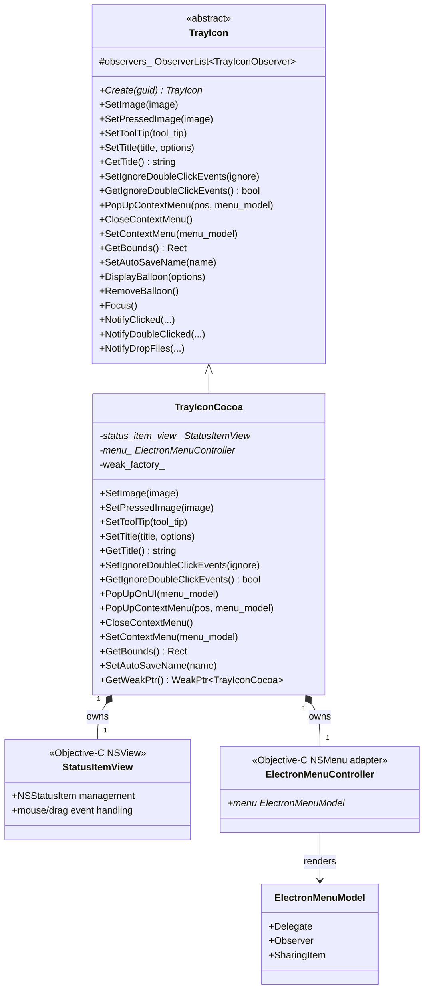
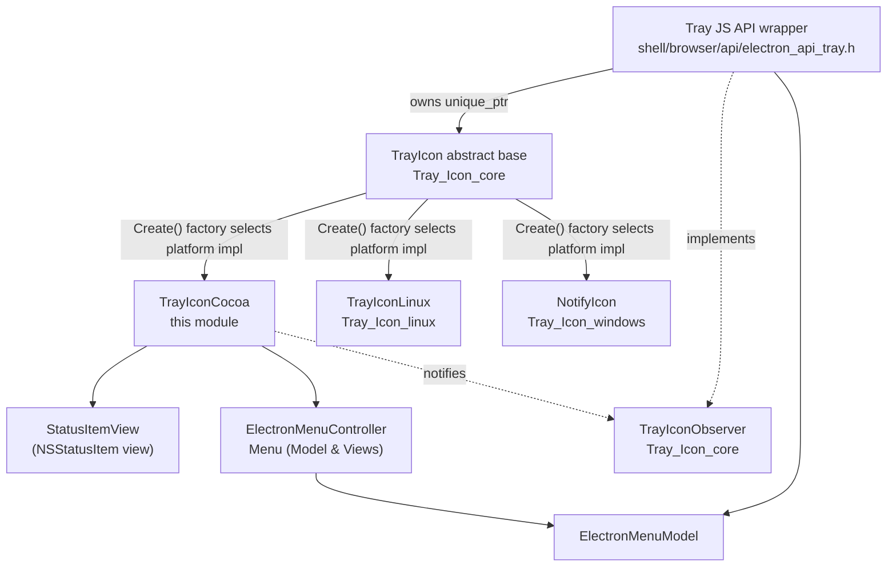
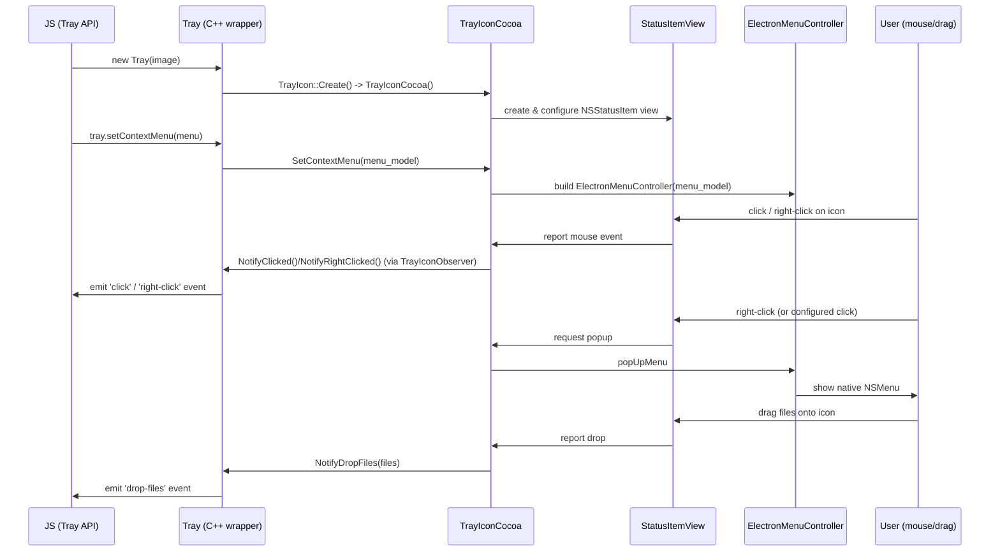

# Tray Icon (macOS)

## Introduction

The **Tray_Icon_macos** module provides the macOS-specific implementation of Electron's system tray ("menu bar") icon. It bridges the cross-platform [`TrayIcon`](Tray_Icon_core.md) abstract interface with native Cocoa APIs (`NSStatusItem`, `NSStatusBar`), rendering the tray icon, handling mouse/click events, drag-and-drop, balloons (tooltips), and displaying the native context menu on macOS.

This module is one of three platform back-ends for the cross-platform tray abstraction, alongside [Tray_Icon_linux](Tray_Icon_linux.md) (GTK/DBus) and [Tray_Icon_windows](Tray_Icon_windows.md) (`NOTIFYICONDATA`). All three implement the same `TrayIcon` interface defined in [Tray_Icon_core](Tray_Icon_core.md), which is instantiated and consumed by the platform-agnostic `Tray` JS API wrapper described in [shell_browser_api_window_ui_tray](shell_browser_api_window_ui_tray.md).

## Purpose and Core Functionality

`TrayIconCocoa` is the macOS concrete subclass of `electron::TrayIcon`. Its responsibilities include:

- Creating and owning a native `NSStatusItem` via a custom `StatusItemView` (an `NSView` subclass) that renders the icon image/title inside the macOS menu bar status area.
- Translating Cocoa mouse and drag events (click, double-click, right-click, drag-enter/exit/end, drop of files/text) into calls on the shared `TrayIconObserver` notification API defined on the base `TrayIcon` class.
- Displaying the tray's context menu using an `ElectronMenuController`, which adapts an `ElectronMenuModel` (see [Menu (Model & Views)](Menu_(Model_%26_Views).md)) into a native `NSMenu`.
- Managing macOS-only tray features not available on other platforms: the status item **title** (text shown next to the icon) and the **ignore double-click** flag, both gated behind `BUILDFLAG(IS_MAC)` in the base class.
- Exposing tray bounds (`GetBounds`) and an auto-save name (`SetAutoSaveName`) used by Chromium/macOS to persist the status item's on-screen position across app launches.

## Architecture

### Class Structure

### Module Relationships

`TrayIconCocoa` sits at the bottom of this stack: it is instantiated by `TrayIcon::Create()` on macOS builds and is consumed indirectly by the JS-facing `Tray` object, which never talks to Cocoa APIs directly — all platform detail is encapsulated here.

## Component Details

### `TrayIconCocoa`

The main C++ class, declared in `shell/browser/ui/tray_icon_cocoa.h`. It overrides the pure-virtual and macOS-specific virtual methods of `TrayIcon`:

| Method | Responsibility |
|---|---|
| `SetImage` / `SetPressedImage` | Forwards `gfx::Image` bitmaps to the `StatusItemView` for normal and "pressed" (highlighted) icon states. |
| `SetToolTip` | Sets the tooltip text shown on hover over the status item. |
| `SetTitle(title, options)` / `GetTitle()` | macOS-only: sets/gets text displayed alongside the icon in the menu bar; `options.font_type` allows selecting a system font variant (e.g., monospaced digit). |
| `SetIgnoreDoubleClickEvents` / `GetIgnoreDoubleClickEvents` | macOS-only: toggles whether double-click events are coalesced/ignored, matching native macOS status item behavior expectations. |
| `PopUpOnUI(menu_model)` | Internal helper that displays the context menu on the UI thread using the currently stored `ElectronMenuController`. |
| `PopUpContextMenu(pos, menu_model)` | Public override that programmatically pops up the menu at a given screen point (used by `tray.popUpContextMenu()` from JS). |
| `CloseContextMenu` | Dismisses any currently open native menu. |
| `SetContextMenu(menu_model)` | Rebuilds the `ElectronMenuController` from the supplied `ElectronMenuModel` and attaches it to the status item for right-click/left-click menu presentation. |
| `GetBounds` | Returns the screen `gfx::Rect` of the `NSStatusItem`'s button, used for positioning balloons/menus and for `tray.getBounds()`. |
| `SetAutoSaveName` | Sets an identifier used by AppKit to persist the status item's placement in the menu bar between sessions. |

Internal state:
- `status_item_view_` — a strong reference to an Objective-C `StatusItemView*`, the actual `NSView` installed into the `NSStatusItem`.
- `menu_` — a strong reference to an `ElectronMenuController*` that owns the native `NSMenu` built from the current `ElectronMenuModel`.
- `weak_factory_` — supports safe asynchronous callbacks (e.g., posting `PopUpOnUI` to the UI thread) via `GetWeakPtr()`.

### `StatusItemView` (Objective-C, forward-declared)

An `NSView` subclass that is installed as the custom view of an `NSStatusItem`. It is responsible for:
- Drawing the tray icon (and pressed-state icon) bitmap.
- Rendering the optional title text next to the icon.
- Capturing low-level mouse events (`mouseDown`, `mouseUp`, `rightMouseDown`, double-click detection) and drag-and-drop events (files/text dragged onto the tray icon), translating them into calls back into `TrayIconCocoa`, which in turn calls the inherited `Notify*` methods on `TrayIcon` (e.g., `NotifyClicked`, `NotifyDropFiles`) to fire the corresponding JS events on the `Tray` object.

### `ElectronMenuController` (Objective-C, forward-declared)

Adapts a cross-platform `ElectronMenuModel` (see [Menu (Model & Views)](Menu_(Model_%26_Views).md)) into a native `NSMenu` hierarchy, wiring up menu item selection back to the model's `Delegate`. `TrayIconCocoa` creates one of these whenever `SetContextMenu` is called, and reuses it for both left-click and right-click menu presentation (the default macOS convention where both click types can open the same context menu).

## Data Flow / Event Sequence

## Integration Points

- **Instantiation**: `TrayIcon::Create()` (declared in [Tray_Icon_core](Tray_Icon_core.md)) is compiled with a macOS-specific implementation that returns a `new TrayIconCocoa()` when `BUILDFLAG(IS_MAC)` is set. This is analogous to how `TrayIconLinux` and `NotifyIcon` are selected on their respective platforms.
- **JS API surface**: The `electron.Tray` class ([shell_browser_api_window_ui_tray](shell_browser_api_window_ui_tray.md)) owns a `std::unique_ptr<TrayIcon>` and is agnostic to which concrete subclass is in use. All platform-specific behaviors (title, ignore-double-click) are exposed through the same virtual interface, with macOS-only methods simply being no-ops or unsupported on other platforms.
- **Menu system**: Context menus set via `tray.setContextMenu()` flow through `ElectronMenuModel` → `ElectronMenuController`, sharing the same menu model infrastructure used by application menus and other native menus documented in [Menu (Model & Views)](Menu_(Model_%26_Views).md).
- **Observer pattern**: `TrayIconCocoa` reuses the `TrayIconObserver` interface and `Notify*` helper methods defined on the base `TrayIcon` class, so event dispatching logic (e.g., converting native events into `click`, `double-click`, `drop-files`, `mouse-enter`, etc.) is centralized and shared identically across all three platform back-ends.
- **Graphics types**: Uses `gfx::Image`, `gfx::Rect`, and `gfx::Point` from Chromium's `//ui/gfx` layer for icon bitmaps and geometry, consistent with usage across the [Desktop UI Widgets & Dialogs](Tray_Icon_core.md) family of modules.

## Related Documentation

- [Tray_Icon_core](Tray_Icon_core.md) — the cross-platform `TrayIcon` base class, `BalloonOptions`, `TitleOptions`, and `TrayIconObserver` that this module implements/extends.
- [Tray_Icon_linux](Tray_Icon_linux.md) — the GTK/DBus-based sibling implementation for Linux.
- [Tray_Icon_windows](Tray_Icon_windows.md) — the `NOTIFYICONDATA`-based sibling implementation for Windows.
- [shell_browser_api_window_ui_tray](shell_browser_api_window_ui_tray.md) — the JS-exposed `Tray` gin wrapper that owns and drives a `TrayIcon` instance.
- [Menu (Model & Views)](Menu_(Model_%26_Views).md) — `ElectronMenuModel` and `ElectronMenuController`, used for building the native context menu displayed from the tray icon.
