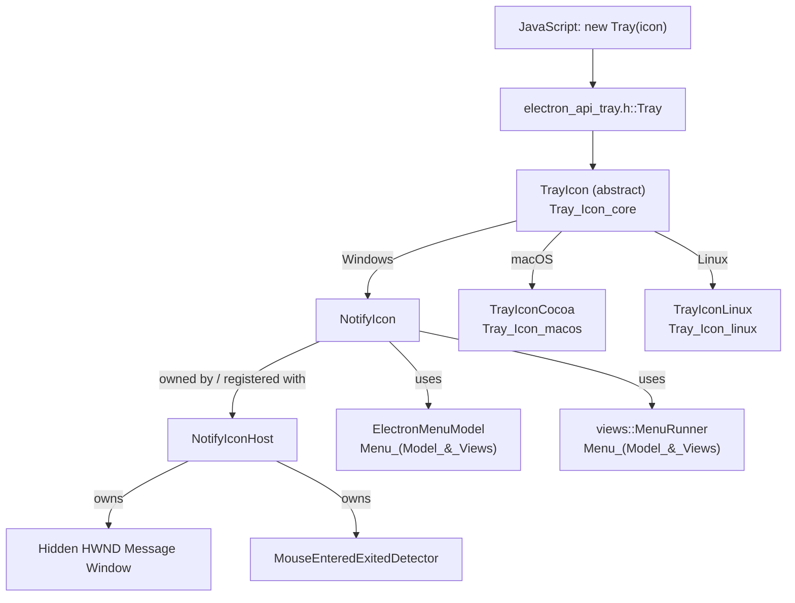
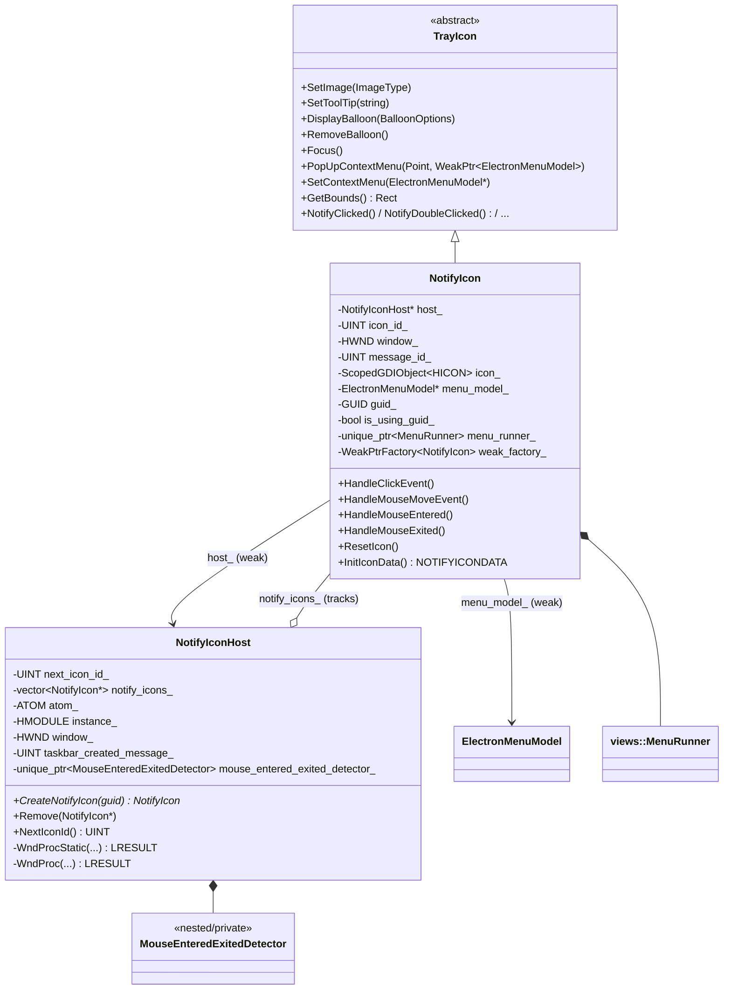
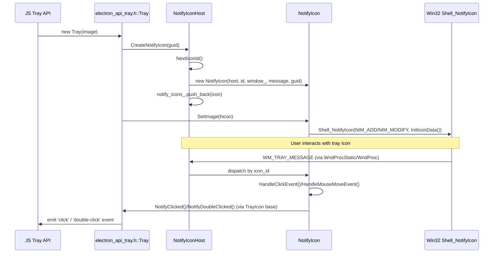
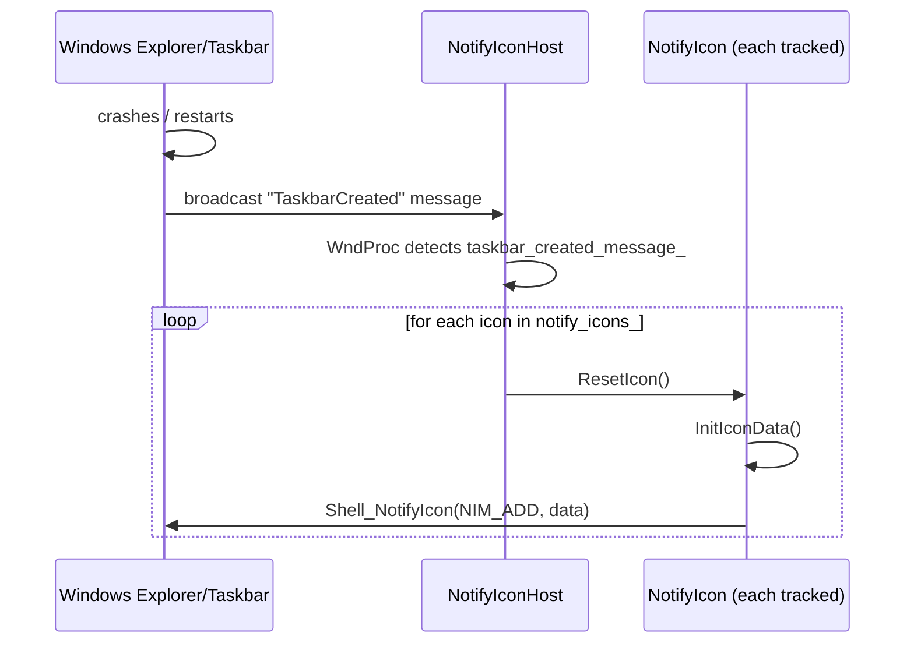
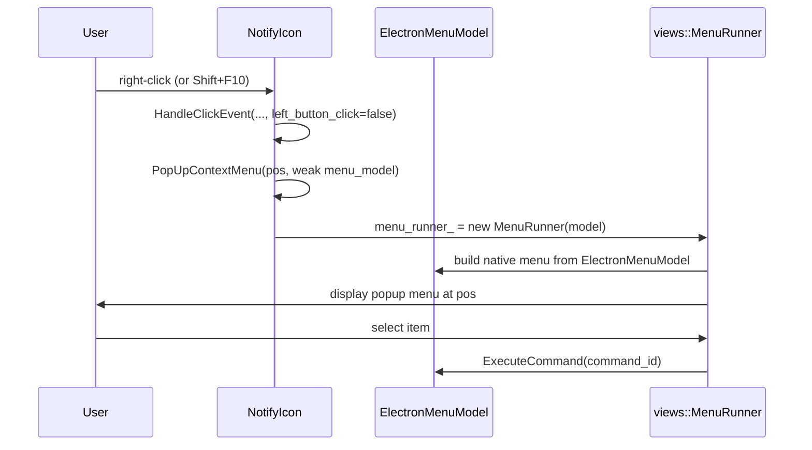

# Tray Icon (Windows)

## Introduction

The **Tray_Icon_windows** module provides the Windows-specific implementation of Electron's system tray ("notification area") icon functionality. It implements the platform contract defined by the cross-platform [`TrayIcon`](Tray_Icon_core.md) abstract base class using the native Win32 Shell Notification Icon API (`Shell_NotifyIcon` from `shellapi.h`).

This module is composed of two tightly coupled classes:

- **`NotifyIcon`** — the concrete `TrayIcon` implementation representing a single tray icon instance. It owns the icon's visual state (image, tooltip, balloon notifications), handles user input events (clicks, mouse move, context menu), and communicates with the shared message-only window owned by `NotifyIconHost`.
- **`NotifyIconHost`** — a per-process singleton-like manager that owns the hidden Win32 window used to receive tray icon callback messages, dispatches those messages to the correct `NotifyIcon` instance, tracks all live icons (so it can recreate them when Explorer's taskbar restarts), and runs mouse enter/exit detection (since the Win32 shell notification API does not natively provide hover-enter/exit events).

Together, these two classes bridge low-level Win32 messaging with Electron's cross-platform `Tray` JavaScript API (exposed via [`shell/browser/api/electron_api_tray.h`](Tray_Icon_core.md)).

## Position in the System

This module is a leaf implementation under the broader **Tray Icon** feature area, which itself is part of the **Desktop UI Widgets & Dialogs** subsystem. Sibling platform implementations exist for macOS and Linux:

| Platform | Module |
|---|---|
| Windows | **Tray_Icon_windows** (this document) |
| macOS | [Tray_Icon_macos](Tray_Icon_macos.md) (`TrayIconCocoa`) |
| Linux | [Tray_Icon_linux](Tray_Icon_linux.md) (`TrayIconLinux`) |
| Cross-platform contract | [Tray_Icon_core](Tray_Icon_core.md) (`TrayIcon`, `TrayIconObserver`) |

The JS-facing `Tray` gin wrappable object (part of [Native_Window_&_Menu_Management](Native_Window_&_Menu_Management.md) → `shell_browser_api_window_ui_tray`) calls `TrayIcon::Create()`, which on Windows instantiates a `NotifyIcon` through a `NotifyIconHost`.



## Core Components

### `NotifyIcon`

`NotifyIcon` (declared in `shell/browser/ui/win/notify_icon.h`) is Electron's concrete Windows subclass of the abstract [`TrayIcon`](Tray_Icon_core.md) interface. Each instance corresponds to exactly one entry in the Windows notification area.

**Construction**

```cpp
NotifyIcon(NotifyIconHost* host, UINT id, HWND window, UINT message, GUID guid);
```

- `host` — the owning `NotifyIconHost`, used to route lifecycle and messaging events (weak, non-owning `raw_ptr`).
- `id` — a unique numeric icon ID assigned by the host (`NotifyIconHost::NextIconId()`), used as `NOTIFYICONDATA::uID`.
- `window` — the shared hidden message-only `HWND` owned by the host, used as `NOTIFYICONDATA::hWnd`.
- `message` — the custom window message ID the shell uses to notify about icon events (`NOTIFYICONDATA::uCallbackMessage`).
- `guid` — an optional stable GUID (falls back to `GUID_DEFAULT`) allowing the OS to persist icon identity/position across app restarts.

**Responsibilities**

| Category | Methods |
|---|---|
| Icon appearance | `SetImage(HICON)`, `SetPressedImage(HICON)`, `SetToolTip(const std::string&)` |
| Balloon notifications | `DisplayBalloon(const BalloonOptions&)`, `RemoveBalloon()` |
| Context menu | `SetContextMenu(raw_ptr<ElectronMenuModel>)`, `PopUpContextMenu(gfx::Point, base::WeakPtr<ElectronMenuModel>)`, `CloseContextMenu()` |
| Input handling | `HandleClickEvent(...)`, `HandleMouseMoveEvent(...)`, `HandleMouseEntered(...)`, `HandleMouseExited(...)` |
| Recovery | `ResetIcon()` — re-adds the icon to the shell after Explorer's taskbar is recreated |
| Geometry | `GetBounds()` — override from `TrayIcon`, returns on-screen icon bounds |
| Identity accessors | `icon_id()`, `window()`, `message_id()`, `guid()` |

**Key internal state**

- `icon_` — a `base::win::ScopedGDIObject<HICON>` owning the current icon handle (ensures proper GDI resource cleanup).
- `menu_model_` — a non-owning `raw_ptr<ElectronMenuModel>` pointing to the JS-configured context menu (see [Menu (Model & Views)](Menu_(Model_&_Views).md)).
- `menu_runner_` — a `std::unique_ptr<views::MenuRunner>`, the Views framework object that actually displays the popup context menu.
- `is_using_guid_` / `guid_` — track whether this icon uses a persistent GUID identity vs. the default.
- `weak_factory_` — supports safe weak-pointer callbacks (`GetWeakPtr()`), important since menu display and balloon callbacks are asynchronous relative to icon destruction.

**`InitIconData()`** is a private helper that builds a `NOTIFYICONDATA` struct populated with the icon's ID, window, message, GUID, and current icon handle — used internally whenever the icon needs to be added, modified, or removed via `Shell_NotifyIcon`.

### `NotifyIconHost`

`NotifyIconHost` (declared in `shell/browser/ui/win/notify_icon_host.h`) manages the Win32 machinery shared by all `NotifyIcon` instances in the process.

**Responsibilities**

- **Icon lifecycle management**
  - `CreateNotifyIcon(std::optional<base::Uuid> guid)` — allocates a new unique icon ID via `NextIconId()`, constructs a `NotifyIcon`, registers it in `notify_icons_`, and returns the pointer.
  - `Remove(NotifyIcon* notify_icon)` — unregisters and removes an icon from tracking (and, transitively, from the shell).
- **Message window ownership**
  - Owns `window_` (`HWND`), `atom_` (registered window class atom), and `instance_` (module `HMODULE`) — the hidden window used purely to receive shell notification callback messages (`WM_*` tray messages) and `taskbar_created_message_` (the registered `"TaskbarCreated"` message).
  - `WndProcStatic()` / `WndProc()` — the static and instance window procedures that receive all messages sent to the hidden window and dispatch them to the appropriate `NotifyIcon` based on `wparam`/`lparam` icon ID.
- **Icon ID allocation**
  - `NextIconId()` — returns and increments `next_icon_id_`, guaranteeing uniqueness of `NOTIFYICONDATA::uID` values within the process.
- **Taskbar recreation handling**
  - When Explorer crashes/restarts, Windows broadcasts the registered `"TaskbarCreated"` message. `WndProc` detects `taskbar_created_message_` and calls `ResetIcon()` on every tracked `NotifyIcon` to restore all tray icons.
- **Hover detection**
  - Owns a `MouseEnteredExitedDetector` (forward-declared nested class, defined in the `.cc` file) via `mouse_entered_exited_detector_`. Because the legacy Win32 shell notification API does not deliver distinct mouse-enter/mouse-exit messages, this helper polls/tracks cursor position relative to icon bounds to synthesize `HandleMouseEntered` / `HandleMouseExited` calls on the appropriate `NotifyIcon`.

**`GUID_DEFAULT`** is defined in this header as a zero-initialized `GUID`, used as the sentinel "no custom GUID" value for icons that don't request persistent identity.

## Architecture & Relationships



### Component Interaction



### Taskbar Recreation Flow



### Context Menu Popup Flow



## Dependencies

| Dependency | Purpose | Reference |
|---|---|---|
| `TrayIcon`, `TrayIconObserver`, `BalloonOptions` | Abstract base class and cross-platform notification/event contract implemented by `NotifyIcon` | [Tray_Icon_core](Tray_Icon_core.md) |
| `ElectronMenuModel`, `views::MenuRunner` | Context menu model and native popup runner used by `PopUpContextMenu` | [Menu (Model & Views)](Menu_(Model_&_Views).md) |
| `electron_api_tray.h::Tray` | JS-facing gin wrapper that owns and drives a platform `TrayIcon` (here, `NotifyIcon`) | [Native_Window_&_Menu_Management](Native_Window_&_Menu_Management.md) |
| Win32 `shellapi.h` (`Shell_NotifyIcon`, `NOTIFYICONDATA`) | Underlying OS API for adding/removing/updating tray icons | Windows SDK |
| `base::win::ScopedGDIObject<HICON>` | RAII wrapper ensuring icon GDI handles are released | Chromium `//base` |
| `gin_converters/guid_converter.h` | Converts JS-provided GUID strings into `base::Uuid` for persistent icon identity | [Common_Native_Gin_Infrastructure](Common_Native_Gin_Infrastructure.md) |
| `gfx::Point`, `gfx::Rect` | Geometry types used for click positions and icon bounds | [Common_Native_Gin_Infrastructure](Common_Native_Gin_Infrastructure.md) (`gfx_converter.h`) |

## Design Notes

- **Single message window, multiple icons**: Rather than each `NotifyIcon` owning its own `HWND`, all icons share one hidden window (`NotifyIconHost::window_`). This mirrors the Win32 shell notification model, where `Shell_NotifyIcon` calls direct callback messages to a window/message pair, disambiguated only by `uID`. `NotifyIconHost::WndProc` performs the dispatch from `(hwnd, message, wparam/lparam)` to the correct `NotifyIcon*` in `notify_icons_`.
- **GUID-based persistence**: Windows allows tray icons to keep a stable position/identity across app restarts if a GUID is supplied. `NotifyIcon` tracks `is_using_guid_` and falls back to `GUID_DEFAULT` (icon ID-based identity) otherwise.
- **Explorer resilience**: The `"TaskbarCreated"` message is a well-known Windows broadcast notifying all apps that the taskbar (and thus all notification area icons) needs to be redrawn from scratch after an Explorer crash/restart. `NotifyIconHost` listens for this and calls `ResetIcon()` on every live icon.
- **Synthesized hover events**: Since Win32's legacy tray icon messages don't include distinct enter/exit notifications, `MouseEnteredExitedDetector` (owned by `NotifyIconHost`) is responsible for polling cursor position and synthesizing `HandleMouseEntered`/`HandleMouseExited` invocations, which are then forwarded to `TrayIcon::NotifyMouseEntered`/`NotifyMouseExited` observers.
- **Weak pointers for async safety**: `NotifyIcon::GetWeakPtr()` and the `base::WeakPtr<ElectronMenuModel>` parameter to `PopUpContextMenu` guard against use-after-free when menu popups or balloon callbacks occur after the icon or its menu model may have been destroyed (e.g., if the JS `Tray` object is garbage collected mid-interaction).
