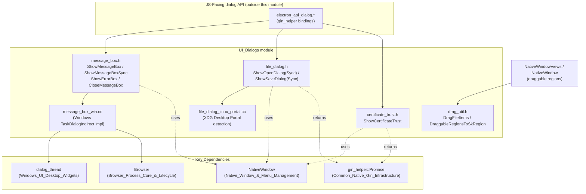
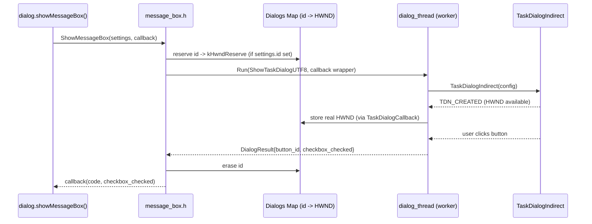
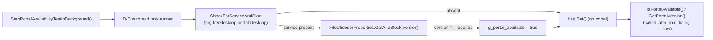
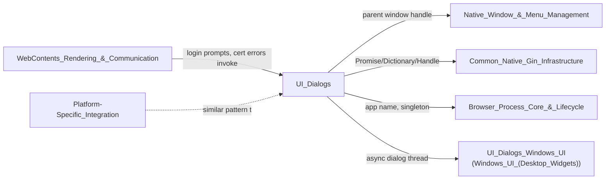

# UI_Dialogs

## 1. Purpose

The **UI_Dialogs** module implements Electron's cross-platform **native dialog**
surface — the small set of OS-level UI primitives that browser-process code
uses to interact synchronously or asynchronously with the user outside of any
`BrowserWindow`'s web content. Concretely, it is responsible for:

- **Message boxes** (`dialog.showMessageBox` / `showMessageBoxSync`) — native
  alert/confirmation dialogs with custom buttons, icons, and checkboxes.
- **File dialogs** (`dialog.showOpenDialog` / `showSaveDialog`) — native
  open/save file pickers, including the Linux XDG Desktop Portal file chooser
  used in sandboxed/Flatpak/Snap environments.
- **Certificate trust prompts** (`dialog.showCertificateTrustDialog` on macOS
  and Linux) — asking the OS to let the user trust a self-signed or otherwise
  untrusted TLS certificate.
- **Drag-and-drop support utilities** — helpers used by renderer-initiated
  native file drags and by draggable window regions (`-webkit-app-region:
  drag`).

Unlike most other Electron subsystems, this module does not own a persistent
object graph; instead it exposes **stateless, platform-abstracted functions**
that are invoked on demand by the JS-facing `dialog` API bindings
(implemented outside this module, typically under
`shell/browser/api/electron_api_dialog.*`) and internally by other native
subsystems (e.g. login-prompt flows, certificate errors, native window
drag-region computation).

Each function has multiple platform-specific implementations (Windows, macOS,
Linux/GTK, Linux Portal) behind a single, platform-neutral header, which keeps
call sites free of `#ifdef` branching.

## 2. Architecture Overview

The module is a **thin, header-driven facade**: each `.h` file declares a
small set of free functions and value types (settings structs) that hide the
platform-specific `.cc`/`.mm`/`.cc` implementations (only the Windows message
box and Linux portal file-chooser implementations are included as core
components here; macOS/GTK counterparts live in sibling translation units not
part of this module's core API surface but conceptually equivalent).

## 3. Sub-Areas of Functionality

Since this module is a single cohesive, file-flat unit (no nested
sub-modules), the sections below document its logical areas directly rather
than delegating to separate sub-module pages.

### 3.1 Message Box (`message_box.h`, `message_box_win.cc`)

**Responsibility:** Show native alert/confirmation dialogs, synchronously or
asynchronously, with support for custom buttons, an optional checkbox, and a
window icon.

Key types:
- `MessageBoxType` — enum of `kNone`, `kInformation`, `kWarning`, `kError`,
  `kQuestion`, used to pick the platform default icon.
- `MessageBoxSettings` — a plain settings struct holding the parent window,
  type, button labels, default/cancel button indices, title/message/detail
  text, checkbox label/state, icon, and layout hints (`no_link`,
  `text_width`).
- `MessageBoxCallback` — `base::OnceCallback<void(int code, bool
  checkbox_checked)>` invoked when an asynchronous dialog is dismissed.

Key functions:
- `ShowMessageBoxSync(settings)` — blocks the calling thread and returns the
  clicked button index.
- `ShowMessageBox(settings, callback)` — shows the dialog without blocking
  the UI thread; the dialog itself runs on a dedicated worker thread (see
  `dialog_thread.h`, documented in
  [UI_Dialogs_Windows_UI](UI_Dialogs_Windows_UI.md)) and the result is
  delivered back via `callback`.
- `CloseMessageBox(id)` — programmatically cancels/dismisses a previously
  shown async message box identified by the optional `MessageBoxSettings::id`.
- `ShowErrorBox(title, content)` — a minimal, dependency-light error dialog
  safe to call very early in startup (e.g. before the JS environment or
  `Browser` singleton is fully initialized).

**Windows implementation (`message_box_win.cc`)** is the concrete example
included in this module's core components. It is built on the Win32
`TaskDialogIndirect` API:

- `CommonButtonID` maps human-readable labels ("OK", "Yes", "Cancel", …) to
  Windows' built-in `TDCBF_*_BUTTON` flags and `IDOK`/`IDYES`/etc. constants,
  so that standard buttons get native styling/localization while
  non-standard labels fall back to custom command-link buttons.
- `DialogResult` is the internal return value pairing the resolved button
  index with the checkbox state.
- A global `flat_map<int, unique_ptr<HWND>>` "dialogs map" (guarded by a
  `base::Lock`) tracks in-flight asynchronous dialogs by their user-supplied
  `id`, using sentinel `HWND` values (`kHwndReserve`, `kHwndCancel`) to
  handle the race between dialog-thread creation and a `CloseMessageBox`
  call arriving before the native window exists.
- Asynchronous dialogs are executed on a background thread via the
  `dialog_thread::Run()` helper (see the *Windows_UI_(Desktop_Widgets)*
  sub-area of [UI_Dialogs_Windows_UI](UI_Dialogs_Windows_UI.md)) so the
  Electron UI/message thread is never blocked.

### 3.2 File Dialog (`file_dialog.h`, `file_dialog_linux_portal.cc`)

**Responsibility:** Show native open/save file & directory pickers.

Key types:
- `Filter` / `Filters` — `<description, extensions>` pairs used to populate
  file-type dropdowns.
- `OpenFileDialogProperty` / `SaveFileDialogProperty` — bit-flag enums
  controlling behavior such as multi-selection, directory selection, hidden
  files, package-as-directory treatment (macOS), overwrite confirmation
  (Linux), and recent-files exclusion (Windows).
- `DialogSettings` — aggregates the parent window, title/message/button
  labels, default path, filters, property flags, and platform-specific
  toggles (`shows_tag_field`, `force_detached`,
  `security_scoped_bookmarks` for macOS sandboxing).

Key functions:
- `ShowOpenDialogSync` / `ShowSaveDialogSync` — blocking variants returning
  selected paths directly.
- `ShowOpenDialog` / `ShowSaveDialog` — asynchronous variants that resolve a
  `gin_helper::Promise<gin_helper::Dictionary>` (see
  [Common_Native_Gin_Infrastructure](Common_Native_Gin_Infrastructure.md) for
  the `Promise`/`Dictionary` machinery) with the result (canceled flag +
  selected path(s)/bookmark data).
- Linux-only portal helpers: `StartPortalAvailabilityTestInBackground`,
  `IsPortalAvailable`, `GetPortalVersion` — used to detect, off the UI
  thread, whether the `org.freedesktop.portal.FileChooser` D-Bus service is
  present (required for sandboxed Linux packaging formats), and which
  version is available, before deciding whether to use the portal-based
  chooser or the classic GTK chooser.

**Linux Portal implementation (`file_dialog_linux_portal.cc`)** — the
concrete example included in this module:
- Connects to the session D-Bus bus on a dedicated, lazily-created
  single-thread task runner (`g_electron_dbus_thread_task_runner`).
- Uses `dbus_utils::CheckForServiceAndStart` to test for
  `org.freedesktop.portal.Desktop`.
- `FileChooserProperties` (a `dbus::PropertySet` subclass) reads the
  portal's `version` property to compare against a required minimum
  (default `3`, configurable via the `--xdg-portal-required-version`
  command-line flag; version `4`+ is needed for the `current_folder`
  option).
- Publishes results through process-wide atomics/flags
  (`g_portal_available`, `g_available_portal_version`,
  `AtomicFlag`) that are polled synchronously by `IsPortalAvailable()` /
  `GetPortalVersion()` once the async probe completes.

### 3.3 Certificate Trust (`certificate_trust.h`)

**Responsibility:** Prompt the OS-native "always trust this certificate"
dialog (macOS Keychain UI / Linux equivalents) when a user explicitly asks
Electron to add trust for a certificate presented on a TLS error, typically
driven by `dialog.showCertificateTrustDialog`.

- `ShowCertificateTrust(parent_window, cert, message)` takes a
  `electron::NativeWindow*` (see
  [Native_Window_&_Menu_Management](Native_Window_&_Menu_Management.md)), a
  `scoped_refptr<net::X509Certificate>`, and a message string, and returns a
  `v8::Local<v8::Promise>` that resolves once the user has responded to the
  OS prompt. The heavy lifting of turning the completion callback into a
  V8 promise is done by `gin_helper::Promise`
  (see [Common_Native_Gin_Infrastructure](Common_Native_Gin_Infrastructure.md)).

### 3.4 Drag Utilities (`drag_util.h`)

**Responsibility:** Support native OS drag-and-drop initiated from Electron
(dragging files out of the app) and the computation of custom
draggable/non-draggable window regions.

- `DragFileItems(files, icon, view)` — starts a native OS file-drag
  operation for the given list of `base::FilePath`s, showing `icon` as the
  drag image, anchored to the given `gfx::NativeView`.
- `DraggableRegionsToSkRegion(regions)` — converts a list of Blink
  `DraggableRegionPtr` mojom structs (produced from CSS
  `-webkit-app-region: drag`/`no-drag` regions) into a single `SkRegion`
  used by `NativeWindow`/`NativeWindowViews` to implement custom window
  dragging and hit-testing.

## 4. Relationship to Other Modules

- **[Native_Window_&_Menu_Management](Native_Window_&_Menu_Management.md)** —
  every dialog function accepts an optional `NativeWindow*` parent so the
  dialog can be shown as a sheet/modal attached to a specific Electron
  window; on Windows, `message_box_win.cc` casts the parent to
  `NativeWindowViews` to obtain its `HWND`/`AcceleratedWidget`.
- **[Common_Native_Gin_Infrastructure](Common_Native_Gin_Infrastructure.md)**
  — asynchronous file dialogs and the certificate-trust prompt return
  `gin_helper::Promise<...>` / `v8::Local<v8::Promise>` objects, tying native
  dialog results back into JavaScript `Promise`s consumed by the `dialog`
  module's public API.
- **[Browser_Process_Core_&_Lifecycle](Browser_Process_Core_&_Lifecycle.md)**
  — `ShowMessageBoxSync`/`ShowTaskDialogWstr` fall back to `Browser::Get()->GetName()`
  for the dialog title when none is supplied, tying dialog presentation to
  the app-level `Browser` singleton.
- **UI_Dialogs_Windows_UI** (see the *Windows_UI_(Desktop_Widgets)* sibling
  area, e.g. `shell/browser/ui/win/dialog_thread.h`) — provides the
  dedicated worker-thread execution model (`dialog_thread::Run`) used by
  `ShowMessageBox` to avoid blocking the UI thread while a native Win32
  dialog is modal.
- **[WebContents_Rendering_&_Communication](WebContents_Rendering_&_Communication.md)**
  — higher-level flows such as HTTP basic-auth login prompts
  (`shell/browser/login_handler.h`) and TLS certificate error handling
  invoke these dialog primitives (message boxes / certificate trust) to
  collect user decisions.
- Sibling area **Autofill_Popup** and module
  **[Platform-Specific_Integration](Platform-Specific_Integration.md)**
  (native notifications) follow an analogous "platform-neutral header +
  per-OS `.cc`/`.mm` implementation" pattern used throughout Electron's
  native UI surface, but are documented separately as they serve distinct
  concerns (inline autofill suggestions and OS toast/notification centers,
  respectively).

## 5. Design Notes

- **Header/impl separation per platform.** Every public entry point
  (`ShowMessageBox`, `ShowOpenDialog`, `ShowCertificateTrust`, …) is declared
  once in a shared header and implemented independently per platform
  (`_win.cc`, `_mac.mm`, `_gtk.cc`/`_linux_portal.cc`). This keeps calling
  code (dialog bindings, login handlers, error reporting) OS-agnostic.
- **Sync and async dual APIs.** Both message boxes and file dialogs expose a
  blocking "Sync" function alongside a callback/Promise-based asynchronous
  one, mirroring the dual synchronous/asynchronous surface Electron exposes
  to JS (`dialog.showMessageBoxSync` vs `dialog.showMessageBox`).
- **Early-availability safety.** `ShowErrorBox` is intentionally
  dependency-light (no `Browser` singleton, no dialog-map bookkeeping) so it
  can report fatal startup errors before most of Electron's browser-process
  singletons exist.
- **Portal detection is asynchronous and cached.** Because probing D-Bus for
  the XDG Desktop Portal involves IPC, `file_dialog_linux_portal.cc`
  performs the check once in the background at startup
  (`StartPortalAvailabilityTestInBackground`) and caches the result in
  process-global state so that each `ShowOpenDialog`/`ShowSaveDialog` call
  can synchronously decide which chooser implementation to use.
