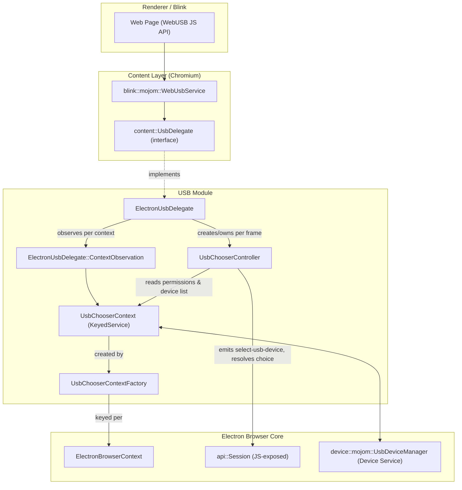
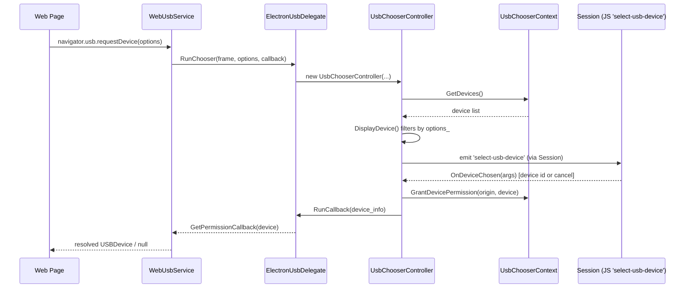
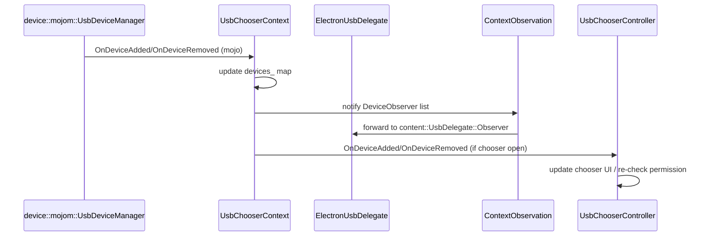

# USB Module

## 1. Purpose

The **USB** module implements Electron's support for the **WebUSB** web platform API. It allows renderer-process web content (pages, iframes, and workers) to discover, request permission for, and communicate with USB devices attached to the host machine, while giving the Electron application (via its main process JS) full control over device selection through the standard `session.setDevicePermissionHandler` / `select-usb-device` event mechanisms.

The module is one of several **Device & Peripheral Access** subsystems in Electron's browser process (siblings include Bluetooth, HID, Serial, WebAuthn, and File System Access — see the [Device & Peripheral Access](Device_%26_Peripheral_Access.md) overview for how these relate to each other). It bridges three layers:

1. **Chromium's `content::UsbDelegate` interface** — the browser engine's extension point for WebUSB.
2. **Electron's permission & persistence layer** — per-`BrowserContext` device permission tracking (`UsbChooserContext`), which is itself a `KeyedService` created via a `BrowserContextKeyedServiceFactory`.
3. **UI/JS integration** — a chooser controller that surfaces device-selection UI (or delegates it to JS via `Session`'s `select-usb-device` event) and resolves the promise returned to the web page.

## 2. Architecture Overview

## 3. Core Components

| Component | File | Responsibility |
|---|---|---|
| `ElectronUsbDelegate` | `shell/browser/usb/electron_usb_delegate.h` | Implements `content::UsbDelegate`; the single entry point Chromium calls into for all WebUSB operations (permission checks, device enumeration, chooser invocation, observer management). |
| `ElectronUsbDelegate::ContextObservation` | `shell/browser/usb/electron_usb_delegate.h` | Private nested class that observes a specific `UsbChooserContext`/`BrowserContext` lifetime and forwards device add/remove notifications back to the delegate's registered `content::UsbDelegate::Observer`s. |
| `UsbChooserContext` | `shell/browser/usb/usb_chooser_context.h` | A `KeyedService` (one per `BrowserContext`) that owns the connection to the Device Service's `UsbDeviceManager`, tracks granted permissions (persistent & ephemeral), and maintains the live device list. |
| `UsbChooserContextFactory` | `shell/browser/usb/usb_chooser_context_factory.h` | `BrowserContextKeyedServiceFactory` singleton that creates/retrieves the `UsbChooserContext` instance associated with a given `content::BrowserContext`. |
| `UsbChooserController` | `shell/browser/usb/usb_chooser_controller.h` | Per-request controller created for each `navigator.usb.requestDevice()` call; enumerates candidate devices, drives the JS-side chooser (via `Session`), observes device changes while the chooser is open, and resolves/rejects the WebUSB permission callback. |

## 4. Key Flows

### 4.1 Device Permission Request (`navigator.usb.requestDevice`)

### 4.2 Device Hotplug Notification

## 5. Integration Points

- **`ElectronBrowserClient`** (see [Browser_Process_Core_&_Lifecycle.md](Browser_Process_Core_%26_Lifecycle.md)) owns and hands out the `ElectronUsbDelegate` instance to Content as its `content::ContentBrowserClient::GetUsbDelegate()` implementation.
- **`ElectronBrowserContext`** (see [Browser_Context_&_Session_Management.md](Browser_Context_%26_Session_Management.md)) is the `content::BrowserContext` subclass keyed against which `UsbChooserContextFactory` creates a `UsbChooserContext`. Permission grants persist per browser context/session, mirroring how cookies, protocol handlers, and other per-session state are scoped.
- **`api::Session`** (`shell/browser/api/electron_api_session.h`, documented in the session sub-module of [Browser_Context_&_Session_Management.md](Browser_Context_%26_Session_Management.md)) is the JS-facing object that emits the `select-usb-device` event and exposes `setDevicePermissionHandler`, letting application code programmatically approve/deny devices or provide custom chooser UI, similarly to the [Serial](Serial.md) and HID (`shell_browser_hid`) modules.
- **`RenderFrameHost` / `WebContents`** — `UsbChooserController` observes the requesting `WebContents` (via `content::WebContentsObserver`) so that the chooser is torn down correctly if the frame is destroyed or navigated away before the user responds.
- **Device Service (`device::mojom::UsbDeviceManager`)** — `UsbChooserContext` is a Mojo client of Chromium's platform-independent Device Service, which abstracts actual OS-level USB device access.

## 6. Relationship to Sibling Device Modules

The USB module follows the same three-tier pattern (`Delegate` → `ChooserContext`/`ChooserContextFactory` → `ChooserController`) used by:
- **HID** (`shell/browser/hid/*`) — `ElectronHidDelegate`, `HidChooserContext`, `HidChooserController`.
- **Serial** (`shell/browser/serial/*`, see [Serial.md](Serial.md)) — `ElectronSerialDelegate`, `SerialChooserContext`, `SerialChooserController`.

Understanding this module transfers directly to understanding those siblings within [Device_&_Peripheral_Access.md](Device_%26_Peripheral_Access.md).

## 7. Notes on Complexity

This module consists of a small, tightly-coupled set of four header files with no further natural sub-division (delegate, context, context-factory, controller form a single cohesive request/permission pipeline). No sub-module documentation was generated; all details are captured in this single document.
