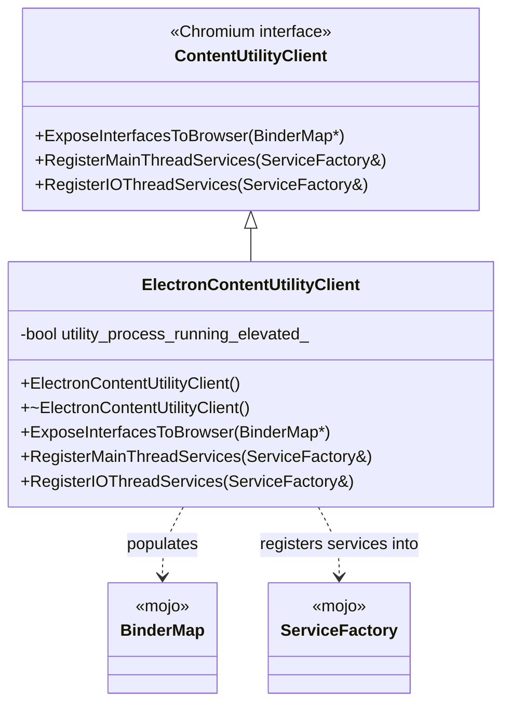
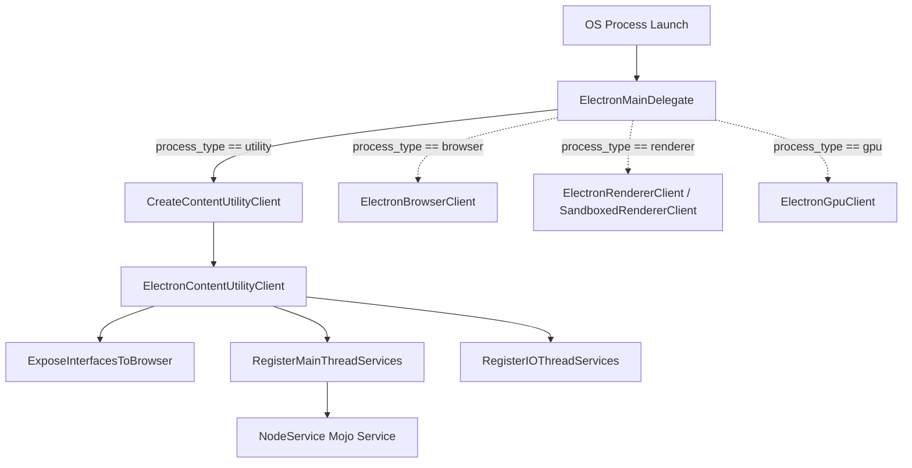
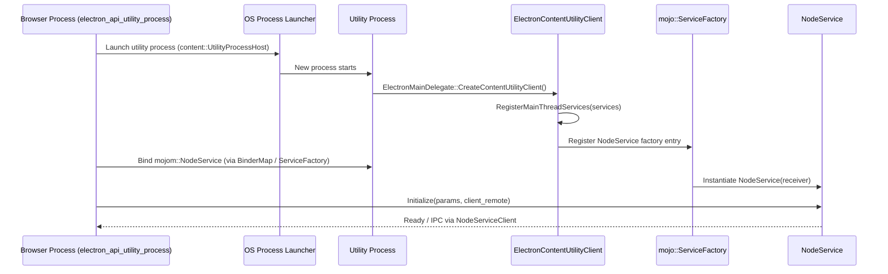

# Utility Content Client

## Introduction

The **Utility Content Client** module is Electron's integration point with Chromium's `content::ContentUtilityClient` interface. It provides the single entry class — `ElectronContentUtilityClient` — that Chromium's multi-process architecture instantiates inside every **utility process** launched by the browser. Utility processes are short-lived, sandboxed (or, in some cases, elevated) helper processes that Chromium spins up to perform isolated, potentially risky work (network service, audio decoding, unzipping, and — most importantly for Electron — running arbitrary Node.js code via the `NodeService` Mojo interface).

This module is intentionally small and focused: it does not implement business logic itself. Instead, it acts as a **registration and interface-exposure hub**, wiring up Mojo binders and services so that the utility process can be asked ("bound") to do specific jobs by the browser process. Its most consequential responsibility, in the context of Electron, is exposing the `NodeService` implementation (see [Node_Service.md](Node_Service.md)) so that Electron's Node.js integration can run inside a dedicated utility process (i.e., Electron's `UtilityProcess` API).

## Purpose and Core Functionality

### Why a Utility Content Client exists

Chromium's multi-process model separates responsibilities into distinct process types: browser, renderer, GPU, and utility. Each process type has a corresponding `Content*Client` interface that the embedder (Electron) must implement to customize behavior for that process type. `ElectronContentUtilityClient` is Electron's implementation of the utility-process contract.

The class is created once per utility process by `ElectronMainDelegate::CreateContentUtilityClient()` (see [Application_Bootstrap_&_Process_Entry.md](Application_Bootstrap_&_Process_Entry.md)), and lives for the lifetime of that process.

### Core Responsibilities

1. **Exposing interfaces to the browser process** (`ExposeInterfacesToBrowser`): registers Mojo interface binders into a `mojo::BinderMap` so the browser process can request specific capabilities from this utility process instance.
2. **Registering main-thread services** (`RegisterMainThreadServices`): adds Mojo `ServiceFactory` entries for services that must run on the utility process's main (UI) sequence — this is where Electron's `NodeService` is registered, allowing a Node.js environment to be instantiated inside the utility process.
3. **Registering IO-thread services** (`RegisterIOThreadServices`): adds `ServiceFactory` entries for services that operate on the IO thread instead of the main thread.
4. **Tracking privilege elevation state**: the private `utility_process_running_elevated_` flag records whether this particular utility process instance was launched with elevated OS privileges (relevant on Windows, where certain utility operations may require admin rights), influencing which services/interfaces are safe to expose.

## Architecture

### Component Structure

### Relationship to Process Bootstrap

`ElectronContentUtilityClient` is not self-instantiating; it is created and owned by `ElectronMainDelegate`, which is Electron's implementation of `content::ContentMainDelegate` and the central factory for all per-process-type Chromium client objects (browser, GPU, renderer, utility). See [Application_Bootstrap_&_Process_Entry.md](Application_Bootstrap_&_Process_Entry.md) for the full bootstrap sequence.

## Data Flow / Process Interaction

The utility process's role in Electron's `UtilityProcess` JS API (`electron_api_utility_process.h`, part of [System_&_App-Level_Services_API.md](System_&_App-Level_Services_API.md)) illustrates how this module fits into an end-to-end flow: the browser process spawns a utility process, connects to a Mojo service registered by `ElectronContentUtilityClient`, and that service (`NodeService`) then bootstraps a Node.js environment to execute user script.

## Component Interactions

| Component | Role | Related Module |
|---|---|---|
| `ElectronMainDelegate` | Creates `ElectronContentUtilityClient` for `process_type == "utility"` | [Application_Bootstrap_&_Process_Entry.md](Application_Bootstrap_&_Process_Entry.md) |
| `mojo::BinderMap` | Populated by `ExposeInterfacesToBrowser` to advertise interfaces callable from the browser process | Chromium/Mojo core (external) |
| `mojo::ServiceFactory` | Populated by `RegisterMainThreadServices`/`RegisterIOThreadServices` to register concrete Mojo service implementations, keyed by thread affinity | Chromium/Mojo core (external) |
| `NodeService` | The primary Electron-specific service registered on the main thread; hosts a full Node.js (`node::Environment`) + V8 (`JavascriptEnvironment`) instance inside the utility process | [Node_Service.md](Node_Service.md) |
| `ElectronBrowserClient` / `electron_api_utility_process.h` | Browser-side counterpart that requests and manages utility processes (e.g., via `UtilityProcessWrapper`) | [System_&_App-Level_Services_API.md](System_&_App-Level_Services_API.md), [Browser_Process_Core_&_Lifecycle.md](Browser_Process_Core_&_Lifecycle.md) |

## Key Design Notes

- **Minimal surface area**: `ElectronContentUtilityClient` deliberately does not embed business logic. All actual work (e.g., Node.js execution) is delegated to Mojo services such as `NodeService`, keeping the utility-process entry point thin and easy to audit for security review — important since utility processes may run with elevated privileges or handle untrusted data.
- **Elevated privilege awareness**: The `utility_process_running_elevated_` member allows the client to conditionally expose or withhold certain interfaces/services depending on whether the current utility process instance was launched elevated, which is a Windows-specific security consideration.
- **Thread-affinity separation**: Chromium's utility-process framework separates "main thread" services (UI-sequence-affine, e.g., anything touching `content::ContentUtilityClient`'s primary sequence) from "IO thread" services. `ElectronContentUtilityClient` mirrors this split via two distinct registration methods, ensuring services are scheduled on the correct sequence.
- **Symmetry with other process-type clients**: This class is one of several sibling "Client" implementations (`ElectronBrowserClient`, `ElectronGpuClient`, renderer clients) that together fulfill Chromium's `ContentClient`/`ContentMainDelegate` embedder contract. See [Browser_Process_Core_&_Lifecycle.md](Browser_Process_Core_&_Lifecycle.md) and [Renderer_Process_Infrastructure.md](Renderer_Process_Infrastructure.md) for the counterparts in other process types.

## Related Documentation

- [Node_Service.md](Node_Service.md) — the Mojo service (`NodeService`, `ParentPort`) most commonly registered through this client, providing the Node.js execution environment inside utility processes.
- [Application_Bootstrap_&_Process_Entry.md](Application_Bootstrap_&_Process_Entry.md) — covers `ElectronMainDelegate`, which constructs `ElectronContentUtilityClient` and routes process startup based on `process_type`.
- [System_&_App-Level_Services_API.md](System_&_App-Level_Services_API.md) — covers the browser-side `UtilityProcess`/`electron_api_utility_process.h` JS API that drives utility process creation and communication.
- [Browser_Process_Core_&_Lifecycle.md](Browser_Process_Core_&_Lifecycle.md) — covers `ElectronBrowserClient` and `ElectronBrowserMainParts`, the browser-process analogues that orchestrate process creation.
