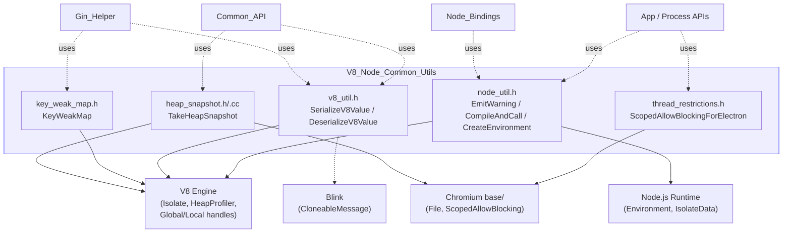
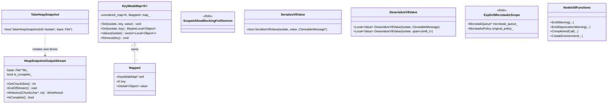
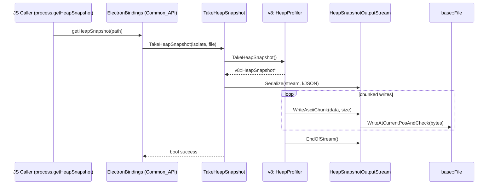
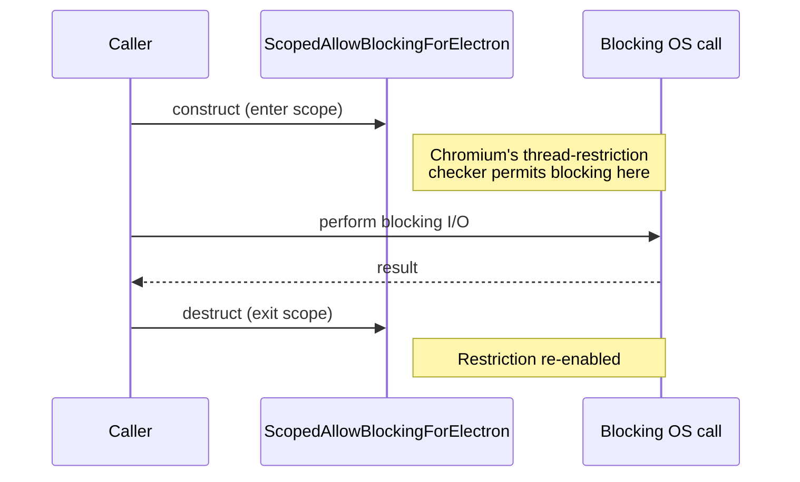
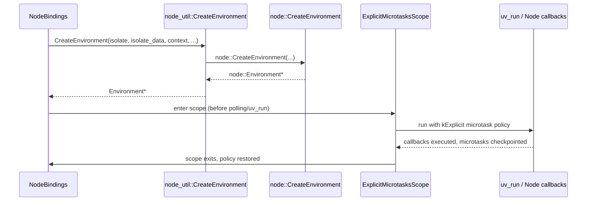
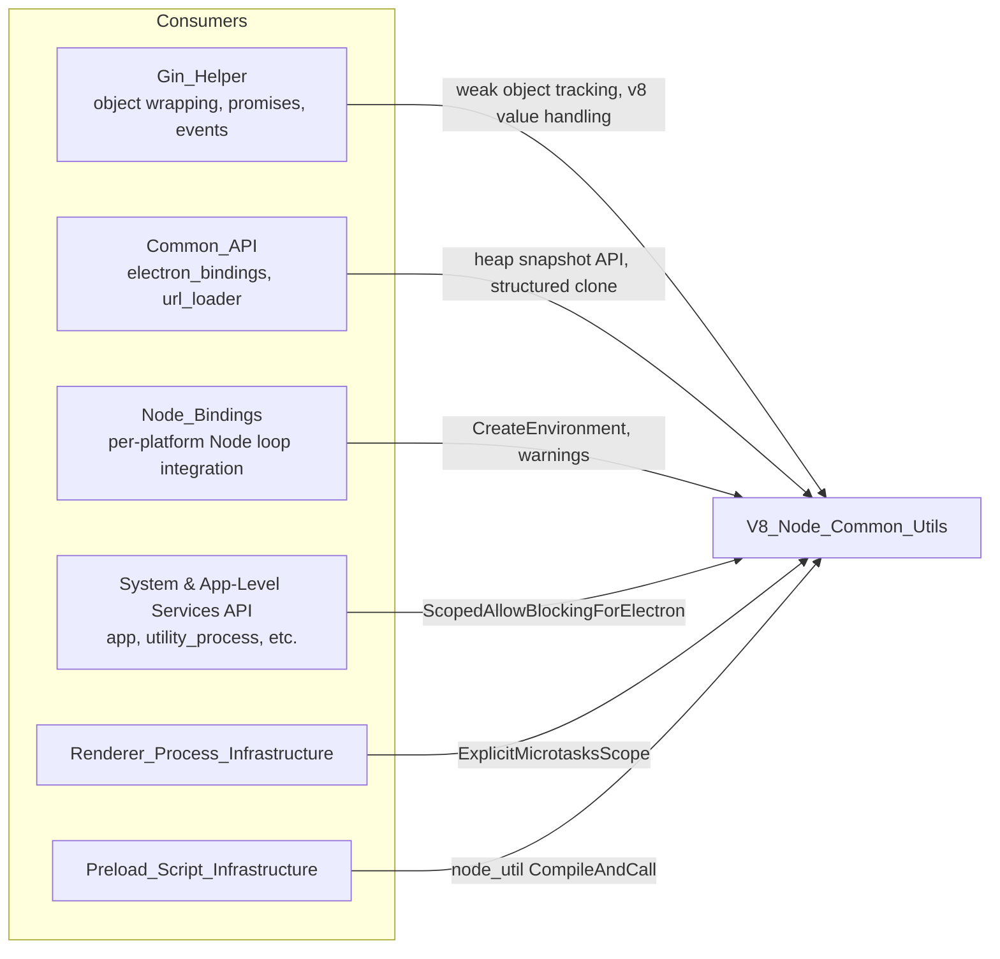

# V8 & Node Common Utilities

## Introduction and Purpose

The **V8_Node_Common_Utils** module is a small but foundational collection of low-level helper utilities that sit at the intersection of the **V8 JavaScript engine** and the **Node.js runtime** inside Electron's C++ codebase (`shell/common/`). These utilities are consumed throughout Electron's browser, renderer, and utility processes wherever raw V8 primitives (`v8::Isolate`, `v8::Value`, `v8::Local<T>`) or Node.js internals (`node::Environment`, microtask scheduling) need to be manipulated directly, outside of the higher-level [Gin_Helper](Gin_Helper.md) object-wrapping abstractions.

Unlike [Gin_Helper](Gin_Helper.md) (which focuses on exposing C++ objects/functions to JavaScript via the Gin binding library) or [Node_Bindings](Node_Bindings.md) (which manages the Node.js event loop and environment lifecycle per-process), this module provides **narrow, single-purpose utilities**:

- Serializing/deserializing V8 values for structured cloning (e.g., IPC message passing).
- Diagnosing memory usage via V8 heap snapshots.
- Safely associating native, non-JS-owned keys with V8 objects using weak references (avoiding memory leaks).
- Temporarily relaxing thread I/O restrictions for blocking operations that Electron deliberately allows.
- Emitting Node.js-style warnings/deprecations and safely invoking Node's microtask/environment machinery from C++.

This is a **leaf module** — it has no further sub-modules — consisting of five small, independent header/source files. It is a low-level dependency for higher-level modules such as [Gin_Helper](Gin_Helper.md), [Common_API](Common_API.md), [Node_Bindings](Node_Bindings.md), and various API bindings elsewhere in the codebase (e.g., [Public_JS_API_Bindings](Public_JS_API_Bindings.md), [System_&_App-Level_Services_API](shell_browser_api_system_device.md)).

## Architecture Overview

The module consists of five independent header/source pairs, each addressing a distinct concern. They do **not** depend on each other, but they share the same layer of the dependency stack — directly wrapping V8/Node.js/libuv/Chromium `base` APIs for use by the rest of `shell/common`, `shell/browser`, and `shell/renderer` code.

### Component Relationship Diagram

## Core Components

### 1. Heap Snapshot Capture (`heap_snapshot.h` / `heap_snapshot.cc`)

Provides `electron::TakeHeapSnapshot(v8::Isolate* isolate, base::File* file)`, which triggers V8's heap profiler to produce a full heap snapshot and stream it, as JSON, into a `base::File`.

- **`HeapSnapshotOutputStream`** (internal, anonymous-namespace class implementing `v8::OutputStream`): bridges V8's chunked snapshot-writing callback interface (`GetChunkSize`, `WriteAsciiChunk`, `EndOfStream`) to synchronous file writes via `base::File::WriteAtCurrentPosAndCheck`.
- Used to back developer-facing diagnostic APIs (e.g., `process.getHeapSnapshot()` exposed via [Common_API](Common_API.md)'s `electron_bindings.h`) that let application/developer code capture memory snapshots for leak investigation.

### 2. Key-Weak Map (`key_weak_map.h`)

`electron::KeyWeakMap<K>` is a template implementing an ES6-`WeakMap`-like structure but keyed by an arbitrary native type `K` (e.g., integer IDs, pointers) rather than by a JS object. It stores `v8::Global<v8::Object>` handles set to **weak**, so that:

- The mapping does **not** prevent V8's garbage collector from reclaiming the JS object.
- When the JS object is collected, the map entry is automatically removed via the `OnObjectGC` weak callback.

Key methods:
| Method | Purpose |
|---|---|
| `Set(isolate, key, value)` | Registers a weak association between `key` and the given JS object. |
| `Get(isolate, key)` | Looks up the JS object for a key, returning a `MaybeLocal` (empty if absent/collected). |
| `Values(isolate)` | Returns all currently-alive mapped objects. |
| `Remove(key)` | Explicitly removes an entry and clears its weak handle. |

This pattern is used, for example, by ID-based object registries in [Gin_Helper](Gin_Helper.md) (`trackable_object.h`) and other subsystems that must track native-object-to-JS-wrapper associations without creating memory leaks (e.g., mapping window/webContents IDs to their JS wrapper objects).

### 3. Thread Restrictions (`thread_restrictions.h`)

`electron::ScopedAllowBlockingForElectron` is a minimal subclass of Chromium's `base::ScopedAllowBlocking`. It is an explicit, auditable RAII marker used at call sites where Electron intentionally performs blocking I/O on a thread that Chromium's threading-checks would otherwise flag as disallowed (e.g., synchronous file dialogs, certain startup-time file reads).

### 4. V8 Value Serialization (`v8_util.h`)

Declares free functions for converting between `v8::Value` and Blink's `blink::CloneableMessage` — the structured-clone wire format used across process/thread boundaries (e.g., `postMessage`, `MessagePort`, `ipcRenderer`/`ipcMain` payloads):

- `SerializeV8Value(isolate, value, CloneableMessage* out)` — serializes a JS value into a `CloneableMessage`.
- `DeserializeV8Value(isolate, const CloneableMessage&)` / `DeserializeV8Value(isolate, base::span<const uint8_t>)` — reconstructs a JS value from serialized bytes.
- `util::as_byte_span(v8::Local<v8::ArrayBufferView>)` — a convenience accessor exposing an `ArrayBufferView`'s backing bytes as a `base::span<uint8_t>`.

These functions underlie Electron's IPC and messaging APIs (see [Public_JS_API_Bindings](Public_JS_API_Bindings.md)'s `message-channel.ts`/`ipc-renderer.ts`, and [Common_API](Common_API.md)'s `electron_api_url_loader.h`), enabling complex JS values to cross the native/JS or process boundary safely.

### 5. Node.js Utilities (`node_util.h`)

A set of free functions in `electron::util` and `electron::Buffer` namespaces that wrap Node.js internals:

- **Warnings**: `EmitWarning` / `EmitDeprecationWarning` — call Node's `process.emitWarning()` mechanism (overloads exist that take an explicit `v8::Isolate*` or implicitly use the current `JavascriptEnvironment`'s isolate).
- **Script execution**: `CompileAndCall(isolate, context, id, parameters, arguments)` — compiles and calls JS source bundled into the binary, invoked as an isolated function (no leakage of top-level declarations into the global scope). Used for bootstrapping bundled internal scripts (e.g., preload/init scripts).
- **Environment creation**: `CreateEnvironment(...)` — a logging wrapper around `node::CreateEnvironment`, used by [Node_Bindings](Node_Bindings.md)'s `NodeBindings::CreateEnvironment` to construct the `node::Environment` for a given isolate/context.
- **`ExplicitMicrotasksScope`**: an RAII guard that temporarily forces V8's microtask policy to `kExplicit` for the duration of the scope, then restores the prior policy. This is required around any code path that can trigger Node.js callbacks or `uv_run()`, since Node expects explicit microtask checkpoints after each JS callback, whereas Electron's renderer process normally uses a different (Blink-driven) policy.
- **`electron::Buffer` helpers**: `as_byte_span(node_buffer)` and `Copy(...)` overloads provide `base::span`-friendly wrappers around Node's `Buffer` APIs for interop between C++ `base::span` code and Node Buffer objects.

## How This Module Fits Into the Overall System

- **[Gin_Helper](Gin_Helper.md)**: uses `KeyWeakMap`-style patterns for ID-to-instance tracking (e.g., `TrackableObject`), and relies on the same V8 value semantics (`v8::Local`, `v8::Isolate`) that `v8_util.h` wraps for serialization.
- **[Common_API](Common_API.md)**: `electron_bindings.h` exposes `process.getHeapSnapshot()`-style JS APIs that internally call `TakeHeapSnapshot`, and its URL-loader/message APIs rely on `SerializeV8Value`/`DeserializeV8Value` for structured-clone payloads.
- **[Node_Bindings](Node_Bindings.md)**: `NodeBindings::CreateEnvironment` builds directly on `electron::util::CreateEnvironment` declared in `node_util.h`.
- **Process bootstrapping and system APIs** (e.g., `Application_Bootstrap_&_Process_Entry`, `System_&_App-Level_Services_API`): use `ScopedAllowBlockingForElectron` when performing intentionally synchronous/blocking operations (e.g., during startup or dialog display) that would otherwise trip Chromium's thread-safety checks.
- **`Renderer_Process_Infrastructure`** and **`Preload_Script_Infrastructure`**: use `ExplicitMicrotasksScope` and the warning-emission helpers when bridging Node's microtask expectations with Blink's renderer-side microtask policy.

## Design Notes

- **No cross-dependencies within the module**: each file (`heap_snapshot`, `key_weak_map`, `thread_restrictions`, `v8_util`, `node_util`) is self-contained and independently includable, minimizing compile-time coupling across Electron's large codebase.
- **RAII-based safety**: both `ScopedAllowBlockingForElectron` and `ExplicitMicrotasksScope` follow the RAII pattern, guaranteeing restoration of prior state (thread restriction / microtask policy) even in the presence of early returns or exceptions.
- **Template-based type safety**: `KeyWeakMap<K>` is a template so it can be keyed by any hashable native type (e.g., integer IDs, pointers, strings) while always mapping to a V8 `Object`.
- **Header-only insulation from heavy V8/Node types**: `v8_util.h` and `node_util.h` forward-declare V8/Node/Blink types to minimize header include costs across the codebase, deferring full type resolution to their corresponding `.cc` implementation files.
