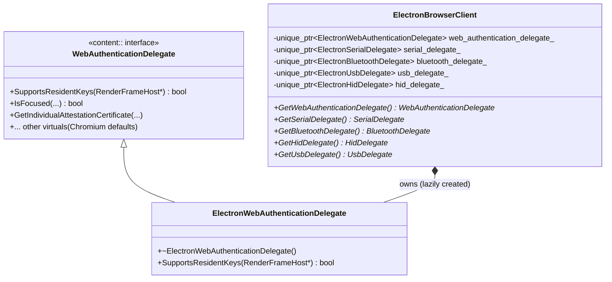
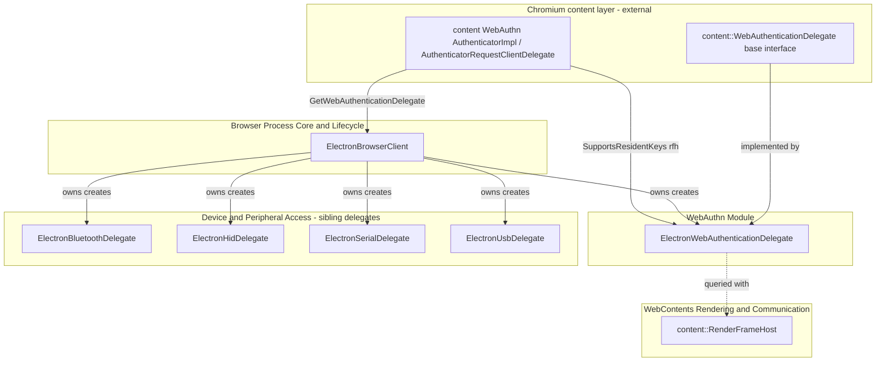
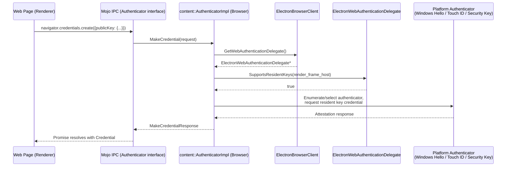
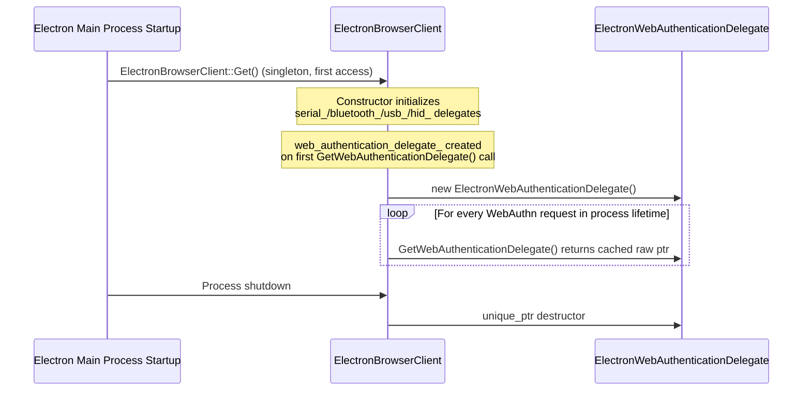

# WebAuthn Module

## Introduction

The **WebAuthn** module provides Electron's implementation of the [Web Authentication API](https://www.w3.org/TR/webauthn-2/) delegate hook required by Chromium's `content` layer. It is a deliberately thin integration point: Electron does not implement its own FIDO2/WebAuthn authenticator UI or credential storage, but it must supply a `content::WebAuthenticationDelegate` implementation so that Chromium's built-in WebAuthn plumbing (platform authenticators, virtual authenticators used in testing, resident-key/passkey support, etc.) can query embedder-specific policy decisions.

The module consists of a single class, `ElectronWebAuthenticationDelegate`, owned and instantiated by [`ElectronBrowserClient`](Browser_Process_Core_%26_Lifecycle.md), which is the central `content::ContentBrowserClient` implementation for the whole browser process. Architecturally, WebAuthn sits alongside the other hardware/permission delegates — Bluetooth, HID, Serial, and USB — that Electron plugs into Chromium's device-access abstraction layer (see [Device & Peripheral Access](Device_%26_Peripheral_Access.md)).

## Purpose & Core Functionality

`content::WebAuthenticationDelegate` is a Chromium-defined extension point that lets embedders (like Electron or Chrome) answer embedder-specific questions during a WebAuthn ceremony (registration/authentication) without the `content` layer needing to know about browser/app-specific concepts such as profiles, sync, or platform authenticator availability.

Electron's implementation, `ElectronWebAuthenticationDelegate`, currently overrides:

- **`SupportsResidentKeys(content::RenderFrameHost*)`** — Informs Chromium's WebAuthn stack whether the current renderer frame's authenticator flow may create *resident keys* (a.k.a. discoverable credentials / passkeys). Electron enables this unconditionally, deferring the actual capability negotiation to the underlying platform authenticator (e.g., Windows Hello, macOS Touch ID/Secure Enclave, or a security key) rather than gating it with app-specific business logic the way Chrome does (Chrome's implementation adds enterprise-policy and sync-account checks).

Because Electron does not ship a first-party GUI for authenticator selection or account chooser dialogs (unlike Chrome), `ElectronWebAuthenticationDelegate` intentionally leaves most of `content::WebAuthenticationDelegate`'s virtual surface at Chromium's default behavior. It only overrides the minimum needed to unblock resident-key credential flows inside `BUILD.gn`-included Electron apps. Comments in the header explicitly note the class is "Modified from `chrome_authenticator_request_delegate.h`", underscoring that it is a deliberately reduced adaptation of Chrome's richer implementation.

## Architecture

### Component Structure

`ElectronWebAuthenticationDelegate` has no persistent state of its own — it is a stateless policy adapter. `ElectronBrowserClient` owns a single instance for the lifetime of the browser process and hands out a raw pointer via `GetWebAuthenticationDelegate()` whenever `content`'s WebAuthn implementation (in `//content/browser/webauth/`) needs an embedder decision.

### Module Dependency Diagram

See [Browser Process Core & Lifecycle](Browser_Process_Core_%26_Lifecycle.md) for details on `ElectronBrowserClient` itself and how the delegate accessors (`GetSerialDelegate`, `GetBluetoothDelegate`, `GetHidDelegate`, `GetUsbDelegate`, `GetWebAuthenticationDelegate`) are wired into `content::ContentBrowserClient`. See [Device & Peripheral Access](Device_%26_Peripheral_Access.md) for the analogous, but functionally much larger, chooser-based delegates for Bluetooth/HID/Serial/USB device permission flows.

## Data / Control Flow

### WebAuthn Ceremony — Resident Key Support Check

The typical flow begins in the renderer, where a web page calls `navigator.credentials.create()` or `.get()` with `authenticatorSelection.residentKey` requirements. This request travels via Mojo to the browser process's WebAuthn implementation, which consults the embedder delegate before proceeding with authenticator discovery.

Because `ElectronWebAuthenticationDelegate` always returns `true` from `SupportsResidentKeys`, the *actual* gating of resident-key creation happens further down the stack — inside `content`'s authenticator discovery/dispatch logic and the platform authenticator itself (e.g., a CTAP2 security key may reject a resident-key request if it lacks capacity, or the OS-level platform authenticator may prompt the user for biometric confirmation).

### Delegate Lifecycle within the Browser Process

## Component Reference

### `ElectronWebAuthenticationDelegate`
*File: `shell/browser/webauthn/electron_authenticator_request_delegate.h`*

| Member | Type | Description |
|---|---|---|
| `~ElectronWebAuthenticationDelegate()` | dtor (override) | Default destructor; no owned resources beyond base class state. |
| `SupportsResidentKeys(content::RenderFrameHost*)` | `bool` (override) | Returns whether the frame's WebAuthn ceremony may request resident/discoverable credentials. Electron returns `true` unconditionally, relying on platform authenticators and Chromium's CTAP2 layer for enforcement. |

**Inheritance:** Publicly inherits from `content::WebAuthenticationDelegate`, the Chromium-defined base class (declared in `content/public/browser/web_authentication_delegate.h`, outside the Electron codebase). All other virtuals on the base class use Chromium's default (typically permissive or no-op) behavior unless Electron overrides them in the future.

**Ownership:** A single instance is lazily constructed and owned by [`ElectronBrowserClient`](Browser_Process_Core_%26_Lifecycle.md) via `std::unique_ptr<ElectronWebAuthenticationDelegate> web_authentication_delegate_`, exposed through the `content::ContentBrowserClient::GetWebAuthenticationDelegate()` override.

## Relationship to Sibling Device-Access Delegates

`ElectronBrowserClient` follows the same ownership/exposure pattern for several other `content::ContentBrowserClient` delegate hooks, all declared as `std::unique_ptr` members and exposed through parallel `Get*Delegate()` accessor overrides:

| Delegate | Accessor on `ElectronBrowserClient` | Purpose | Documented in |
|---|---|---|---|
| `ElectronWebAuthenticationDelegate` | `GetWebAuthenticationDelegate()` | WebAuthn/FIDO2 policy hooks | *this document* |
| `ElectronBluetoothDelegate` | `GetBluetoothDelegate()` | Web Bluetooth chooser & permission logic | [Device & Peripheral Access](Device_%26_Peripheral_Access.md) |
| `ElectronHidDelegate` | `GetHidDelegate()` | WebHID chooser & permission logic | [Device & Peripheral Access](Device_%26_Peripheral_Access.md) |
| `ElectronSerialDelegate` | `GetSerialDelegate()` | Web Serial chooser & permission logic | [Device & Peripheral Access](Device_%26_Peripheral_Access.md) |
| `ElectronUsbDelegate` | `GetUsbDelegate()` | WebUSB chooser & permission logic | [Device & Peripheral Access](Device_%26_Peripheral_Access.md) |

Unlike Bluetooth/HID/Serial/USB — which each maintain a `*ChooserController` per `RenderFrameHost` to drive a device-selection UI and persist per-origin permission grants via `ElectronBrowserContext` (see [Browser Context & Session Management](Browser_Context_%26_Session_Management.md)) — the WebAuthn delegate is stateless and does not integrate with Electron's permission-grant storage. FIDO2 credential storage and biometric confirmation are entirely delegated to the OS platform authenticator or an external security key; Electron's WebAuthn delegate is purely a policy pass-through.

## Integration Points

- **[Browser Process Core & Lifecycle](Browser_Process_Core_%26_Lifecycle.md):** `ElectronBrowserClient` is the sole consumer/owner of `ElectronWebAuthenticationDelegate` and the place where `content::ContentBrowserClient::GetWebAuthenticationDelegate()` is overridden.
- **[Device & Peripheral Access](Device_%26_Peripheral_Access.md):** Sibling delegates (Bluetooth/HID/Serial/USB) for other hardware-permission-gated Web Platform APIs, following the identical `unique_ptr`-owned-by-`ElectronBrowserClient` pattern.
- **[WebContents Rendering & Communication](WebContents_Rendering_%26_Communication.md):** `content::RenderFrameHost`, the parameter passed into `SupportsResidentKeys`, identifies the specific frame/origin initiating the WebAuthn ceremony; frame lifecycle and origin resolution are managed by the WebContents subsystem.
- **[Browser Context & Session Management](Browser_Context_%26_Session_Management.md):** While the WebAuthn delegate itself does not read/write permission state through `ElectronBrowserContext`, the surrounding device-access delegates that share its ownership pattern do, and future extensions to WebAuthn policy (e.g., resident-key opt-outs per session) would likely follow the same `ElectronBrowserContext`-backed storage model.

## Extensibility Notes

Because Electron's implementation only overrides `SupportsResidentKeys`, any additional embedder-level WebAuthn policy (e.g., large-blob extension support signaling, attestation conveyance customization, or per-origin authenticator restrictions) would be added by overriding further virtuals on `content::WebAuthenticationDelegate` within this same class. The header comment referencing Chrome's `chrome_authenticator_request_delegate.h` is a useful upstream reference point when Chromium introduces new virtuals that Electron may need to adopt or intentionally decline (falling back to Chromium's default implementation).
