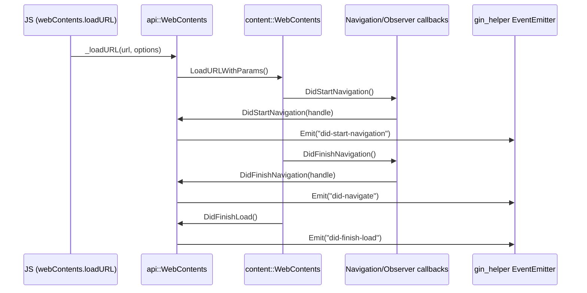
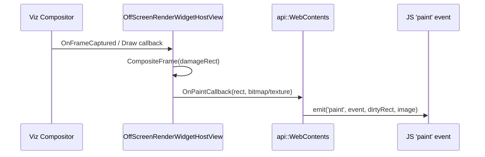

# WebContents_Rendering_&_Communication

## Purpose

The **WebContents_Rendering_&_Communication** module is the browser-process nucleus that turns Chromium's raw `content::WebContents` into Electron's rich, event-driven `webContents` API. It is the largest and most interconnected module in Electron's native codebase, and it is responsible for:

- **Creating, owning, and managing** `content::WebContents` instances for windows, `<webview>` guests, offscreen renderers, background pages, and DevTools contents (`shell_browser_api_webcontents`).
- **Configuring behavior** of a `WebContents` through permissions, `webPreferences`, and zoom management (`Web_Contents`).
- **Bridging `<webview>` guest content** to its embedder, including zoom propagation and guest registry lookups (`Web_View`).
- **Handling browser-process IPC** originating from renderer frames, service workers, autofill agents, and network-hint requests (`shell_browser_ipc_handlers`).
- **Rendering off-screen** by intercepting Chromium's compositor pipeline to deliver CPU bitmaps or GPU shared textures instead of native window painting (`OSR_(Offscreen_Rendering)`).
- **Printing** web content to physical printers or PDF (`Printing`).
- **Resolving plugin/MIME-type ownership** for extension-hosted viewers such as the PDF viewer (`Plugins`).
- Supplying a grab-bag of **auxiliary browser-side services**: native file choosers, HTTP auth login prompts, and geolocation stubs (`shell_browser_misc`).

Together these sub-modules provide the full request/response and rendering lifecycle for every `WebContents` in an Electron application, from creation and navigation through IPC, permission checks, rendering, printing, and teardown.

## Architecture

```mermaid
graph TB
    subgraph JS["Public JS API"]
        JSAPI["webContents / BrowserWindow / webview<br/>(lib/browser/api)"]
    end

    subgraph Core["shell_browser_api_webcontents"]
        WC["WebContents<br/>(electron_api_web_contents)"]
        WCV["WebContentsView"]
        WFM["WebFrameMain"]
        FS["FrameSubscriber"]
        SPH["SavePageHandler"]
        MP["MessagePort"]
    end

    subgraph Behavior["Web_Contents"]
        WCP["WebContentsPreferences"]
        WCPH["WebContentsPermissionHelper"]
        WZC["WebContentsZoomController"]
        ZLD["ZoomLevelDelegate"]
    end

    subgraph Guest["Web_View"]
        WVGD["WebViewGuestDelegate"]
        WVM["WebViewManager"]
    end

    subgraph IPC["shell_browser_ipc_handlers"]
        IPCH["ElectronApiIPCHandlerImpl /<br/>ElectronApiSWIPCHandlerImpl"]
        AF["AutofillDriver(Factory)"]
        NHU["NetworkHintsHandlerImpl /<br/>ElectronWebContentsUtilityHandlerImpl"]
    end

    subgraph OSR["OSR (Offscreen Rendering)"]
        OWCV["OffScreenWebContentsView"]
        ORWHV["OffScreenRenderWidgetHostView"]
    end

    subgraph Print["Printing"]
        PVM["PrintViewManagerElectron"]
    end

    subgraph Misc["shell_browser_misc"]
        FSH["FileSelectHelper"]
        LH["LoginHandler"]
        FLP["FakeLocationProvider"]
    end

    subgraph Plug["Plugins"]
        PU["PluginUtils"]
    end

    JSAPI -->|gin bindings| WC
    WC --> WCV
    WC --> WFM
    WC --> FS
    WC --> SPH
    WC -.-> MP

    WC --> WCP
    WC --> WCPH
    WC --> WZC
    WZC --> ZLD

    WC --> WVGD
    WVGD --> WVM
    WVGD -.-> WZC

    WC --> IPCH
    WC --> AF
    WC --> NHU

    WC --> OWCV
    OWCV --> ORWHV

    WC --> PVM
    WC --> FSH
    WC --> LH
    WC --> PU

    subgraph External["Related External Modules"]
        SESS["Browser_Context_&_Session_Management"]
        NW["Native_Window_&_Menu_Management"]
        GIN["Common_Native_Gin_Infrastructure"]
        EXT["Extensions_Subsystem"]
    end

    WC --> SESS
    WC --> NW
    WC --> GIN
    PU --> EXT
```

### Data Flow: Navigation & Event Emission

### Data Flow: Offscreen Frame Capture

## Sub-modules & Core Components

| Sub-module | Responsibility | Key Components |
|---|---|---|
| [shell_browser_api_webcontents](shell_browser_api_webcontents.md) | Core `WebContents` JS binding, view wrapper, per-frame binding, and supporting utilities (frame capture, page saving, message ports). | `WebContents`, `WebContentsView`, `WebFrameMain`, `FrameSubscriber`, `SavePageHandler`, `MessagePort` |
| [Web_Contents](Web_Contents.md) | Permission mediation, `webPreferences` parsing/application, and zoom level management/persistence. | `WebContentsPermissionHelper`, `WebContentsPreferences`, `WebContentsZoomController`, `ZoomLevelDelegate`, `WebContentsZoomObserver` |
| [Web_View](Web_View.md) | `<webview>` guest lifecycle, embedder/guest registry, and zoom propagation for guest views. | `WebViewGuestDelegate`, `WebViewManager` |
| [shell_browser_misc](shell_browser_misc.md) | Standalone browser-process utilities: native file choosers, HTTP auth prompts, geolocation stub. | `FileSelectHelper`, `LoginHandler`, `FakeLocationProvider` |
| [shell_browser_ipc_handlers](shell_browser_ipc_handlers.md) | Mojo IPC endpoints for renderer/service-worker messaging, autofill driver management, and utility/network-hint services. | `ElectronApiIPCHandlerImpl`, `ElectronApiSWIPCHandlerImpl`, `AutofillDriver(Factory)`, `NetworkHintsHandlerImpl`, `ElectronWebContentsUtilityHandlerImpl` |
| [OSR_(Offscreen_Rendering)](OSR_(Offscreen_Rendering).md) | Redirects compositor output to CPU bitmap or GPU shared-texture callbacks instead of a native window. | `OffScreenWebContentsView`, `OffScreenRenderWidgetHostView`, `OffScreenHostDisplayClient`, `OffScreenVideoConsumer`, `OffscreenViewProxy` |
| [Printing](Printing.md) | Browser/renderer print orchestration, PDF generation, and print-preview customization. | `PrintViewManagerElectron`, `printing_utils`, `PrintRenderFrameHelperDelegate` |
| [Plugins](Plugins.md) | Resolves MIME-type-to-extension mappings for extension-hosted content viewers (e.g., PDF viewer). | `PluginUtils` |

## Related Modules

- [Browser_Context_&_Session_Management](Browser_Context_&_Session_Management.md) — provides the `Session`/`ElectronBrowserContext` that every `WebContents` belongs to.
- [Native_Window_&_Menu_Management](Native_Window_&_Menu_Management.md) — supplies the `NativeWindow`/`BrowserWindow` that hosts a `WebContents`.
- [Extensions_Subsystem](Extensions_Subsystem.md) — guest view delegates and MIME handler view extensions consumed by `Plugins` and `Web_View`.
- [Common_Native_Gin_Infrastructure](Common_Native_Gin_Infrastructure.md) — gin/V8 bindings, converters, and helper templates powering all JS bindings in this module.
- [Desktop_UI_Widgets_&_Dialogs](Desktop_UI_Widgets_&_Dialogs.md) — `InspectableWebContents` (DevTools) and `AutofillPopup` used by `WebContents` and OSR overlays.
- [Renderer_Process_Infrastructure](Renderer_Process_Infrastructure.md) — renderer-side counterparts (renderer clients, printing helper delegate) that pair with this module's browser-side IPC and printing components.