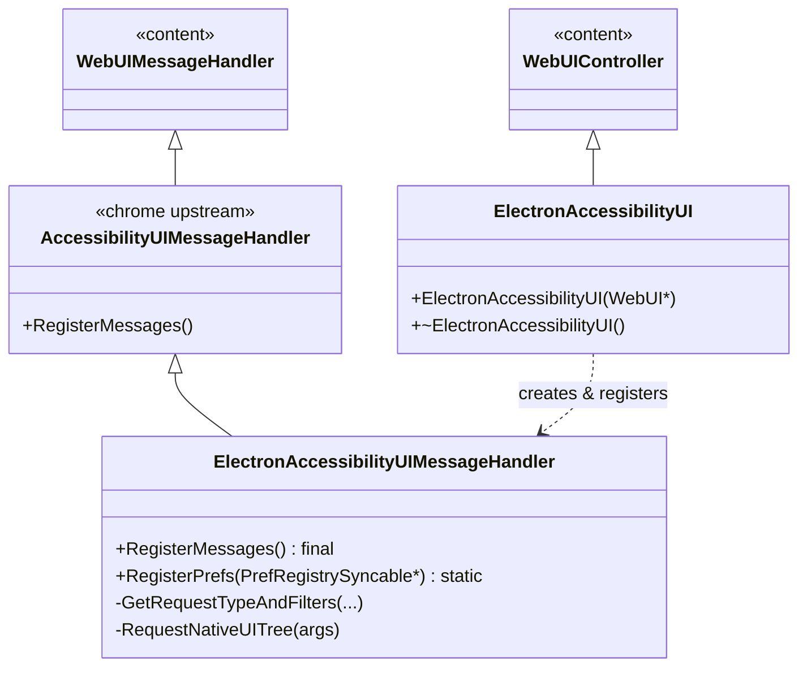
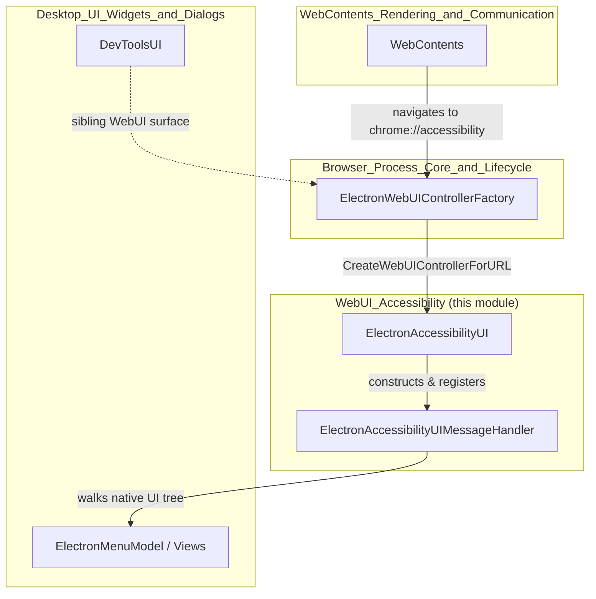
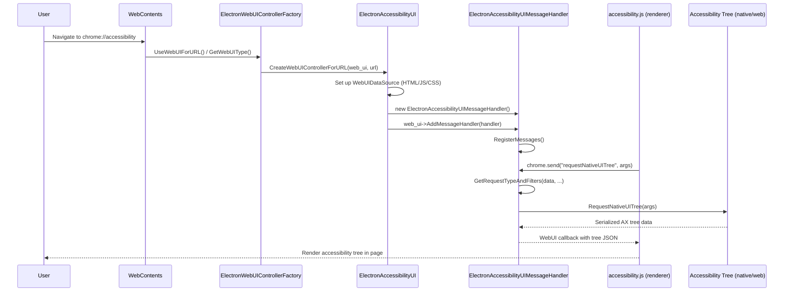
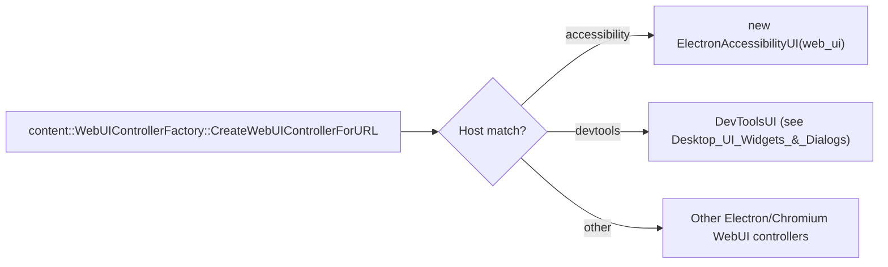
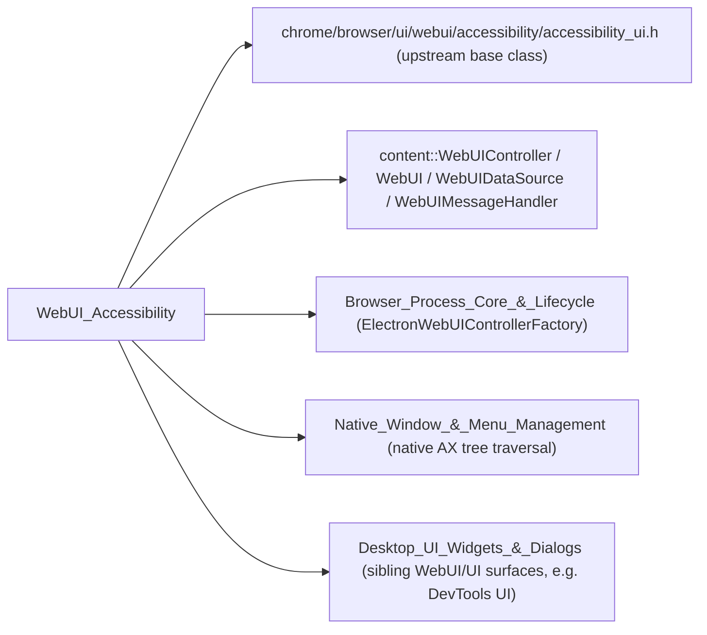

# WebUI Accessibility Module

## Introduction

The **WebUI_Accessibility** module implements Electron's internal `chrome://accessibility` WebUI page — a diagnostic surface that lets developers and QA engineers inspect the accessibility tree (AX tree) of any renderer frame running inside an Electron application. It is a very small, focused module consisting of two classes:

- **`ElectronAccessibilityUI`** — the `content::WebUIController` that backs the `chrome://accessibility` page.
- **`ElectronAccessibilityUIMessageHandler`** — the message handler that bridges JavaScript (`accessibility.js`, borrowed from Chromium) running on that page to native C++ code, allowing the page to query and render the accessibility tree of native UI and web content.

This module is a thin Electron-specific adapter around Chromium's upstream `//chrome/browser/ui/webui/accessibility` implementation, wired into Electron's custom WebUI infrastructure so that the same diagnostic tooling available in Google Chrome is also available inside Electron-based applications.

---

## Purpose & Core Functionality

| Component | Responsibility |
|---|---|
| `ElectronAccessibilityUI` | `content::WebUIController` subclass instantiated whenever a `WebContents` navigates to the `chrome://accessibility` URL. It owns/sets up the `content::WebUI` object and installs the `ElectronAccessibilityUIMessageHandler`, along with the `WebUIDataSource` that serves the HTML/JS/CSS assets for the page. |
| `ElectronAccessibilityUIMessageHandler` | Subclass of Chromium's `AccessibilityUIMessageHandler`. It implements `RegisterMessages()` to bind message names (invoked from `accessibility.js` through `chrome.send`) to native handler functions, and provides Electron-specific overrides such as `RequestNativeUITree()` (to dump the native `views`/platform UI accessibility tree, distinct from web content) and `GetRequestTypeAndFilters()` (to parse the incoming JSON request describing what part of the tree to fetch and how to filter it). It also exposes `RegisterPrefs()` for wiring accessibility-related preferences into the pref registry. |

Both classes intentionally add minimal Electron-specific behavior on top of Chromium's existing accessibility WebUI implementation — Electron reuses Chromium's `accessibility_ui.h/cc`, `.html`, `.js`, and `.css` resources almost verbatim, only substituting Electron-appropriate integration points (e.g. Electron's own `Browser`/`NativeWindow` abstractions when walking the native UI tree instead of Chrome's `Browser`/`BrowserView`).

---

## Architecture

### Class Relationships

### Module Position in the System

The module sits within the broader **[Desktop_UI_Widgets_&_Dialogs](Desktop_UI_Widgets_%26_Dialogs.md)** family of components (Electron's native UI layer), specifically alongside other internal WebUI surfaces such as **DevTools UI**. It depends on the generic WebUI dispatch mechanism owned by the **[Browser_Process_Core_&_Lifecycle](Browser_Process_Core_%26_Lifecycle.md)** module.

---

## Data Flow: Loading the `chrome://accessibility` Page

---

## Component Interaction

### Registration with the WebUI Factory

`ElectronAccessibilityUI` is only ever instantiated through Electron's central WebUI dispatch point, `ElectronWebUIControllerFactory` (documented in **[Browser_Process_Core_&_Lifecycle](Browser_Process_Core_%26_Lifecycle.md)**). When a `WebContents` requests a `chrome://` URL, the factory's `CreateWebUIControllerForURL` inspects the host (`accessibility`) and instantiates `ElectronAccessibilityUI`, mirroring how Chromium's own `WebUIControllerFactory` chain routes `chrome://` pages to their respective controllers.

### Message Handling Pipeline

`ElectronAccessibilityUIMessageHandler` overrides/extends the upstream `AccessibilityUIMessageHandler` behavior:

1. **`RegisterMessages()`** — binds JS-invocable message names (e.g., `toggleAccessibility`, `requestWebContentsTree`, `requestNativeUITree`) to internal handler methods, following the same message contract Chromium's `chrome://accessibility` page expects.
2. **`GetRequestTypeAndFilters()`** — parses the `base::Value::Dict` payload sent by the page's JS into structured request-type and allow/deny filter strings, used to scope which parts of the AX tree are returned and how nodes are filtered by role/state.
3. **`RequestNativeUITree()`** — Electron-specific: walks Electron's native window/widget hierarchy (as opposed to a web page's DOM-derived AX tree) to produce accessibility data for native UI surfaces (menus, dialogs, tray, etc.), integrating with types described in **[Native_Window_&_Menu_Management](Native_Window_%26_Menu_Management.md)** and **[Desktop_UI_Widgets_&_Dialogs](Desktop_UI_Widgets_%26_Dialogs.md)**.
4. **`RegisterPrefs()`** — static helper invoked during pref-registry setup (see `PrefService`/`PrefRegistrySimple` usage across **[Browser_Process_Core_&_Lifecycle](Browser_Process_Core_%26_Lifecycle.md)**) to register accessibility-related preferences (e.g., whether the accessibility tree should include internal/hidden nodes).

---

## Dependencies

- **Upstream Chromium base classes** — `AccessibilityUIMessageHandler` (declared in `chrome/browser/ui/webui/accessibility/accessibility_ui.h`) supplies the bulk of the message-handling logic; Electron only overrides what is necessary to plug into its own window/browser model.
- **`content::WebUIController` / `content::WebUI` / `content::WebUIDataSource` / `content::WebUIMessageHandler`** — the Content layer abstractions that `ElectronAccessibilityUI` and `ElectronAccessibilityUIMessageHandler` build upon.
- **[Browser_Process_Core_&_Lifecycle](Browser_Process_Core_%26_Lifecycle.md)** — supplies `ElectronWebUIControllerFactory`, the single entry point that instantiates `ElectronAccessibilityUI` for matching URLs, and the `PrefService`/pref-registry plumbing used by `RegisterPrefs()`.
- **[Native_Window_&_Menu_Management](Native_Window_%26_Menu_Management.md)** — provides the native window/menu/view object graph that `RequestNativeUITree()` walks to build the non-web accessibility tree.
- **[Desktop_UI_Widgets_&_Dialogs](Desktop_UI_Widgets_%26_Dialogs.md)** — the parent module grouping; sibling WebUI surfaces such as **DevTools UI** follow an analogous controller/handler pattern and share the same `ElectronWebUIControllerFactory` dispatch mechanism.
- **[WebContents_Rendering_&_Communication](WebContents_Rendering_%26_Communication.md)** — the `WebContents`/renderer frames whose DOM-based accessibility trees are the primary subject inspected by the page (as opposed to the native UI tree).

---

## Usage Context

This module is not exposed through Electron's public JS API (see **[Public_JS_API_Bindings](Public_JS_API_Bindings.md)**); it is an internal diagnostic tool reached only by navigating a `WebContents` to `chrome://accessibility`, typically for debugging accessibility issues during development of an Electron app or of Electron itself. It has no runtime dependency on application code and does not participate in the app's normal IPC or rendering pipelines beyond the standard WebUI navigation and message-passing mechanism used by all internal `chrome://` pages.

## Summary

| Aspect | Detail |
|---|---|
| **Type** | Internal diagnostic WebUI (`chrome://accessibility`) |
| **Key classes** | `ElectronAccessibilityUI`, `ElectronAccessibilityUIMessageHandler` |
| **Base classes** | `content::WebUIController`, `AccessibilityUIMessageHandler` |
| **Entry point** | `ElectronWebUIControllerFactory::CreateWebUIControllerForURL` |
| **Primary data** | Native and web-content accessibility (AX) trees |
| **Related modules** | Browser_Process_Core_&_Lifecycle, Native_Window_&_Menu_Management, Desktop_UI_Widgets_&_Dialogs, WebContents_Rendering_&_Communication |
