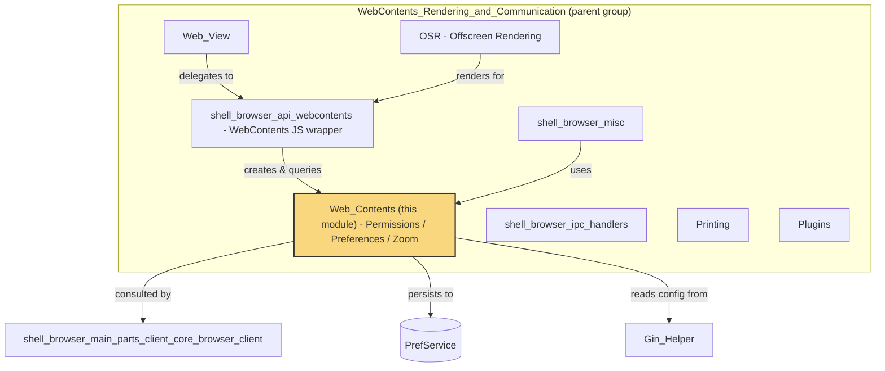
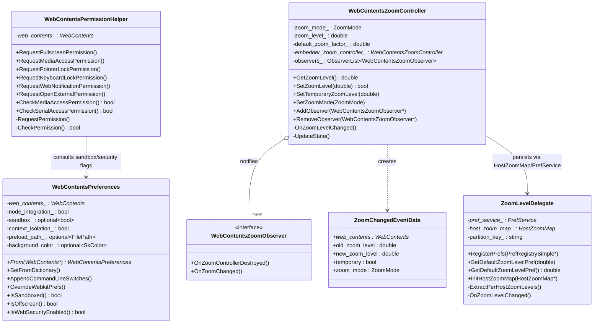
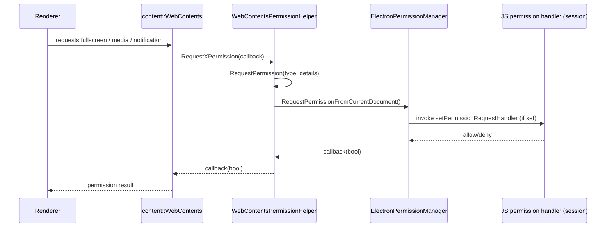
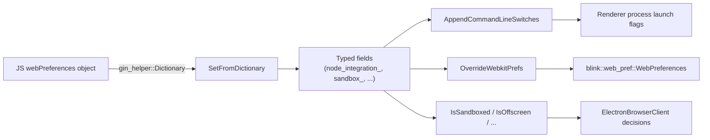
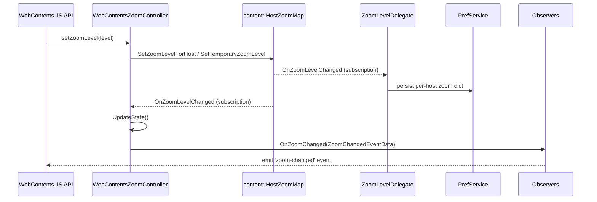
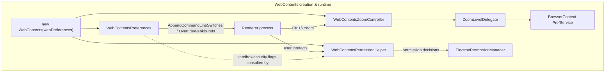

# Web Contents

## Introduction

The **Web_Contents** module provides the cross-cutting *behavioral configuration* layer that sits on top of Chromium's `content::WebContents`. Rather than owning the `WebContents` object itself (that responsibility belongs to [shell_browser_api_webcontents](shell_browser_api_webcontents.md)), this module supplies the policies and runtime state that determine **how** a given `WebContents` behaves:

- **Permissions** — whether a page/frame is allowed to use fullscreen, media devices, geolocation-adjacent APIs, pointer/keyboard lock, web notifications, and external-URL navigation.
- **Preferences** — the (large) set of Electron-specific `webPreferences` (node integration, sandboxing, context isolation, background color, image handling, etc.) that are read from JS and translated into Chromium's `blink::web_pref::WebPreferences` and renderer command-line switches.
- **Zoom** — per-`WebContents` and per-host page-zoom level management, including persistence of zoom preferences across sessions.

All three concerns are implemented as `content::WebContentsUserData`-derived helper classes that attach themselves to a `WebContents` instance and are looked up on demand (`FromWebContents()` / `From()` pattern), keeping the core `WebContents` wrapper itself lean.

## Position in the Overall System

The `WebContents` API wrapper (see [shell_browser_api_webcontents.md](shell_browser_api_webcontents.md)) is the primary *consumer* of this module: when a `BrowserWindow`/`WebContents` object is created from JavaScript, the `webPreferences` dictionary is handed to `WebContentsPreferences`, permission requests originating from the renderer are routed through `WebContentsPermissionHelper`, and zoom-related JS APIs (`webContents.setZoomLevel`, `zoomFactor`, etc.) are backed by `WebContentsZoomController`.

## Architecture Overview

## Sub-modules

This module is intentionally small and cohesive; its functionality is organized into three tightly related concern areas, all documented in-depth below rather than split into separate files, since they share the same lifecycle pattern (`WebContentsUserData`) and are frequently used together when a `WebContents` is configured.

| Concern | Core Class(es) | Responsibility |
|---|---|---|
| [Permissions](#permissions-webcontentspermissionhelper) | `WebContentsPermissionHelper` | Mediates async permission requests (fullscreen, media, pointer/keyboard lock, notifications, external navigation) and sync permission checks (media, serial). |
| [Preferences](#preferences-webcontentspreferences) | `WebContentsPreferences`, `Dictionary` | Parses/stores Electron `webPreferences`, applies them to Chromium's `WebPreferences`/renderer command line. |
| [Zoom Management](#zoom-management-webcontentszoomcontroller--zoomleveldelegate) | `WebContentsZoomController`, `ZoomChangedEventData`, `WebContentsZoomObserver`, `ZoomLevelDelegate` | Tracks and persists per-tab/per-host zoom level and broadcasts zoom-change events. |

---

## Permissions: `WebContentsPermissionHelper`

**File:** `shell/browser/web_contents_permission_helper.h`

`WebContentsPermissionHelper` is a `content::WebContentsUserData` attached to each `WebContents`. It centralizes all permission decision-making that Electron exposes to app developers via the `session.setPermissionRequestHandler` / `setPermissionCheckHandler` JS APIs (implemented in [ElectronPermissionManager](shell_browser_context.md)).

### Responsibilities
- **Asynchronous request methods** — each corresponds to a browser-triggered permission prompt:
  - `RequestFullscreenPermission`
  - `RequestMediaAccessPermission`
  - `RequestPointerLockPermission`
  - `RequestKeyboardLockPermission`
  - `RequestWebNotificationPermission`
  - `RequestOpenExternalPermission`
- **Synchronous checks** — used for already-decided/cached permission state:
  - `CheckMediaAccessPermission`
  - `CheckSerialAccessPermission`
- Internally, all request methods funnel through the private `RequestPermission()` helper, and all checks funnel through `CheckPermission()`, both of which ultimately query the embedder's `ElectronPermissionManager` (part of the [Browser_Context_&_Session_Management](shell_browser_context.md) module) with a `blink::PermissionType` and contextual `base::Value::Dict` details.

### Interaction Flow

This class relies on `ElectronPermissionManager`, documented in the [Browser_Context_&_Session_Management](shell_browser_context.md) module, for the actual policy resolution and JS callback dispatch.

---

## Preferences: `WebContentsPreferences`

**File:** `shell/browser/web_contents_preferences.h`

`WebContentsPreferences` stores and applies the full set of Electron `webPreferences` options passed when creating a `BrowserWindow`, `WebContentsView`, or `<webview>` tag. It is also a `WebContentsUserData`, retrievable via the static `From(content::WebContents*)`.

### Key Responsibilities
1. **Ingestion** — `SetFromDictionary(const gin_helper::Dictionary&)` parses a JS-provided options object (backed by [Gin_Helper::Dictionary](Gin_Helper.md)) into strongly-typed C++ fields (`node_integration_`, `sandbox_`, `context_isolation_`, `webgl_`, `preload_path_`, etc.).
2. **Command-line propagation** — `AppendCommandLineSwitches(base::CommandLine*, bool is_subframe)` forwards relevant preferences to the renderer process as command-line switches, since the renderer process reads them at startup (see [Renderer_Process_Infrastructure](Renderer_Client.md)).
3. **WebPreferences override** — `OverrideWebkitPrefs(blink::web_pref::WebPreferences*, blink::RendererPreferences*)` mutates Chromium's native preferences structures to reflect Electron-specific settings (fonts, image policy, autoplay policy, spellcheck, etc.).
4. **Introspection accessors** — e.g. `IsOffscreen()`, `IsSandboxed()`, `IsWebSecurityEnabled()`, `GetBackgroundColor()`, `AllowsNodeIntegrationInSubFrames()`, used throughout the browser process (notably by `ElectronBrowserClient`, see [shell_browser_main_parts_client_core_browser_client](shell_browser_main_parts_client_core_browser_client.md)) to make security- and rendering-relevant decisions.
5. **Snapshotting** — `SaveLastPreferences()`/`last_preference()` retain the preference set active at the time the renderer was last launched, used to detect changes that require a renderer restart.

### Data Flow

`WebContentsPreferences` is declared as a `friend` of `ElectronBrowserClient`, reflecting how tightly integrated preference resolution is with browser-process content embedding decisions (see [shell_browser_main_parts_client_core_browser_client.md](shell_browser_main_parts_client_core_browser_client.md)).

---

## Zoom Management: `WebContentsZoomController` & `ZoomLevelDelegate`

**Files:** `shell/browser/web_contents_zoom_controller.h`, `shell/browser/web_contents_zoom_observer.h`, `shell/browser/zoom_level_delegate.h`

This trio implements Electron's page-zoom feature end-to-end: from per-tab runtime zoom state down to persisted per-host zoom preferences.

### `WebContentsZoomController`
A `WebContentsObserver` + `WebContentsUserData` that:
- Tracks the current `ZoomMode` (`ZOOM_MODE_DEFAULT`, `ZOOM_MODE_ISOLATED`, `ZOOM_MODE_MANUAL`, `ZOOM_MODE_DISABLED`).
- Reads/writes zoom level through Chromium's `content::HostZoomMap`, unless in manual mode, in which case it manages a local, per-tab zoom level.
- Supports **temporary** zoom levels via `SetTemporaryZoomLevel`, useful for embedded/guest views that shouldn't affect other tabs.
- Supports **embedder delegation** via `SetEmbedderZoomController`, allowing `<webview>` guest content to defer zoom to its embedder (used by [Web_View](Web_View.md)).
- Emits `ZoomChangedEventData` to registered `WebContentsZoomObserver` instances whenever zoom state changes (`OnZoomLevelChanged` → `UpdateState`).
- Resets/adjusts zoom automatically on navigation (`DidFinishNavigation`, `ResetZoomModeOnNavigationIfNeeded`, `SetZoomFactorOnNavigationIfNeeded`).

### `WebContentsZoomObserver`
A minimal `base::CheckedObserver` interface with two hooks:
- `OnZoomControllerDestroyed` — mandatory cleanup hook.
- `OnZoomChanged` — optional notification of a `ZoomChangedEventData` payload.

Consumers such as the `WebContents` JS wrapper (see [shell_browser_api_webcontents.md](shell_browser_api_webcontents.md)) implement this interface to relay zoom events to JavaScript (`did-change-zoom` / zoom related events).

### `ZoomLevelDelegate`
Implements Chromium's `content::ZoomLevelDelegate` interface to bridge `HostZoomMap` with Electron's `PrefService`-backed persistence, scoped per storage partition (`partition_path`):
- `RegisterPrefs(PrefRegistrySimple*)` — registers the pref schema.
- `InitHostZoomMap(content::HostZoomMap*)` — loads persisted per-host zoom levels into the live `HostZoomMap` at partition initialization and subscribes to future changes.
- `SetDefaultZoomLevelPref` / `GetDefaultZoomLevelPref` — manage the partition-wide default zoom level.
- `ExtractPerHostZoomLevels` / `OnZoomLevelChanged` — synchronize `HostZoomMap` changes back into `PrefService` storage.

### Zoom Interaction Diagram

`ZoomLevelDelegate` is instantiated per `BrowserContext`/partition (see [Browser_Context_&_Session_Management](shell_browser_context.md)) and installed into the `content::HostZoomMap` owned by that context, ensuring zoom preferences persist across app restarts on a per-partition basis.

---

## How the Pieces Fit Together

## Related Modules

- [shell_browser_api_webcontents.md](shell_browser_api_webcontents.md) — The JS-facing `WebContents` wrapper that owns and drives instances of the classes documented here.
- [Web_View.md](Web_View.md) — `<webview>` guest management, which relies on zoom embedder delegation and shares preference/permission handling.
- [Browser_Context_&_Session_Management](shell_browser_context.md) — Provides `ElectronPermissionManager`, `PrefService`, and the `BrowserContext`/partition that `ZoomLevelDelegate` persists into.
- [shell_browser_main_parts_client_core_browser_client.md](shell_browser_main_parts_client_core_browser_client.md) — `ElectronBrowserClient`, a close collaborator that consults `WebContentsPreferences` for security/rendering decisions and mediates content-layer callbacks that ultimately invoke `WebContentsPermissionHelper`.
- [Gin_Helper.md](Gin_Helper.md) — Provides the `gin_helper::Dictionary` type used to parse JS preference objects.
- [Renderer_Client.md](Renderer_Client.md) — Consumes command-line switches appended by `WebContentsPreferences` to configure renderer-side behavior (node integration, sandboxing, etc.).
