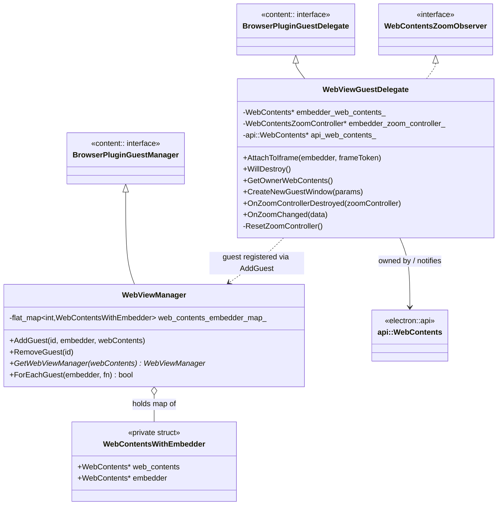
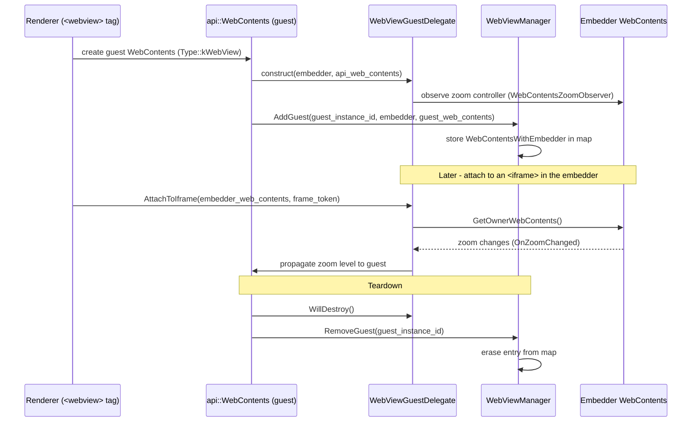
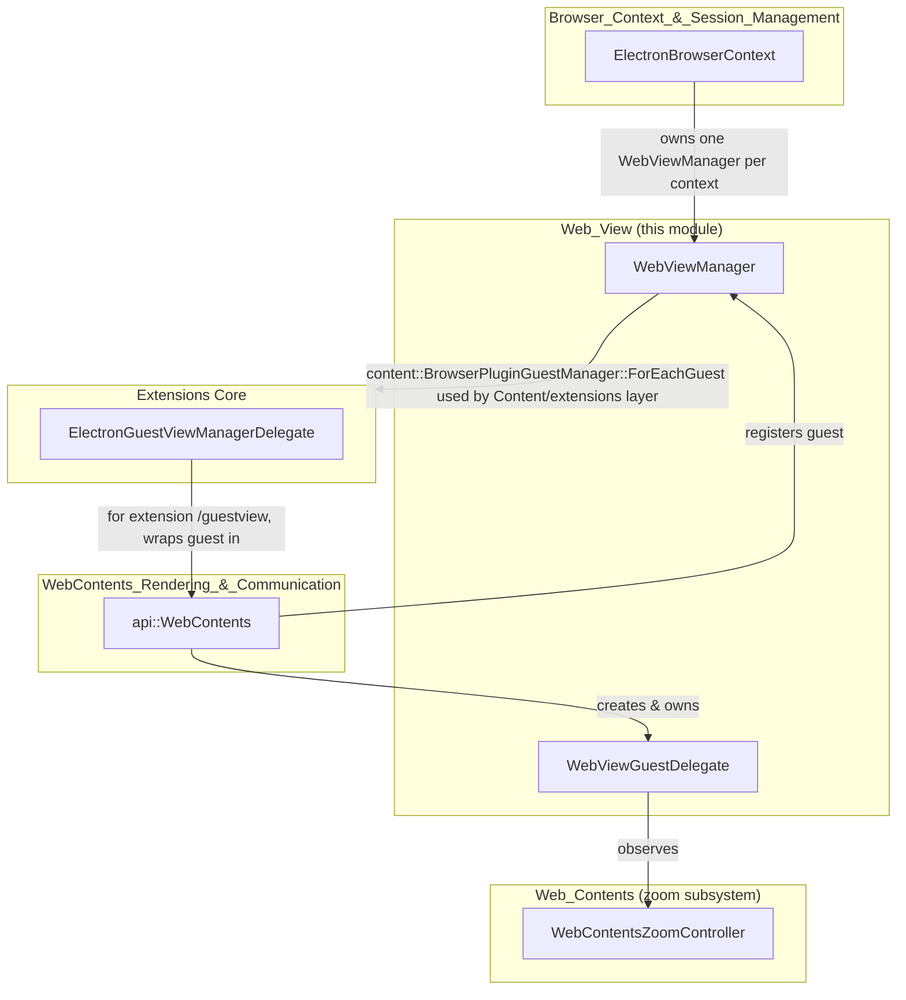
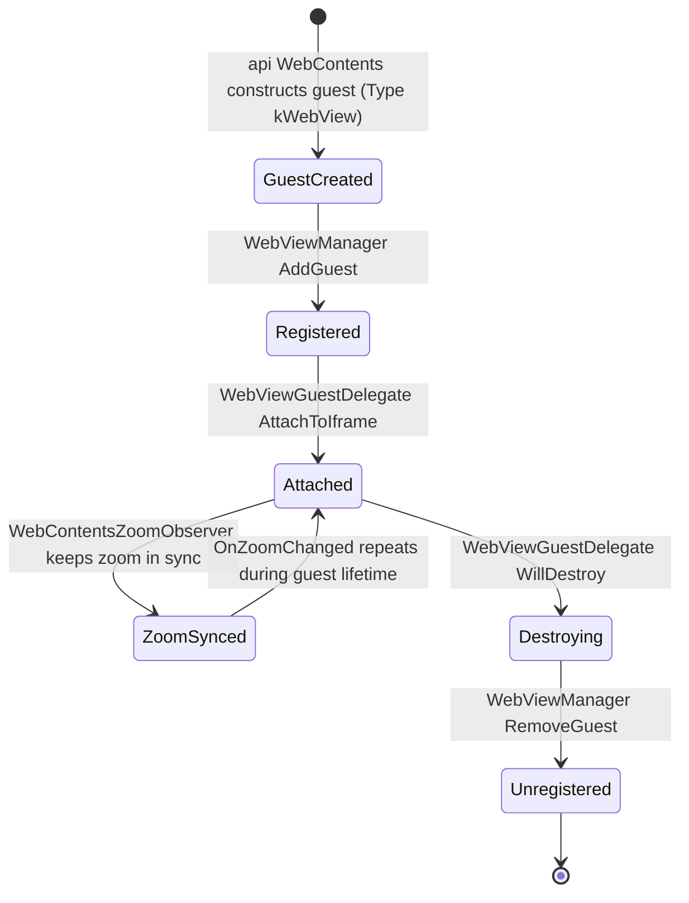

# Web_View Module

## 1. Purpose

The `Web_View` module implements the browser-process plumbing required to support Electron's
`<webview>` tag (and, more generally, any "guest" `WebContents` embedded inside another
`WebContents`). It is a thin, focused layer built directly on top of Chromium's
`content::BrowserPluginGuestDelegate` / `content::BrowserPluginGuestManager` abstractions, and it
bridges those low-level Content API concepts to Electron's own `api::WebContents` wrapper and zoom
subsystem.

Two components make up the module:

| Component | File | Responsibility |
|---|---|---|
| `WebViewGuestDelegate` | `shell/browser/web_view_guest_delegate.h` | Per-guest delegate attached to a guest `WebContents`; manages the embedder relationship, iframe attachment, and zoom-level propagation between embedder and guest. |
| `WebViewManager` | `shell/browser/web_view_manager.h` | Per-`BrowserContext`-scoped registry that tracks the mapping of guest-instance-id → (guest `WebContents`, embedder `WebContents`) and implements the `ForEachGuest` iteration contract required by Content. |

Because the module is intentionally minimal, it depends heavily on, and is consumed by, several
larger modules described elsewhere in this wiki (see [Related Modules](#5-related-modules) below).

## 2. Architecture Overview

### 2.1 Class Relationships

### 2.2 Component Interaction / Data Flow

### 2.3 Where Web_View Fits in the System

## 3. Sub-Module / Component Details

Given its small footprint (two headers, two classes), `Web_View` is documented as a single,
cohesive unit rather than split into further sub-modules. The two classes are described below.

### 3.1 `WebViewGuestDelegate`

**File:** `shell/browser/web_view_guest_delegate.h`

Responsibilities:
- Implements `content::BrowserPluginGuestDelegate`, the Content API hook that a guest
  `content::WebContents` uses to communicate with its embedder.
- Holds raw (non-owning) pointers to:
  - `embedder_web_contents_` — the `content::WebContents` that hosts the `<webview>` guest.
  - `embedder_zoom_controller_` — the `WebContentsZoomController` of the embedder, subscribed to
    via `WebContentsZoomObserver` so that zoom-level changes on the embedder propagate to the
    guest.
  - `api_web_contents_` — the owning Electron `api::WebContents` wrapper.
- Key operations:
  - `AttachToIframe` — attaches the guest to a specific iframe (identified by a
    `blink::LocalFrameToken`) inside the embedder, enabling the modern `<webview>` cross-process
    frame attachment model.
  - `WillDestroy` — lifecycle hook invoked before the guest is torn down, used to detach zoom
    observation and other cleanup.
  - `GetOwnerWebContents` / `CreateNewGuestWindow` / `GetGuestDelegateWeakPtr` — required overrides
    of `BrowserPluginGuestDelegate` used by Content when the guest needs to know its owner or
    when a new guest window must be created (e.g., `window.open` inside a `<webview>`).
  - `OnZoomControllerDestroyed` / `OnZoomChanged` — `WebContentsZoomObserver` callbacks that keep
    the guest's zoom level in sync with the embedder and safely detach if the embedder's zoom
    controller disappears (`ResetZoomController`).

Ownership model: a `WebViewGuestDelegate` is created and owned by an `api::WebContents` instance
of `Type::kWebView` (see `WebContents_Rendering_&_Communication` /
[shell_browser_api_webcontents](shell_browser_api_webcontents_core.md)). It does not own the
embedder or the guest `content::WebContents`; all cross-references are `raw_ptr` and guarded with
weak pointers (`weak_ptr_factory_`) to avoid dangling references during shutdown.

### 3.2 `WebViewManager`

**File:** `shell/browser/web_view_manager.h`

Responsibilities:
- Implements `content::BrowserPluginGuestManager`, the per-`BrowserContext` singleton (owned by
  `ElectronBrowserContext`, see
  [Browser_Context_&_Session_Management](shell_browser_context.md)) that Content queries whenever
  it needs to enumerate or resolve guest views for an embedder.
- Maintains an internal `base::flat_map<int, WebContentsWithEmbedder>` keyed by
  `guest_instance_id`, where the private `WebContentsWithEmbedder` struct stores non-owning
  (`raw_ptr`) pointers to both the guest `content::WebContents` and its embedder.
- Public API:
  - `AddGuest(guest_instance_id, embedder, web_contents)` — registers a new guest/embedder pair;
    called when a `<webview>` (or extension guest view) is created.
  - `RemoveGuest(guest_instance_id)` — removes the mapping on guest teardown.
  - `static GetWebViewManager(content::WebContents*)` — resolves the `WebViewManager` instance
    associated with a given `WebContents`'s `BrowserContext`.
  - `ForEachGuest(embedder, fn)` — override of `BrowserPluginGuestManager::ForEachGuest`; invoked
    by Content/extensions code (e.g., `ElectronGuestViewManagerDelegate` in the
    [Extensions Subsystem](shell_browser_extensions_core.md)) to iterate all guests belonging to a
    given embedder, short-circuiting when `fn` returns `true`.

## 4. Lifecycle Summary

## 5. Related Modules

- **[shell_browser_api_webcontents_core.md](shell_browser_api_webcontents_core.md)** — Defines
  `api::WebContents`, the class that owns a `WebViewGuestDelegate` when `type_ ==
  Type::kWebView`, and that registers/unregisters guests with `WebViewManager`.
- **[shell_browser_context.md](shell_browser_context.md)** — `ElectronBrowserContext` is the
  owner of the per-context `WebViewManager` instance.
- **[Web_Contents.md](Web_Contents.md)** — Home of `WebContentsZoomController` /
  `WebContentsZoomObserver`, the zoom-propagation mechanism that `WebViewGuestDelegate` relies on
  to keep guest and embedder zoom levels consistent.
- **[shell_browser_extensions_core.md](shell_browser_extensions_core.md)** — Hosts
  `ElectronGuestViewManagerDelegate`, which uses `WebViewManager::ForEachGuest` semantics (via the
  Chromium `GuestViewManager`/`BrowserPluginGuestManager` contract) and wraps newly-added guest
  `WebContents` in `api::WebContents::FromOrCreate`.
- **[Native_Window_&_Menu_Management](shell_browser_native_window_core.md)** — Guests rendered as
  `<webview>` ultimately paint into a `NativeWindow`/`BrowserView` hierarchy; not a direct code
  dependency of this module, but part of the same end-to-end window/guest rendering pipeline.
