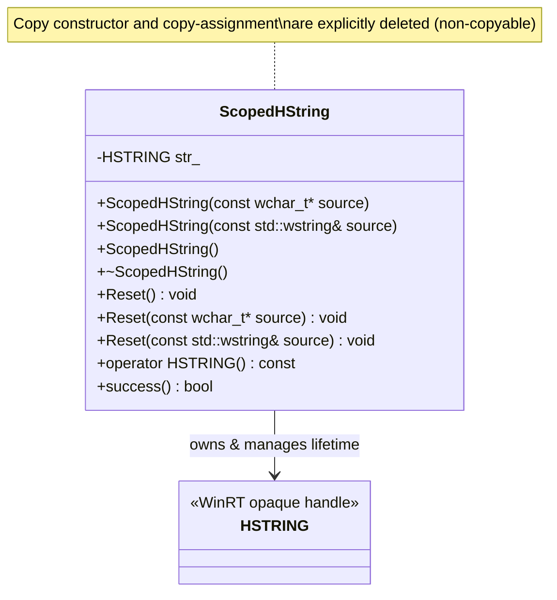
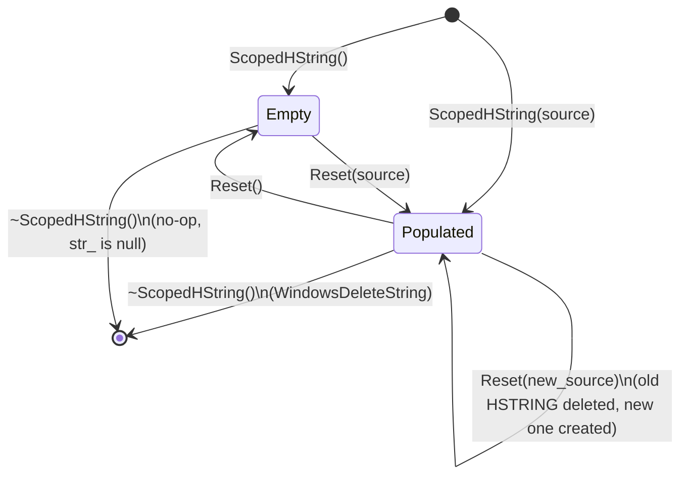
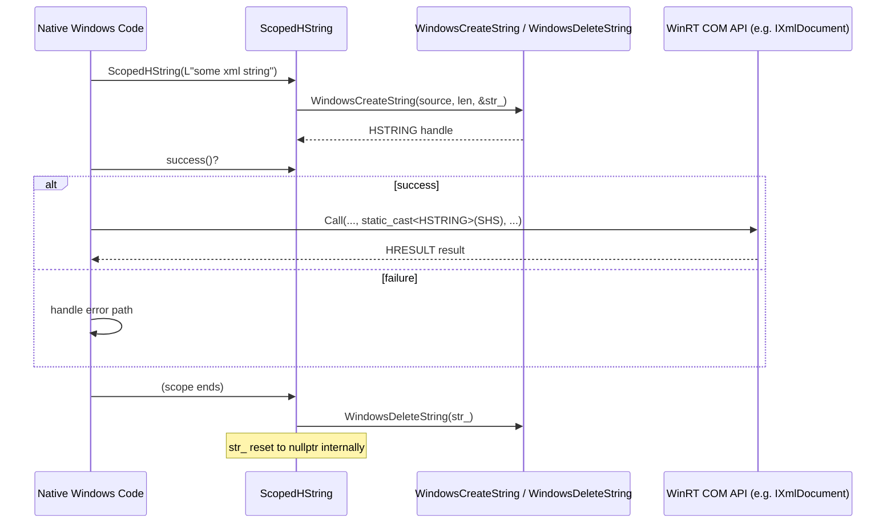
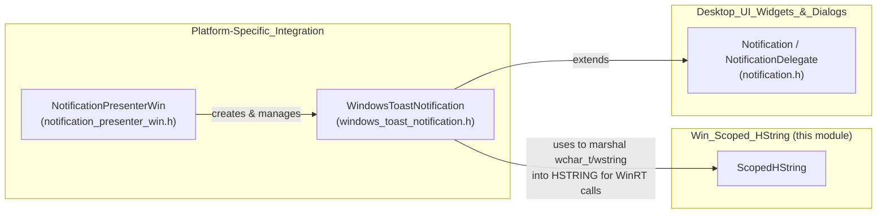
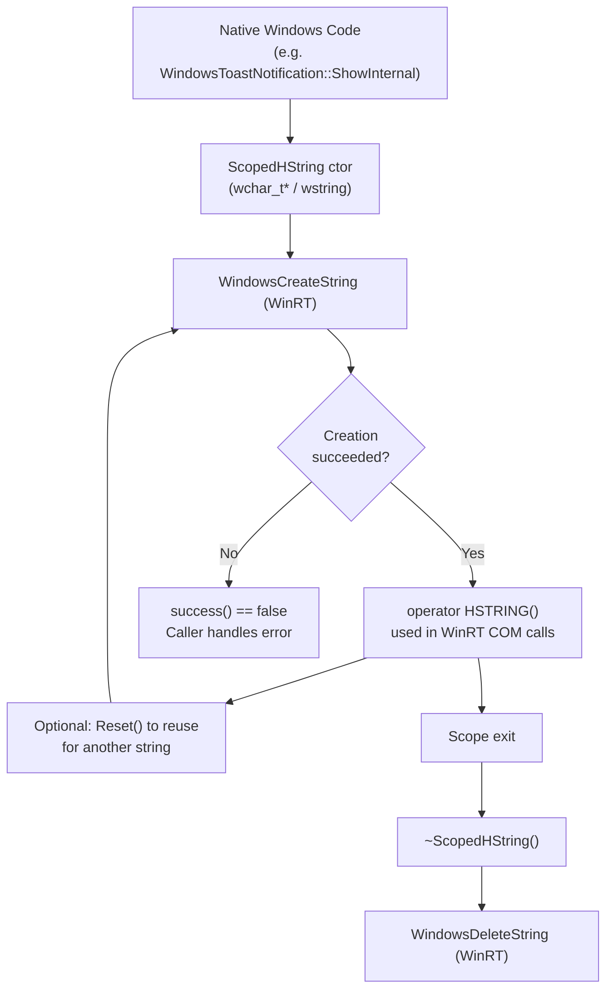

# Win_Scoped_HString

## Introduction

`Win_Scoped_HString` is a small, focused, Windows-only utility module in Electron's C++ shell layer. It provides a single RAII (Resource Acquisition Is Initialization) wrapper class, `ScopedHString`, around the native Windows Runtime (WinRT) `HSTRING` type. Its sole purpose is to safely and automatically manage the lifetime of `HSTRING` handles — allocating them from wide-character (`wchar_t`/`std::wstring`) input and guaranteeing their release when the wrapper goes out of scope.

This module exists to eliminate manual, error-prone `WindowsCreateString` / `WindowsDeleteString` bookkeeping whenever Electron's native Windows code needs to call into WinRT APIs (which exclusively use `HSTRING` for string parameters). It is a low-level plumbing component consumed primarily by the Windows notification (Toast) subsystem, part of the broader [Platform-Specific_Integration](Platform-Specific_Integration.md) module family.

---

## Purpose & Core Functionality

### What is `HSTRING`?

`HSTRING` is an opaque, immutable, reference-counted string handle used throughout the Windows Runtime (WinRT) COM-based API surface (`Windows.Foundation`, `Windows.UI.Notifications`, `Windows.Data.Xml.Dom`, etc.). Strings must be explicitly created via `WindowsCreateString` and explicitly destroyed via `WindowsDeleteString`. Forgetting to release an `HSTRING` leaks memory; double-freeing or using-after-free causes undefined behavior.

### Role of `ScopedHString`

`ScopedHString` encapsulates this create/destroy pair behind standard C++ RAII semantics:

- **Construction** — Given a `const wchar_t*` or `std::wstring`, the constructor allocates a new `HSTRING` via the WinRT string APIs.
- **Empty construction** — A default constructor creates a wrapper with no underlying string (`str_ == nullptr`), useful for deferred initialization.
- **Destruction** — The destructor automatically releases the underlying `HSTRING`, so callers never need to remember to call `WindowsDeleteString` manually.
- **Reset** — `Reset()`, `Reset(const wchar_t*)`, and `Reset(const std::wstring&)` allow reusing the same `ScopedHString` object for a different string value, releasing the old handle before creating the new one.
- **Implicit conversion** — `operator HSTRING()` allows a `ScopedHString` instance to be passed directly anywhere a raw `HSTRING` is expected by WinRT APIs, without any explicit accessor call.
- **Success check** — `success()` reports whether the underlying `HSTRING` was successfully created (non-null), letting callers detect allocation failures.
- **Non-copyable** — Copy constructor and copy-assignment are explicitly deleted, preventing accidental double-ownership of the same native handle (each `HSTRING` has a single logical owner).

### Design Rationale

This class follows the same idiom as other "Scoped*" RAII helpers found elsewhere in Electron's codebase (e.g., `ScopedTemporaryFile` in [Common_Native_Gin_Infrastructure](Common_Native_Gin_Infrastructure.md), or `ScopedCAActionDisabler` / `ScopedDisableResize` in the macOS UI layers). It is intentionally minimal — a thin, header-only-friendly wrapper with no dependencies beyond the Windows SDK (`<hstring.h>`, `<windows.h>`) and the C++ standard library (`<string>`).

---

## Architecture

Key structural notes:

- `ScopedHString` holds exactly one private member: `HSTRING str_` (initialized to `nullptr`).
- All lifecycle transitions (create, replace, destroy) funnel through the WinRT `WindowsCreateString` / `WindowsDeleteString` C-API functions (implemented in the corresponding `.cc` file, not shown here).
- The class lives in the `electron` namespace, alongside other native Windows-integration helpers.

---

## Lifecycle & State Diagram

- **Empty** state: `str_ == nullptr`; `success()` returns `false`.
- **Populated** state: `str_` holds a valid `HSTRING`; `success()` returns `true` (assuming allocation succeeded).
- Every transition into a new "Populated" or "Empty" state via `Reset` first releases any previously held `HSTRING`, preventing leaks when reusing an instance.

---

## Usage / Data Flow

The typical call pattern is: construct on the stack immediately before a WinRT API call, pass the object where an `HSTRING` is expected (relying on the implicit conversion operator), and let it fall out of scope automatically.

---

## Primary Consumer: Windows Toast Notifications

The main (and currently only) consumer of `ScopedHString` in the codebase is the **Windows Toast Notification** implementation, part of the [Platform-Specific_Integration](Platform-Specific_Integration.md) module's notification subsystem (`shell_browser_notifications`):

- `shell/browser/notifications/win/windows_toast_notification.h` — declares `WindowsToastNotification` (a `Notification` subclass) and forward-declares `ScopedHString`.
- The `.cc` implementation (not included in this module) uses `ScopedHString` to convert XML strings (representing Toast notification templates) and other WinRT string parameters when calling into `ABI::Windows::UI::Notifications::IToastNotificationManagerStatics`, `IXmlDocument`, and related COM interfaces.

### Why Toast Notifications need it

Windows Toast Notifications are exposed through the modern WinRT API (`Windows.UI.Notifications`), which requires:
1. Building an XML document describing the toast (title, body, icon, timeout behavior) as a wide string.
2. Converting that string into an `HSTRING` to pass to `IXmlDocument::LoadXml` or similar WinRT methods.
3. Passing further `HSTRING`-typed parameters (e.g., class names, activation arguments) to `IToastNotificationManagerStatics` and `IToastNotifier`.

`ScopedHString` is used at each of these boundaries so that native COM calls never leak `HSTRING` handles, even when exceptions or early returns occur — the destructor guarantees cleanup.

---

## Relationship to Other Modules

| Module | Relationship |
|---|---|
| [Platform-Specific_Integration](Platform-Specific_Integration.md) | Parent module; `Win_Scoped_HString` is a child leaf module dedicated to this one utility class. `shell_browser_notifications` (a sibling child) is the primary consumer via `WindowsToastNotification`. |
| [Desktop_UI_Widgets_&_Dialogs](Desktop_UI_Widgets_&_Dialogs.md) | Defines the cross-platform `Notification` / `NotificationPresenter` base abstractions that `WindowsToastNotification` implements; it also hosts other Windows-specific UI helpers (e.g., `shell/browser/ui/win/*`) that may use similar Windows COM/WinRT idioms. |
| [Common_Native_Gin_Infrastructure](Common_Native_Gin_Infrastructure.md) | Hosts other RAII "Scoped*" utility patterns (e.g., `ScopedTemporaryFile`, `ScopedAllowBlockingForElectron`) that follow analogous ownership-management conventions, though unrelated in implementation. |

`Win_Scoped_HString` has **no outgoing dependencies** on other Electron modules — it depends only on the Windows SDK and STL. This makes it a foundational, dependency-free utility that can be safely included by any Windows-specific native code without introducing coupling.

---

## Component Interaction Summary

---

## API Reference Summary

| Member | Description |
|---|---|
| `ScopedHString(const wchar_t* source)` | Creates an `HSTRING` copy of the given null-terminated wide string. |
| `ScopedHString(const std::wstring& source)` | Creates an `HSTRING` copy of the given `std::wstring`. |
| `ScopedHString()` | Creates an empty wrapper (`str_ == nullptr`); no `HSTRING` allocated yet. |
| `~ScopedHString()` | Releases the owned `HSTRING` (if any) via `WindowsDeleteString`. |
| `Reset()` | Releases the current `HSTRING` and resets to the empty state. |
| `Reset(const wchar_t* source)` | Releases the current `HSTRING` (if any) and allocates a new one from `source`. |
| `Reset(const std::wstring& source)` | Same as above, taking a `std::wstring`. |
| `operator HSTRING() const` | Implicit conversion so the object can be passed directly to WinRT APIs expecting `HSTRING`. |
| `success() const` | Returns `true` if the wrapper currently owns a valid (non-null) `HSTRING`. |

**Deleted members:** copy constructor and copy-assignment operator — instances are move-only in spirit (though no explicit move operations are declared; instances are generally used as short-lived stack locals rather than transferred between owners).

---

## Summary

`Win_Scoped_HString` is a minimal but critical safety utility for any Electron native code on Windows that interacts with WinRT COM APIs requiring `HSTRING` parameters. By wrapping allocation and deallocation in RAII semantics, it eliminates a common class of memory-management bugs in the Windows Toast Notification pipeline and any future Windows Runtime integrations that may be added to Electron's native shell layer.
