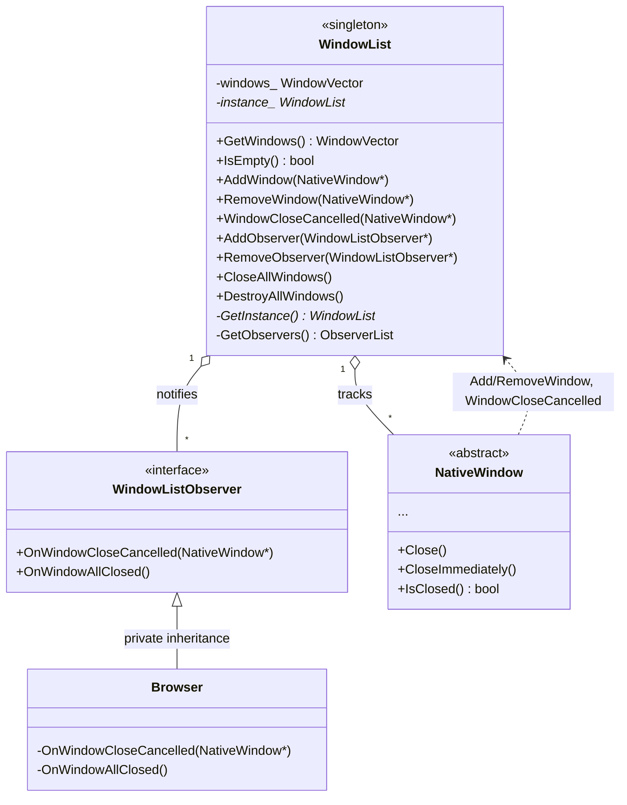
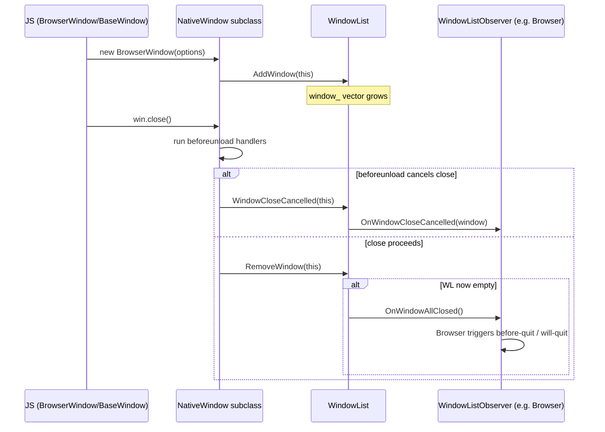
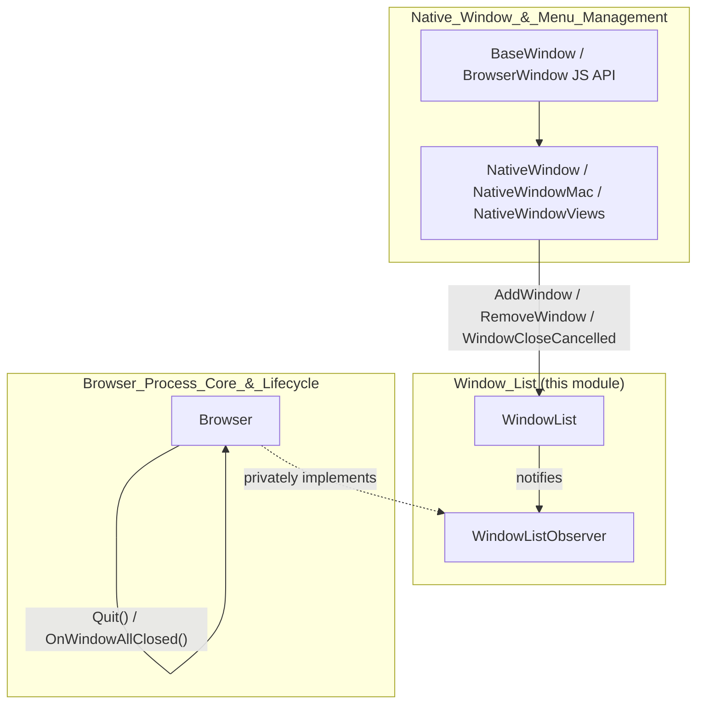

# Window List

## 1. Purpose & Overview

The **Window List** module is a small but architecturally significant piece of Electron's C++ browser process. It provides a single, process-wide registry of all live [`NativeWindow`](Native_Window_&_Menu_Management.md) instances (windows created by `BrowserWindow`, `BaseWindow`, or internal Electron code) and an observer mechanism that lets other subsystems react to window lifecycle events — most importantly the "all windows closed" event that typically triggers application quit logic.

Despite its size (two header files), `WindowList` sits at a critical junction in the Electron architecture:

* It is the canonical source of truth for "how many windows are currently open" — used by [`Browser`](Browser_Process_Core_&_Lifecycle.md) to decide when to fire the `window-all-closed` event and potentially quit the app.
* It decouples the concrete window implementation (`NativeWindow` and its per-platform subclasses in [Native_Window_&_Menu_Management](Native_Window_&_Menu_Management.md)) from consumers who only need to enumerate or be notified about windows, via the classic Observer pattern.
* It is a pure C++, static/singleton-based utility with no direct V8/Node.js binding of its own — the JS-facing `BrowserWindow`/`BaseWindow` APIs (documented in [Native_Window_&_Menu_Management](Native_Window_&_Menu_Management.md), sub-module `shell_browser_api_window_ui_windows`) register/unregister themselves with `WindowList` as part of their construction/destruction.

## 2. Core Components

| Component | File | Responsibility |
|---|---|---|
| `WindowList` | `shell/browser/window_list.h` | Static/singleton registry of all `NativeWindow*` pointers; exposes add/remove/query/close-all/destroy-all operations and manages the `WindowListObserver` list. |
| `WindowListObserver` | `shell/browser/window_list_observer.h` | Abstract observer interface (`base::CheckedObserver`) with two hook methods: `OnWindowCloseCancelled` and `OnWindowAllClosed`. |
| `NativeWindow` (forward-declared) | `shell/browser/native_window.h` | The actual window object being tracked. Full definition and lifecycle documented in [Native_Window_&_Menu_Management](Native_Window_&_Menu_Management.md). |

### 2.1 `WindowList`

`WindowList` is implemented as a **singleton with an entirely static public interface** — callers never instantiate it directly. Internally it lazily creates a single instance (`WindowList::instance_`) on first use via the private `GetInstance()` accessor.

Key responsibilities:

- **Registration** — `AddWindow(NativeWindow*)` / `RemoveWindow(NativeWindow*)` maintain a `WindowVector` (`std::vector<NativeWindow*>`) in insertion order. Every concrete window implementation calls these during its construction and destruction/close sequence.
- **Enumeration** — `GetWindows()` returns a copy-able vector of all currently tracked windows; `IsEmpty()` is a fast convenience check.
- **Bulk operations** — `CloseAllWindows()` requests a graceful close (respecting `beforeunload` handlers) on every tracked window; `DestroyAllWindows()` forcibly destroys them (used during hard shutdown paths).
- **Cancellation signaling** — `WindowCloseCancelled(NativeWindow*)` is invoked by a window when a `beforeunload` handler cancels an in-progress close; this fans out to all observers via `OnWindowCloseCancelled`.
- **Observer management** — `AddObserver` / `RemoveObserver` delegate to a static `base::ObserverList<WindowListObserver>` obtained through the private `GetObservers()` helper.

### 2.2 `WindowListObserver`

A minimal interface extending `base::CheckedObserver` (Chromium's safe-observer-list base class, which asserts observers are removed before destruction). It defines two **optional** (empty-bodied, override-as-needed) hooks:

- `OnWindowCloseCancelled(NativeWindow* window)` — fired when a window's close was aborted by a `beforeunload` handler.
- `OnWindowAllClosed()` — fired once the last tracked window has been removed from the list. This is the hook [`Browser`](Browser_Process_Core_&_Lifecycle.md) uses (it privately inherits `WindowListObserver`) to trigger the `before-quit` → `will-quit` → shutdown sequence.

## 3. Architecture

### 3.1 Class Relationships

### 3.2 Data Flow: Window Lifecycle & App Quit

### 3.3 Position in the Overall System

## 4. Relationship to Other Modules

- **[Native_Window_&_Menu_Management](Native_Window_&_Menu_Management.md)** — defines `NativeWindow` and its platform subclasses (`NativeWindowMac`, `NativeWindowViews`), and the JS-facing `BaseWindow`/`BrowserWindow` API wrappers. These are the entities that `WindowList` tracks; they call into `WindowList::AddWindow`/`RemoveWindow`/`WindowCloseCancelled` as part of their lifecycle.
- **[Browser_Process_Core_&_Lifecycle](Browser_Process_Core_&_Lifecycle.md)** — the `Browser` singleton privately inherits `WindowListObserver` and implements `OnWindowAllClosed()`/`OnWindowCloseCancelled()` to drive application-level quit semantics (`window-all-closed` event, `before-quit`/`will-quit` flow).

Because the module is intentionally minimal — two headers, no `.cc` implementation exposed in the core component set, no sub-namespaces or independent concerns — it is documented as a single page rather than split into sub-modules.

## 5. Usage Notes for Maintainers

- All access is **static**; there is no need (and no way) to construct a `WindowList` directly. The singleton is created lazily and lives for the process lifetime.
- Because `WindowListObserver` derives from `base::CheckedObserver`, any class implementing it **must** call `WindowList::RemoveObserver(this)` before destruction, or Chromium's observer-list checks will fail (typically as a CHECK/DCHECK crash in debug builds).
- `CloseAllWindows()` vs `DestroyAllWindows()`: prefer `CloseAllWindows()` for normal quit flows since it respects `beforeunload`; `DestroyAllWindows()` is reserved for forced/emergency teardown paths where graceful JS-level cancellation should not block shutdown.
