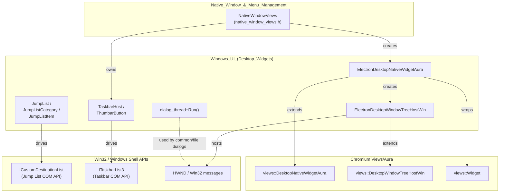
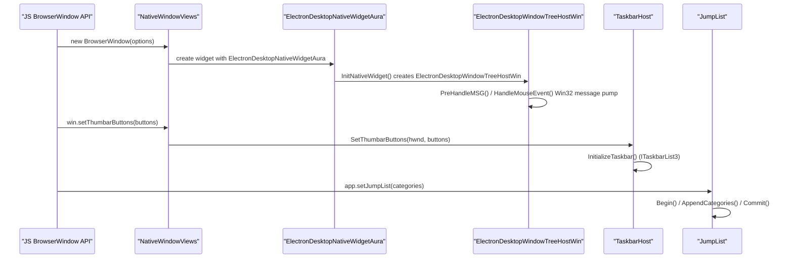

# Windows UI (Desktop Widgets)

## 1. Purpose

The **Windows UI (Desktop Widgets)** module contains the Windows-specific
implementation details that let an Electron `BrowserWindow` behave like a
native Win32/Aura application window and integrate with Windows desktop shell
features. It sits underneath the platform-agnostic
[`NativeWindowViews`](Native_Window_%26_Menu_Management.md) implementation and
provides:

* The Aura/Views ↔ Win32 glue needed to host a `views::Widget` inside a
  native `HWND` (`ElectronDesktopNativeWidgetAura`,
  `ElectronDesktopWindowTreeHostWin`).
* A generic background-thread helper for running blocking Win32 dialog calls
  (common file/message dialogs) without stalling the UI thread
  (`dialog_thread::Run`).
* Windows Shell desktop-widget integrations that live outside the window's
  client area:
  * **Jump Lists** – custom Start-menu/taskbar jump list entries
    (`JumpList`, `JumpListCategory`, `JumpListItem`).
  * **Taskbar host** – thumbnail toolbars, progress bars, overlay icons, and
    thumbnail clipping via `ITaskbarList3` (`TaskbarHost`, `ThumbarButton`).

In short, this module is the "last mile" that turns Chromium's cross-platform
Views windowing stack into a first-class citizen of the Windows desktop
(taskbar, jump lists, thumbnail toolbars) while keeping heavy/blocking native
dialog work off the UI thread.

## 2. Architecture Overview

### Component Interaction (window creation & shell integration)

## 3. Sub-modules

This module is small enough to be documented as a single cohesive page, but
its components naturally split into two functional areas:

| Sub-module | Description | File |
|---|---|---|
| **Native Widget Hosting** | Glue classes (`ElectronDesktopNativeWidgetAura`, `ElectronDesktopWindowTreeHostWin`) that bridge Chromium's Views/Aura windowing framework onto native Win32 `HWND`s, plus the `dialog_thread` helper for off-UI-thread blocking Win32 calls. | [Windows_UI_(Desktop_Widgets)_native_widget_hosting.md](Windows_UI_(Desktop_Widgets)_native_widget_hosting.md) |
| **Desktop Shell Widgets** | Windows shell surface integrations that live outside the window's client area: Jump Lists and the Taskbar host (thumbnail toolbar, progress, overlay icon, thumbnail clip). | [Windows_UI_(Desktop_Widgets)_desktop_shell_widgets.md](Windows_UI_(Desktop_Widgets)_desktop_shell_widgets.md) |

## 4. Relationship to Other Modules

* **[Native_Window_&_Menu_Management](Native_Window_%26_Menu_Management.md)** —
  `NativeWindowViews` is the cross-platform window class that owns a
  `TaskbarHost` instance and constructs the `ElectronDesktopNativeWidgetAura`
  / `ElectronDesktopWindowTreeHostWin` pair on Windows. This module provides
  the Windows-specific backing implementation that `NativeWindowViews`
  delegates to.
* **[Frame_Views](Frame_Views.md)** —
  The `WinFrameView`, `WinCaptionButton`, and `WinIconPainter` classes render
  the custom window frame/caption buttons that live inside the `HWND` hosted
  by `ElectronDesktopWindowTreeHostWin`.
* **[UI_Dialogs](UI_Dialogs.md)** — Windows
  message boxes and file dialogs (`message_box_win.cc`) use the
  `dialog_thread::Run()` helper defined here to execute native Win32 dialog
  calls on a dedicated thread.
* **[System_&_App-Level_Services_API](System_%26_App-Level_Services_API.md)** —
  The `app.setJumpList()` and related Electron JS APIs are implemented on top
  of the `JumpList` class documented here.
* **[Tray_Icon](Tray_Icon.md)** — `NotifyIcon`
  and `NotifyIconHost` (Windows tray icon implementation) are conceptually
  related desktop-shell widgets but are documented separately as part of the
  cross-platform Tray Icon sub-module.

## 5. Key Design Notes

* **Thread safety for blocking dialogs**: `dialog_thread::Run()` provides a
  generic pattern to execute a blocking Win32 call (e.g.
  `GetOpenFileName`/`MessageBox`) on a dedicated single-threaded sequence and
  marshal the result back to the UI thread via a callback, preventing UI
  jank/deadlocks from native modal dialogs.
* **Aura/Win32 bridging**: `ElectronDesktopNativeWidgetAura` and
  `ElectronDesktopWindowTreeHostWin` override numerous
  `views::DesktopNativeWidgetAura` / `views::DesktopWindowTreeHostWin` hooks
  (window activation, size constraints, DWM frame insets, mouse/message
  interception) to implement Electron-specific window behaviors such as
  frameless windows, transparency, and screenshot blocking.
* **COM-based shell integration**: Both `JumpList` and `TaskbarHost` wrap
  Windows Shell COM interfaces (`ICustomDestinationList`, `ITaskbarList3`)
  and expose simplified, Electron-friendly APIs (structs like
  `JumpListItem`/`JumpListCategory` and `ThumbarButton`) that are consumed by
  the JS-facing `app`/`BrowserWindow` APIs.
