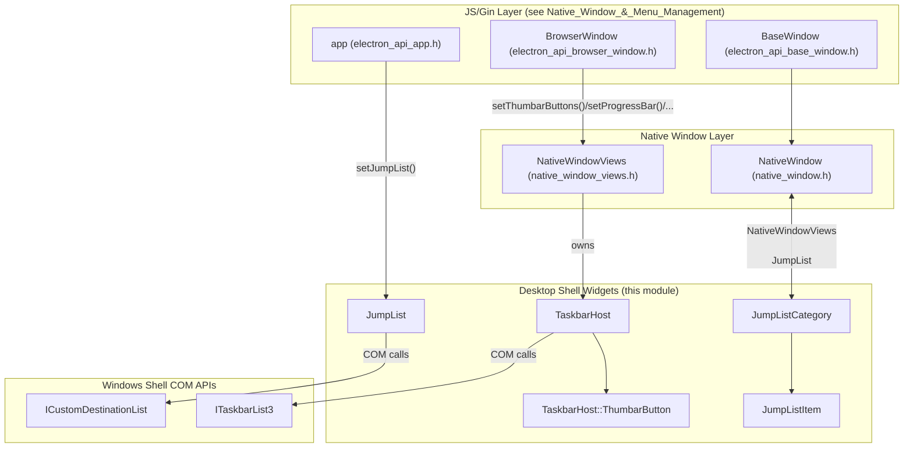
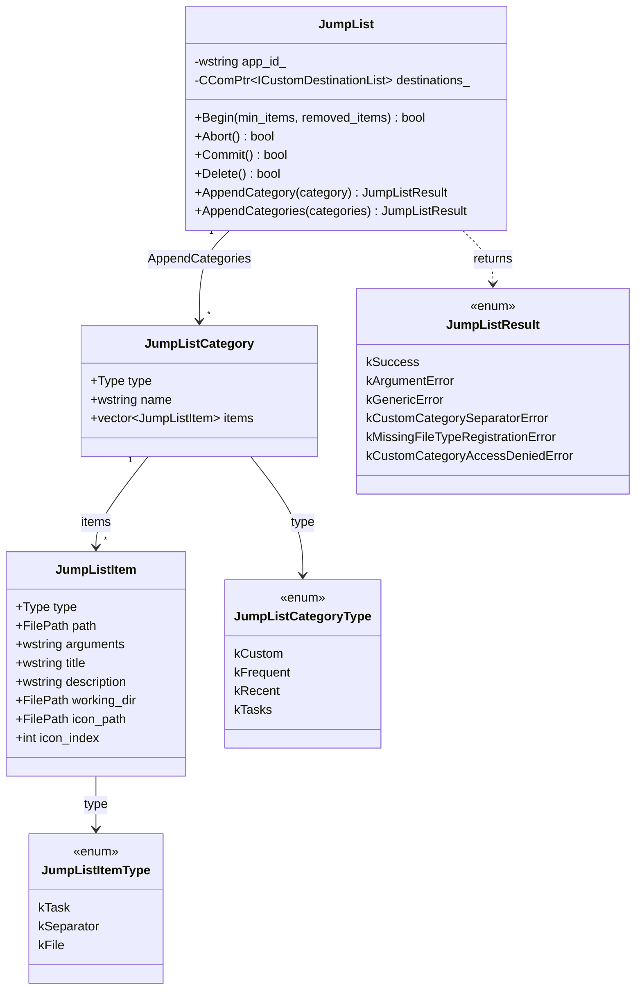
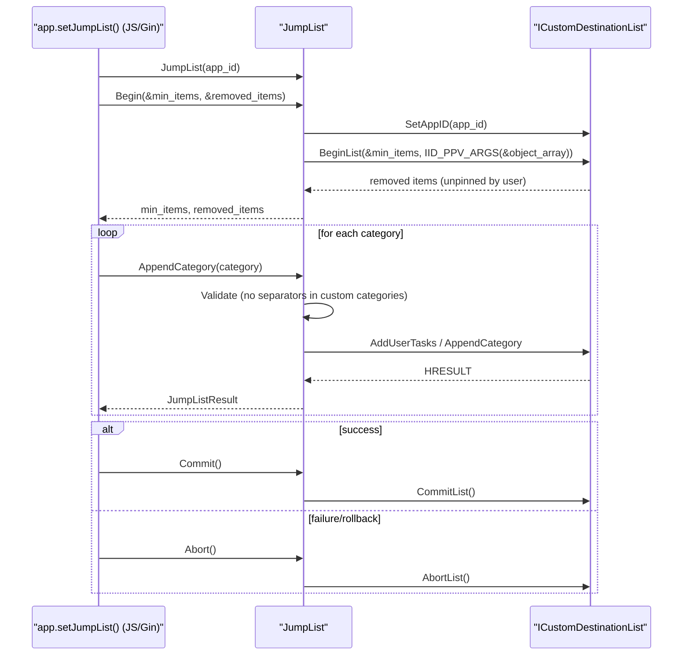
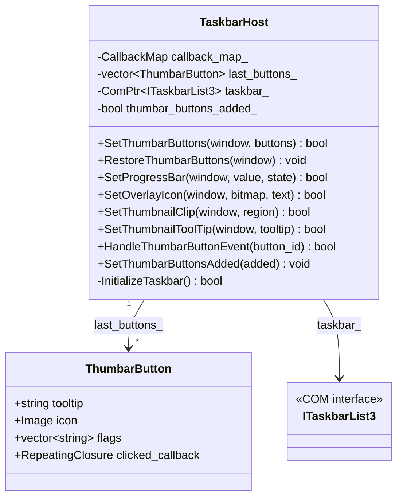
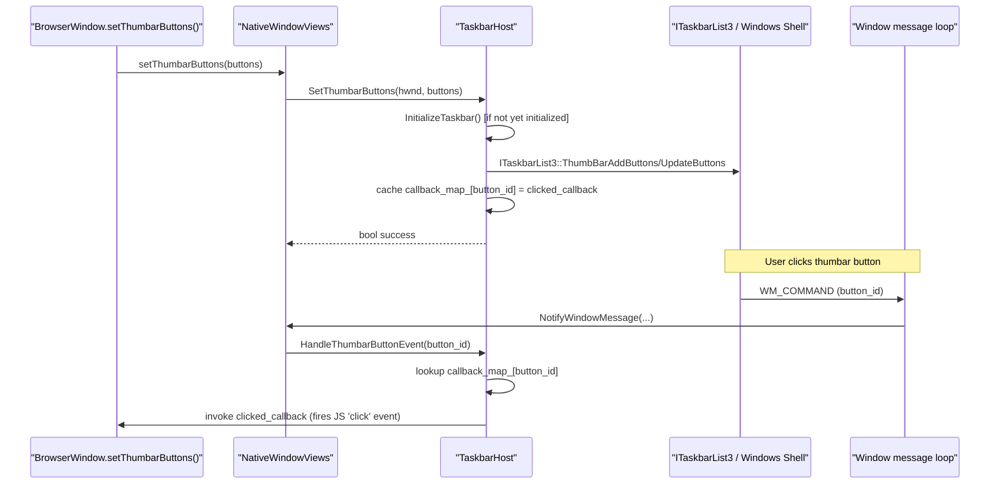
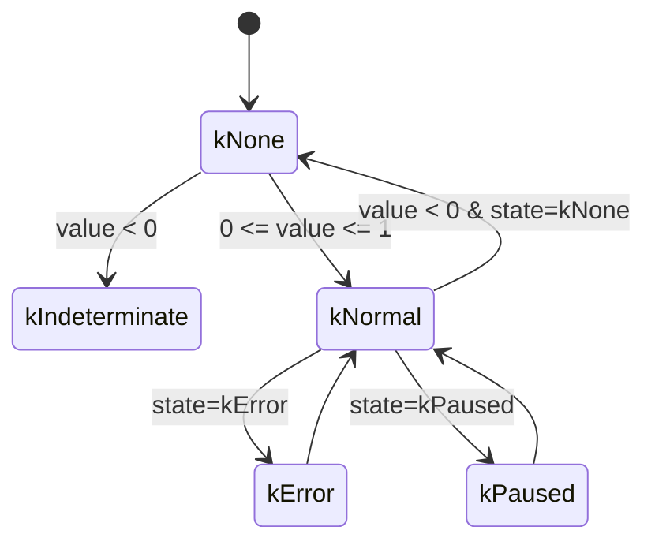
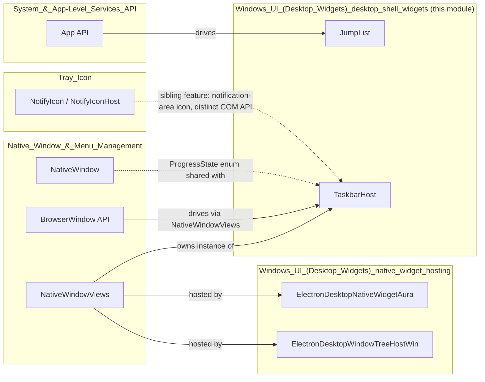

# Windows UI (Desktop Widgets) — Desktop Shell Widgets

## Introduction

The **Desktop Shell Widgets** module is a Windows-specific subsystem of Electron's native UI layer that integrates an application's `BrowserWindow` with two core pieces of the Windows desktop shell:

- **Jump Lists** — the right-click context menu that appears when a user right-clicks an application's icon in the Windows Taskbar, providing quick access to tasks and recently/frequently used files.
- **Taskbar Host** — the interactive surface of an application's Taskbar button, including thumbnail toolbar buttons (a.k.a. "thumbar buttons"), progress bars, overlay icons, and thumbnail clipping/tooltips.

Both features are implemented as thin, focused wrappers around Windows Shell COM interfaces (`ICustomDestinationList` and `ITaskbarList3` respectively), and are consumed by higher-level window management code (see [Native_Window_&_Menu_Management](Native_Window_&_Menu_Management.md)) to expose these capabilities through Electron's public JavaScript API (`BrowserWindow.setThumbarButtons`, `app.setJumpList`, `BrowserWindow.setProgressBar`, etc.).

This document covers the two core components of this module:

| Component | File | Responsibility |
|---|---|---|
| `JumpList` | `shell/browser/ui/win/jump_list.h` | Create, modify, and remove a custom Windows Jump List for the app |
| `JumpListCategory` / `JumpListItem` | `shell/browser/ui/win/jump_list.h` | Data structures describing Jump List content |
| `TaskbarHost` | `shell/browser/ui/win/taskbar_host.h` | Manage Taskbar button state: thumbar buttons, progress bar, overlay icon, thumbnail clip/tooltip |
| `ThumbarButton` / `Rect` | `shell/browser/ui/win/taskbar_host.h` | Data structures describing thumbar buttons and clip regions |

---

## 1. Module Purpose & Scope

Electron exposes cross-platform APIs (`app.setJumpList()`, `win.setThumbarButtons()`, `win.setProgressBar()`, `win.setOverlayIcon()`, `win.setThumbnailClip()`, `win.setThumbnailToolTip()`) that, on Windows, must be translated into calls against native Win32 Shell COM APIs. This module is the **native (non-JS) implementation layer** responsible for that translation. It has no direct dependency on V8/Gin bindings — that glue lives in `shell_browser_api_window_ui_windows` (`electron_api_browser_window.h`, `electron_api_base_window.h` — see [Native_Window_&_Menu_Management](Native_Window_&_Menu_Management.md)) and in `shell/browser/native_window_views.h` for Windows-specific window plumbing.

The module sits in the broader **Windows_UI_(Desktop_Widgets)** parent group alongside its sibling `Windows_UI_(Desktop_Widgets)_native_widget_hosting` (which handles `DesktopWindowTreeHost`/`ElectronDesktopNativeWidgetAura` — the Aura widget hosting infrastructure), and is itself a child of the broader `Frame_Views` / `Desktop_UI_Widgets_&_Dialogs` documentation tree (see [Tray_Icon](Tray_Icon.md) for the related but distinct Notification-Area icon feature, which uses `NotifyIcon`/`NotifyIconHost` rather than Jump Lists or Taskbar buttons).

---

## 2. Architecture Overview

---

## 3. Component: `JumpList`

### 3.1 Purpose

`JumpList` wraps the Windows `ICustomDestinationList` COM interface to create, populate, and delete a custom Jump List for the running application. Jump Lists let users pin frequently-used tasks (e.g., "New Document") or recently-opened files directly to the app's taskbar context menu.

### 3.2 Data Model

- **`JumpListItem`** represents a single Jump List entry:
  - `kTask` — launches the app with specific `arguments`.
  - `kSeparator` — a visual divider (only valid inside the standard `kTasks` category).
  - `kFile` — a recent/pinned file link (requires the app be a registered handler for the file type).

- **`JumpListCategory`** groups items under a named heading:
  - `kCustom` — app-defined category name; can contain tasks/files but **not** separators.
  - `kFrequent` / `kRecent` — OS-managed categories; name/content are managed by Windows, though items can be influenced indirectly (e.g., via `SHAddToRecentDocs`).
  - `kTasks` — the standard "Tasks" category; app-defined items including separators, but the category itself cannot be renamed.

### 3.3 API / Transaction Model

`JumpList` follows a Windows-mandated **transaction pattern**: `Begin()` → mutate (`AppendCategory`/`AppendCategories`) → `Commit()` or `Abort()`.

Key semantics:
- **`Begin(min_items, removed_items)`**: Must precede any mutation. Returns the OS-enforced minimum item count and the list of items the user has manually unpinned (both output parameters are optional/nullable).
- **`AppendCategory` / `AppendCategories`**: Validate category contents (e.g., reject separators in custom categories) before submitting to COM, returning a `JumpListResult` enum that surfaces specific, actionable error codes to JS (e.g., `kCustomCategorySeparatorError`, `kMissingFileTypeRegistrationError`, `kCustomCategoryAccessDeniedError` for user-privacy-restricted scenarios).
- **`Commit()` / `Abort()`**: Finalize or discard the pending transaction.
- **`Delete()`**: Removes the custom Jump List entirely, reverting to the Windows default.

### 3.4 Error Handling Philosophy

Unlike simple boolean returns, `AppendCategory`/`AppendCategories` return a rich `JumpListResult` enum specifically so that JS-level callers (in the `app` API — see [System_&_App-Level_Services_API](System_&_App-Level_Services_API.md)) can throw descriptive exceptions rather than generic failures, covering cases unique to the Windows Shell (unregistered file-type handlers, user privacy settings blocking custom categories, invalid separator placement).

---

## 4. Component: `TaskbarHost`

### 4.1 Purpose

`TaskbarHost` wraps `ITaskbarList3` to manage all interactive/visual aspects of a window's Taskbar button:

- **Thumbar buttons** — up to 7 custom clickable buttons shown in the thumbnail preview toolbar.
- **Progress bar** — a colored progress indicator overlaid on the taskbar icon.
- **Overlay icon** — a small badge icon (e.g., unread count) drawn over the taskbar icon.
- **Thumbnail clip** — restricts the taskbar thumbnail preview to a sub-region of the window.
- **Thumbnail tooltip** — custom tooltip text for the thumbnail preview.

### 4.2 Structure

- **`ThumbarButton`** bundles the button's tooltip text, icon, style `flags` (e.g., "enabled", "dismissonclick", "nobackground"), and a callback invoked when the button is clicked.
- **`TaskbarHost`** lazily initializes (`InitializeTaskbar`) and caches a `ComPtr<ITaskbarList3>`, then dispatches all state-changing calls (`SetProgressBar`, `SetOverlayIcon`, etc.) through this single COM object per window `HWND`.
- Internally, `callback_map_` maps integer button IDs back to their `RepeatingClosure` so that native window-message dispatch (`HandleThumbarButtonEvent`) can invoke the correct JS-bound callback when Windows notifies the app of a button click via `WM_COMMAND`.

### 4.3 Interaction Flow

### 4.4 Progress Bar State Machine

`SetProgressBar` accepts a `NativeWindow::ProgressState` (defined in [Native_Window_&_Menu_Management](Native_Window_&_Menu_Management.md)'s `native_window.h`), reused here rather than duplicated, to keep progress semantics consistent across platforms:

---

## 5. Cross-Module Relationships

- **[Native_Window_&_Menu_Management](Native_Window_&_Menu_Management.md)**: `NativeWindowViews` (the Windows/Linux Views-based window implementation) owns a `TaskbarHost` instance and forwards `BrowserWindow`/`BaseWindow` JS API calls to it. It also defines the shared `NativeWindow::ProgressState` enum consumed by `TaskbarHost::SetProgressBar`.
- **`Windows_UI_(Desktop_Widgets)_native_widget_hosting`** (sibling module): Provides the Aura widget/window-tree-host plumbing (`ElectronDesktopNativeWidgetAura`, `ElectronDesktopWindowTreeHostWin`) that supplies the raw `HWND` used by both `JumpList` and `TaskbarHost`.
- **[System_&_App-Level_Services_API](System_&_App-Level_Services_API.md)**: The `app` object's JS-exposed `setJumpList()` method is the primary caller of `JumpList`.
- **[Tray_Icon](Tray_Icon.md)**: A related but architecturally separate feature — the Windows notification-area icon (`NotifyIcon`/`NotifyIconHost`), which uses `Shell_NotifyIcon` rather than `ITaskbarList3`/`ICustomDestinationList`. Both features together comprise Electron's Windows desktop-shell integration surface.
- **[Common_Native_Gin_Infrastructure](Common_Native_Gin_Infrastructure.md)**: Provides the `gfx::Image`/`SkBitmap` types used by `ThumbarButton::icon` and `SetOverlayIcon`, plus the `gin_helper` machinery used further up the call stack (in the `BrowserWindow`/`BaseWindow` bindings) to marshal JS objects into these native structs.

---

## 6. Platform Positioning

This module exists solely under `#if BUILDFLAG(IS_WIN)` compilation guards in the broader codebase (implied by its `shell/browser/ui/win/` path and Win32/COM includes: `<shobjidl.h>`, `<wrl/client.h>`, `<atlbase.h>`). Its macOS and Linux analogs live in sibling modules:

| Platform | Progress/Badge equivalent | Module |
|---|---|---|
| Windows | `TaskbarHost` (`ITaskbarList3`) | *this module* |
| macOS | Dock badge/progress via `NativeWindowMac` | [Native_Window_&_Menu_Management](Native_Window_&_Menu_Management.md) |
| Linux | Unity launcher API (`unity_service.cc`) | [Platform-Specific_Integration](Platform-Specific_Integration.md) |
| Windows | `JumpList` (`ICustomDestinationList`) | *this module* |
| macOS/Linux | *(no direct equivalent — Jump Lists are a Windows-only shell feature)* | — |

---

## 7. Summary

The Desktop Shell Widgets module provides a clean, COM-transaction-aware native abstraction over two distinct pieces of Windows shell chrome:

1. **`JumpList`** — declarative, transactional creation of custom taskbar right-click menus with rich, actionable error reporting suited for JS exception surfacing.
2. **`TaskbarHost`** — stateful, per-window management of taskbar button interactivity (thumbar buttons with click callbacks), visual indicators (progress, overlay icon), and thumbnail behavior (clip region, tooltip).

Both components deliberately avoid any V8/Gin dependency, keeping COM/Win32 concerns isolated from JS binding concerns — that separation of responsibility is what allows this module to be cleanly consumed by the platform-agnostic `NativeWindowViews` and JS API layers documented in [Native_Window_&_Menu_Management](Native_Window_&_Menu_Management.md) and [System_&_App-Level_Services_API](System_&_App-Level_Services_API.md).
