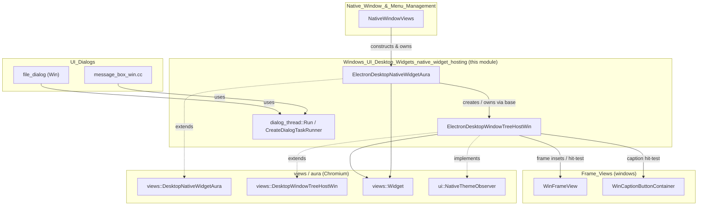
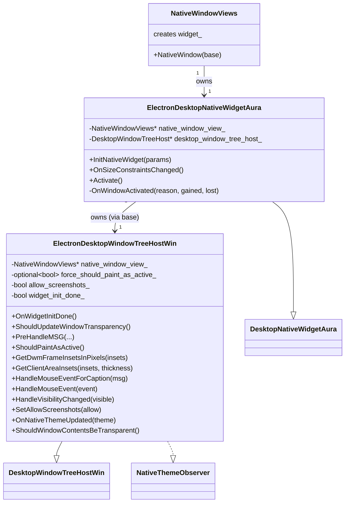
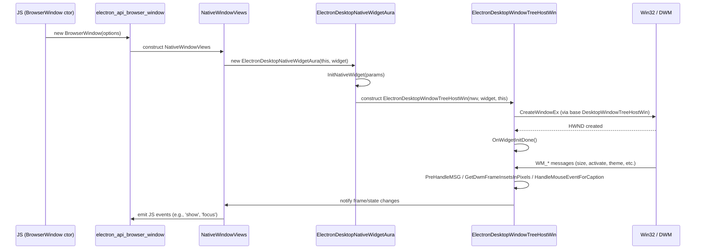
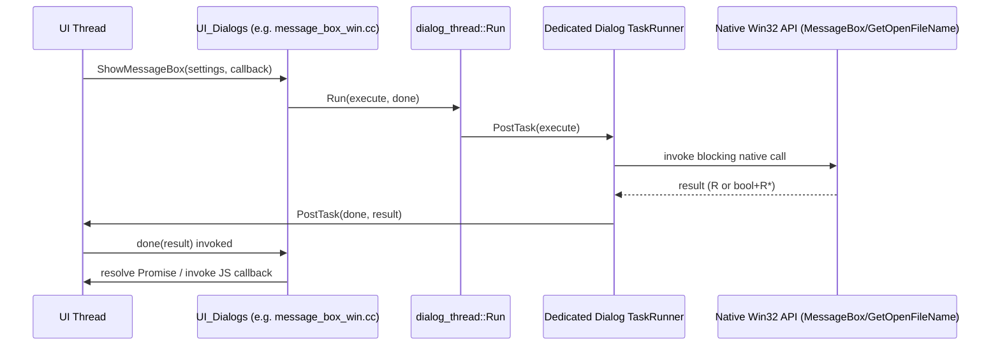

# Windows UI (Desktop Widgets) — Native Widget Hosting

## Introduction

This module provides the Windows-specific plumbing that connects Electron's cross-platform `views::Widget`/`NativeWindowViews` window abstraction to the native Win32 windowing system. It sits at the boundary between the Chromium `views` toolkit (aura) and the raw HWND message loop, and is responsible for:

- Creating and wiring up the `DesktopNativeWidgetAura` and `DesktopWindowTreeHostWin` subclasses that Electron uses on Windows.
- Intercepting and customizing native Win32 window messages (WM_*) to support Electron-specific behaviors (frameless windows, DWM insets, screenshot blocking, theme updates, activation handling, etc.).
- Offering a small utility (`dialog_thread`) for running blocking native dialog calls (e.g., Win32 common dialogs) off the UI thread and marshaling results back safely.

This module is a child of [Windows_UI_(Desktop_Widgets)](Windows_UI_(Desktop_Widgets).md) and is a sibling to [Windows_UI_(Desktop_Widgets)_desktop_shell_widgets](Windows_UI_(Desktop_Widgets)_desktop_shell_widgets.md) (which covers the Jump List and Taskbar host widgets). It is consumed directly by [Native_Window_&_Menu_Management](Native_Window_&_Menu_Management.md), specifically `NativeWindowViews`, which is the platform-agnostic window class that Electron's `BrowserWindow`/`BaseWindow` APIs are built on top of (see [shell_browser_api_window_ui_windows](Native_Window_&_Menu_Management.md)).

---

## Purpose & Scope

Electron's window management on Windows relies on the Chromium `views` framework running on top of `aura`. Two pieces of glue code are required to make a `views::Widget` behave like a proper native Win32 top-level window with Electron's customizations:

1. **`ElectronDesktopNativeWidgetAura`** — a subclass of `views::DesktopNativeWidgetAura` that ties the widget's lifecycle to Electron's `NativeWindowViews`, and customizes native widget initialization/activation behavior.
2. **`ElectronDesktopWindowTreeHostWin`** — a subclass of `views::DesktopWindowTreeHostWin` that intercepts raw Win32 messages and DWM-related queries (frame insets, transparency, mouse hit-testing for captions, screenshot protection, native theme changes) so that Electron's custom frame views (see [Frame_Views](Frame_Views.md)) render and behave correctly.

Additionally, **`dialog_thread`** provides a generic, reusable pattern (`Run()`) for executing a blocking operation (typically a native Win32 dialog, such as a message box or file dialog) on a dedicated single-threaded task runner, then delivering the result back on the UI thread via callback. This is used by native dialog implementations under [UI_Dialogs](UI_Dialogs.md) (e.g., Windows message box/file dialog code) to avoid blocking the browser UI thread while a native modal dialog is displayed.

---

## Core Components

### 1. `dialog_thread::Result` / `dialog_thread::Run`
File: `shell/browser/ui/win/dialog_thread.h`

A templated helper namespace (not a class) that:
- Creates a dedicated `SingleThreadTaskRunner` (`CreateDialogTaskRunner()`) for running dialog-related blocking calls.
- Provides `Run(execute, done)` overloads:
  - The primary overload posts `execute` to the dialog thread, captures its return value `R`, then posts `done(R)` back to the UI thread.
  - A convenience overload adapts calls of the shape `bool execute(R*)` (common in Win32 APIs that return a success boolean and an out-parameter) by wrapping both values into an internal `Result` struct, and unpacking them again before invoking `done(bool, R)`.

This pattern mirrors a "worker thread → post → UI thread → callback" JS-like async pattern, implemented with `base::OnceCallback`.

### 2. `ElectronDesktopNativeWidgetAura`
File: `shell/browser/ui/win/electron_desktop_native_widget_aura.h`

Inherits from `views::DesktopNativeWidgetAura`. Responsibilities:
- Holds a raw (non-owning) pointer back to the owning `NativeWindowViews` (`native_window_view_`).
- Holds a raw pointer to the `views::DesktopWindowTreeHost` it owns indirectly (owned by the base `DesktopNativeWidgetAura`).
- Overrides:
  - `InitNativeWidget(params)` — customizes widget initialization parameters/behavior for Electron windows.
  - `OnSizeConstraintsChanged()` (Windows-only) — reacts to min/max size changes to keep native constraints in sync.
  - `Activate()` — customizes window activation behavior (from `internal::NativeWidgetPrivate`).
  - `OnWindowActivated(reason, gained_active, lost_active)` — private override reacting to `wm::ActivationChangeObserver` notifications to keep Electron's window state (e.g., focus events) in sync with aura's window activation model.

This class effectively acts as the "native widget" adapter required by `views::Widget`, and is instantiated when a `NativeWindowViews` is created on Windows (see [shell_browser_native_window_views](Native_Window_&_Menu_Management.md)).

### 3. `ElectronDesktopWindowTreeHostWin`
File: `shell/browser/ui/win/electron_desktop_window_tree_host_win.h`

Inherits from `views::DesktopWindowTreeHostWin` and `ui::NativeThemeObserver`. This is the lowest-level piece that intercepts the native Win32 window's message pump and DWM queries:

- Constructed with a `NativeWindowViews*`, the owning `views::Widget*`, and the `views::DesktopNativeWidgetAura*` that owns it — establishing the three-way relationship between Electron's window object, the views `Widget`, and the aura native widget.
- Key overrides:
  - `OnWidgetInitDone()` — hook fired once widget initialization completes; used to finish setup that depends on the HWND being valid (`widget_init_done_` flag tracks this).
  - `ShouldUpdateWindowTransparency()` — controls whether Chromium's compositor should manage window transparency (relevant to frameless/vibrancy-like windows).
  - `PreHandleMSG(message, w_param, l_param, result)` — intercepts raw Win32 messages **before** default `views` processing, allowing Electron to short-circuit or modify message handling (e.g., custom non-client area handling for frameless windows).
  - `ShouldPaintAsActive()` — overrides active/inactive frame painting logic; combined with `force_should_paint_as_active_` (an `std::optional<bool>`) to let Electron explicitly force a paint state (useful for programmatic focus/blur emulation).
  - `GetDwmFrameInsetsInPixels(insets)` / `GetClientAreaInsets(insets, frame_thickness)` — supply custom frame/client insets to DWM, required for correctly rendering Electron's custom or frameless window chrome (works together with [Frame_Views_windows](Frame_Views.md) — `WinFrameView`, `WinCaptionButtonContainer`).
  - `HandleMouseEventForCaption(message)` / `HandleMouseEvent(event)` — customize hit-testing and mouse event routing so custom caption buttons and draggable regions behave like native title bars.
  - `HandleVisibilityChanged(visible)` — reacts to show/hide transitions.
  - `SetAllowScreenshots(allow)` / `UpdateAllowScreenshots()` — implements Electron's screenshot-protection feature (`contentProtection`) by toggling Windows' `SetWindowDisplayAffinity`-style protection; `allow_screenshots_` tracks current state.
  - `OnNativeThemeUpdated(observed_theme)` (from `ui::NativeThemeObserver`) — reacts to OS theme (light/dark) changes, propagating updates to the window frame (ties into dark-mode handling described in [shell_browser_main_parts_client_core_bootstrap](Browser_Process_Core_&_Lifecycle.md), which owns `DarkModeManagerLinux`'s Windows analog logic at a higher level).
  - `ShouldWindowContentsBeTransparent()` — additional transparency query used by the base class during compositing.

---

## Architecture

---

## Component Relationships & Ownership

---

## Data Flow: Window Creation on Windows

---

## Data Flow: Native Dialog Execution (`dialog_thread`)

This ensures the native, blocking Win32 dialog call never runs on Electron's main UI thread, preventing UI freezes while still marshaling the result back safely for JS callback/Promise resolution.

---

## Interactions with Other Modules

| Related Module | Relationship |
|---|---|
| [Native_Window_&_Menu_Management](Native_Window_&_Menu_Management.md) | `NativeWindowViews` (in `shell_browser_native_window_views`) owns and drives `ElectronDesktopNativeWidgetAura`/`ElectronDesktopWindowTreeHostWin` as its Windows-specific backing implementation. |
| [Frame_Views](Frame_Views.md) | `WinFrameView`, `WinCaptionButtonContainer`, and `WinCaptionButton` (in `Frame_Views_windows`) rely on the insets and hit-test overrides provided by `ElectronDesktopWindowTreeHostWin` to render custom title bars/caption buttons correctly. |
| [Windows_UI_(Desktop_Widgets)_desktop_shell_widgets](Windows_UI_(Desktop_Widgets)_desktop_shell_widgets.md) | Sibling module providing `TaskbarHost` and `JumpList`, which operate on the same native `HWND` hosted by this module's tree host. |
| [UI_Dialogs](UI_Dialogs.md) | Windows-specific dialog implementations (`message_box_win.cc`, Win32 file dialog code) use `dialog_thread::Run`/`CreateDialogTaskRunner` to execute blocking dialog calls off the UI thread. |
| [Platform-Specific_Integration](Platform-Specific_Integration.md) | `shell/browser/win/scoped_hstring.h` and other Windows platform helpers are used alongside this module elsewhere in the Windows UI stack (e.g., toast notifications), though not directly coupled to widget hosting. |

---

## Design Notes

- **Non-owning back-references**: Both `ElectronDesktopNativeWidgetAura` and `ElectronDesktopWindowTreeHostWin` hold raw (`raw_ptr`) pointers to `NativeWindowViews`, reflecting that `NativeWindowViews` is the actual owner of the widget hierarchy; the widget/tree-host objects are transient and destroyed alongside the native window, not the reverse.
- **Layered override strategy**: Rather than reimplementing window management, this module overrides specific hook points (`PreHandleMSG`, `GetDwmFrameInsetsInPixels`, `HandleMouseEventForCaption`, etc.) exposed by Chromium's `views` framework, keeping platform-specific customization minimal and localized.
- **Thread-safety for dialogs**: `dialog_thread::Run`'s templated design allows any blocking, synchronous native call to be safely bridged into Electron's callback/Promise-based async API surface without duplicating threading boilerplate in every dialog implementation.
- **Theme & security integration**: `OnNativeThemeUpdated` and `SetAllowScreenshots`/`UpdateAllowScreenshots` show how OS-level signals (theme changes, display affinity) are surfaced into Electron's window features (`nativeTheme` updates, `contentProtection` option).
