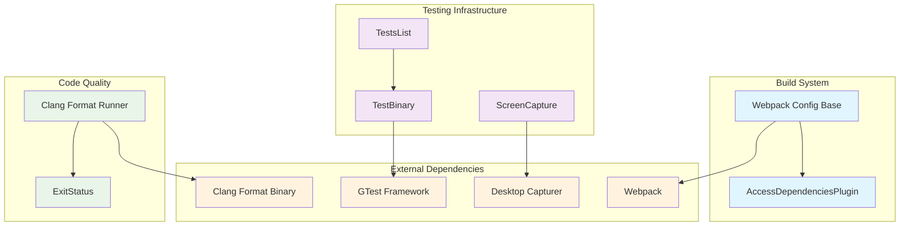
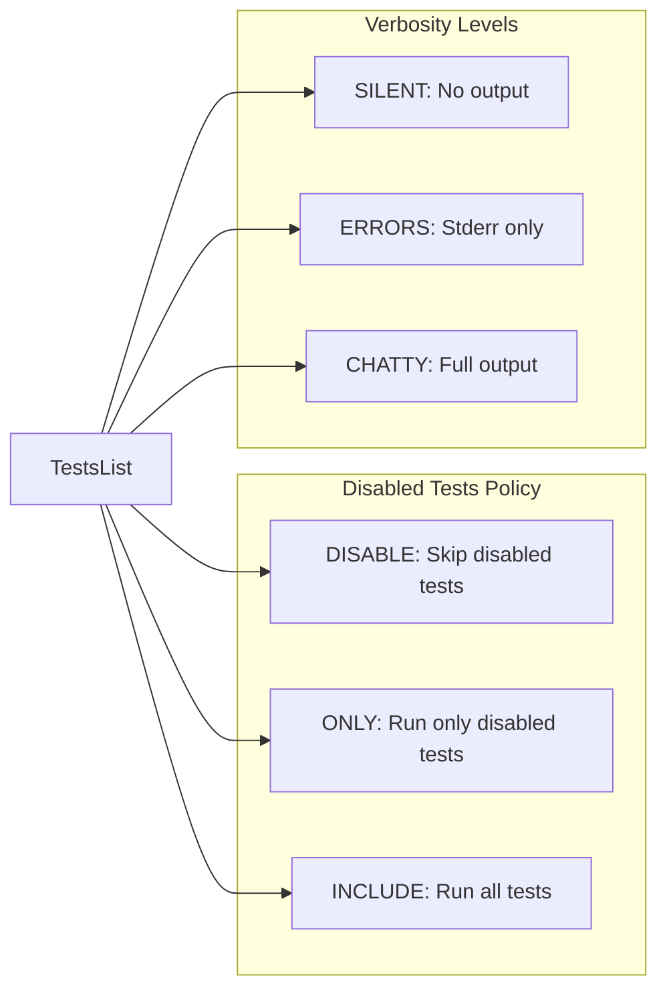
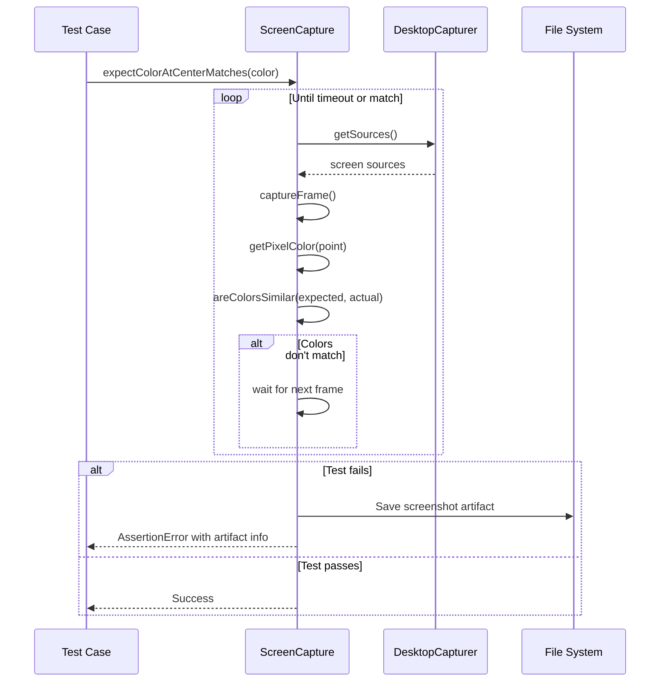
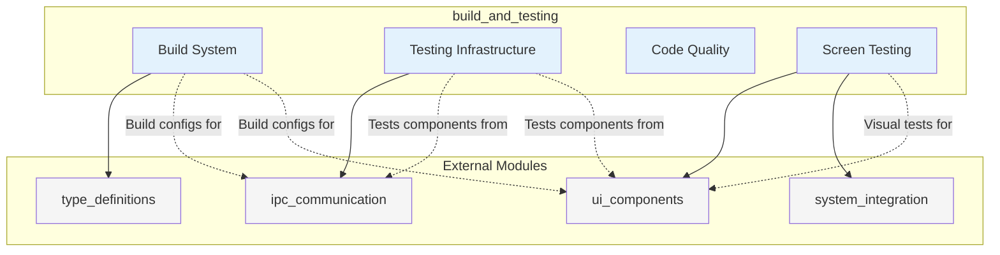
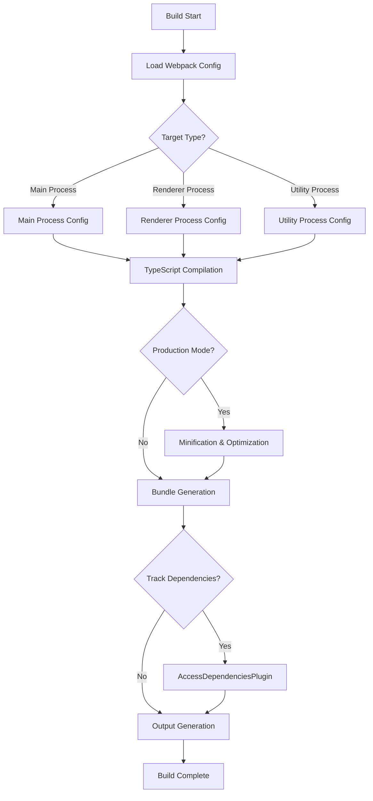
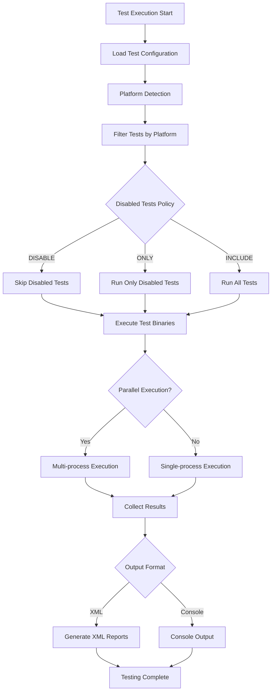

# Build and Testing Module

The build_and_testing module provides essential infrastructure for building, testing, and quality assurance in the Electron framework. This module encompasses webpack configuration management, native test execution, code formatting, and screen capture testing capabilities.

## Architecture Overview



## Core Components

### Build System Components

#### AccessDependenciesPlugin
**Location**: `build/webpack/webpack.config.base.js`

A custom Webpack plugin that tracks and reports module dependencies during the build process.

**Key Features**:
- Hooks into Webpack's compilation process
- Extracts file paths of all processed modules
- Outputs dependency information as JSON for analysis
- Supports build graph visualization and dependency tracking

**Usage Context**:
- Activated when `PRINT_WEBPACK_GRAPH` environment variable is set
- Used for build analysis and dependency visualization
- Helps identify module relationships and potential optimization opportunities

#### Webpack Configuration Base
**Location**: `build/webpack/webpack.config.base.js`

Provides the foundational Webpack configuration factory for Electron's build system.

**Configuration Features**:
- **Target-specific builds**: Supports different Electron targets (main, renderer, utility)
- **TypeScript compilation**: Integrated ts-loader with custom tsconfig
- **Code optimization**: TerserPlugin for production builds with class/function name preservation
- **Environment-specific handling**: Different configurations for Node.js and web environments
- **Build flags integration**: Dynamic feature flag injection from build system
- **Error handling**: Optional wrapper plugins for profiling and error catching

### Testing Infrastructure

#### TestsList
**Location**: `script/lib/native_tests.py`

Manages and orchestrates the execution of native test suites across different platforms.

**Key Capabilities**:
- **Configuration-driven**: YAML-based test configuration management
- **Platform awareness**: Automatic platform detection and test filtering
- **Parallel execution**: Support for running multiple test binaries concurrently
- **Flexible test filtering**: Include/exclude specific tests or run only disabled tests
- **Output management**: XML output generation for CI/CD integration

**Test Management Policies**:


#### TestBinary
**Location**: `script/lib/native_tests.py`

Handles the execution of individual test binaries with Google Test framework integration.

**Features**:
- **GTest integration**: Native support for Google Test filtering and output formats
- **Flexible filtering**: Include/exclude test patterns
- **Output redirection**: Configurable stdout/stderr handling
- **XML reporting**: Structured test result output for CI systems
- **Error handling**: Robust exception handling with detailed error reporting

### Screen Testing Infrastructure

#### ScreenCapture
**Location**: `spec/lib/screen-helpers.ts`

Provides comprehensive screen capture and visual testing capabilities for UI validation.

**Core Functionality**:
- **Multi-display support**: Capture from specific displays or primary display
- **Color validation**: Pixel-perfect color matching with similarity thresholds
- **Timeout handling**: Configurable waiting periods for expected visual states
- **Artifact generation**: Automatic screenshot saving for debugging failures
- **Platform optimization**: macOS-specific adjustments for system prompts

**Visual Testing Workflow**:


### Code Quality Tools

#### Clang Format Runner
**Location**: `script/run-clang-format.py`

A comprehensive wrapper around clang-format for maintaining consistent code style across the codebase.

**Features**:
- **Multi-file processing**: Parallel processing of multiple files and directories
- **Git integration**: Process only changed files in staging area
- **Flexible exclusion**: Pattern-based file exclusion with `.clang-format-ignore` support
- **Diff generation**: Unified diff output for review and patching
- **In-place fixing**: Optional automatic code reformatting
- **Colorized output**: Enhanced readability with colored diff output

#### ExitStatus
**Location**: `script/run-clang-format.py`

Defines standardized exit codes for the clang-format runner.

**Status Codes**:
- `SUCCESS (0)`: All files properly formatted
- `DIFF (1)`: Formatting differences found
- `TROUBLE (2)`: Execution errors or failures

## Integration with Other Modules

### Dependencies and Relationships



**Key Integration Points**:

1. **With [type_definitions](type_definitions.md)**: Build system uses TypeScript definitions for compilation
2. **With [ipc_communication](ipc_communication.md)**: Testing infrastructure validates IPC functionality
3. **With [ui_components](ui_components.md)**: Screen capture tests validate UI component rendering
4. **With [system_integration](system_integration.md)**: Tests system-level integrations and APIs

## Build Process Flow



## Testing Workflow



## Configuration and Customization

### Webpack Configuration Options

The build system supports extensive customization through configuration parameters:

- **alwaysHasNode**: Determines Node.js environment availability
- **loadElectronFromAlternateTarget**: Alternative target for Electron API loading
- **targetDeletesNodeGlobals**: Controls Node.js global variable handling
- **wrapInitWithProfilingTimeout**: Enables profiling wrapper
- **wrapInitWithTryCatch**: Adds error handling wrapper

### Test Configuration Structure

Tests are configured via YAML files with the following structure:

```yaml
tests:
  - test_binary_name:
      disabled:
        - TestSuite.DisabledTest1
        - TestSuite.DisabledTest2
      platform:
        - linux
        - mac
        - windows
```

### Screen Testing Configuration

Screen capture tests can be customized with:

- **Display selection**: Target specific displays or use primary
- **Color similarity thresholds**: Adjust tolerance for color matching
- **Timeout values**: Configure waiting periods for visual states
- **Artifact generation**: Control screenshot saving for debugging

## Best Practices

### Build System
- Use environment-specific configurations for different build targets
- Leverage build flags for feature toggling
- Monitor dependency graphs for optimization opportunities
- Implement proper error handling and logging

### Testing
- Organize tests by platform compatibility
- Use descriptive test names and proper categorization
- Implement proper cleanup and resource management
- Generate structured output for CI/CD integration

### Code Quality
- Run clang-format checks in pre-commit hooks
- Use consistent exclusion patterns across projects
- Generate patches for easy application of formatting fixes
- Integrate with CI/CD pipelines for automated quality checks

### Screen Testing
- Account for platform-specific UI differences
- Use appropriate color similarity thresholds
- Implement proper timeout handling for flaky tests
- Save artifacts for debugging failed visual tests

## Performance Considerations

- **Parallel Processing**: Both testing and formatting support parallel execution
- **Incremental Builds**: Webpack configuration supports incremental compilation
- **Resource Management**: Proper cleanup of test processes and screen capture resources
- **Optimization**: Production builds include minification and tree-shaking

## Troubleshooting

### Common Build Issues
- **TypeScript compilation errors**: Check tsconfig.electron.json configuration
- **Dependency resolution**: Verify webpack alias configurations
- **Plugin conflicts**: Review plugin order and compatibility

### Test Execution Problems
- **Platform compatibility**: Verify test platform requirements
- **Binary not found**: Check test binary paths and build status
- **Permission issues**: Ensure proper execution permissions

### Screen Capture Issues
- **Empty sources**: Linux CI environments may have limited screen access
- **Color mismatches**: Adjust similarity thresholds for different displays
- **Timeout failures**: Increase timeout values for slower systems

This module serves as the foundation for Electron's build and quality assurance processes, providing robust tools for compilation, testing, and validation across multiple platforms and environments.