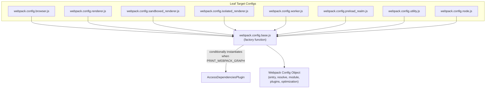
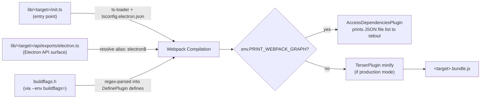
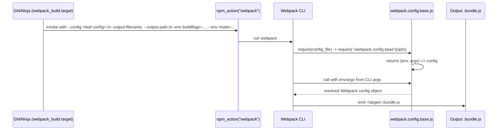

# Build & Webpack Tooling

## Introduction

The `build_webpack_tools` module contains the Webpack build configuration infrastructure used to bundle Electron's own TypeScript/JavaScript sources (`lib/**`) into the JavaScript bundles that are embedded into the Electron binary at build time. It is the JavaScript-side counterpart of Electron's GN/Ninja build system: while GN orchestrates the native C++ compilation, this module orchestrates the compilation and bundling of Electron's internal JS layer (browser process API bindings, renderer process bindings, preload scripts, sandboxed renderer, utility process, worker, and Node integration scripts).

This module is a child of the broader **Build & Development Tooling** domain (sibling to `script_tools`, which covers Python-based developer scripts such as native test runners and clang-format checks). It has no runtime dependency on Electron's C++ or native window/browser subsystems — its only relationship to the rest of the system is that it consumes files from [`lib_browser_api`](lib_browser_api.md) and [`lib_renderer_ipc`](lib_renderer_ipc.md) (and other `lib/**` directories) as **inputs**, and produces the bundled `.bundle.js` files that those runtime layers ultimately execute in the Electron process (main, renderer, utility, worker, etc.).

---

## Purpose & Core Functionality

Electron ships several distinct JavaScript "targets" — isolated bundles of code that run in different processes/contexts with different capabilities (e.g., whether Node.js integration is available, whether `require`/`process`/`Buffer` globals exist, whether the code runs in a sandboxed/context-isolated world). Each target needs its own Webpack configuration because:

- Some targets have Node.js built in natively (`alwaysHasNode: true`) and don't need Node polyfills.
- Some targets must have `Buffer`/`process`/`global` **removed** post-bundling because the host environment (sandboxed renderer, isolated world) must not leak Node-like globals.
- Some targets need defensive wrapping (`try/catch`, profiling timeout deferral) around their init code since a JS crash during bootstrap should not crash the whole process.
- Build tooling needs a way to introspect the full dependency graph of a bundle (for GN `inputs` tracking) without actually emitting a full bundle.

The module solves this with a **single shared base configuration factory** (`webpack.config.base.js`) that is parameterized per-target by small "leaf" config files (`webpack.config.<target>.js`), plus a GN template (`webpack.gni`) that invokes Webpack as part of the native build.

### Core Component: `AccessDependenciesPlugin`

```js
class AccessDependenciesPlugin {
  apply (compiler) {
    compiler.hooks.compilation.tap('AccessDependenciesPlugin', compilation => {
      compilation.hooks.finishModules.tap('AccessDependenciesPlugin', modules => {
        const filePaths = modules.map(m => m.resource).filter(p => p).map(p => path.relative(electronRoot, p));
        console.info(JSON.stringify(filePaths));
      });
    });
  }
}
```

This is a Webpack compiler plugin that hooks into the `compilation` → `finishModules` lifecycle event to enumerate every module (source file) that was resolved into the dependency graph, and prints their paths (relative to the Electron repo root) as a JSON array to stdout. It is only activated when the build is invoked with `env.PRINT_WEBPACK_GRAPH` set — a "dry run" mode used by the GN build to discover the **exact set of input files** a given bundle target depends on, without performing a full compile/minify. This lets GN declare accurate build dependencies (`inputs`) for incremental builds, and lets other lint/graph tooling introspect which `lib/` files feed which output bundle.

---

## Architecture

### Configuration Factory Pattern

`webpack.config.base.js` exports a **factory of factories**: it exports a function that takes target-specific options and returns *another* function `(env, argv) => webpackConfigObject`, which is the shape Webpack itself expects for dynamic configs. Each `webpack.config.<target>.js` file is a thin, declarative leaf that supplies the target-specific flags and immediately re-exports the resulting Webpack config.



### Target Matrix

Each leaf config supplies a distinct combination of options to the base factory:

| Target | `alwaysHasNode` | `targetDeletesNodeGlobals` | `wrapInitWithProfilingTimeout` | `wrapInitWithTryCatch` | `loadElectronFromAlternateTarget` |
|---|---|---|---|---|---|
| `browser` | ✅ | – | – | – | – |
| `renderer` | ✅ | ✅ | ✅ | ✅ | – |
| `sandboxed_renderer` | – | – | ✅ | ✅ | – |
| `isolated_renderer` | – | – | – | ✅ | – |
| `worker` | ✅ | ✅ | – | ✅ | `renderer` |
| `preload_realm` | – | – | ✅ | ✅ | – |
| `utility` | ✅ | – | – | – | – |
| `node` | ✅ | – | – | – | – |

These option flags map directly to conditional branches inside `webpack.config.base.js` that add plugins:

- **`alwaysHasNode`** → controls whether the Webpack `target` is `'node'` (native Node runtime, no browser polyfills needed) or `'web'` (needs `buffer`/`process/browser` polyfills injected via `ProvidePlugin`).
- **`targetDeletesNodeGlobals`** → injects a `ProvidePlugin` that sources `Buffer`/`global`/`process` from Electron's own `@electron/internal/common/webpack-provider` module instead of Node/Webpack defaults — used for renderer/worker contexts where Electron wants to control exactly how/when these globals appear (and later strip them).
- **`wrapInitWithProfilingTimeout`** → wraps the bundle's init code in a named function, deferring execution via `setTimeout` when the process was launched with `--profile-electron-init` (useful for startup profiling).
- **`wrapInitWithTryCatch`** → wraps init code in `try { ... } catch` so a bootstrap failure logs an error instead of silently crashing/hanging the process.
- **`loadElectronFromAlternateTarget`** → used by `worker`, which needs to resolve the `electron` module's public API surface from the `renderer` target's `electron.ts` exports file rather than its own (`worker` has no own Electron API surface file).

### Data Flow: From Source to Bundle



1. **Entry resolution**: The base factory locates `lib/<target>/init.ts` (or `.js` fallback) as the Webpack entry point.
2. **Electron API aliasing**: `electron$`, `electron/main$`, `electron/renderer$`, etc. are aliased to the target's (or an alternate target's) `api/exports/electron.ts` file, ensuring `require('electron')` inside bundled code resolves to the correct API surface for that process type. See [`lib_browser_api`](lib_browser_api.md) and [`lib_renderer_ipc`](lib_renderer_ipc.md) for what those API modules expose.
3. **Buildflag injection**: If invoked with `--env buildflags=<path-to-buildflags.h>`, the factory parses C++ preprocessor `#define BUILDFLAG_INTERNAL_*` macros out of the generated GN buildflags header and injects them as Webpack `DefinePlugin` string literals, so TypeScript code can do compile-time `if (BUILDFLAG(ENABLE_X))` checks that get dead-code-eliminated.
4. **TypeScript compilation**: `.ts` files are compiled via `ts-loader` against `tsconfig.electron.json`, with select diagnostics suppressed (rootDir violations, private-field-in-enclosing-class checks) since the shared `lib/` tree spans multiple logical targets.
5. **Optional graph-only mode**: If `PRINT_WEBPACK_GRAPH` is set, `AccessDependenciesPlugin` is added and TypeScript type-checking is skipped (`transpileOnly: true`) to make the introspection pass fast; the plugin dumps the resolved module file list instead of a full bundle.
6. **Output wrapping & minification**: Depending on target flags, the init code may be wrapped for profiling/error-safety, and in `production` mode, the bundle is minified with `TerserPlugin` (configured to preserve class/function names for stack traces and Node's introspection).

---

## Integration with the Native Build System

`webpack.gni` defines the `webpack_build` GN template, which is the bridge between Chromium's GN/Ninja build graph and this Webpack tooling.



Key aspects of the GN integration:

- `inputs` always include the invoking leaf config file, `webpack.config.base.js` itself, `tsconfig.json`, `yarn.lock`, and Electron's internal/ambient type declaration files — plus whatever additional inputs the specific GN target declares (typically discovered dynamically via the `PRINT_WEBPACK_GRAPH` dependency-graph mode described above).
- `mode` is `development` by default, switched to `production` for official/release builds — this is what triggers `TerserPlugin` minification in the base config's `optimization.minimize` setting.
- The GN template automatically adds a dependency on `//electron/buildflags` and passes the generated `buildflags.h` path via `--env buildflags=`, which flows into the `DefinePlugin` defines described above.

This module has no direct dependency on the [Application Bootstrap & Process Entry](shell_app.md) or [Browser Process Core & Lifecycle](shell_browser_core.md) native modules — instead, its **output artifacts** (the compiled `.bundle.js` files) are what those native bootstrap paths load and execute as the JS runtime layer for each process type (browser main process, renderer, utility process, etc.). The mapping of target name → runtime purpose corresponds to:

- `browser` → main/browser process JS init, consumed alongside [`Browser Process Core & Lifecycle`](shell_browser_core.md) and the [`Public JS API Bindings`](lib_browser_api.md) surface.
- `renderer` / `sandboxed_renderer` / `isolated_renderer` → renderer process JS init, consumed by [`Renderer Process Infrastructure`](Renderer_Client.md) and [`lib_renderer_ipc`](lib_renderer_ipc.md).
- `preload_realm` → preload script execution context, related to [`Preload Script Infrastructure`](Preload_Script.md) and [`Preload_ServiceWorker_(Renderer)`](Preload_ServiceWorker_(Renderer).md).
- `utility` → utility process JS init, related to [`Node Utility Services`](Utility_Content_Client.md).
- `worker` → Node worker_threads JS init.
- `node` → the `node` target bundle used for Electron's Node.js integration mode.

---

## Related Documentation

- [`script_tools`](script_tools.md) — sibling module covering Python-based build/developer scripts (native test runner, clang-format checker) within the same `Build & Development Tooling` domain.
- [`lib_browser_api`](lib_browser_api.md) — browser-process public JS API surface bundled by the `browser` target.
- [`lib_renderer_ipc`](lib_renderer_ipc.md) — renderer-process IPC API surface bundled by the `renderer`/`sandboxed_renderer`/`isolated_renderer` targets.
- [`Preload_Script`](Preload_Script.md) and [`Preload_ServiceWorker_(Renderer)`](Preload_ServiceWorker_(Renderer).md) — runtime consumers of the `preload_realm` bundle.
