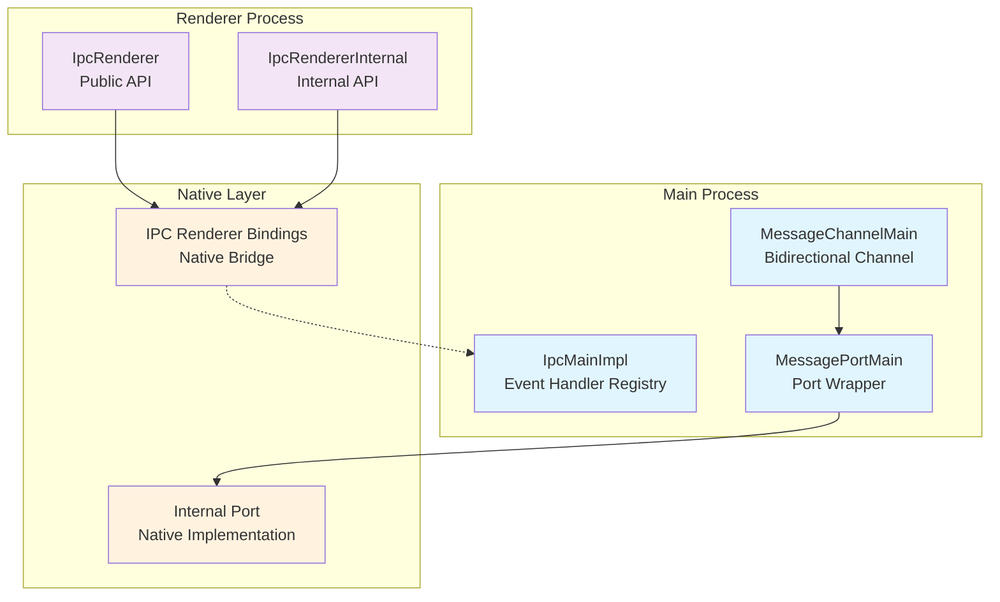
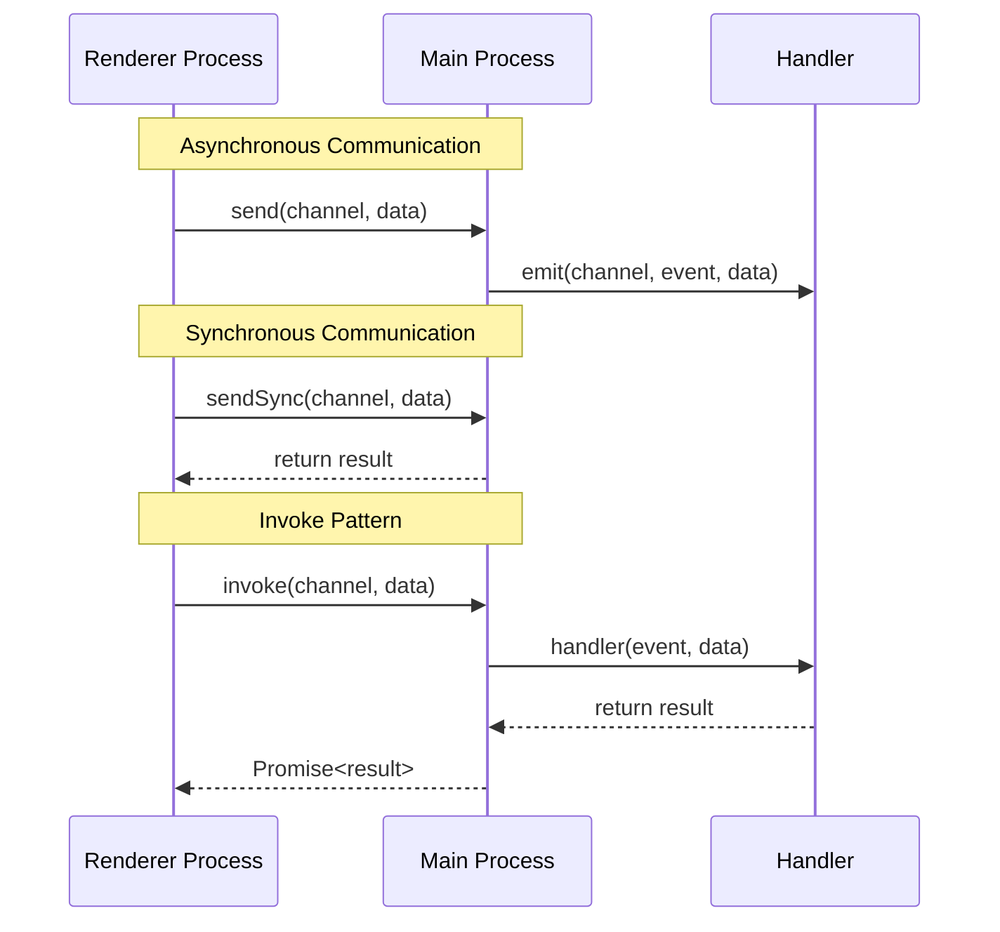
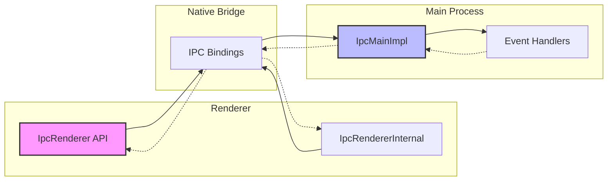
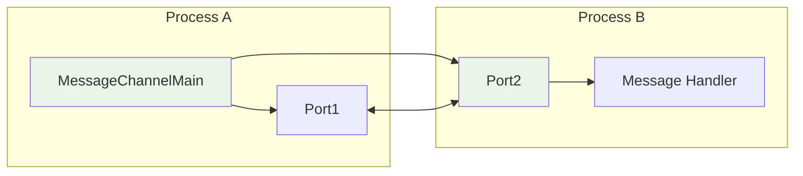

# IPC Communication Module

The IPC Communication module provides the core inter-process communication infrastructure for Electron applications, enabling secure and efficient message passing between the main process and renderer processes.

## Overview

This module implements Electron's IPC (Inter-Process Communication) system, which allows different processes in an Electron application to communicate with each other. It provides both synchronous and asynchronous communication patterns, along with message port functionality for advanced use cases.

## Architecture



## Core Components

### IpcMainImpl
**Location**: `lib/browser/ipc-main-impl.ts`

The main process IPC implementation that manages invoke handlers and event emission.

**Key Features**:
- Handler registration and management
- One-time handler support
- Error handling for channel operations
- Extends EventEmitter for event-driven communication

**Methods**:
- `handle(method, fn)`: Register a persistent handler
- `handleOnce(method, fn)`: Register a one-time handler
- `removeHandler(method)`: Remove a registered handler

### IpcRenderer
**Location**: `lib/renderer/api/ipc-renderer.ts`

Public API for renderer process IPC communication.

**Key Features**:
- Synchronous and asynchronous message sending
- Method invocation with promise-based responses
- Host communication for webview scenarios
- Message posting with transferable objects

**Methods**:
- `send(channel, ...args)`: Send asynchronous message
- `sendSync(channel, ...args)`: Send synchronous message
- `invoke(channel, ...args)`: Invoke method with response
- `sendToHost(channel, ...args)`: Send to webview host
- `postMessage(channel, message, transferables)`: Post with transferables

### IpcRendererInternal
**Location**: `lib/renderer/ipc-renderer-internal.ts`

Internal IPC API for Electron's internal operations.

**Key Features**:
- Similar to IpcRenderer but marked as internal
- Type-safe invoke method with generics
- Separate channel namespace from public API

### MessagePortMain
**Location**: `lib/browser/message-port-main.ts`

Wrapper for native message ports providing structured communication.

**Key Features**:
- Event-driven message handling
- Port lifecycle management
- Transferable object support
- Nested port handling

**Methods**:
- `start()`: Activate the port
- `close()`: Close the port
- `postMessage(...args)`: Send message through port

### MessageChannelMain
**Location**: `lib/browser/api/message-channel.ts`

Creates paired message ports for bidirectional communication.

**Key Features**:
- Creates connected port pairs
- Enables structured communication patterns
- Supports complex data transfer scenarios

## Communication Patterns



## Data Flow



## Message Port Communication



## Integration Points

### Type Definitions
The module integrates with [type_definitions](type_definitions.md) for:
- `IpcMainEvent` interfaces
- `WebContents` and `BrowserWindow` types
- Process and global type definitions

### Process Management
Coordinates with [process_management](process_management.md) for:
- Utility process communication
- Parent-child process messaging
- Process lifecycle events

### Web View System
Supports [web_view_system](web_view_system.md) through:
- Host communication patterns
- Guest view messaging
- Isolated context communication

## Security Considerations

### Channel Isolation
- Internal and public channels are separated
- Handler validation prevents duplicate registrations
- Type checking ensures proper function handlers

### Message Validation
- Arguments are serialized safely
- Error handling prevents information leakage
- Transferable objects are properly managed

## Usage Examples

### Basic IPC Communication
```typescript
// Main Process
import { ipcMain } from 'electron';

ipcMain.handle('get-data', async (event, id) => {
  return await fetchData(id);
});

// Renderer Process
import { ipcRenderer } from 'electron';

const data = await ipcRenderer.invoke('get-data', 123);
```

### Message Port Communication
```typescript
// Main Process
import { MessageChannelMain } from 'electron';

const { port1, port2 } = new MessageChannelMain();
webContents.postMessage('port', null, [port2]);

port1.on('message', (event) => {
  console.log('Received:', event.data);
});

// Renderer Process
ipcRenderer.on('port', (event) => {
  const [port] = event.ports;
  port.postMessage('Hello from renderer');
});
```

## Error Handling

The module implements comprehensive error handling:
- Handler registration validation
- Invoke method error propagation
- Channel name validation
- Type checking for handlers

## Performance Considerations

- Handlers are stored in efficient Map structures
- Event emission is optimized for high-frequency communication
- Message serialization is handled at the native layer
- Port lifecycle management prevents memory leaks

## Dependencies

This module depends on:
- Node.js EventEmitter for event handling
- Native Electron bindings for IPC transport
- Internal renderer bindings for process communication

## Related Documentation

- [type_definitions](type_definitions.md) - Type interfaces and definitions
- [process_management](process_management.md) - Process lifecycle and management
- [web_view_system](web_view_system.md) - Web view communication patterns
- [system_integration](system_integration.md) - System-level integrations