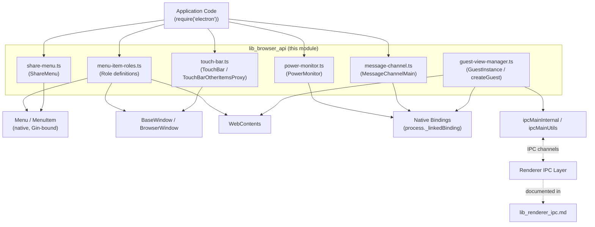
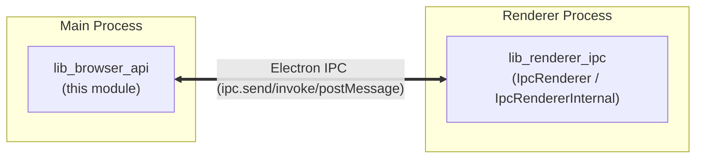

# `lib_browser_api` — Browser-Process JavaScript API Bindings

## 1. Purpose

`lib_browser_api` is the collection of **TypeScript "glue" modules** that live under
`lib/browser/api/` (plus the closely related `lib/browser/guest-view-manager.ts`). These
files implement the *main-process* half of several public Electron JavaScript APIs by
wrapping native (`process._linkedBinding`) bindings or by orchestrating existing
Electron classes (`Menu`, `BrowserWindow`, `WebContents`, `session`) into higher-level,
developer-facing objects.

Unlike the C++ `shell/browser/api/*` layer (see [shell_browser_api_system_device](shell_browser_api_system_device.md),
[shell_browser_api_window_ui](shell_browser_api_window_ui.md), etc.) which exposes native
objects to V8 via Gin bindings, this module is **pure TypeScript** code that runs inside
the Electron main process's Node.js environment. It sits directly on top of the native
bindings and is what application developers actually `require('electron')` and interact
with.

Concretely, this module provides:

- **Menu role behavior** (`menu-item-roles.ts`) — the built-in behavior (labels,
  accelerators, and actions) for standard `MenuItem` roles like `copy`, `quit`,
  `toggleDevTools`, and composite roles like `editMenu`/`windowMenu`.
- **`ShareMenu`** — a thin wrapper around `Menu` for macOS-style native share sheets.
- **`TouchBar`** family (`TouchBarOtherItemsProxy` and sibling item classes) — macOS
  Touch Bar item definitions and the logic to bind/unbind a `TouchBar` to a
  `BaseWindow`.
- **`PowerMonitor`** — an `EventEmitter` facade over the native power-monitor binding
  that lazily activates OS power-event listening.
- **`MessageChannelMain`** — the main-process `MessageChannel`/`MessagePort` pair
  constructor.
- **Guest View Manager** (`guest-view-manager.ts`) — the server-side logic backing the
  legacy `<webview>` tag: creating/destroying guest `WebContents`, wiring IPC between
  embedder and guest, and enforcing the `webviewTag` preference.

## 2. Architecture Overview

All components in this module run in the **Electron main process**. They are consumed
by end-user application code (via `require('electron')`) and by other internal browser
modules (e.g., `Menu`, `BrowserWindow`).

### Process boundary context

This module is one half of the **Public JS API Bindings** area of Electron. Its sibling,
the renderer-side IPC primitives (`IpcRenderer`, `IpcRendererInternal`), is documented
separately in **[lib_renderer_ipc.md](lib_renderer_ipc.md)**. Together they implement the
send/invoke/postMessage machinery that `guest-view-manager.ts` and `MessageChannelMain`
rely on to bridge the browser and renderer processes.

## 3. Sub-modules

This module is organized into three functional groupings, each documented in detail in
its own file:

| Sub-module | Doc | Core Components |
|---|---|---|
| Menu, Share & Touch Bar Bindings | [lib_browser_api_menu_and_sharing.md](lib_browser_api_menu_and_sharing.md) | `menu-item-roles.ts::Role`, `share-menu.ts::ShareMenu`, `touch-bar.ts::TouchBarOtherItemsProxy` |
| System Power Monitoring | [lib_browser_api_system_monitoring.md](lib_browser_api_system_monitoring.md) | `power-monitor.ts::PowerMonitor` |
| Messaging & Guest Views | [lib_browser_api_messaging_and_guestviews.md](lib_browser_api_messaging_and_guestviews.md) | `message-channel.ts::MessageChannelMain`, `guest-view-manager.ts::GuestInstance` |

## 4. How This Module Fits Into the Overall System

- **Native bindings**: Several components (`PowerMonitor`, `MessageChannelMain`,
  `GuestInstance`/guest-view-manager) call into native bindings exposed by the C++ layer
  (e.g. `electron_browser_power_monitor`, `electron_browser_message_port`,
  `electron_browser_web_view_manager`). Those native objects are implemented in the
  `shell/browser/api/*` C++ sources documented under
  [shell_browser_api_system_device](shell_browser_api_system_device.md) and
  [shell_browser_api_window_ui](shell_browser_api_window_ui.md).
- **Window & Menu system**: `menu-item-roles.ts` and `share-menu.ts` operate on `Menu`,
  `BaseWindow`, and `WebContents` objects whose native counterparts are documented in
  [shell_browser_api_window_ui](shell_browser_api_window_ui.md) and
  [shell_browser_native_window](shell_browser_native_window.md).
- **WebContents & Sessions**: Guest view creation relies heavily on `WebContents`
  creation/session/webPreferences semantics documented in
  [shell_browser_api_webcontents](shell_browser_api_webcontents.md) and
  [shell_browser_api_session_net](shell_browser_api_session_net.md).
- **IPC transport**: Both `guest-view-manager.ts` (via `ipcMainInternal`/`ipcMainUtils`)
  and `MessageChannelMain` depend on the same underlying Electron IPC transport that the
  renderer-side bindings in [lib_renderer_ipc.md](lib_renderer_ipc.md) consume.

## 5. Key Design Patterns

- **Lazy native activation** — `PowerMonitor` only calls `createPowerMonitor()` once a
  listener is registered, avoiding unnecessary OS hooks.
- **Decorator-based reactive properties** — `touch-bar.ts` uses `@ImmutableProperty` and
  `@LiveProperty` decorators to declaratively bind TypeScript class properties to native
  config values and emit `change` events automatically.
- **IPC safety wrapper** — `guest-view-manager.ts`'s `makeSafeHandler` centralizes the
  `webviewTag` feature-flag check and frame-type validation before dispatching any
  guest-view IPC call.
- **Facade over native singletons** — `MessageChannelMain` and `PowerMonitor` both wrap a
  native binding object behind a conventional Node.js `EventEmitter`/class API surface.
