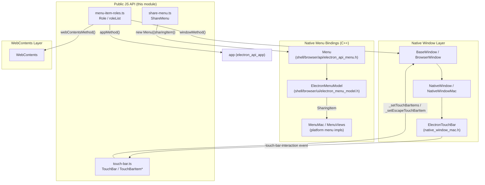
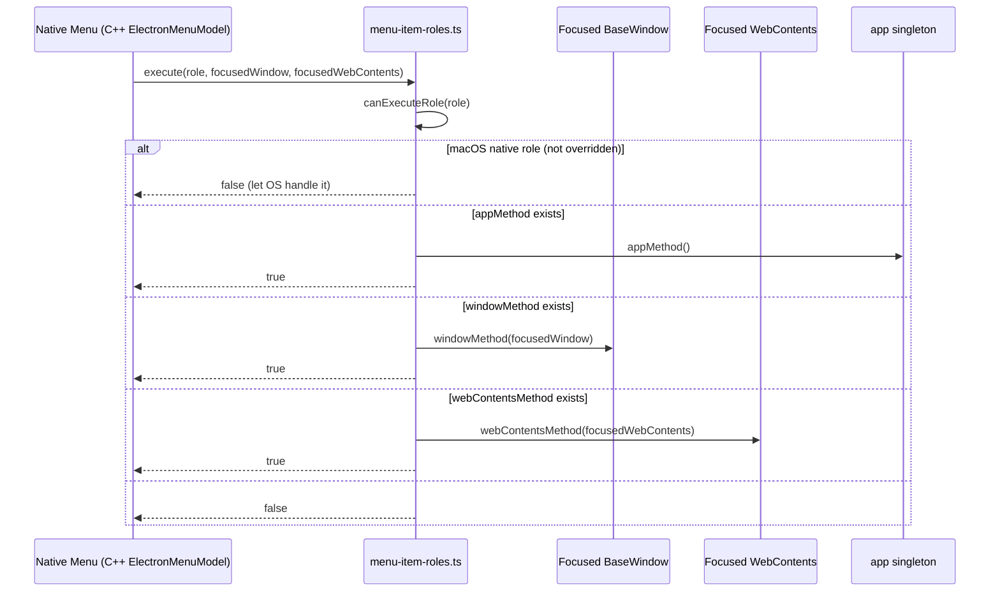
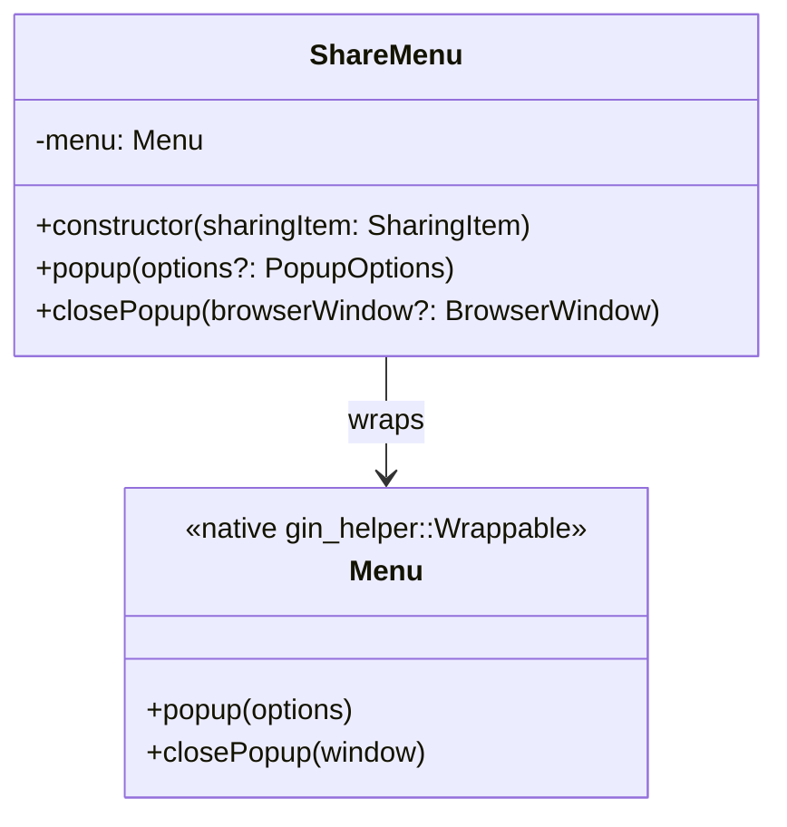
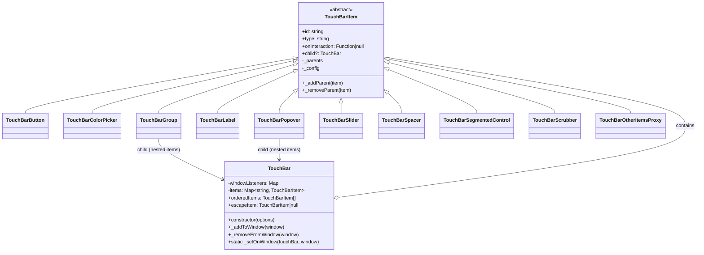
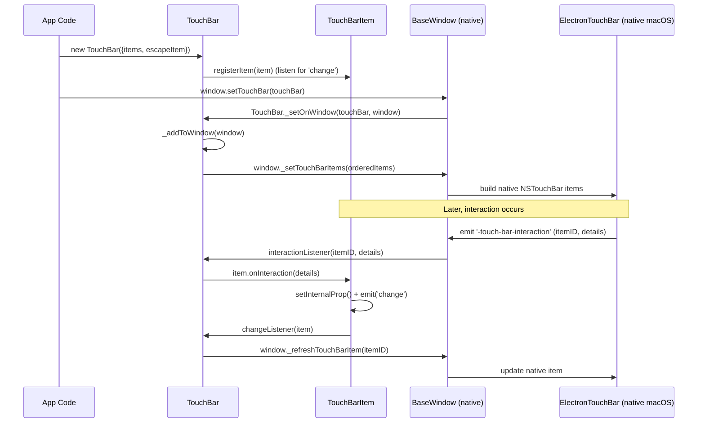
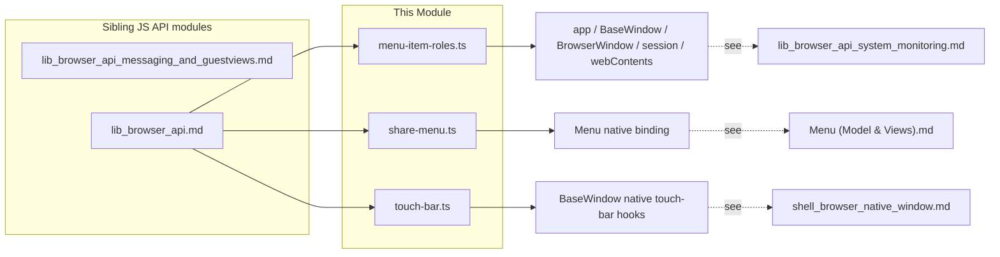

# Browser API: Menu & Sharing (`lib_browser_api_menu_and_sharing`)

## Introduction

This module contains the **JavaScript-side implementations of Electron's menu-related and macOS Touch Bar / sharing APIs** that run in the main (browser) process. It bridges high-level, declarative JS APIs (`Menu`, `MenuItem` roles, `ShareMenu`, `TouchBar`) to the native C++ menu and window infrastructure exposed through Electron's `gin`/native bindings.

Concretely, the module is responsible for:

- **Role-based menu items** (`menu-item-roles.ts`) — defining default labels, accelerators, and behaviors for well-known roles (`copy`, `paste`, `quit`, `toggleDevTools`, submenu templates like `editMenu`/`viewMenu`, etc.) and dispatching role actions to the focused window or web contents.
- **Native sharing UI** (`share-menu.ts`) — a thin `EventEmitter` wrapper (`ShareMenu`) around the native `Menu` class configured with a `SharingItem`, used to show the OS "Share..." menu (primarily on macOS).
- **Touch Bar declarative API** (`touch-bar.ts`) — a rich set of `TouchBarItem` subclasses (`TouchBarButton`, `TouchBarSlider`, `TouchBarGroup`, etc.) plus the `TouchBar` container class that manages item lifecycle, change propagation to native windows, and the `TouchBarOtherItemsProxy` sentinel type used to mark where the OS should insert its own controls.

This module is a child of [lib_browser_api](lib_browser_api.md), which in turn belongs to the broader [Public_JS_API_Bindings](Public_JS_API_Bindings.md) layer. It sits alongside sibling sub-modules [lib_browser_api_system_monitoring](lib_browser_api_system_monitoring.md) and [lib_browser_api_messaging_and_guestviews](lib_browser_api_messaging_and_guestviews.md).

---

## Module Purpose & Scope

| Concern | Component | File |
|---|---|---|
| Menu item role catalog & execution | `Role` / `roleList` | `lib/browser/api/menu-item-roles.ts` |
| Native OS share sheet wrapper | `ShareMenu` | `lib/browser/api/share-menu.ts` |
| macOS Touch Bar declarative model | `TouchBar`, `TouchBarItem` subclasses, `TouchBarOtherItemsProxy` | `lib/browser/api/touch-bar.ts` |

These three files together implement the **desktop menu & sharing surface** of Electron's public JS API (`Menu`, `MenuItem`, `ShareMenu`, `TouchBar`), which is consumed by application code through `electron/main`.

---

## Architecture Overview

---

## 1. Menu Item Roles (`menu-item-roles.ts`)

### Purpose

Provides the **default behavior catalog** for `MenuItem`'s `role` property. Every role (e.g. `'copy'`, `'quit'`, `'toggleDevTools'`, `'editMenu'`) is described by a `Role` descriptor object containing:

- `label` — default text (can be a dynamic getter, e.g. based on `app.name` or platform).
- `accelerator` — default keyboard shortcut.
- `checked` — for checkbox-like roles (e.g. `togglespellchecker`).
- `windowMethod` / `webContentsMethod` / `appMethod` — the actual action, dispatched against the focused `BaseWindow`, focused `WebContents`, or the `app` singleton respectively.
- `registerAccelerator` — whether Electron should globally register the accelerator (disabled for roles like `copy`/`cut`/`paste` which rely on native OS text-editing shortcuts).
- `nonNativeMacOSRole` — marks roles that must be manually implemented on macOS because Cocoa does not provide a native equivalent (e.g. `reload`, `toggleDevTools`, `zoomIn`).
- `submenu` — for composite roles like `appMenu`, `fileMenu`, `editMenu`, `viewMenu`, `windowMenu`, `shareMenu`, which expand into a list of `MenuItemConstructorOptions`.

### Key Exports

| Function | Responsibility |
|---|---|
| `getDefaultType(role)` | Returns `'checkbox'` if the role has a `checked` state, else `'normal'`. |
| `getDefaultLabel(role)` | Returns the role's label (supports dynamic getters). |
| `getCheckStatus(role)` | Returns the current `checked` value. |
| `shouldOverrideCheckStatus(role)` | Whether the role defines its own checked semantics. |
| `getDefaultAccelerator(role)` | Returns the default accelerator string. |
| `shouldRegisterAccelerator(role)` | Whether Electron should register the accelerator globally. |
| `getDefaultSubmenu(role)` | Returns (and null-filters) the submenu template for composite roles. |
| `execute(role, focusedWindow, focusedWebContents)` | Dispatches the role's action; returns `true`/`false` whether it executed. |

These functions are called from the native `Menu`/`MenuItem` C++ bindings (via V8/gin) when constructing menu items and when a menu command is triggered, to fill in defaults that were not explicitly overridden by application code, and to execute native-side role behavior that Cocoa doesn't handle automatically (`nonNativeMacOSRole`).

### Execution Flow

`canExecuteRole` ensures that on macOS, roles that Cocoa implements natively (i.e. not flagged `nonNativeMacOSRole`) are *not* executed in JS — the OS handles them via `NSApplication`/`NSMenu` automatically.

### Platform Sensitivity

The role table branches heavily on `process.platform` (`isMac`, `isWindows`, `isLinux`):
- `about` shows a native panel via `appMethod` only on Windows/Linux (macOS handles it natively).
- `quit` label and accelerator vary per-OS.
- `editmenu`/`windowmenu` submenus differ between macOS and other platforms (Substitutions/Speech submenus, "Bring All to Front" vs "Close").

### Integration Points

- Depends on `app`, `BaseWindow`, `BrowserWindow`, `session`, `webContents` from `electron/main` — see [lib_browser_api_system_monitoring](lib_browser_api_system_monitoring.md) and window/session native modules such as [shell_browser_api_window_ui](shell_browser_api_window_ui.md) and [shell_browser_api_session_net](shell_browser_api_session_net.md).
- Consumed by the native `Menu`/`MenuItem` binding layer (`shell/browser/api/electron_api_menu.h::Menu`) documented in [Menu_(Model_&_Views)](Menu_%28Model_%26_Views%29.md).

---

## 2. Share Menu (`share-menu.ts`)

### Purpose

`ShareMenu` is Electron's public `Electron.ShareMenu` implementation. It is a minimal `EventEmitter` wrapper that delegates all real work to the native `Menu` class, constructed with a special `sharingItem` option.

### How it Works

1. On construction, `ShareMenu` instantiates a native `Menu` object (`shell/browser/api/electron_api_menu.h::Menu`) passing `{ sharingItem }` as its constructor argument.
2. The native `Menu` constructor recognizes the `sharingItem` option and stores it on the underlying `ElectronMenuModel` (`SetSharingItem`), which is a macOS-only concept (`ElectronMenuModel::SharingItem` holds `texts`, `urls`, or `file_paths`).
3. `popup()`/`closePopup()` simply forward to the native menu's own `popup`/`closePopup` methods, which — on macOS — open the OS's native `NSSharingServicePicker`-backed menu via `MenuMac`.

### Relationship to Native Menu Model

`ElectronMenuModel::Delegate::GetSharingItemForCommandId` (implemented by the native `Menu` class) is what allows individual menu commands to carry `SharingItem` payloads, but for `ShareMenu` the entire menu itself is a "share" menu rather than an individual item — set once via the constructor.

See [Menu_(Model_&_Views)](Menu_%28Model_%26_Views%29.md) for the full native menu model documentation (`ElectronMenuModel`, `Menu`, `MenuMac`, `MenuViews`).

---

## 3. Touch Bar (`touch-bar.ts`)

### Purpose

Implements Electron's declarative **macOS Touch Bar API** (`Electron.TouchBar`) entirely in JS/TS, using decorators to define reactive (`LiveProperty`) and one-time (`ImmutableProperty`) fields on each `TouchBarItem` subtype. Changes to live properties automatically emit `'change'` events that propagate up to the owning `TouchBar`, which in turn notifies the native window to refresh the corresponding native NSTouchBar item.

### Component Model

### Property Decorators

- **`ImmutableProperty`** — computed once at construction from the item's config (e.g. `type`, `id`, `onInteraction` callback wrapper). Read-only afterward; attempting to set throws.
- **`LiveProperty`** — computed at construction but also settable afterward; setting triggers an optional `onMutate` hook and emits a `'change'` event on the item, which bubbles up through `TouchBar.changeListener` to the owning native window.

This pattern lets consumers do `button.label = 'New Label'` and have the Touch Bar update immediately without re-creating the whole bar.

### `TouchBarOtherItemsProxy` (Core Component)

A minimal `TouchBarItem<null>` subtype whose `type` is `'other_items_proxy'` and which never produces interaction events (`onInteraction = null`). It acts as a **placeholder marker**: when included in a `TouchBar`'s item list, it tells macOS where to render its own automatically-generated controls (e.g. system password/autofill suggestions) relative to the app's custom items. `TouchBar`'s constructor enforces that **at most one** `OtherItemsProxy` exists per bar.

### Item Lifecycle & Window Binding

### Nested Items (`TouchBarGroup` / `TouchBarPopover`)

Both `TouchBarGroup` and `TouchBarPopover` have a `child` property that is itself a `TouchBar` (built automatically from an `items` array if not already a `TouchBar`). The parent `TouchBar`'s `registerItem` recursively registers nested items so their `'change'` events also propagate correctly, and `_addParent`/`_removeParent` maintain back-references for future extensions.

### Escape Item

`TouchBar.escapeItem` is a special single item shown in the Touch Bar's leftmost ("escape key") region. Setting it triggers `'escape-item-change'`, which — when the bar is attached to a window — calls `window._setEscapeTouchBarItem(item)` on the native side.

### Native Counterpart

The native macOS Touch Bar host object is `ElectronTouchBar` (`shell/browser/native_window_mac.h`), which receives the JS-built item list via `_setTouchBarItems`/`_refreshTouchBarItem`/`_setEscapeTouchBarItem` native bindings on `BaseWindow`, and translates them into real `NSTouchBarItem` instances. See [shell_browser_native_window](shell_browser_native_window.md) for `NativeWindowMac` / `ElectronTouchBar` details.

---

## Cross-Module Dependencies

## Relationship to the Wider System

- **Parent module:** [lib_browser_api](lib_browser_api.md) — aggregates all browser-process JS API surface files (menus, sharing, touch bar, messaging, power monitor, guest views).
- **Grandparent module:** [Public_JS_API_Bindings](Public_JS_API_Bindings.md) — the overall public JS/TS API layer exposed to Electron application developers, spanning both browser and renderer processes.
- **Native counterparts:**
  - Menu/role execution → native `Menu`, `ElectronMenuModel`, `MenuMac`, `MenuViews` in [Menu_(Model_&_Views)](Menu_%28Model_%26_Views%29.md).
  - Touch Bar native host → `NativeWindowMac`/`ElectronTouchBar` in [shell_browser_native_window](shell_browser_native_window.md).
  - Window/WebContents targets for role actions → [shell_browser_api_window_ui](shell_browser_api_window_ui.md) and [shell_browser_api_webcontents](shell_browser_api_webcontents.md).
  - `gin_helper` infrastructure underlying the native `Menu` wrappable class → [Gin_Helper](Gin_Helper.md).

---

## Summary

| File | Exports | Role |
|---|---|---|
| `menu-item-roles.ts` | `roleList`, `getDefaultType`, `getDefaultLabel`, `getCheckStatus`, `shouldOverrideCheckStatus`, `getDefaultAccelerator`, `shouldRegisterAccelerator`, `getDefaultSubmenu`, `execute` | Central catalog of built-in `MenuItem` role behavior and defaults, dispatched to window/webContents/app. |
| `share-menu.ts` | `ShareMenu` (default) | JS wrapper exposing `Electron.ShareMenu`, delegating to native `Menu` configured with a `SharingItem`. |
| `touch-bar.ts` | `TouchBar` (default), including static nested classes `TouchBarButton`, `TouchBarColorPicker`, `TouchBarGroup`, `TouchBarLabel`, `TouchBarPopover`, `TouchBarSlider`, `TouchBarSpacer`, `TouchBarSegmentedControl`, `TouchBarScrubber`, `TouchBarOtherItemsProxy` | Declarative, reactive Touch Bar item model with native window binding for macOS Touch Bar support. |

This module has no direct external runtime dependencies beyond Node's `events.EventEmitter` and Electron's own `electron/main` module surface; all heavy lifting (actual OS UI rendering) is delegated to native C++ bindings documented in the linked modules above.
