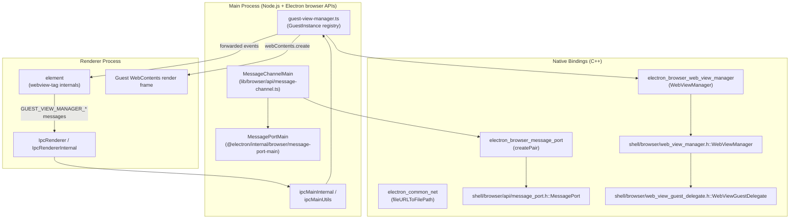
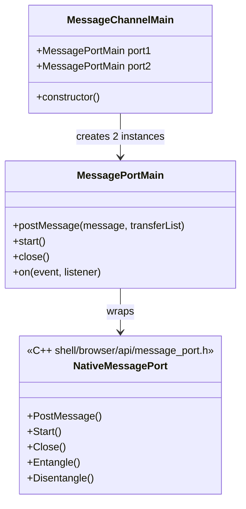
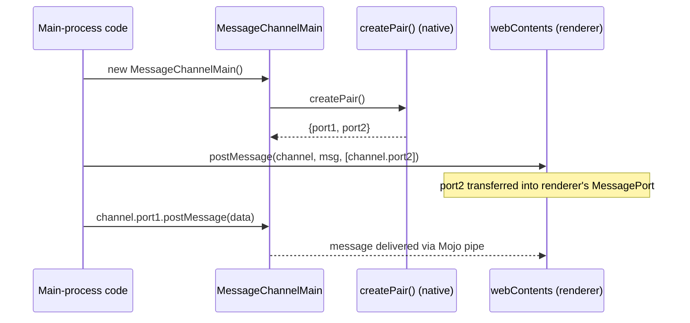
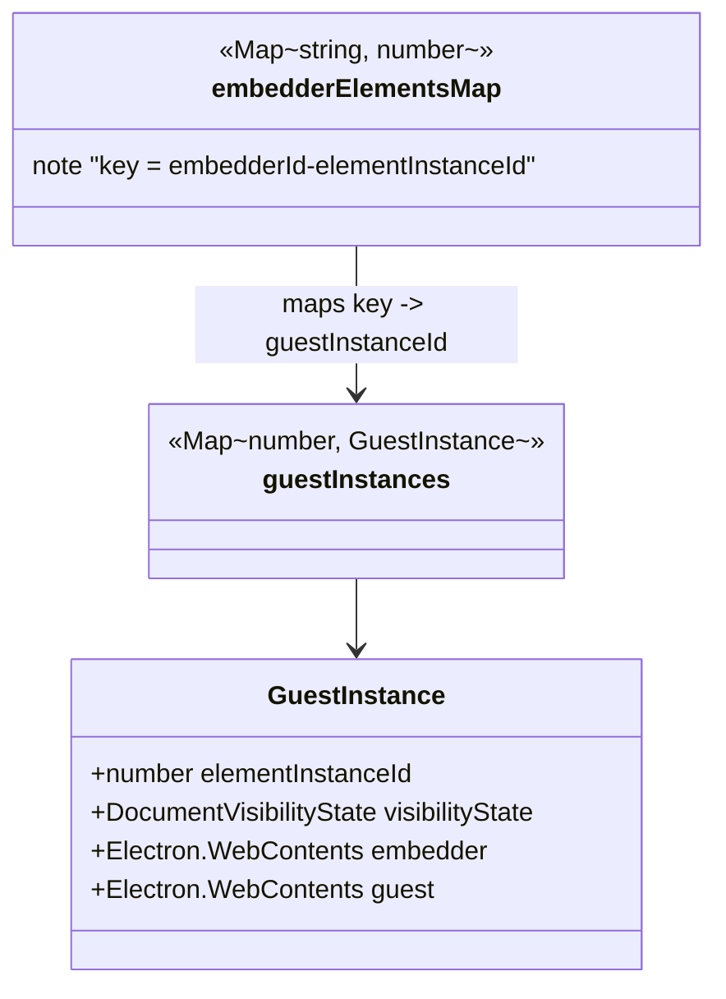
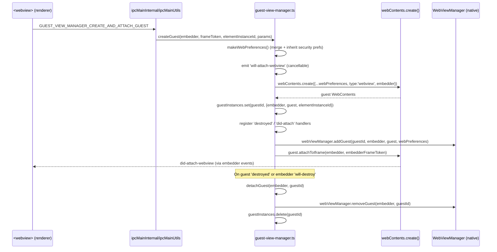
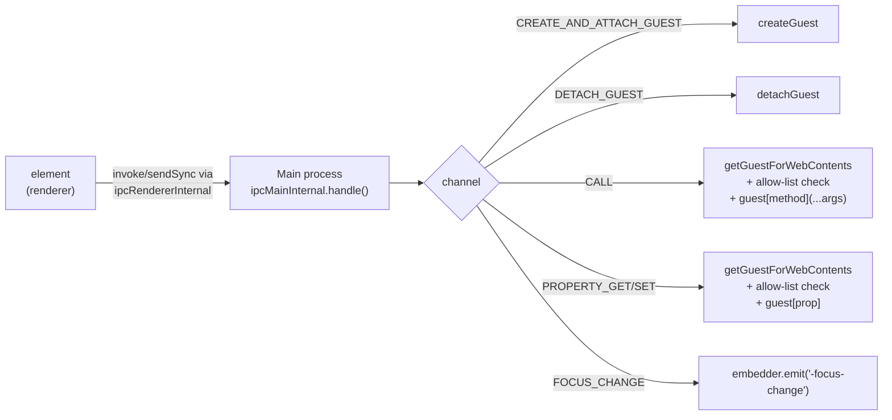
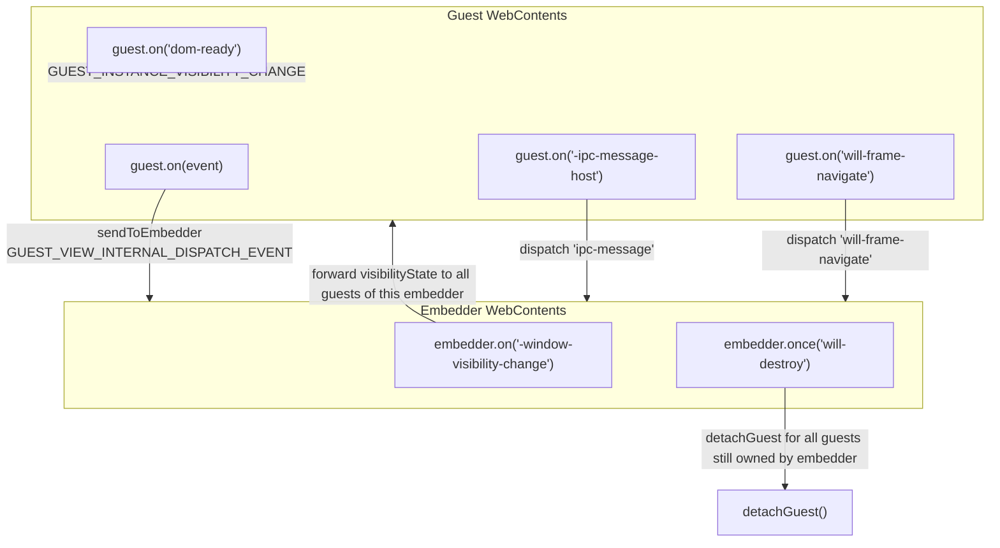
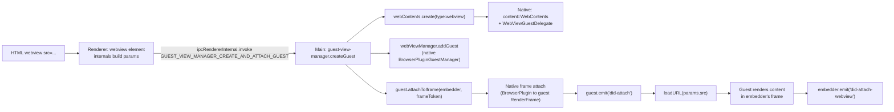
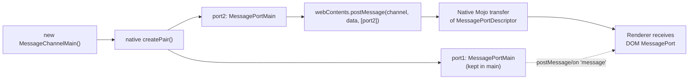

# Browser API: Messaging & GuestViews

## Introduction

This module is the browser-process (main process) implementation of two closely related pieces of Electron's inter-context communication infrastructure:

1. **`MessageChannelMain`** — the main-process counterpart of the Web `MessageChannel`/`MessagePort` API, exposed to Electron users as `electron.MessageChannelMain`. It allows the main process to create a pair of entangled `MessagePortMain` objects that can be transferred to renderers, utility processes, or kept in the main process, enabling zero-copy, structured-clone based messaging channels independent of the regular `ipcMain`/`ipcRenderer` channel.

2. **The GuestView Manager** (`lib/browser/guest-view-manager.ts`) — the main-process orchestrator for the legacy `<webview>` tag. It manages the full lifecycle of "guest" `WebContents` instances embedded inside a host ("embedder") `WebContents`, mediates IPC calls made by the `<webview>` element in the renderer (method calls, property access, attach/detach, focus changes), and forwards guest events back to the embedder.

Both components live under `lib/browser/api/` and `lib/browser/` respectively and are part of the broader [Public JS API Bindings](lib_browser_api.md) surface that Electron exposes from the browser process. They rely heavily on native bindings (`process._linkedBinding(...)`) that bridge into the C++ implementation described in [WebContents Rendering & Communication](shell_browser_api_webcontents.md) and its `Web_View` sub-area.

---

## Table of Contents

- [Purpose & Scope](#purpose--scope)
- [Architecture Overview](#architecture-overview)
- [Component: MessageChannelMain](#component-messagechannelmain)
- [Component: GuestView Manager](#component-guestview-manager)
  - [Guest Lifecycle](#guest-lifecycle)
  - [IPC Surface](#ipc-surface)
  - [Event Forwarding](#event-forwarding)
  - [Security Model](#security-model)
- [Data Flow Diagrams](#data-flow-diagrams)
- [Relationship to Other Modules](#relationship-to-other-modules)
- [Key Design Notes](#key-design-notes)

---

## Purpose & Scope

| Concern | Component | Description |
|---|---|---|
| Structured message-port channels | `MessageChannelMain` | Creates a pair of `MessagePortMain` instances backed by a native Mojo `MessagePort` pair, usable for direct main↔renderer or renderer↔renderer (via transfer) messaging without going through `ipcMain`. |
| `<webview>` tag lifecycle | `guest-view-manager.ts` | Creates, attaches, detaches, and destroys guest `WebContents` on behalf of embedder `WebContents`; validates and dispatches all `<webview>`-originated IPC. |

Both are **browser-process-only** modules (they execute in the Electron main process) and are loaded internally as part of Electron's bootstrap of built-in modules — they are not typically constructed directly by user code except via the public `MessageChannelMain` constructor.

## Architecture Overview

---

## Component: MessageChannelMain

### Location
`lib/browser/api/message-channel.ts`

### Responsibility
`MessageChannelMain` is a thin JS wrapper that:
1. Calls the native `createPair()` function exposed by the `electron_browser_message_port` linked binding.
2. Wraps each native port half in a `MessagePortMain` (a `gin_helper`-wrapped object backed by [`shell/browser/api/message_port.h::MessagePort`](shell_browser_api_webcontents.md)).
3. Exposes `port1` and `port2` as public properties, matching the Web platform's `MessageChannel` shape (`port1`/`port2`), but scoped to the main process (`MessagePortMain` rather than DOM `MessagePort`).

### Usage Pattern (conceptual)

Because the ports are backed directly by Blink/Mojo `MessagePortDescriptor`/`MessagePortChannel` primitives (see `MessagePort::Entangle`/`Disentangle` in the native header), messages sent over `MessageChannelMain` bypass the `ipcMain`/`ipcRenderer` event bus entirely, offering lower overhead and structured-clone semantics for transferable objects.

**Related modules:**
- Renderer-side IPC primitives that this complements: [Renderer Process IPC](lib_renderer_ipc.md) (`IpcRenderer`, `IpcRendererInternal`).
- Native message port implementation and Gin wrapping conventions: [Common Native Gin Infrastructure](Gin_Helper.md).
- Utility process channel handling that also uses `MessagePort`-style connectors: [System & App-Level Services API](shell_browser_api_system_device.md) (`electron_api_utility_process.h::Connector`).

---

## Component: GuestView Manager

### Location
`lib/browser/guest-view-manager.ts`

### Responsibility

The GuestView Manager is the main-process brain behind the `<webview>` tag. The `<webview>` tag itself is rendered/managed on the renderer side (webview element + preload internals), but every privileged operation — creating the actual guest `WebContents`, attaching it to the embedder's frame, exposing method/property access, and tearing it down — is mediated here for security and lifecycle-correctness reasons.

Internally it maintains two registries:

- `guestInstances`: `guestInstanceId -> GuestInstance` — tracks every live guest, its embedder, and the `<webview>` element instance that owns it.
- `embedderElementsMap`: `"<embedderId>-<elementInstanceId>" -> guestInstanceId` — used to detect and detach a stale guest when a `<webview>` element is re-attached (e.g., `src` changed causing element re-creation).

### Guest Lifecycle

Key steps performed by `createGuest`:
1. **`makeWebPreferences`** — builds the guest's `WebPreferences` from the `<webview>` element's HTML attributes (`nodeintegration`, `plugins`, `partition`, `preload`, `webpreferences`, etc.), then forcibly re-inherits a fixed set of security-critical preferences (`contextIsolation`, `nodeIntegration`, `sandbox`, `enableWebSQL`, ...) from the embedder whenever the embedder itself has those preferences at their secure default — preventing a compromised or malicious `<webview>` configuration from escalating privileges beyond its embedder.
2. **`will-attach-webview` event** — emitted on the embedder `WebContents`; if `event.preventDefault()` is called, guest creation aborts (returns `-1`).
3. **Guest creation** — `webContents.create()` is invoked with `type: 'webview'` and `embedder` set, producing a full new `WebContents` (see [WebContents Rendering & Communication](shell_browser_api_webcontents.md)).
4. **Event/IPC wiring** — the guest's lifecycle and IPC events are wired to forward to the embedder (see [Event Forwarding](#event-forwarding)).
5. **Stale guest cleanup** — if the same `<webview>` element (`embedderId-elementInstanceId`) previously pointed to a different guest, that old guest is detached from its outer frame.
6. **Native registration** — `webViewManager.addGuest(...)` registers the guest/embedder pair with the native [`WebViewManager`](shell_browser_api_webcontents.md) (a `content::BrowserPluginGuestManager`), and `guest.attachToIframe(...)` performs the actual frame attachment, which is backed by native [`WebViewGuestDelegate`](shell_browser_api_webcontents.md).

### IPC Surface

The manager registers handlers for a fixed set of `IPC_MESSAGES.GUEST_VIEW_MANAGER_*` channels (defined in the shared `common/ipc-messages` module), all funneled exclusively through **internal** IPC (`ipcMainInternal` / `ipcMainUtils`), never the public `ipcMain`:

| Channel | Type | Purpose |
|---|---|---|
| `GUEST_VIEW_MANAGER_CREATE_AND_ATTACH_GUEST` | `handle` (async invoke) | Create a new guest and attach it to the embedder's iframe. |
| `GUEST_VIEW_MANAGER_DETACH_GUEST` | `handleSync` | Detach (and clean up) a guest by id. |
| `GUEST_VIEW_MANAGER_FOCUS_CHANGE` | `on` (fire-and-forget) | Notify embedder of `<webview>` focus changes (`-focus-change`). |
| `GUEST_VIEW_MANAGER_CALL` | `handle` + `handleSync` | Invoke an async or sync method on the guest `WebContents` (e.g., `loadURL`, `reload`, `goBack`). Method name is checked against `asyncMethods`/`syncMethods` allow-lists from `common/web-view-methods`. History-related sync methods are redirected to `guest.navigationHistory`. |
| `GUEST_VIEW_MANAGER_PROPERTY_GET` / `_SET` | `handleSync` | Get/set a property on the guest `WebContents`, validated against a `properties` allow-list. |

All handlers are wrapped by `makeSafeHandler`, which:
- Rejects any invocation whose `event.type !== 'frame'` (i.e., blocks calls from non-frame contexts such as service workers).
- Verifies the calling `WebContents` has `webviewTag` enabled (`isWebViewTagEnabled`, cached in a `WeakMap`); otherwise logs an error and throws `<webview> disabled`.

`getGuestForWebContents` provides an additional access-control check: it verifies that `guestInstance.guest.hostWebContents === contents` — i.e., only the actual embedder that owns a guest may call methods/properties on it, or detach it. This prevents one `<webview>`'s embedder from manipulating another's guest by guessing/reusing a `guestInstanceId`.

### Event Forwarding

Two forwarding mechanisms exist:

1. **Guest → Embedder event dispatch.** For every event name in `webViewEvents` (from `common/web-view-events`), the manager subscribes on the guest and re-emits to the embedder via `IPC_MESSAGES.GUEST_VIEW_INTERNAL_DISPATCH_EVENT` on a per-guest channel suffixed with `viewInstanceId`. Event arguments are mapped into a named-properties object using the `webViewEvents[eventKey]` positional-to-name mapping.
2. **Guest IPC ('-ipc-message-host') & navigation events.** `ipcRenderer.sendToHost()` calls made from inside the guest surface as the internal `-ipc-message-host` event, which is forwarded to the embedder as an `ipc-message` guest-view event carrying `{ frameId, channel, args }`. `will-frame-navigate` is forwarded similarly with URL/frame metadata.
3. **Visibility propagation.** `watchEmbedder` subscribes to the embedder's `-window-visibility-change` event (once per embedder) and forwards the `visibilityState` to every guest owned by that embedder via `IPC_MESSAGES.GUEST_INSTANCE_VISIBILITY_CHANGE`. On `dom-ready`, a guest is proactively sent its last known visibility state (a workaround noted in-code for electron/electron#6828).

### Security Model

- **Preference inheritance lock:** critical isolation-related preferences cannot be relaxed by `<webview>` attributes beyond what the embedder itself allows (see `inheritedWebPreferences` map in `makeWebPreferences`).
- **`webviewTag` gating:** every IPC entrypoint checks `isWebViewTagEnabled` on the *caller's* `WebContents`, derived from `getLastWebPreferences().webviewTag`.
- **Frame-origin enforcement:** `getGuestForWebContents` ties every guest to its actual `hostWebContents`, preventing cross-embedder guest hijacking.
- **Cancellable creation:** `will-attach-webview` lets embedder-side (trusted, main-process) code veto guest creation before any native resources are allocated.
- **Method/property allow-lists:** `asyncMethods`, `syncMethods`, `properties`, and `navigationHistorySyncMethods` (from `common/web-view-methods`) constrain the IPC-callable surface of a guest `WebContents`, preventing arbitrary method invocation from the renderer.

---

## Data Flow Diagrams

### End-to-end `<webview>` creation to first paint

### MessageChannelMain transfer to renderer

---

## Relationship to Other Modules

| Related Module | Relationship |
|---|---|
| [Public JS API Bindings](lib_browser_api.md) | Parent grouping; sibling API modules such as `power-monitor`, `share-menu`, `menu-item-roles` live alongside these components. |
| [Renderer Process IPC](lib_renderer_ipc.md) | Provides `IpcRenderer`/`IpcRendererInternal`, the renderer-side counterparts used by the `<webview>` tag internals and by any code that transfers `MessagePortMain` ports to a renderer `MessagePort`. |
| [WebContents Rendering & Communication](shell_browser_api_webcontents.md) | Supplies `webContents.create()`, `attachToIframe`, native `MessagePort`, and the `message_port.h` implementation wrapped by `MessagePortMain`. Also supplies the native `WebViewManager` and `WebViewGuestDelegate` used to back guest attach/detach. |
| [Extensions Subsystem](shell_browser_extensions_core.md) | `ElectronGuestViewManagerDelegate` / `ElectronMimeHandlerViewGuestDelegate` (in `electron_extensions_api_client.cc`) integrate the same guest-view concepts for extension `<webview>`/MimeHandler use cases, sharing lifecycle patterns with this module. |
| [Common Native Gin Infrastructure](Gin_Helper.md) | `MessagePort` native class is a `gin_helper::DeprecatedWrappable` + `CleanedUpAtExit`; understanding Gin wrapping conventions clarifies how `MessagePortMain` is exposed to JS. |
| [System & App-Level Services API](shell_browser_api_system_device.md) | `electron_api_utility_process.h::Connector` demonstrates another consumer of the Mojo connector/message-port pattern used for `UtilityProcess` communication. |

---

## Key Design Notes

- **Internal-IPC only:** Both the GuestView manager's control channel and its underlying transport (`ipcMainInternal`, `ipcMainUtils`) are intentionally distinct from the public `ipcMain`, ensuring user code cannot spoof `<webview>` control messages by sending to well-known channel names.
- **No direct construction of guest state from renderer:** All `GuestInstance` fields are populated and mutated only in the main process; the renderer only ever passes an `elementInstanceId` and attribute-derived `params`.
- **WeakMap-based caching:** `isWebViewTagEnabledCache` avoids repeatedly reading `getLastWebPreferences()` for every IPC call from the same `WebContents`.
- **Single native registration point:** All guest bookkeeping funnels through one native `webViewManager` linked binding instance per process, keeping the C++ `BrowserPluginGuestManager` mapping (`guest_instance_id -> {web_contents, embedder}`) in sync with the JS-side `guestInstances` map.
- **`MessageChannelMain` is stateless beyond port creation:** unlike the guest-view manager, it holds no process-wide registry — each instance is independent and garbage-collected normally once both ports are unreferenced and closed.
