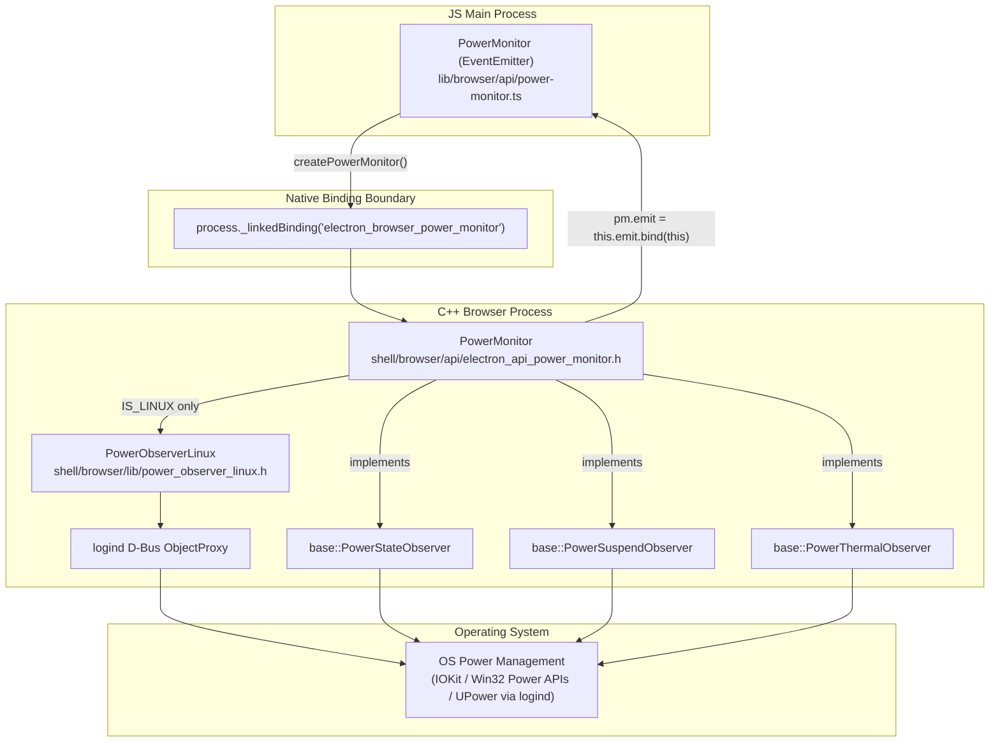
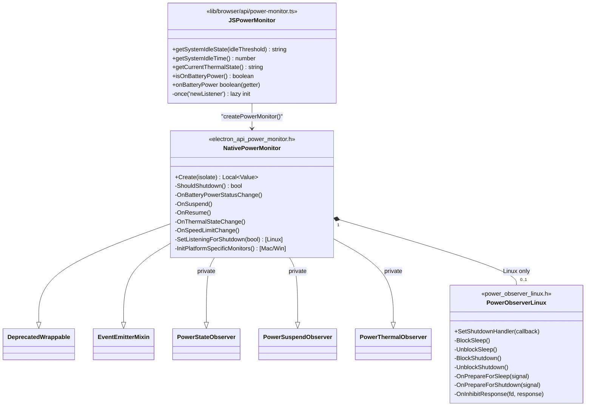
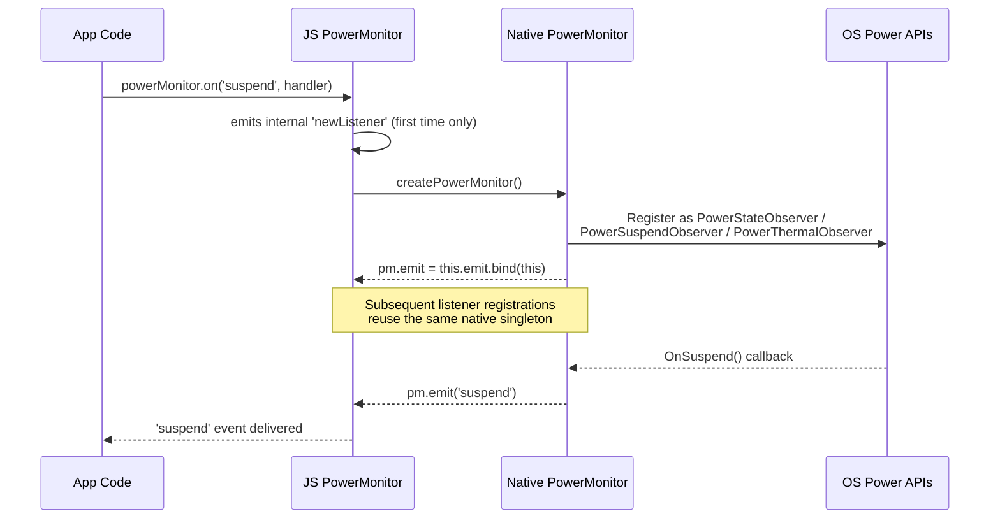
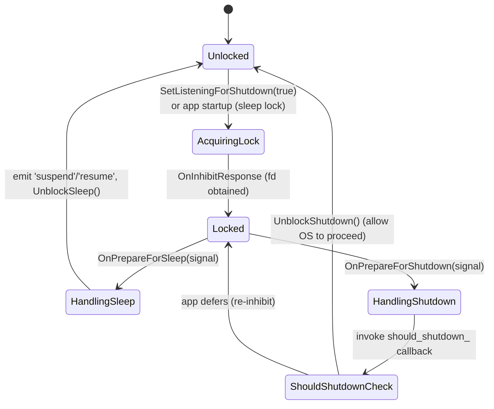
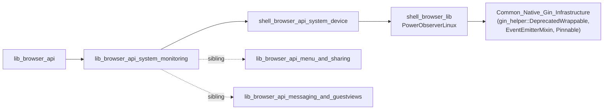

# System Monitoring Module (`PowerMonitor`)

## Introduction

The **System Monitoring** module exposes Electron's `powerMonitor` API to the main-process JavaScript environment. It is a thin, lazily-initialized `EventEmitter` wrapper (`lib/browser/api/power-monitor.ts`) around a native C++ singleton (`shell/browser/api/electron_api_power_monitor.h::PowerMonitor`) that hooks into the operating system's power-management subsystems (battery status, suspend/resume, thermal state, and — on Linux — `logind`/D-Bus shutdown/sleep inhibition).

This module is a direct child of [lib_browser_api](lib_browser_api.md) and is a sibling of [lib_browser_api_menu_and_sharing](lib_browser_api_menu_and_sharing.md) and [lib_browser_api_messaging_and_guestviews](lib_browser_api_messaging_and_guestviews.md). Its native counterpart lives alongside other system/app-level services documented in [shell_browser_api_system_device](shell_browser_api_system_device.md), and its Linux-specific D-Bus integration is documented in [shell_browser_lib](shell_browser_lib.md) (`PowerObserverLinux`).

---

## Purpose & Core Functionality

`powerMonitor` allows Electron apps to:

- Query **system idle time/state** (`getSystemIdleTime`, `getSystemIdleState`)
- Query **battery status** (`isOnBatteryPower`, `onBatteryPower` getter)
- Query **thermal state** (`getCurrentThermalState`)
- Subscribe to **power lifecycle events**: `suspend`, `resume`, `on-ac`, `on-battery`, `shutdown`, `lock-screen`, `unlock-screen`, `thermal-state-change`, `speed-limit-change`
- On Linux, **participate in the shutdown sequence** by inhibiting `logind` shutdown/sleep until the app explicitly allows it (used to support the `shutdown` event and graceful app termination).

---

## Architecture Overview

The module spans two layers:

1. **JS Layer (`lib/browser/api/power-monitor.ts`)** — a singleton `EventEmitter` subclass, `PowerMonitor`, exported as `module.exports = new PowerMonitor()`. It binds to a native object created via `process._linkedBinding('electron_browser_power_monitor')`.
2. **Native Layer (`shell/browser/api/electron_api_power_monitor.h`)** — a `gin_helper`-wrapped C++ singleton that implements `base::PowerStateObserver`, `base::PowerSuspendObserver`, and `base::PowerThermalObserver` from `//base/power_monitor`, translating OS callbacks into JS-emittable events. On Linux, it composes a `PowerObserverLinux` instance to talk to `logind` over D-Bus.

---

## Component Relationships

---

## Lifecycle & Lazy Initialization

To avoid starting OS-level power monitors before the Electron app is ready (and before any consumer actually cares), the JS wrapper defers native initialization until the **first** listener is attached to any event:

Key points:
- The native object's `emit` function is **rebound** to the JS `EventEmitter`'s `emit`, so all native-originated events (`suspend`, `resume`, `on-ac`, `on-battery`, `thermal-state-change`, `speed-limit-change`, `shutdown`, `lock-screen`/`unlock-screen`) surface directly as standard Node.js events on the exported `powerMonitor` singleton.
- Initialization happens once, guarded by `EventEmitter.once('newListener', ...)`.

---

## Platform-Specific Behavior

### macOS / Windows
The native `PowerMonitor::InitPlatformSpecificMonitors()` hooks directly into IOKit (macOS) or Win32 power notification APIs (Windows) through Chromium's `base::PowerMonitor` observer interfaces — no additional inhibition logic is required, since these platforms provide native OS hooks for graceful shutdown/sleep handling.

### Linux — Shutdown/Sleep Inhibition via `logind`

Linux lacks a synchronous "will you allow shutdown?" callback comparable to mac/Windows, so Electron implements its own **inhibitor lock** protocol against `systemd-logind` over D-Bus, encapsulated in `PowerObserverLinux` (see [shell_browser_lib](shell_browser_lib.md)):

- `PowerObserverLinux` connects to the `logind` D-Bus service (`OnLoginServiceAvailable`), acquires `Inhibit` locks for `sleep` and/or `shutdown` (`BlockSleep`/`BlockShutdown`), and listens for `PrepareForSleep`/`PrepareForShutdown` signals.
- The native `PowerMonitor::SetListeningForShutdown(bool)` is called by the JS layer whenever listener counts on the `'shutdown'` event change (added on `newListener`/`removeListener` for that specific event name), so the D-Bus inhibitor is only held while the app actually has a `shutdown` handler registered — this keeps native resource usage (`sleep_lock_`, `shutdown_lock_` file descriptors) minimal.
- `PowerMonitor::ShouldShutdown()` is invoked as the `should_shutdown_` callback passed to `PowerObserverLinux::SetShutdownHandler`, allowing the app's JS `shutdown` listener chain to influence whether the OS shutdown proceeds.

---

## Public API Surface (JS)

| Member | Type | Description |
|---|---|---|
| `getSystemIdleState(idleThreshold)` | method | Returns `'active' \| 'idle' \| 'locked' \| 'unknown'` based on idle threshold (seconds). |
| `getSystemIdleTime()` | method | Returns seconds since last user input. |
| `getCurrentThermalState()` | method | Returns current OS-reported thermal state. |
| `isOnBatteryPower()` | method | Returns `true` if running on battery. |
| `onBatteryPower` | getter | Convenience alias for `isOnBatteryPower()`. |
| `'suspend'` | event | OS is suspending. |
| `'resume'` | event | OS resumed from suspend. |
| `'on-ac'` / `'on-battery'` | events | Power source changed. |
| `'thermal-state-change'` | event | OS thermal state changed. |
| `'speed-limit-change'` | event | CPU speed limit changed (thermal throttling). |
| `'shutdown'` | event (Linux/mac) | OS is shutting down; app may delay via handler logic. |

All native calls (`createPowerMonitor`, `getSystemIdleState`, `getSystemIdleTime`, `getCurrentThermalState`, `isOnBatteryPower`) are resolved through `process._linkedBinding('electron_browser_power_monitor')`, which resolves to the native `PowerMonitor::Create` factory registered as part of Electron's context-aware native module set (see [shell_browser_api_system_device](shell_browser_api_system_device.md) for how this binding is registered alongside other system/app-level native APIs like `app`, `screen`, and `systemPreferences`).

---

## Dependency & Integration Summary

- **Parent module**: [lib_browser_api](lib_browser_api.md) — aggregates all browser-process JS API bindings.
- **Native counterpart & sibling APIs**: [shell_browser_api_system_device](shell_browser_api_system_device.md) — houses the C++ `PowerMonitor`, `App`, `Screen`, `SystemPreferences`, and other system-level `gin_helper::Wrappable` classes exposed through the same native binding mechanism.
- **Linux D-Bus integration**: [shell_browser_lib](shell_browser_lib.md) — provides `PowerObserverLinux`, the `logind` inhibitor implementation consumed exclusively on `BUILDFLAG(IS_LINUX)`.
- **Underlying wrapping infrastructure**: [Gin_Helper](Gin_Helper.md) (part of [Common_Native_Gin_Infrastructure](Common_Native_Gin_Infrastructure.md)) — supplies `DeprecatedWrappable`, `EventEmitterMixin`, and related plumbing used by the native `PowerMonitor` class to expose itself as a JS-visible `EventEmitter`-compatible object.
