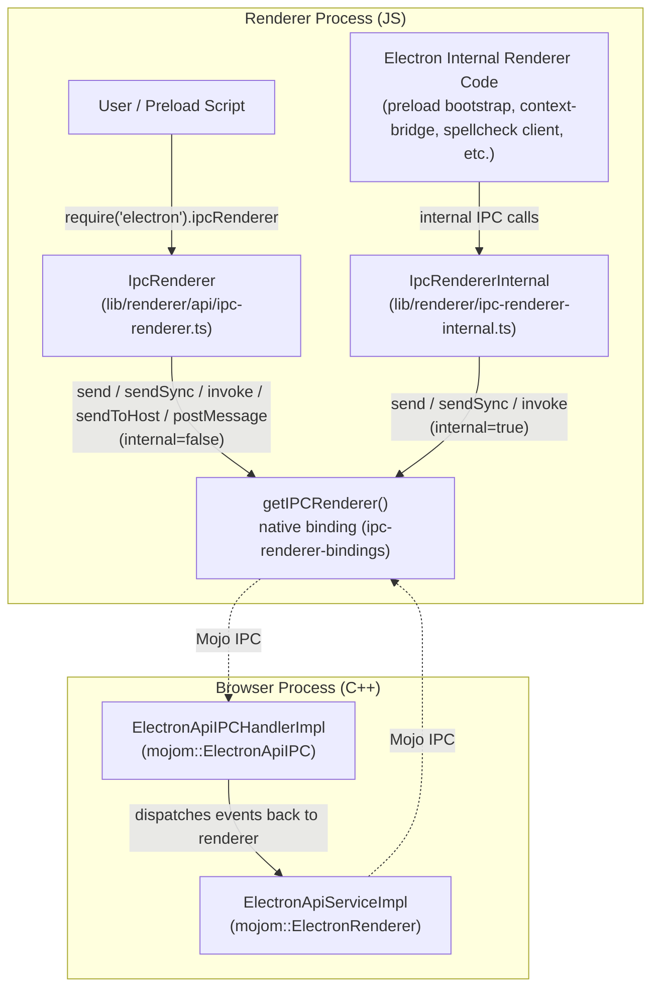
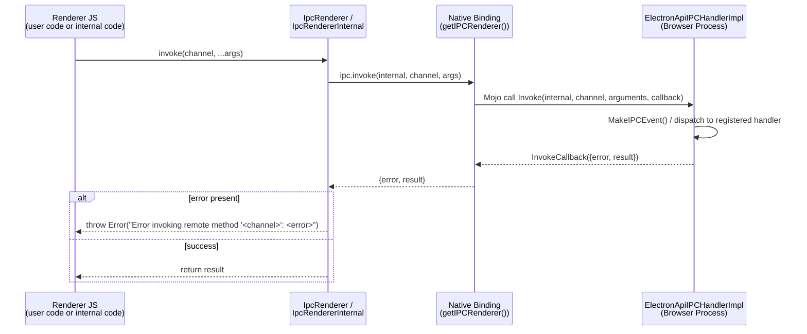

# Renderer IPC Module (`lib_renderer_ipc`)

## 1. Purpose

This module implements the **renderer-side JavaScript surface** for Electron's Inter-Process
Communication (IPC) system. It provides two thin, `EventEmitter`-based wrapper classes that
renderer-process JavaScript code (both user code and Electron's own internal preload/renderer
scripts) uses to talk to the main (browser) process:

| Component | File | Audience | Purpose |
|---|---|---|---|
| `IpcRenderer` | `lib/renderer/api/ipc-renderer.ts` | **Public** — exposed to user code as `require('electron').ipcRenderer` | User-facing `ipcRenderer` module documented in the Electron API |
| `IpcRendererInternal` | `lib/renderer/ipc-renderer-internal.ts` | **Internal** — used only by Electron's own preload/renderer-side infrastructure | Privileged IPC channel used by Electron internals (e.g. preload script bootstrapping, service worker preload, context bridge) that must not be reachable/spoofable by untrusted web content |

Both classes are extremely small: they are stateless facades over a shared native binding
(`getIPCRenderer()`) and simply forward calls, tagging each call with an `internal` boolean flag
that the native/browser side uses to decide trust level and routing.

## 2. Architecture Overview

The module sits at the boundary between renderer-process JavaScript and the native transport
layer (Mojo, wrapped by Electron's C++ `ElectronApiIPC`/`ElectronRenderer` mojom interfaces).
It does **not** implement any transport logic itself — it only builds the ergonomic JS API and
delegates every method to `ipc-renderer-bindings` (a native binding module, not part of this
module's core components) which is backed by Mojo IPC to the browser process.

### Key architectural points

- **Single native transport, two trust levels.** Both classes call the exact same
  `getIPCRenderer()` binding; the only functional difference is the `internal` boolean baked in
  at construction time (`false` for `IpcRenderer`, `true` for `IpcRendererInternal`). This flag
  is forwarded on every call and is validated on the browser side by
  `ElectronApiIPCHandlerImpl` (see [WebContents_Rendering_&_Communication.md](WebContents_Rendering_%26_Communication.md))
  to prevent untrusted web content from invoking privileged/internal channels.
- **Stateless facade pattern.** Neither class holds IPC-specific state; they exist purely to give
  callers an idiomatic Node.js `EventEmitter` interface (`.on()`, `.once()`, etc. inherited from
  `events.EventEmitter`) with typed convenience methods (`send`, `sendSync`, `invoke`,
  `sendToHost`, `postMessage`).
- **Singletons.** Both files export a single instantiated object (`export default new
  IpcRenderer()` and `export const ipcRendererInternal = new IpcRendererInternal()`), so there is
  exactly one instance per renderer/isolate, matching a single logical channel to the browser
  process per frame context.
- **Asynchronous invoke pattern.** `invoke()` on both classes awaits a `{ error, result }` tuple
  from the native binding and re-throws as a proper JS `Error` if the browser-side handler
  reported a failure — this normalizes error propagation across the process boundary.

## 3. Component Details

### `IpcRenderer` (public API)

Implements the public `Electron.IpcRenderer` interface and backs the well-known
`ipcRenderer` module available to any renderer-process/preload script:

- `send(channel, ...args)` — fire-and-forget async message to the main process.
- `sendSync(channel, ...args)` — blocking/synchronous message, returns the browser's reply.
- `sendToHost(channel, ...args)` — message routed to the embedding `<webview>` host (guest view
  scenarios; see [WebContents_Rendering_&_Communication.md](WebContents_Rendering_%26_Communication.md)
  and its `Web_View` sub-module).
- `invoke(channel, ...args)` — promise-based request/response call; throws on error.
- `postMessage(channel, message, transferables)` — structured-clone / transferable-based
  messaging (powers `MessagePort`-style APIs; see the `message_port.h` component documented in
  [WebContents_Rendering_&_Communication.md](WebContents_Rendering_%26_Communication.md)).

All calls are made with `internal = false`.

### `IpcRendererInternal` (internal API)

Implements `ElectronInternal.IpcRendererInternal`, a reduced surface (`send`, `sendSync`,
`invoke` — no `sendToHost`/`postMessage`) used exclusively by Electron's own renderer bootstrap
code, such as:

- Preload script context setup (see [Preload_ServiceWorker_(Renderer).md](Preload_ServiceWorker_%28Renderer%29.md)
  and [Preload_Script.md](Preload_Script.md)).
- Renderer client infrastructure that wires up spellcheck, context-bridge, and autofill features
  (see [Renderer_Client.md](Renderer_Client.md) and [Renderer_API.md](Renderer_API.md)).

All calls are made with `internal = true`, allowing the browser-process handler to trust and
route these messages differently (e.g., allow access to privileged internal channels not exposed
to web content).

## 4. Data Flow: A Typical `invoke()` Call

## 5. Relationship to Other Modules

This module is the renderer-side half of Electron's IPC system. Its counterparts and consumers
live in other documented modules:

- **[Public_JS_API_Bindings](lib_browser_api.md)** — the sibling browser-process JS bindings
  (`lib/browser/api/*`) that, together with this module, form the complete public JS API surface
  exposed via `electron`. `message-channel.ts` (`MessageChannelMain`) in that module is the
  browser-side counterpart to the `postMessage`/`MessagePort` flow initiated here.
- **[WebContents_Rendering_&_Communication](WebContents_Rendering_%26_Communication.md)** —
  specifically its `shell_browser_ipc_handlers` sub-module, which hosts
  `ElectronApiIPCHandlerImpl` (handles `Message`/`Invoke`/`MessageSync`/`MessageHost` from this
  module) and `ElectronApiSWIPCHandlerImpl` (the Service-Worker equivalent), as well as
  `ElectronApiServiceImpl` (renderer-side Mojo receiver used to *push* events/messages from the
  browser process back into the renderer, e.g. for `webContents.send()`).
- **[Renderer_Process_Infrastructure](Renderer_Client.md)** and
  **[Preload_Script_Infrastructure](Preload_Script.md)** — consumers that rely on
  `IpcRendererInternal` to bootstrap preload contexts, context-bridge, and other internal
  renderer features before any user code runs.
- **[Common_Native_Gin_Infrastructure](Gin_Helper.md)** — the browser-side `gin_helper` event and
  promise plumbing (e.g. `gin_helper::internal::Event`, `PromiseBase`) used by
  `ElectronApiIPCHandlerImpl` to construct the events/promises delivered in response to `invoke`
  and `sendSync` calls made from this module.

## 6. Design Notes / Why Two Classes?

Separating public (`IpcRenderer`) and internal (`IpcRendererInternal`) implementations — despite
nearly identical code — is a deliberate security boundary:

- The public `ipcRenderer` object is reachable from arbitrary (potentially untrusted) preload or
  even sandboxed renderer/web content depending on configuration, so it must never expose
  Electron's own internal-only channels.
- The `internal = true` flag is baked into the class at the call site (not passed by the caller),
  so internal code cannot accidentally — or a malicious script cannot forcibly — downgrade/upgrade
  trust level; the two code paths are physically distinct modules/singletons.
- Keeping both wrappers minimal (no business logic, just forwarding + error normalization) limits
  the attack surface and keeps the trust decision entirely on the browser-process handler side
  (`ElectronApiIPCHandlerImpl`), which independently validates the `internal` flag against the
  actual frame/context making the underlying Mojo call.
