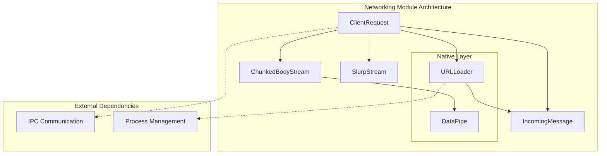
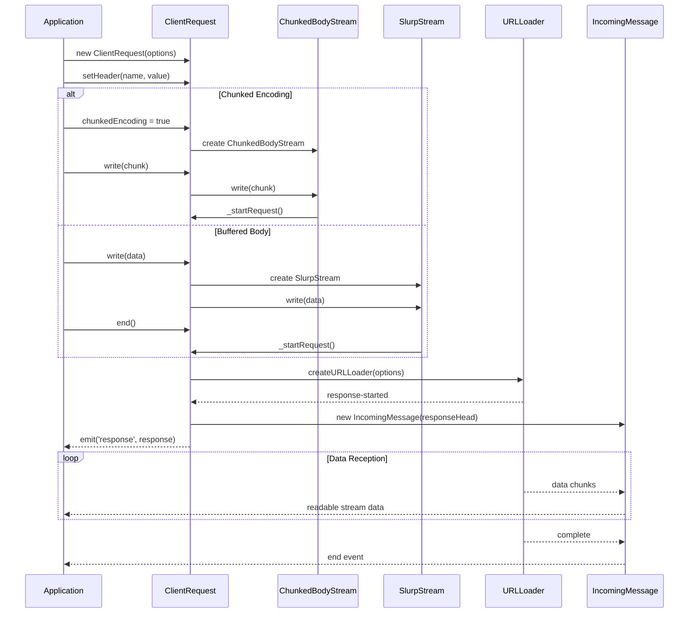
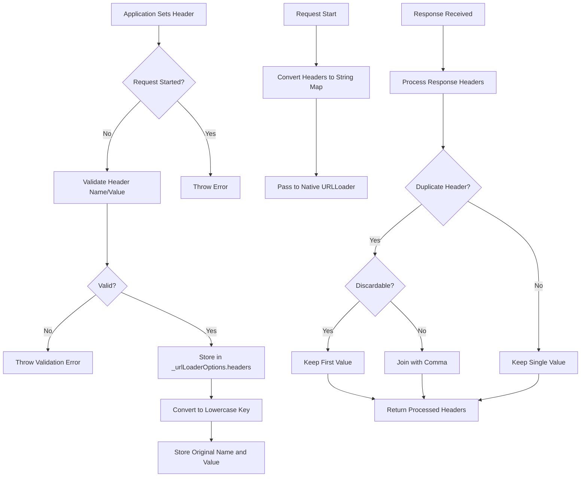
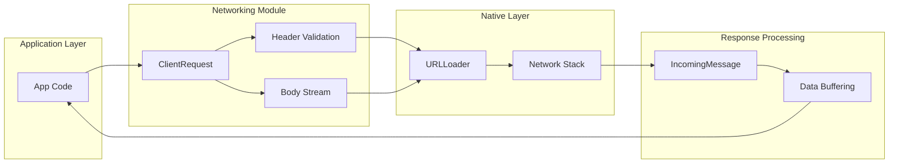
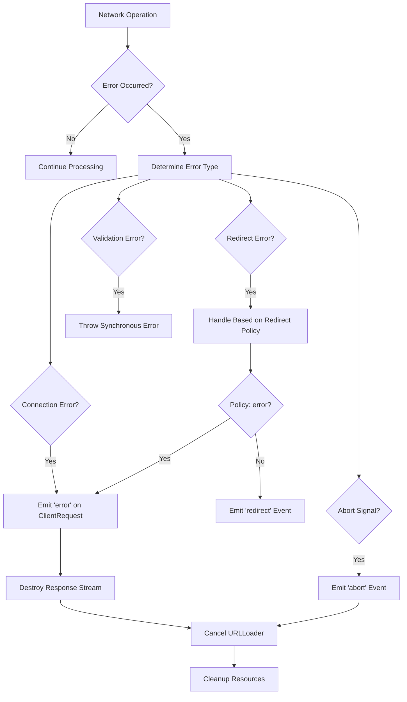

# Networking Module

The networking module provides HTTP/HTTPS client functionality for Electron applications, implementing a Node.js-compatible interface for making network requests. It serves as the foundation for all HTTP communication within Electron, offering both streaming and buffered request handling capabilities.

## Architecture Overview

The networking module is built around four core components that work together to provide comprehensive HTTP client functionality:



## Core Components

### ClientRequest
The primary HTTP client class that implements the Electron.ClientRequest interface. It extends Node.js Writable stream and provides:

- **HTTP Method Support**: GET, POST, PUT, DELETE, and other HTTP methods
- **Header Management**: Setting, getting, and removing HTTP headers
- **Body Handling**: Support for both buffered and streaming request bodies
- **Redirect Control**: Configurable redirect policies (follow, error, manual)
- **Authentication**: Built-in login event handling
- **Progress Tracking**: Upload and download progress monitoring

**Key Features:**
- Protocol validation (HTTP/HTTPS by default, extensible via `allowAnyProtocol`)
- Session and partition support for cookie management
- Chunked transfer encoding support
- Abort functionality for request cancellation

### IncomingMessage
Represents HTTP response data as a readable stream, providing:

- **Response Metadata**: Status code, status message, HTTP version
- **Header Access**: Both processed headers and raw header arrays
- **Streaming Data**: Efficient handling of response body data
- **Backpressure Management**: Proper flow control for large responses

**Header Processing:**
- Automatic handling of duplicate headers per HTTP specifications
- Special treatment for `set-cookie` headers (maintained as arrays)
- Raw header access for debugging and advanced use cases

### ChunkedBodyStream
Handles streaming request bodies with chunked transfer encoding:

- **Lazy Initialization**: Request starts only when first chunk is written
- **Flow Control**: Proper backpressure handling with the native layer
- **Error Handling**: Graceful handling of connection errors and aborts

### SlurpStream
A utility stream that buffers all written data for simple request bodies:

- **Memory Buffering**: Collects all data in memory before sending
- **Simple Interface**: Easy-to-use for small to medium-sized request bodies
- **Automatic Finalization**: Triggers request start when stream ends

## Data Flow Diagrams

### Request Lifecycle



### Header Management Flow



## Component Interactions

### Request Processing Pipeline



### Error Handling Flow



## Integration Points

### IPC Communication Integration
The networking module integrates with the [IPC Communication](ipc_communication.md) system for:
- **Session Management**: Coordinating with browser process for cookie handling
- **Security Context**: Sharing security policies and permissions
- **Process Coordination**: Managing network requests across process boundaries

### Process Management Integration
Works with [Process Management](process_management.md) for:
- **Utility Process Support**: Network requests can be made from utility processes
- **Resource Cleanup**: Proper cleanup when processes terminate
- **Process-Specific Configuration**: Different network policies per process type

### Type Definitions Integration
Leverages [Type Definitions](type_definitions.md) for:
- **Interface Contracts**: Strong typing for all networking APIs
- **Event Definitions**: Type-safe event handling
- **Configuration Options**: Comprehensive option validation

## Configuration and Options

### ClientRequestConstructorOptions
```typescript
interface ClientRequestConstructorOptions {
  method?: string;                    // HTTP method (default: 'GET')
  url?: string;                      // Request URL
  session?: Session;                 // Electron session for cookies
  partition?: string;                // Session partition name
  credentials?: RequestCredentials;   // Credential handling policy
  useSessionCookies?: boolean;       // Include session cookies
  redirect?: 'follow' | 'error' | 'manual'; // Redirect policy
  headers?: Record<string, string>;  // Request headers
  origin?: string;                   // Request origin
  referrerPolicy?: ReferrerPolicy;   // Referrer policy
  cache?: RequestCache;              // Cache policy
  priority?: RequestPriority;        // Request priority
}
```

### Protocol Support
- **Default Protocols**: HTTP and HTTPS
- **Extended Support**: Custom protocols via `allowAnyProtocol()` function
- **Security**: Protocol validation prevents unauthorized schemes

### Redirect Policies
- **follow**: Automatically follow redirects (default)
- **error**: Treat redirects as errors
- **manual**: Emit redirect events for application handling

## Performance Considerations

### Memory Management
- **Streaming**: ChunkedBodyStream for large uploads
- **Buffering**: SlurpStream for small requests
- **Backpressure**: Proper flow control prevents memory exhaustion

### Network Efficiency
- **Connection Reuse**: Leverages underlying network stack optimizations
- **Header Compression**: Efficient header handling
- **Progress Tracking**: Minimal overhead progress monitoring

### Error Recovery
- **Graceful Degradation**: Continues operation despite individual request failures
- **Resource Cleanup**: Automatic cleanup on errors and aborts
- **Retry Logic**: Application-level retry support through event system

## Security Features

### Header Validation
- **Name Validation**: Prevents header injection attacks
- **Value Validation**: Ensures header values are properly formatted
- **Security Headers**: Proper handling of security-related headers

### Protocol Security
- **HTTPS Support**: Full TLS/SSL support
- **Certificate Validation**: Leverages system certificate stores
- **Origin Policies**: Respects same-origin and CORS policies

### Session Security
- **Cookie Isolation**: Proper cookie scoping per session
- **Credential Management**: Secure handling of authentication data
- **Permission Integration**: Respects Electron's permission system

## Usage Examples

### Basic HTTP Request
```typescript
import { net } from 'electron';

const request = net.request('https://api.example.com/data');
request.on('response', (response) => {
  console.log(`Status: ${response.statusCode}`);
  response.on('data', (chunk) => {
    console.log(chunk.toString());
  });
});
request.end();
```

### POST Request with JSON Body
```typescript
const request = net.request({
  method: 'POST',
  url: 'https://api.example.com/submit',
  headers: {
    'Content-Type': 'application/json'
  }
});

request.write(JSON.stringify({ key: 'value' }));
request.end();
```

### Streaming Upload
```typescript
const request = net.request({
  method: 'PUT',
  url: 'https://api.example.com/upload'
});

request.chunkedEncoding = true;

// Stream data in chunks
request.write(chunk1);
request.write(chunk2);
request.end();
```

## Best Practices

### Request Management
- Always handle both 'response' and 'error' events
- Use appropriate body streaming for large payloads
- Implement proper timeout handling at application level

### Header Management
- Validate headers before setting to avoid runtime errors
- Use lowercase header names for consistency
- Be aware of header merging behavior for duplicates

### Error Handling
- Implement comprehensive error handling for network failures
- Use abort() method for request cancellation
- Clean up resources properly in error scenarios

### Performance Optimization
- Choose appropriate body streaming strategy based on data size
- Monitor upload/download progress for user feedback
- Implement request pooling at application level if needed

## Troubleshooting

### Common Issues
- **Protocol Errors**: Ensure URL scheme is supported (http/https)
- **Header Validation**: Check header names and values for validity
- **Redirect Loops**: Configure appropriate redirect policy
- **Memory Issues**: Use streaming for large request/response bodies

### Debugging
- Enable network logging in Electron for detailed request information
- Monitor 'error' events for network-level failures
- Use 'redirect' events to track redirect behavior
- Check upload/download progress events for performance issues

## Future Considerations

### Planned Enhancements
- HTTP/2 and HTTP/3 support improvements
- Enhanced progress tracking capabilities
- Better integration with Electron's permission system
- Improved error reporting and diagnostics

### API Evolution
- Maintaining backward compatibility with Node.js http module
- Adding new features while preserving existing behavior
- Performance optimizations for modern web standards