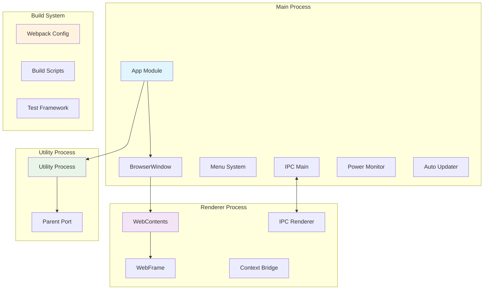
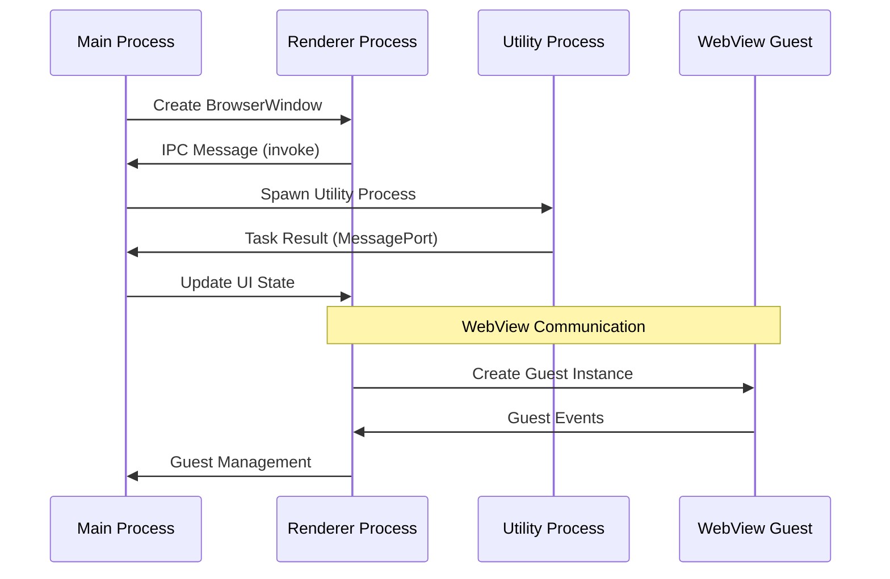
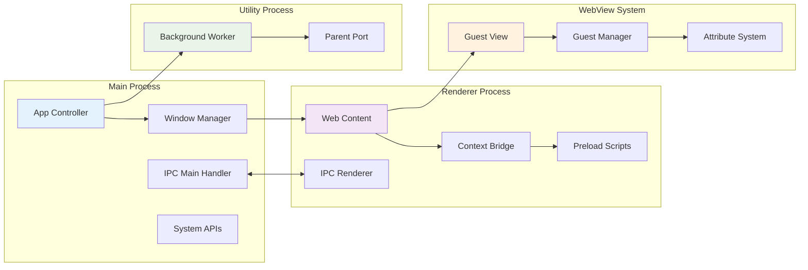

# Electron Framework Documentation

## Overview

Electron is a framework that enables developers to build cross-platform desktop applications using web technologies (HTML, CSS, and JavaScript). This documentation covers the core architecture and components of the Electron framework, providing insights into its internal structure and functionality.

## Architecture Overview

Electron follows a multi-process architecture with distinct process types and communication mechanisms:

## Core Module Structure

The Electron framework is organized into several key modules, each with detailed documentation:

### 1. Process Management ([process_management.md](process_management.md))
- **Utility Process**: Background task execution and isolated operations
- **Parent Port**: Communication channel for utility processes
- **Process Lifecycle**: Creation, management, and cleanup of processes

### 2. Inter-Process Communication ([ipc_communication.md](ipc_communication.md))
- **IPC Main**: Main process communication handling
- **IPC Renderer**: Renderer process communication management
- **Message Ports**: Structured data transfer between processes
- **Message Channels**: Bidirectional communication channels

### 3. UI Components ([ui_components.md](ui_components.md))
- **BrowserView**: Embeddable web content views
- **TouchBar**: macOS Touch Bar integration with various controls
- **Share Menu**: Native sharing functionality
- **Menu System**: Cross-platform menu implementation

### 4. System Integration ([system_integration.md](system_integration.md))
- **Power Monitor**: System power state monitoring and events
- **Auto Updater**: Application update management (Windows)
- **Crash Reporter**: Error reporting and crash handling

### 5. Networking ([networking.md](networking.md))
- **Client Request**: HTTP/HTTPS request handling
- **Streaming**: Chunked and buffered data transfer
- **Protocol Support**: Custom protocol implementation

### 6. WebView System ([web_view_system.md](web_view_system.md))
- **WebView Implementation**: Embedded web content management
- **Attribute System**: WebView configuration and behavior
- **Guest View Management**: Isolated web content handling

### 7. Build and Testing ([build_and_testing.md](build_and_testing.md))
- **Webpack Configuration**: Module bundling and build process
- **Test Framework**: Comprehensive testing infrastructure
- **Code Quality**: Formatting and linting tools
- **Screen Testing**: Visual testing capabilities

### 8. Type Definitions ([type_definitions.md](type_definitions.md))
- **Internal Types**: Framework-specific type definitions
- **Ambient Types**: Global type declarations
- **API Interfaces**: Public and internal API contracts

## Key Features

### Multi-Process Architecture
Electron uses a multi-process model similar to modern web browsers:
- **Security**: Isolates web content from the main application
- **Stability**: Prevents renderer crashes from affecting the main process
- **Performance**: Enables parallel processing and resource management

### Native API Access
Provides access to native operating system features:
- File system operations
- System notifications
- Hardware integration
- Platform-specific functionality

### Web Technology Integration
Seamlessly integrates web technologies with native capabilities:
- Modern web standards support
- Node.js integration in renderer processes
- Context isolation for security
- Preload scripts for safe API exposure

## Communication Patterns

The Electron framework implements sophisticated communication patterns between processes:

### Data Flow Architecture

## Security Model

Electron implements multiple security layers:

1. **Process Isolation**: Separates main and renderer processes
2. **Context Isolation**: Isolates the main world from isolated world
3. **Preload Scripts**: Safe API exposure mechanism
4. **Content Security Policy**: Web content security enforcement
5. **Node Integration Control**: Configurable Node.js access

## Development Workflow

The framework supports comprehensive development workflows:

### Build Process
- **TypeScript Compilation**: Full TypeScript support with strict type checking
- **Module Bundling**: Webpack-based bundling with custom configurations
- **Asset Optimization**: Automatic optimization of resources and dependencies
- **Platform-specific Packaging**: Cross-platform build and distribution

### Testing Infrastructure ([build_and_testing.md](build_and_testing.md))
- **Unit Testing**: Component-level testing with comprehensive coverage
- **Integration Testing**: Cross-process communication testing
- **End-to-end Testing**: Full application workflow testing
- **Visual Testing**: Screen capture and pixel-perfect UI testing
- **Performance Testing**: Memory and CPU usage monitoring

### Release Management
- **Automated Version Bumping**: Semantic versioning with automated updates
- **Release Note Generation**: Automatic changelog creation from commit history
- **Multi-platform Distribution**: Simultaneous releases across platforms
- **Update Delivery System**: Automatic update mechanisms for deployed applications

### Code Quality
- **Linting and Formatting**: Automated code style enforcement
- **Type Safety**: Comprehensive TypeScript type definitions
- **Security Auditing**: Built-in security best practices
- **Documentation Generation**: Automatic API documentation

## Platform Support

Electron provides cross-platform compatibility:
- **Windows**: Full Windows API integration
- **macOS**: Native macOS features and UI guidelines
- **Linux**: X11 and Wayland support

## Performance Considerations

### Memory Management
- Efficient process lifecycle management
- Garbage collection optimization
- Resource cleanup mechanisms

### Startup Optimization
- Lazy loading strategies
- Preload script optimization
- Bundle size minimization

### Runtime Performance
- V8 engine optimization
- Native module integration
- Background task management

## Extension Points

The framework provides multiple extension mechanisms:
- Custom protocol handlers
- Native module integration
- Plugin architecture
- Theme and styling customization

## Conclusion

Electron provides a comprehensive framework for building cross-platform desktop applications using web technologies. Its multi-process architecture, extensive API surface, and robust development tools make it suitable for applications ranging from simple utilities to complex enterprise software.

The framework continues to evolve with modern web standards while maintaining backward compatibility and providing developers with the tools needed to create high-quality desktop applications.