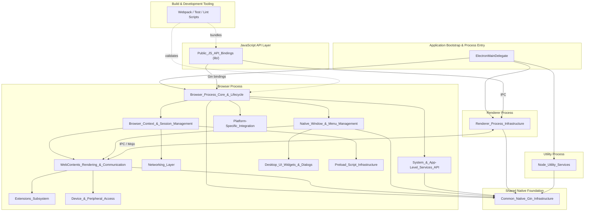
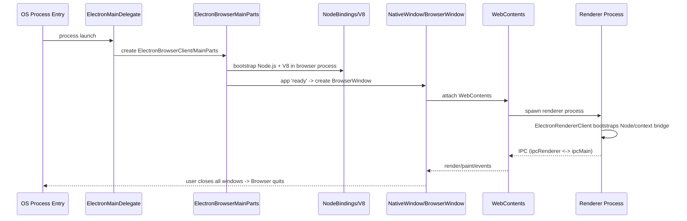
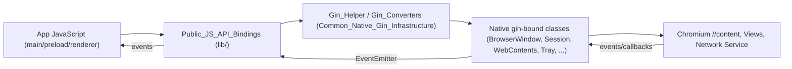

# Electron

## 1. Purpose

**Electron** is a framework for building cross-platform desktop applications using JavaScript, HTML, and CSS. It achieves this by combining the **Chromium** rendering/browser engine with the **Node.js** runtime inside a single native application, exposing a rich set of native OS capabilities (windowing, menus, tray icons, dialogs, notifications, device access, networking, etc.) through a JavaScript API.

This repository contains:

- The **native C++ core** (`shell/`) that embeds Chromium's `//content` layer and Node.js, implements Electron's multi-process architecture (browser, renderer, GPU, utility processes), and binds native functionality to JavaScript via `gin`/V8.
- The **public TypeScript/JavaScript API layer** (`lib/`) that application developers consume as `require('electron')`.
- The **build and developer tooling** (`build/`, `script/`) used to compile, bundle, test, and lint the codebase itself.

Architecturally, Electron mirrors Chromium's multi-process model: a **main (browser) process** owns application lifecycle, windows, menus, and sessions; **renderer processes** host web content and run sandboxed/preloaded JavaScript; **utility processes** run isolated Node.js workloads; and a thin **native bootstrap layer** wires everything together at startup.

## 2. End-to-End Architecture

### 2.1 Process & Module Topology

```mermaid
graph TB
    subgraph Entry["Application Bootstrap & Process Entry"]
        MainDelegate["ElectronMainDelegate"]
    end

    subgraph Browser["Browser Process"]
        Core["Browser_Process_Core_&_Lifecycle"]
        Session["Browser_Context_&_Session_Management"]
        Window["Native_Window_&_Menu_Management"]
        WC["WebContents_Rendering_&_Communication"]
        Ext["Extensions_Subsystem"]
        Device["Device_&_Peripheral_Access"]
        Net["Networking_Layer"]
        SysAPI["System_&_App-Level_Services_API"]
        Platform["Platform-Specific_Integration"]
        UI["Desktop_UI_Widgets_&_Dialogs"]
        Preload["Preload_Script_Infrastructure"]
    end

    subgraph Renderer["Renderer Process"]
        RendererInfra["Renderer_Process_Infrastructure"]
    end

    subgraph Utility["Utility Process"]
        NodeSvc["Node_Utility_Services"]
    end

    subgraph Shared["Shared Native Foundation"]
        Gin["Common_Native_Gin_Infrastructure"]
    end

    subgraph JS["JavaScript API Layer"]
        PublicAPI["Public_JS_API_Bindings (lib/)"]
    end

    subgraph Tooling["Build & Development Tooling"]
        Build["Webpack / Test / Lint Scripts"]
    end

    MainDelegate --> Core
    MainDelegate --> RendererInfra
    MainDelegate --> NodeSvc

    Core --> Session
    Core --> Window
    Session --> WC
    Window --> WC
    WC --> Ext
    WC --> Device
    Session --> Net
    Core --> SysAPI
    Core --> Platform
    Window --> UI
    Session --> Preload

    Core --> Gin
    WC --> Gin
    Window --> Gin
    SysAPI --> Gin
    RendererInfra --> Gin
    NodeSvc --> Gin

    RendererInfra <-->|IPC / Mojo| WC
    PublicAPI -->|Gin bindings| Core
    PublicAPI -->|IPC| RendererInfra
    Build -.->|bundles| PublicAPI
    Build -.->|validates| Core
```

### 2.2 Startup & Runtime Flow

```mermaid
sequenceDiagram
    participant OS as OS Process Entry
    participant MD as ElectronMainDelegate
    participant BMP as ElectronBrowserMainParts
    participant Node as NodeBindings/V8
    participant Win as NativeWindow/BrowserWindow
    participant WC as WebContents
    participant Renderer as Renderer Process

    OS->>MD: process launch
    MD->>BMP: create ElectronBrowserClient/MainParts
    BMP->>Node: bootstrap Node.js + V8 in browser process
    BMP->>Win: app 'ready' -> create BrowserWindow
    Win->>WC: attach WebContents
    WC->>Renderer: spawn renderer process
    Renderer->>Renderer: ElectronRendererClient bootstraps Node/context bridge
    Renderer-->>WC: IPC (ipcRenderer <-> ipcMain)
    WC-->>Win: render/paint/events
    Win-->>OS: user closes all windows -> Browser quits
```

### 2.3 JavaScript-to-Native Binding Flow

```mermaid
flowchart LR
    JSApp["App JavaScript (main/preload/renderer)"]
    PublicAPI["Public_JS_API_Bindings (lib/)"]
    GinHelper["Gin_Helper / Gin_Converters (Common_Native_Gin_Infrastructure)"]
    NativeAPI["Native gin-bound classes (BrowserWindow, Session, WebContents, Tray, ...)"]
    Chromium["Chromium //content, Views, Network Service"]

    JSApp --> PublicAPI
    PublicAPI --> GinHelper
    GinHelper --> NativeAPI
    NativeAPI --> Chromium
    Chromium -->|events/callbacks| NativeAPI
    NativeAPI -->|EventEmitter| PublicAPI
    PublicAPI -->|events| JSApp
```

## 3. Core Modules

| Module | Responsibility |
|---|---|
| [Build & Development Tooling](Build_&_Development_Tooling.md) | Webpack bundling of `lib/**` into runtime bundles; native test runner and clang-format tooling for CI. |
| [Application Bootstrap & Process Entry](Application_Bootstrap_&_Process_Entry.md) | OS process entry points, `ElectronMainDelegate`, content/crash-reporter clients, libuv task runner, and the app-relauncher mechanism. |
| [Public JS API Bindings](Public_JS_API_Bindings.md) | TypeScript layer (`lib/`) implementing the public `electron` module surface for both browser and renderer processes. |
| [Browser Process Core & Lifecycle](Browser_Process_Core_&_Lifecycle.md) | The `Browser` singleton, `BrowserProcessImpl`, `ElectronBrowserClient`/`ElectronBrowserMainParts`, and V8/Node bootstrap for the main process. |
| [Browser Context & Session Management](Browser_Context_&_Session_Management.md) | `ElectronBrowserContext`/`Session` and per-session cookies, permissions, downloads, protocols, and service workers. |
| [Native Window & Menu Management](Native_Window_&_Menu_Management.md) | `NativeWindow`/`BrowserWindow`/`Menu`/`Tray`/`View` native windowing and the global `WindowList` registry. |
| [WebContents Rendering & Communication](WebContents_Rendering_&_Communication.md) | Core `WebContents` implementation, `<webview>` guests, offscreen rendering, printing, and browser-process IPC handlers. |
| [Extensions Subsystem](Extensions_Subsystem.md) | Chrome-extension-compatible APIs, extension system/loader, and browser/renderer extension clients. |
| [Device & Peripheral Access](Device_&_Peripheral_Access.md) | Bluetooth, HID, Serial, USB, WebAuthn delegates, File System Access, and media device permissioning. |
| [Networking Layer](Networking_Layer.md) | ASAR/custom protocol URL loaders, request/WebSocket proxying (`webRequest`), network context management, DNS/proxy resolution. |
| [System & App-Level Services API](System_&_App-Level_Services_API.md) | `app`, `autoUpdater`, `globalShortcut`, `powerMonitor`, `nativeTheme`, notifications, `UtilityProcess`, and app badging. |
| [Platform-Specific Integration](Platform-Specific_Integration.md) | macOS IAP/StoreKit, Linux Unity launcher, Windows WinRT interop, OS shell operations, and native notification backends. |
| [Preload Script Infrastructure](Preload_Script_Infrastructure.md) | `PreloadScript` descriptor and Service-Worker preload realm execution machinery. |
| [Desktop UI Widgets & Dialogs](Desktop_UI_Widgets_&_Dialogs.md) | Autofill popup, native dialogs, DevTools hosting, tray/menu platform backends, custom window frames, Jump Lists/taskbar. |
| [Common Native Gin Infrastructure](Common_Native_Gin_Infrastructure.md) | Foundational gin/V8 binding scaffolding, type converters, Node.js embedding (`NodeBindings`), ASAR, and shared utilities used by nearly every other module. |
| [Renderer Process Infrastructure](Renderer_Process_Infrastructure.md) | Renderer-side Node bootstrap, context bridge, frame observers, autofill/spellcheck agents, and renderer extensions client. |
| [Node Utility Services](Node_Utility_Services.md) | `NodeService`/`ParentPort` hosting Node.js inside Chromium utility processes for the `UtilityProcess` API. |