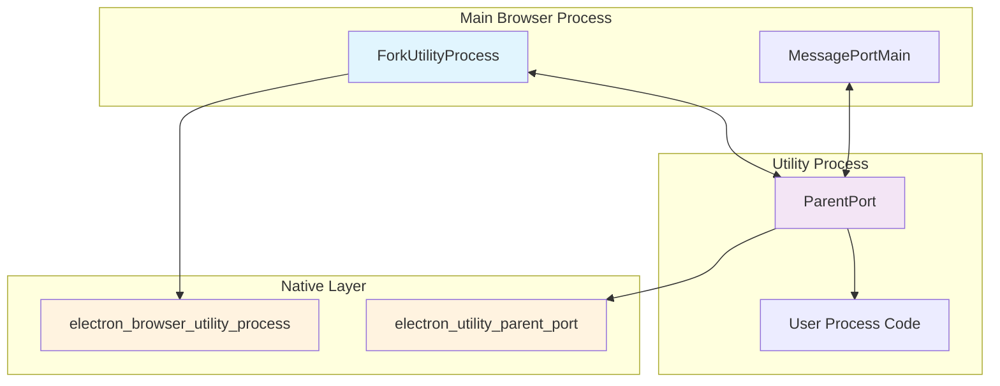
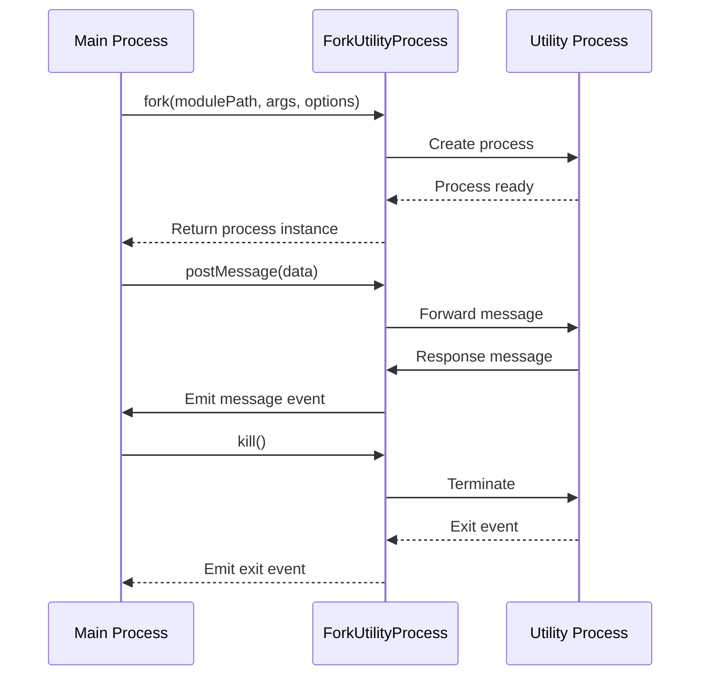
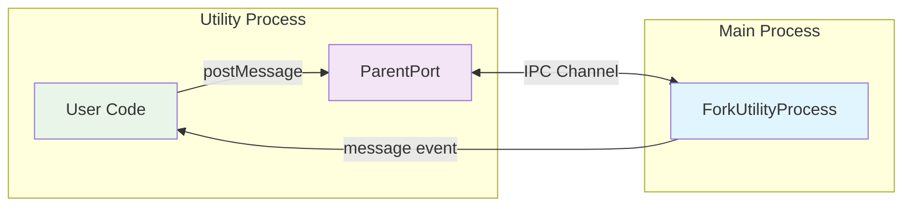
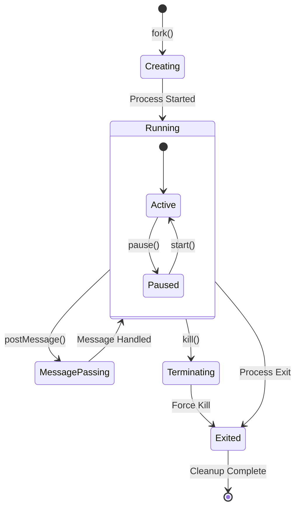
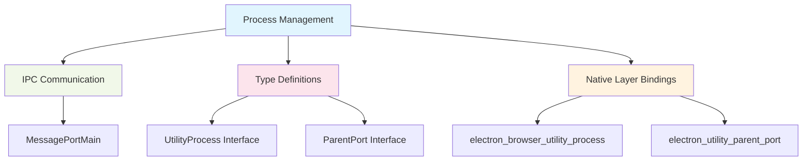

# Process Management Module

## Overview

The Process Management module provides Electron's utility process functionality, enabling the creation and management of isolated Node.js processes that can run alongside the main browser process. This module is essential for offloading CPU-intensive tasks, running untrusted code in isolation, or creating specialized worker processes while maintaining secure communication channels.

## Core Architecture

The module consists of two primary components that work together to provide a complete utility process solution:

- **ForkUtilityProcess**: Main browser process component for creating and managing utility processes
- **ParentPort**: Utility process component for communicating back to the parent process



## Component Details

### ForkUtilityProcess

The `ForkUtilityProcess` class is the primary interface for creating and managing utility processes from the main browser process.

**Key Features:**
- Process lifecycle management (creation, monitoring, termination)
- Configurable stdio handling (pipe, inherit, ignore)
- Message passing with MessagePort support
- Event-driven architecture for process communication

**Configuration Options:**
- `execArgv`: Node.js execution arguments
- `serviceName`: Service identifier for the utility process
- `cwd`: Working directory for the process
- `stdio`: Standard I/O configuration

**Process Communication:**


### ParentPort

The `ParentPort` class provides the communication interface within utility processes to interact with the parent browser process.

**Key Features:**
- Bidirectional message passing
- MessagePort integration for advanced communication patterns
- Event-driven message handling
- Process control (start/pause communication)

**Communication Flow:**


## Integration with Other Modules

The Process Management module integrates closely with several other system modules:

### IPC Communication Integration
- Utilizes [IPC Communication](ipc_communication.md) infrastructure for message passing
- Leverages `MessagePortMain` for advanced communication patterns
- Supports structured data transfer between processes

### Type Definitions Integration
- Implements interfaces defined in [Type Definitions](type_definitions.md)
- Provides type safety for `Electron.UtilityProcess` and `Electron.ParentPort`
- Ensures consistent API contracts across the system

## Process Lifecycle Management



## Usage Patterns

### Basic Utility Process Creation
```typescript
import { fork } from '@electron/internal/browser/api/utility-process';

// Create a utility process
const utilityProcess = fork('path/to/worker.js', [], {
  serviceName: 'my-worker',
  stdio: 'pipe'
});

// Handle messages from utility process
utilityProcess.on('message', (data) => {
  console.log('Received:', data);
});

// Send message to utility process
utilityProcess.postMessage({ task: 'process-data', data: largeDataSet });
```

### Utility Process Implementation
```typescript
// In utility process (worker.js)
import { parentPort } from '@electron/internal/utility/parent-port';

parentPort.on('message', ({ data }) => {
  // Process the data
  const result = processLargeDataSet(data.data);
  
  // Send result back
  parentPort.postMessage({ result });
});

parentPort.start();
```

## Error Handling and Recovery

The module implements comprehensive error handling:

- **Process Creation Errors**: Validation of module paths and options
- **Communication Errors**: Graceful handling of IPC failures
- **Process Termination**: Clean resource cleanup on exit
- **Stream Management**: Proper stdio stream lifecycle management

## Performance Considerations

- **Process Isolation**: Each utility process runs in its own memory space
- **Resource Management**: Automatic cleanup of streams and handles
- **Communication Overhead**: Efficient message serialization through native bindings
- **Scalability**: Support for multiple concurrent utility processes

## Security Model

The utility process system provides several security benefits:

- **Process Isolation**: Utility processes cannot directly access main process memory
- **Controlled Communication**: All communication goes through structured IPC channels
- **Resource Limits**: Processes can be terminated if they become unresponsive
- **Sandboxing**: Utility processes can run with reduced privileges

## Dependencies



## Future Enhancements

The Process Management module is designed to support future enhancements:

- **Process Pooling**: Reusable process pools for improved performance
- **Advanced Monitoring**: Process health monitoring and automatic restart
- **Resource Quotas**: CPU and memory limits for utility processes
- **Enhanced Security**: Additional sandboxing and permission controls

This module serves as a critical foundation for Electron's multi-process architecture, enabling developers to build more robust and performant applications by leveraging isolated utility processes for specialized tasks.