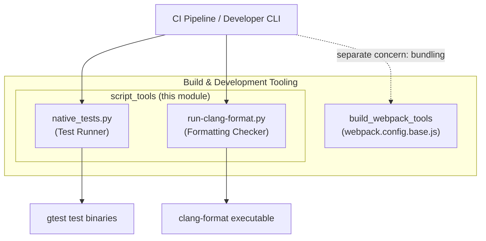
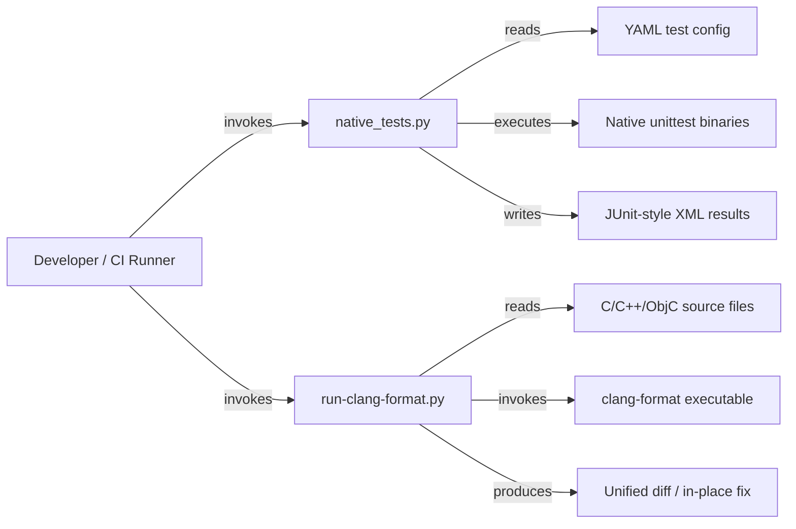

# Script Tools

## Introduction

The **Script Tools** module is a small collection of Python-based developer utilities that live under the `script/` directory of the repository. These are standalone command-line tools invoked during local development and continuous integration (CI) to:

- Run native (C++) unit test binaries in a configurable, cross-platform way (`script/lib/native_tests.py`)
- Lint and auto-fix C/C++/Objective-C source formatting using `clang-format` (`script/run-clang-format.py`)

Both tools are part of the broader **Build & Development Tooling** area of the codebase, which also includes the webpack-based build tooling documented separately (see the sibling module for build/bundling concerns). This module focuses specifically on **test execution** and **code-style enforcement** scripting rather than on bundling application code.

These scripts are consumed by CI pipelines and by contributors running local checks before submitting changes; they are not part of the Electron runtime shipped to end users.

## Architecture Overview

The module has no shared code between its two files — each script is a self-contained CLI tool with its own entry point, invoked directly from the command line or from higher-level CI scripts. They share only the general pattern of being Python utilities that wrap and orchestrate native executables (`gtest`-based test binaries and `clang-format`, respectively).

### Sub-module Breakdown

| Tool | File | Purpose |
|---|---|---|
| [Native Test Runner](script_tools_native_tests.md) | `script/lib/native_tests.py` | Discovers, filters, and executes native `gtest`-based test binaries according to a YAML configuration, per-platform rules, and verbosity/output settings. |
| [Clang Format Runner](script_tools_clang_format.md) | `script/run-clang-format.py` | Runs `clang-format` in parallel across a set of files/directories, produces unified diffs, optionally auto-fixes files in place, and returns CI-friendly exit codes. |

Because these two scripts do not share code or data structures, each is documented in its own dedicated page for clarity; see the links above for full details on each tool's internals.

## How This Module Fits Into the System

- **Native Test Runner** is used by build/test infrastructure to validate native (C++) code changes across Linux, macOS, and Windows, complementing the JavaScript/TypeScript test suites that exercise the [Public JS API Bindings](lib_browser_api.md) and [renderer IPC](lib_renderer_ipc.md) layers.
- **Clang Format Runner** enforces consistent C++ style across the large native codebase that implements the browser process, renderer process, and shared infrastructure (e.g., [Browser Process Core & Lifecycle](shell_browser_core.md), [Common Native Gin Infrastructure](Gin_Helper.md)), helping keep contributions consistent before they are merged.

Both tools operate independently of the Electron runtime itself — they are developer-facing scripts that support the engineering workflow around the native and JS/TS code that composes the rest of the system.

## Key Design Points

- **Config-driven test selection**: `native_tests.py` centers around a YAML config that maps test binary names to platform restrictions and disabled-test lists, allowing fine-grained control without modifying test binaries.
- **Parallel formatting checks**: `run-clang-format.py` uses `multiprocessing` to run `clang-format` across many files concurrently, which scales well for large C++ trees.
- **CI-friendly semantics**: Both tools use well-defined exit codes / return codes (`ExitStatus` in the formatter, summed return codes in the test runner) so CI systems can reliably detect failures.
- **Cross-platform awareness**: `native_tests.py`'s `Platform` class normalizes `sys.platform` values into `linux` / `mac` / `windows`, used to filter which tests run on which OS.

For details on each tool's classes, methods, and control flow, see:
- [Native Test Runner documentation](script_tools_native_tests.md)
- [Clang Format Runner documentation](script_tools_clang_format.md)
