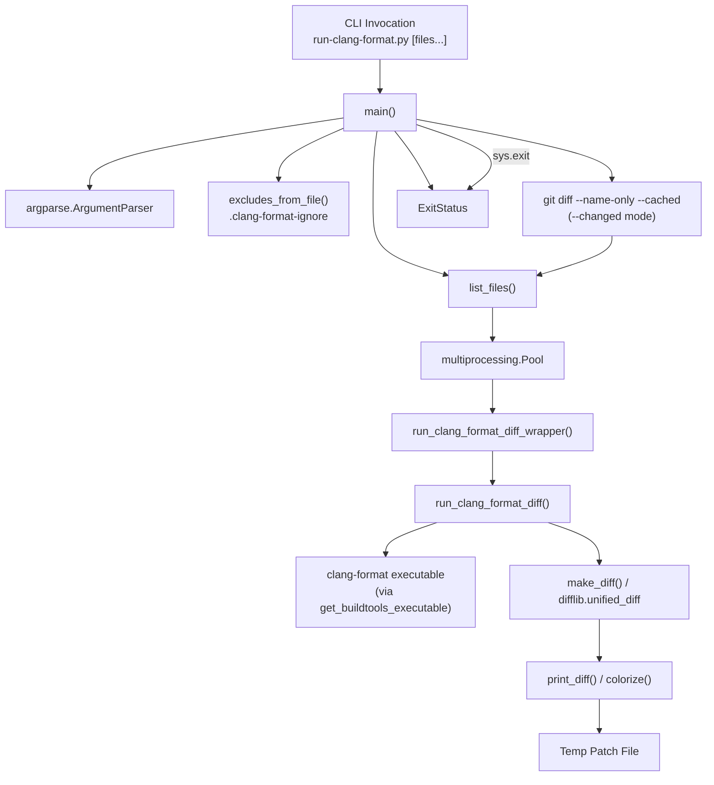
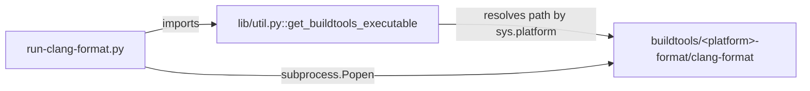
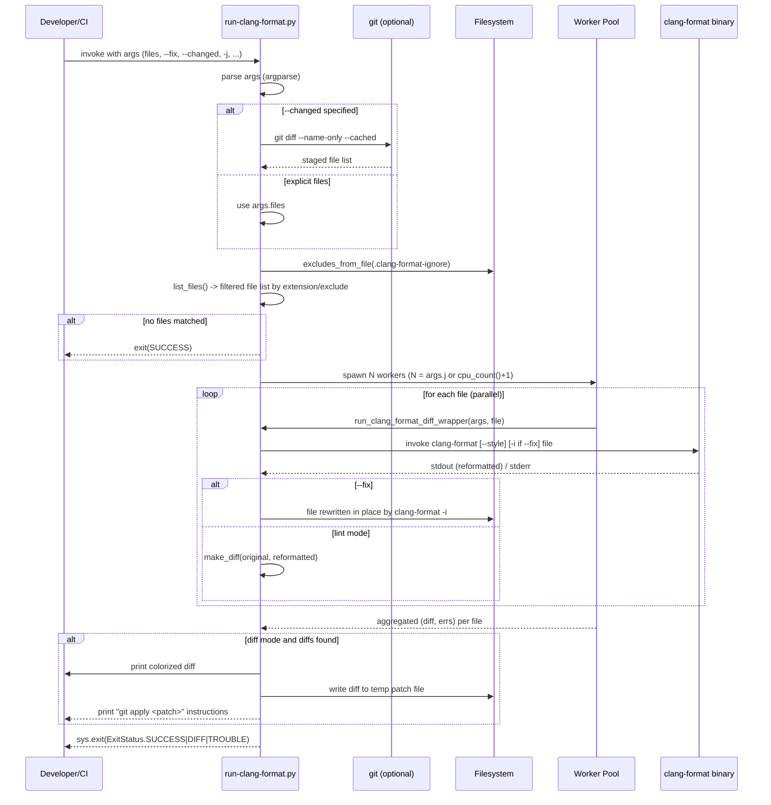

# Script Tools: Clang-Format Runner

## Introduction

The **`script_tools_clang_format`** module provides `script/run-clang-format.py`, a Python wrapper around the `clang-format` binary used across the Electron codebase to enforce consistent C/C++/Objective-C formatting. It is a developer- and CI-facing tool that:

- Discovers source files to check (explicit list, recursive directory walk, or "changed files" via `git diff`).
- Runs `clang-format` on those files in parallel using a multiprocessing pool.
- Either reports a unified diff of formatting violations (lint mode) or rewrites files in place (`--fix` mode).
- Produces a git-appliable patch file summarizing all required changes.
- Returns a well-defined process exit code so it can be wired into CI pipelines and pre-commit hooks.

This module is a leaf component of the [Build & Development Tooling](Build_&_Development_Tooling.md) domain, specifically nested under the [script_tools](script_tools.md) group alongside its sibling [script_tools_native_tests](script_tools_native_tests.md) (test-runner tooling). It has no runtime relationship to the Electron application itself (browser/renderer processes, native APIs, etc.) — it is purely a build-time developer tool.

---

## Purpose & Core Functionality

| Capability | Description |
|---|---|
| **File discovery** | Expands input paths into a concrete file list, optionally recursing into directories and filtering by extension (`DEFAULT_EXTENSIONS`) and exclude glob patterns (from `.clang-format-ignore` and `--exclude`). |
| **Changed-file mode** | `--changed` uses `git diff --name-only --cached` to restrict formatting checks to staged files only, useful for pre-commit hooks. |
| **Parallel execution** | Uses `multiprocessing.Pool` to invoke `clang-format` concurrently across files (`-j` controls job count, default = CPU count + 1). |
| **Diff generation** | For each file, compares original content against `clang-format` output using `difflib.unified_diff`, producing a human-readable, optionally colorized diff. |
| **In-place fixing** | `--fix` passes `-i` to `clang-format`, rewriting files directly instead of producing a diff. |
| **Patch file output** | When not fixing in place, all diffs are aggregated into a temporary patch file that can be applied with `git apply`. |
| **Exit status signaling** | Returns one of three exit codes (`ExitStatus.SUCCESS`, `DIFF`, `TROUBLE`) so CI systems can distinguish "clean", "formatting issues found", and "tool error" outcomes. |

### `ExitStatus` (core component)

```python
class ExitStatus:
    SUCCESS = 0
    DIFF = 1
    TROUBLE = 2
```

A simple namespace of process exit codes:
- **`SUCCESS` (0)** — no files needed reformatting (or `--fix` completed without a tool error).
- **`DIFF` (1)** — at least one file has formatting differences (lint mode only).
- **`TROUBLE` (2)** — an unexpected error or `clang-format` invocation failure occurred.

This is the primary public contract consumed by CI scripts (e.g., a lint pipeline step checks the process return code against `ExitStatus.DIFF`/`TROUBLE` to fail the build).

---

## Architecture

### Component Overview



### Dependency on Build Tooling Utilities

`run-clang-format.py` depends on `script/lib/util.py::get_buildtools_executable`, which resolves the platform-specific path to the vendored `clang-format` binary shipped in Electron's `buildtools/` directory (mac/mac_arm64/win/linux64, each suffixed `-format`). This decouples the script from requiring a system-installed `clang-format` and ensures version consistency across contributors and CI.



This is the module's only significant internal dependency; it otherwise relies solely on the Python standard library (`argparse`, `subprocess`, `multiprocessing`, `difflib`, `fnmatch`, `tempfile`, etc.).

---

## Data Flow / Process Flow

### End-to-End Execution Flow



### Error Handling Flow

```mermaid
flowchart TD
    A[run_clang_format_diff_wrapper] --> B{Exception type?}
    B -->|DiffError| C[re-raise DiffError]
    B -->|Other Exception| D[wrap as UnexpectedError with traceback]
    C --> E[main loop catches DiffError]
    D --> F[main loop catches UnexpectedError]
    E --> G[print_trouble + retcode = TROUBLE]
    F --> H[print_trouble + print traceback + retcode = TROUBLE]
    H --> I{pool active?}
    I -->|yes| J[pool.terminate&#40;&#41; - stop processing remaining files]
    I -->|no| K[continue to next iteration is skipped, loop breaks]
```



---

## Key Functions Reference

| Function | Responsibility |
|---|---|
| `excludes_from_file(ignore_file)` | Reads glob exclude patterns from `.clang-format-ignore`, skipping comments/blank lines. |
| `list_files(files, recursive, extensions, exclude)` | Expands input paths (files/dirs) into a filtered, flat file list matching extensions and not matching excludes. |
| `make_diff(diff_file, original, reformatted)` | Produces a unified diff (`a/<file>` vs `b/<file>`) between original and clang-format output. |
| `run_clang_format_diff(args, file_name)` | Core worker: reads file, invokes `clang-format` (with `-i` for fix mode or `--style`), returns diff+errors or raises `DiffError`. |
| `run_clang_format_diff_wrapper(args, file_name)` | Exception-safety wrapper around `run_clang_format_diff`, converting unexpected exceptions into `UnexpectedError` for clean multiprocessing error propagation. |
| `colorize(diff_lines)` / `print_diff(...)` | Terminal color formatting for diff output (headers bold, hunks cyan, additions green, deletions red). |
| `print_trouble(prog, message, use_colors)` | Prints a formatted error line to stderr, similar to compiler-style error reporting. |
| `main()` | CLI entry point: argument parsing, signal handling, orchestration of file discovery, parallel dispatch, result aggregation, patch file writing, and exit code determination. |

### Exceptions

- **`DiffError`** — raised when `clang-format` fails to run or returns a non-zero exit code for a given file; carries any captured stderr lines (`errs`).
- **`UnexpectedError`** — wraps any non-`DiffError` exception raised while processing a file, preserving the original traceback for diagnostics; used to prevent one bad file from silently crashing the whole multiprocessing pool without a clear error message.

---

## CLI Options Summary

| Option | Purpose |
|---|---|
| `--clang-format-executable` | Override path to `clang-format` (defaults to buildtools-resolved binary). |
| `--extensions` | Comma-separated list of extensions to consider (default covers C/C++/ObjC family). |
| `--fix` | Rewrite files in place instead of producing a diff. |
| `-r, --recursive` | Recurse into directories given as input. |
| `-d, --dry-run` | Print the `clang-format` invocation commands without executing. |
| `files` | Positional list of files/directories to process. |
| `-q, --quiet` | Suppress diff printing (still computes exit code / writes patch file). |
| `-c, --changed` | Restrict to files staged in git (`git diff --name-only --cached`). |
| `-j N` | Number of parallel `clang-format` jobs (default: CPU count + 1). |
| `--color` | Controls colorized diff output (`auto`/`always`/`never`). |
| `-e, --exclude` | Additional glob exclude pattern(s), appended to `.clang-format-ignore` entries. |
| `--style` | Formatting style passed to `clang-format` (e.g., `Chromium`). |

---

## Relationship to Other Modules

- **[script_tools](script_tools.md)** — Parent grouping for developer/CI script tooling; sibling to [script_tools_native_tests](script_tools_native_tests.md), which handles native test execution/listing (`native_tests.py`) rather than code formatting.
- **[Build_&_Development_Tooling](Build_&_Development_Tooling.md)** — The top-level domain covering build scripts and developer tooling (including webpack build configuration in `build_webpack_tools`). `script_tools_clang_format` contributes the C/C++ code-style enforcement piece of this domain.

This module has no dependency on and is not depended upon by Electron's runtime source modules (browser process, renderer, native UI, etc.) — it operates purely on the repository's source tree as a standalone linting/formatting utility invoked from shell scripts, `package.json` scripts, or CI workflows.
