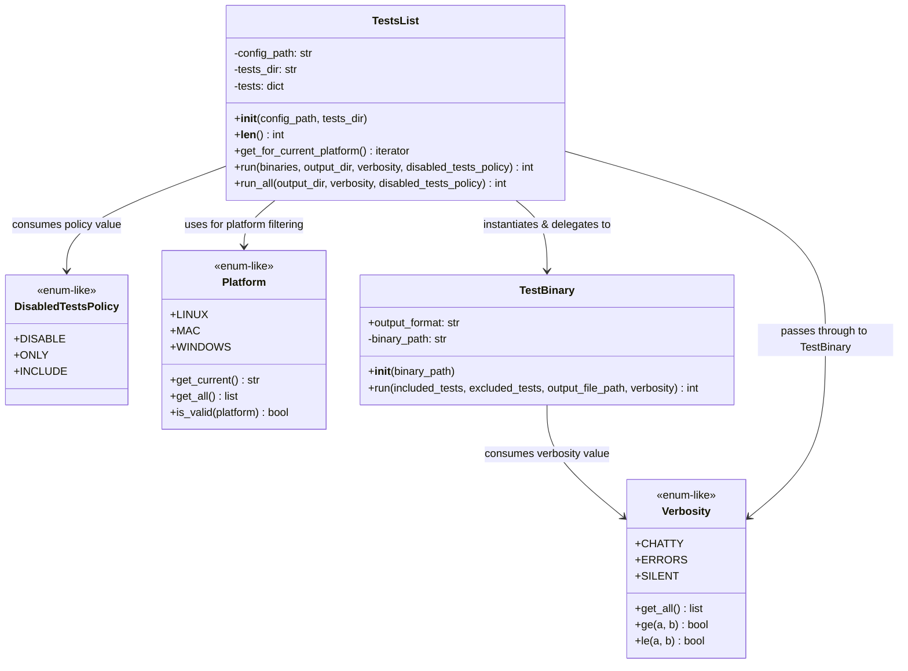
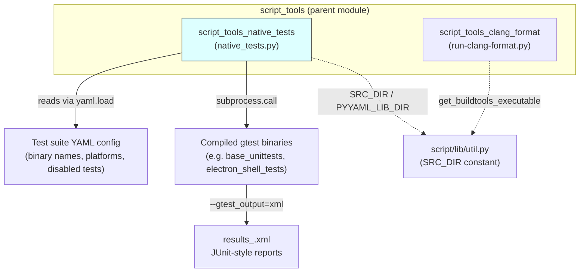
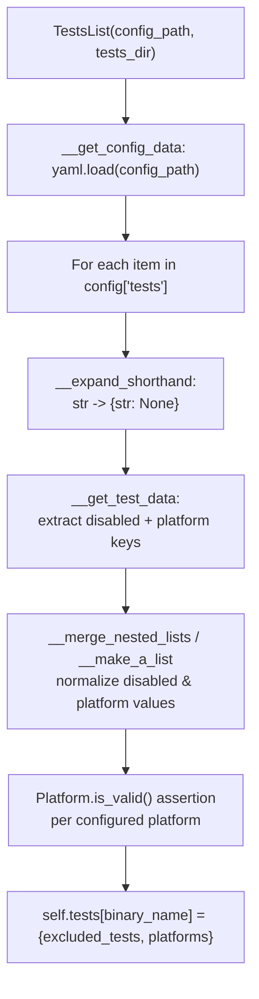
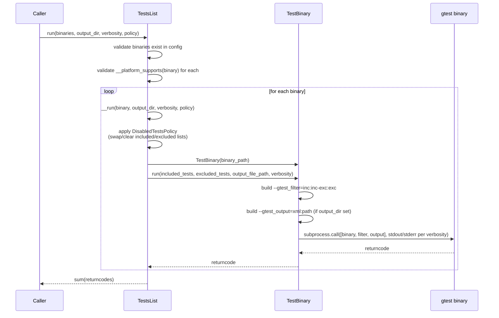
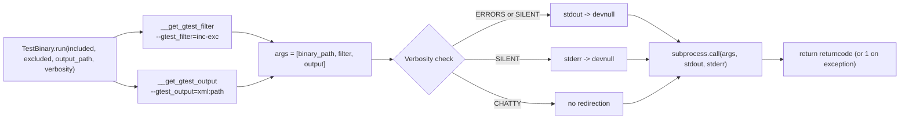
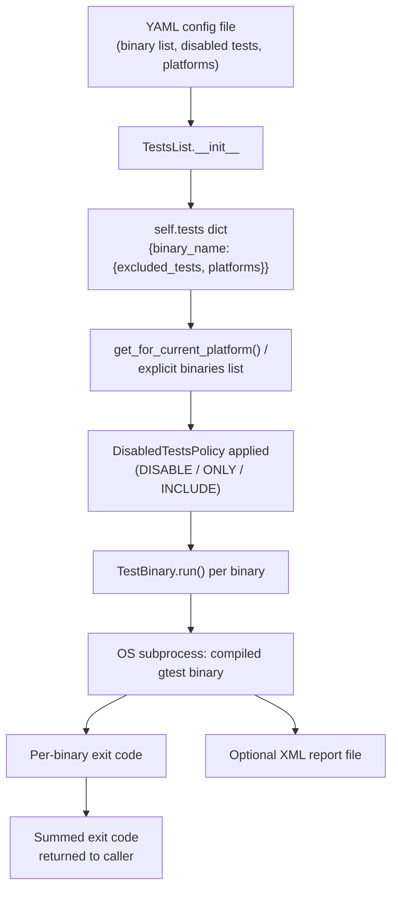

# Script Tools: Native Tests

## Introduction

The **Script Tools: Native Tests** module (`script/lib/native_tests.py`) is a Python library that powers Electron's native (C++) test-execution tooling. It provides a declarative, YAML-driven way to describe a suite of GoogleTest (`gtest`) binaries — which platforms they run on, which individual tests are disabled, and how their output should be collected — and then executes them with consistent verbosity, filtering, and JUnit/XML reporting semantics.

This module is consumed by higher-level CI/build scripts (in the `script/` directory) that need to run Electron's native unit-test binaries (e.g. `base_unittests`, `electron_shell_tests`) across Linux, macOS, and Windows CI shards. It is a sibling of the [Script_Tools_Clang_Format](script_tools_clang_format.md) module within the broader `script_tools` toolset used for Electron's build/development pipeline (see [Build_&_Development_Tooling](build_webpack_tools.md) for related build-time tooling).

---

## Purpose & Core Functionality

Electron ships many native (non-JS) unit test binaries built via GN/Ninja. Running all of them correctly requires:

1. Knowing **which binaries exist** and **where they live** on disk.
2. Knowing **which platform(s)** each binary is expected to run on (some tests are Linux-only, Windows-only, etc.).
3. Knowing which **individual test cases are disabled** (flaky/broken) and honoring different **disabled-test policies** (skip them, run *only* them, or ignore the disabled list entirely).
4. Invoking each binary as a subprocess with the correct `--gtest_filter` and `--gtest_output` flags, aggregating return codes, and controlling how much of the binary's stdout/stderr is surfaced.

`native_tests.py` implements all of this as a small, self-contained library with no external dependencies beyond `PyYAML` (vendored from `third_party/pyyaml`) and the standard library.

### Key Responsibilities

- **Configuration parsing** — reads a YAML config file describing the test suite (`TestsList`).
- **Platform detection & filtering** — determines the current OS and filters the configured binaries to those applicable (`Platform`).
- **Test binary execution** — wraps a single `gtest` binary and executes it as a subprocess with proper filter/output flags (`TestBinary`).
- **Disabled-test policy handling** — allows the caller to choose whether disabled tests are excluded, run exclusively, or included alongside everything else (`DisabledTestsPolicy`).
- **Output verbosity control** — a small ordered enum (`Verbosity`) that governs whether subprocess stdout/stderr is shown, suppressed, or run silently.

---

## Architecture

### Component Overview



### Relationship to the Wider `script_tools` Toolset



`native_tests.py` shares its parent `script_tools` module with `run-clang-format.py` ([Script_Tools_Clang_Format](script_tools_clang_format.md)); both are independent CLI-facing helper libraries under `script/`, but neither depends on the other. Both rely on `script/lib/util.py` for shared path constants (`SRC_DIR`, `ELECTRON_DIR`) — see the [Build_&_Development_Tooling](build_webpack_tools.md) documentation for how these fit into the overall build/dev workflow, including the webpack-based bundling pipeline (`AccessDependenciesPlugin`) used elsewhere in that tooling family.

---

## Component Details

### `Verbosity`

A lightweight ordered-enum utility with three levels, ordered from least to most output:

| Constant | Meaning |
|---|---|
| `SILENT` | No stdout or stderr shown |
| `ERRORS` | stderr only |
| `CHATTY` | stdout and stderr (default) |

It exposes ordering helpers (`ge`, `le`) built on top of `get_all()`'s canonical ordering, which `TestBinary.run` uses to decide whether to redirect a subprocess's stdout/stderr to `/dev/null`.


### `DisabledTestsPolicy`

A simple string-constant enum describing how `TestsList.run`/`__run` should treat the `excluded_tests` list configured per binary:

- **`DISABLE`** (default) — excluded tests are passed to `gtest_filter` as exclusions; everything else runs normally.
- **`ONLY`** — inverts the lists: only the previously-excluded (disabled) tests are run, everything else is excluded. Used to specifically validate that "disabled" tests are still failing/flaky as expected.
- **`INCLUDE`** — the exclusion list is cleared entirely; all tests run, including normally-disabled ones.

### `Platform`

Provides a small cross-platform abstraction over `sys.platform`:

- `get_current()` maps `sys.platform` (`linux`/`linux2`, `darwin`, `cygwin`/`win32`) to one of `Platform.LINUX`, `Platform.MAC`, `Platform.WINDOWS`, raising `AssertionError` for anything unrecognized.
- `get_all()` / `is_valid()` support config validation — every `platform:` entry in the YAML config is checked against this set at parse time.

### `TestsList`

The central orchestrator. Constructed with:
- `config_path` — path to a YAML file describing the test suite.
- `tests_dir` — directory containing the compiled test binaries.

#### Configuration Format (conceptual)

The YAML config's `tests:` key is a list of items, each either:
- a bare string (shorthand for a binary with no special config), or
- a mapping of `binary_name -> { disabled: [...], platform: [...] }`.

`__get_test_data` normalizes both shapes into a canonical `{ excluded_tests: [...], platforms: [...] }` dict per binary, defaulting `platforms` to *all* platforms and `excluded_tests` to an empty list when unspecified. The `disabled` key supports either a flat list or a dict-of-lists (merged via `__merge_nested_lists`), useful for grouping disabled tests by reason/bug link in the YAML source while flattening them for `gtest_filter` purposes.



#### Execution Flow

`run()` is the main entry point used by callers who want to run a specific subset of binaries; `run_all()` is a convenience wrapper that first calls `get_for_current_platform()` to select every binary supported on the host OS.



Key behaviors to note:

- **Fail-fast validation**: `run()` raises an `Exception` immediately if any requested binary name is absent from the config, or if a requested binary is not supported on the current host platform — this happens *before* any subprocess is spawned.
- **Deduplication**: `binaries` is coerced to a `set` so requesting the same binary twice only runs it once.
- **Aggregate return code**: the overall suite return code is the **sum** of each individual binary's return code (not just a boolean pass/fail), so a caller inspecting the final code can distinguish "one binary failed" from "multiple binaries failed" (though it cannot distinguish *which* failed from the aggregate alone — output files / logs are needed for that).
- **Per-binary XML output**: when `output_dir` is provided, each binary's results are written to `results_<binary_name>.xml` via `--gtest_output=xml:<path>`, suitable for CI JUnit ingestion.

### `TestBinary`

A thin wrapper around a single compiled test executable. Responsible only for:

1. Building the `--gtest_filter=<included>-<excluded>` argument (gtest's built-in filter syntax: tests matching the positive list minus tests matching the negative list, colon-separated).
2. Building the `--gtest_output=xml:<path>` argument when an output path is given.
3. Invoking `subprocess.call` with stdout/stderr redirected to `os.devnull` depending on `verbosity`.
4. Catching and reporting exceptions raised during subprocess invocation, returning `1` on failure so the caller's aggregate return-code sum reflects the failure.



---

## Data Flow Summary



---

## Usage Pattern (Typical Caller)

While this module itself contains no `__main__` entry point (it is a library, not a standalone CLI), the typical usage pattern from a calling script under `script/` looks like:

```python
from lib.native_tests import TestsList, DisabledTestsPolicy, Verbosity

tests = TestsList(config_path='path/to/native-tests.yaml',
                   tests_dir='/out/Release')

# Run everything applicable to the current OS.
exit_code = tests.run_all(output_dir='/out/test-results',
                           verbosity=Verbosity.CHATTY,
                           disabled_tests_policy=DisabledTestsPolicy.DISABLE)

sys.exit(exit_code)
```

Or to specifically validate the disabled-tests list (a common CI sanity check to catch stale disabled-test entries that now pass):

```python
tests.run_all(disabled_tests_policy=DisabledTestsPolicy.ONLY)
```

---

## Dependencies

- **`lib.util.SRC_DIR`** — used to locate the vendored `third_party/pyyaml` library, which is added to `sys.path` before importing `yaml`. This ties `native_tests.py` to the Electron/Chromium source-tree layout conventions shared across all `script/` tooling (see [Build_&_Development_Tooling](build_webpack_tools.md)).
- **`PyYAML`** (vendored, not a pip dependency) — used solely for `yaml.load()` on the test config file.
- **Standard library**: `os`, `subprocess`, `sys`.

No other module in the Electron codebase directly depends on `native_tests.py`'s internals beyond invoking `TestsList`/`TestBinary` as described above; it is a leaf utility in the build/test tooling graph.

---

## Related Documentation

- [Script_Tools_Clang_Format](script_tools_clang_format.md) — sibling script-tooling module for source formatting/linting, sharing the same `script_tools` parent and `lib/util.py` path-resolution utilities.
- [Build_&_Development_Tooling](build_webpack_tools.md) — parent-level documentation covering the broader build/dev tooling ecosystem (webpack configs, GN build args such as `build/args/native_tests.gn`, etc.) that this module's output feeds into during CI test execution.
