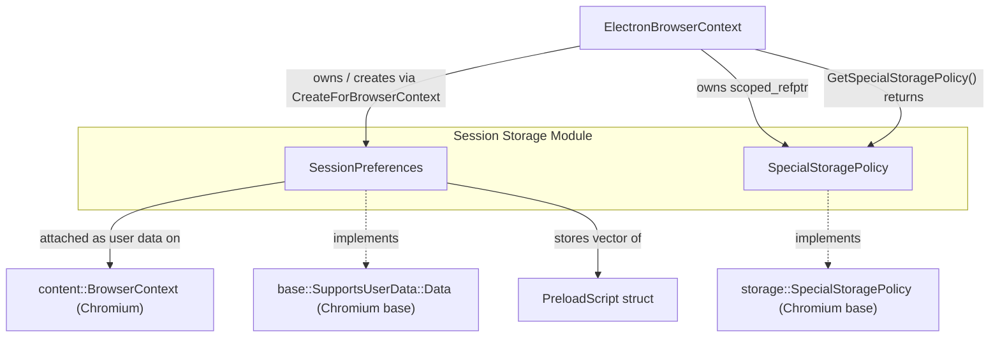
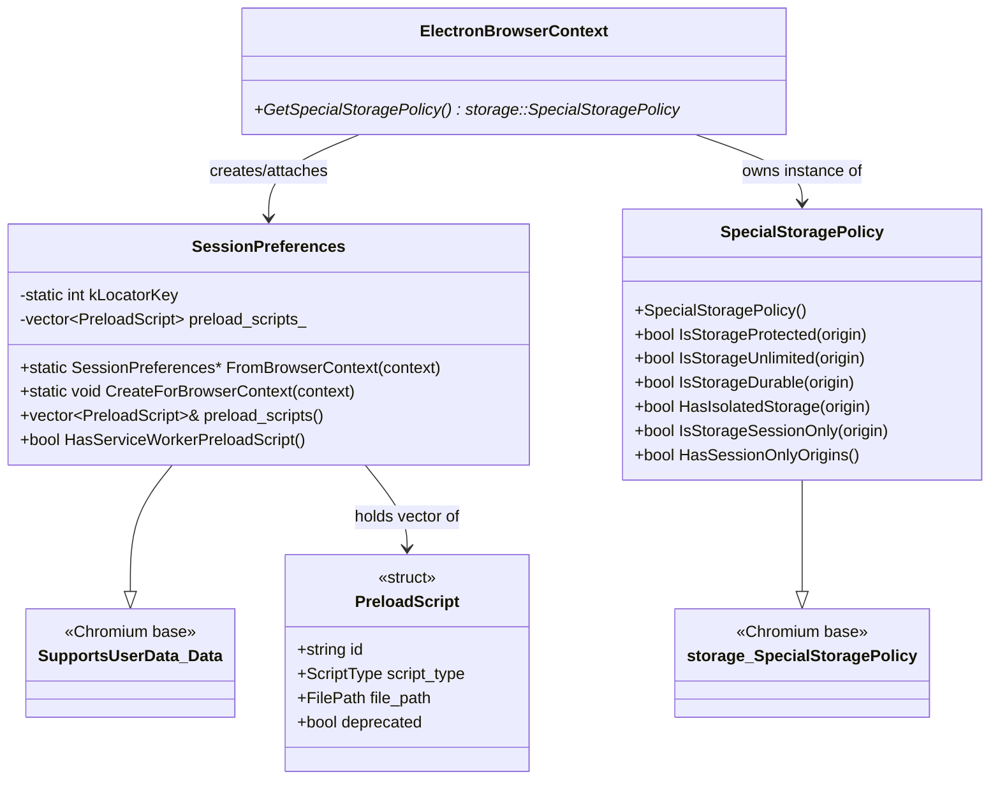
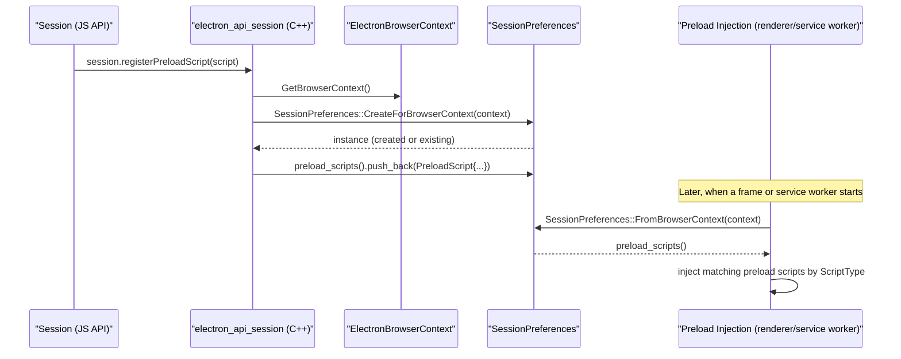
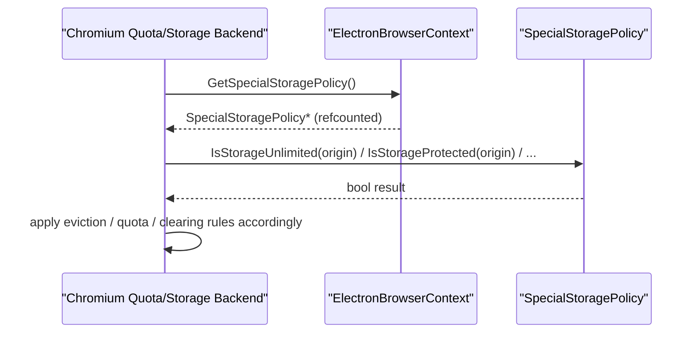
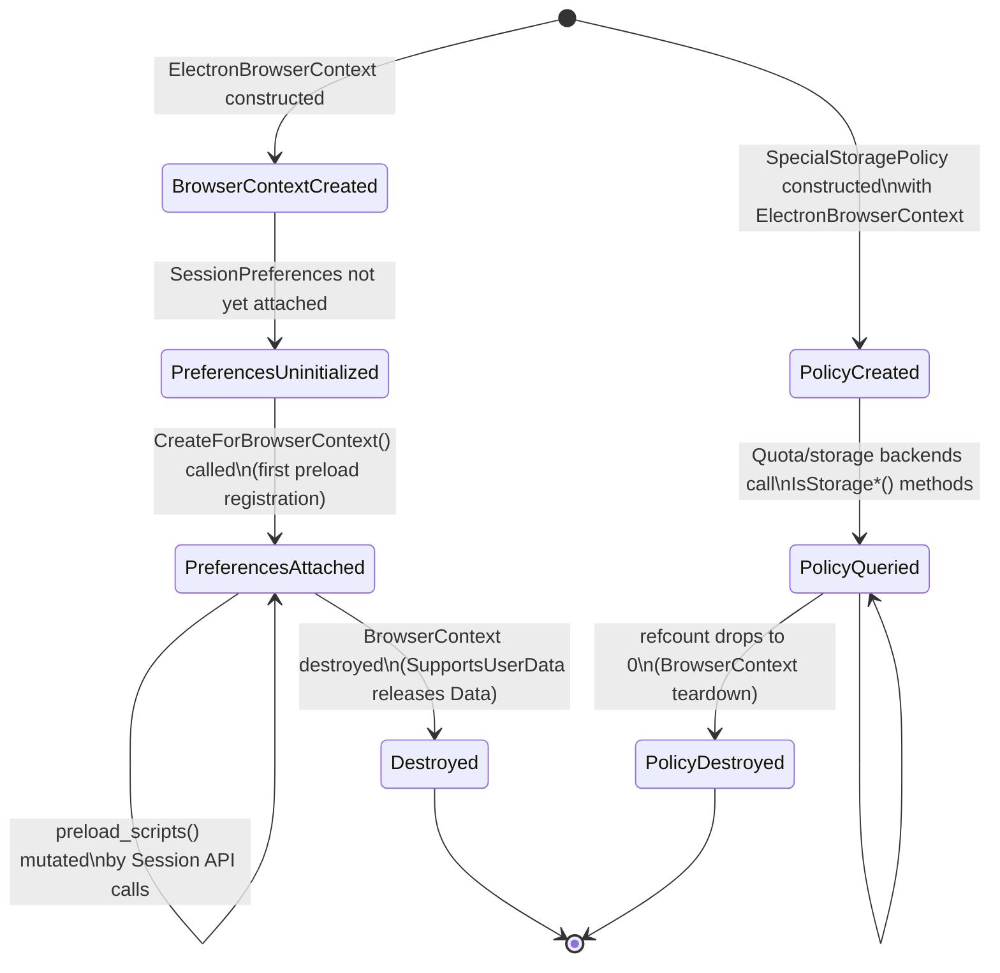

# Session Storage Module

## Introduction

The **Session Storage** module provides two small but critical pieces of infrastructure that back Electron's `Session` API: per-`BrowserContext` preload script bookkeeping (`SessionPreferences`) and quota/storage classification policy (`SpecialStoragePolicy`). Although each class is compact, they act as the glue between the high-level JavaScript-facing `Session` object and Chromium's lower-level `content::BrowserContext` and `storage::SpecialStoragePolicy` subsystems.

This module is a child of [Browser_Context_&_Session_Management](shell_browser_context.md) and is consumed directly by [ElectronBrowserContext](shell_browser_context.md) and the [Session API](shell_browser_api_session_net.md) (`electron_api_session`). It also depends on the [Preload Script](Preload_Script.md) data structure to track preload scripts registered per session.

## Purpose & Core Functionality

| Component | File | Responsibility |
|---|---|---|
| `SessionPreferences` | `shell/browser/session_preferences.h` | Stores per-`BrowserContext` state that doesn't belong on `ElectronBrowserContext` itself — specifically the list of registered `PreloadScript` entries (for both regular web frames and service workers). Attached to a `content::BrowserContext` via Chromium's `base::SupportsUserData` mechanism. |
| `SpecialStoragePolicy` | `shell/browser/special_storage_policy.h` | Implements Chromium's `storage::SpecialStoragePolicy` interface to tell the storage/quota subsystem how to treat data for a given origin (protected, unlimited, durable, isolated, session-only). Electron's implementation is largely permissive by default, deferring fine-grained control to the embedder's `Session` API (e.g. permission handlers). |

Both classes are intentionally minimal — they exist to satisfy Chromium's extension points (`SupportsUserData::Data` and `storage::SpecialStoragePolicy`) while keeping Electron-specific state out of Chromium's own `BrowserContext` implementation.

### SessionPreferences

`SessionPreferences` is a `base::SupportsUserData::Data` object attached to a `content::BrowserContext`. It uses a static integer key (`kLocatorKey`) as the slot identifier in the `BrowserContext`'s user-data map. Key operations:

- `CreateForBrowserContext(context)` — lazily instantiates and attaches a `SessionPreferences` instance to the given `BrowserContext`, if one doesn't already exist.
- `FromBrowserContext(context)` — retrieves the previously attached instance (or `nullptr` if none exists).
- `preload_scripts()` — exposes a mutable vector of `PreloadScript` structs (see [Preload_Script](Preload_Script.md)), which the `Session.setPreloads()` / `Session.registerPreloadScript()` JS APIs populate.
- `HasServiceWorkerPreloadScript()` — convenience check used by the service-worker preload machinery (see [Preload_ServiceWorker_(Renderer)](Preload_ServiceWorker_%28Renderer%29.md)) to decide whether service worker preload injection logic needs to run at all.

### SpecialStoragePolicy

`SpecialStoragePolicy` extends `storage::SpecialStoragePolicy`, the interface Chromium's Quota Manager and storage backends (Cookies, IndexedDB, LocalStorage, Cache Storage, etc.) consult to decide how to treat storage for a given origin. Electron's implementation intentionally opts out of Chrome's built-in policy concepts (extension protection, unlimited storage allowlists, durable storage prompts) since these are either not applicable to Electron apps or are instead controlled through Electron's own permission and session APIs:

- `IsStorageProtected` — whether the origin's storage should be protected from bulk clearing.
- `IsStorageUnlimited` — whether quota limits are waived for the origin.
- `IsStorageDurable` — whether storage should persist without eviction.
- `HasIsolatedStorage` — whether the origin gets storage isolated from other origins beyond the standard partitioning.
- `IsStorageSessionOnly` / `HasSessionOnlyOrigins` — used to support "session-only" cookie/storage semantics (data cleared when the session ends).

It is instantiated once per `ElectronBrowserContext` and returned via `ElectronBrowserContext::GetSpecialStoragePolicy()`.

## Architecture

## Component Relationships

## Data Flow: Preload Script Registration

## Data Flow: Storage Policy Consultation

## Lifecycle

## Integration with Other Modules

- **[Browser_Context_&_Session_Management](shell_browser_context.md)** — `ElectronBrowserContext` is the owner and primary consumer of both classes in this module. It creates `SessionPreferences` on demand and holds a `scoped_refptr<storage::SpecialStoragePolicy>` pointing to a `SpecialStoragePolicy` instance, returning it via the overridden `GetSpecialStoragePolicy()`.
- **[shell_browser_api_session_net](shell_browser_api_session_net.md)** — The `Session` JS API (`electron_api_session.h/.cc`) is the primary caller that mutates `SessionPreferences::preload_scripts()` in response to `session.setPreloads()` / `session.registerPreloadScript()` / `session.unregisterPreloadScript()` calls.
- **[Preload_Script](Preload_Script.md)** — Defines the `PreloadScript` struct stored by `SessionPreferences`. This struct captures the script's unique id, type (`kWebFrame` vs `kServiceWorker`), file path, and legacy validation flag.
- **[Preload_ServiceWorker_(Renderer)](Preload_ServiceWorker_%28Renderer%29.md)** — Renderer-side service worker preload logic queries `SessionPreferences::HasServiceWorkerPreloadScript()` and iterates `preload_scripts()` to determine which scripts to inject into service worker execution contexts.
- **Chromium Storage/Quota Subsystem** — `SpecialStoragePolicy` implements the `storage::SpecialStoragePolicy` interface consumed internally by Chromium's `QuotaManager`, `CookieStore`, and related storage backends to decide eviction, quota, and clearing behavior per origin.

## Design Notes

- Both classes favor **simplicity over configurability** at this layer: `SpecialStoragePolicy`'s methods are implemented with straightforward, mostly permissive logic, since Electron delegates fine-grained per-origin storage/permission decisions to the embedding application via the `Session`/`permission` JS APIs rather than baking Chrome-style policies (extensions allowlists, unlimited storage prompts) into the browser layer.
- `SessionPreferences` uses the `base::SupportsUserData` pattern (a common Chromium idiom) instead of being a direct member of `ElectronBrowserContext`, which keeps optional/lazy per-context state decoupled from the context's main class definition and avoids bloating `ElectronBrowserContext` with every small feature's state.
- Both objects are scoped to the lifetime of their owning `content::BrowserContext` — `SessionPreferences` is destroyed automatically when the `BrowserContext`'s user data map is torn down, and `SpecialStoragePolicy` is reference-counted and released when the last reference (typically held by `ElectronBrowserContext` and Chromium's storage backends) is dropped.
