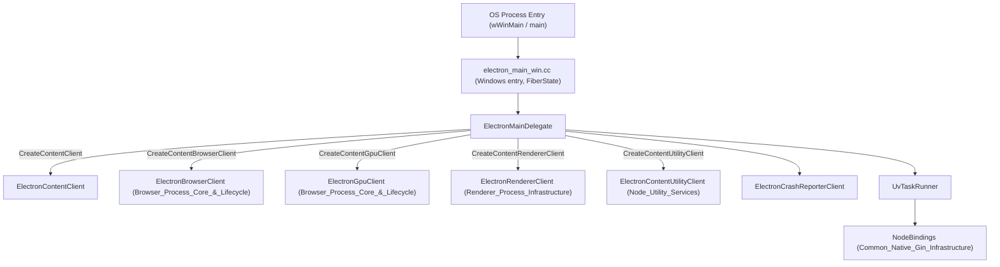
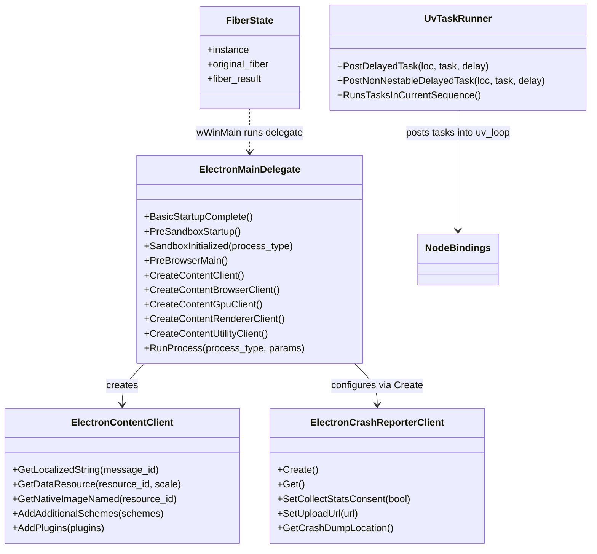

# Shell App Module (`shell/app`)

## 1. Purpose

The `shell_app` module is the **entry point layer** of the Electron runtime's C++ codebase. It contains the very first
code that runs when an Electron application process starts—whether that process ends up being the **browser**
(main) process, a **renderer**, a **GPU** process, or a **utility** process. Its responsibilities are narrowly
scoped but foundational:

- Provide the `content::ContentMainDelegate` implementation (`ElectronMainDelegate`) that Chromium's `//content`
  layer calls into during startup to create the various process-specific clients (browser, GPU, renderer, utility).
- Provide platform entry points (e.g. `wWinMain` on Windows) that perform pre-Chromium initialization such as
  command-line parsing, crash-handler bootstrapping, and (on 32-bit Windows) moving execution onto a
  larger-stack fiber.
- Supply small, cross-cutting infrastructure pieces needed very early in the process lifetime:
  - `ElectronContentClient` – exposes localized strings/resources to `//content`.
  - `ElectronCrashReporterClient` – configures Crashpad/Breakpad crash reporting before almost anything else runs.
  - `UvTaskRunner` – bridges Chromium's `base::SingleThreadTaskRunner` abstraction onto libuv's event loop so
    that Node.js and Chromium can share a single thread's scheduling primitives.

Because this module executes before most of the rest of Electron is initialized, it deliberately has very few
dependencies and instead *creates* the objects that later modules (browser process core, renderer process
infrastructure, node bindings, etc.) rely on.

## 2. Architecture Overview

**Key flow:**
1. The OS invokes the platform-specific entry function (e.g. `wWinMain`, implemented in
   `shell/app/electron_main_win.cc`). This performs argument parsing, decides whether the process should run as a
   plain Node.js process (`--run-as-node`), a Crashpad handler, or a full Electron/Chromium process, and (on
   32-bit Windows) switches to a large-stack fiber via `FiberState`/`FiberBinder` before continuing.
2. For a full Electron process, a `content::ContentMainParams` is built around an `ElectronMainDelegate` instance
   and passed to `content::ContentMain()`, handing control to Chromium's process-startup sequence.
3. `ElectronMainDelegate` is queried by `//content` at each stage of startup (`BasicStartupComplete`,
   `PreSandboxStartup`, `SandboxInitialized`, `PreBrowserMain`, `RunProcess`, etc.) and lazily constructs the
   appropriate `Content*Client` for the process type being launched, handing off to the modules documented below.
4. `ElectronContentClient` and `ElectronCrashReporterClient` are used very early (before most subsystems exist) to
   supply resource strings and to configure crash reporting, respectively.
5. `UvTaskRunner` is created once Node.js integration is needed, letting Chromium's `base::SingleThreadTaskRunner`
   posting APIs enqueue work onto libuv's loop—critical for allowing Node and Chromium to co-exist on one thread.

## 3. Relationship to Other Modules

`shell_app` is intentionally thin—most of the heavy lifting it delegates to is implemented elsewhere in the
codebase:

| Concern | Delegated To |
|---|---|
| Full browser-process startup sequencing (`BrowserMainParts`) | [Browser_Process_Core_&_Lifecycle](shell_browser_main_parts.md) |
| Browser content client behavior (permissions, navigation, etc.) | [Browser_Process_Core_&_Lifecycle](shell_browser_main_parts.md) |
| Renderer-side content client & Node integration | [Renderer_Process_Infrastructure](renderer_client.md) |
| GPU process client | [Browser_Process_Core_&_Lifecycle](shell_browser_main_parts.md) |
| Utility process client / Node utility service | [Node_Utility_Services](utility_content_client.md) |
| Node.js/libuv event-loop internals consumed by `UvTaskRunner` | [Node_Bindings](node_bindings.md) (part of Common Native Gin Infrastructure) |
| Post-fork relaunching of the app (separate executable helper) | [Relauncher](relauncher.md) |
| Command line parsing helpers (`ElectronCommandLine`) | [Common_Infra](common_infra.md) (part of Common Native Gin Infrastructure) |

The `shell_app` module sits at the very root of the dependency graph: nearly everything else in the application is
constructed, directly or indirectly, as a consequence of code in this module running first.

## 4. Sub-modules

This module is organized into three cohesive sub-modules, documented in detail in their own files:

### 4.1 [Main Delegate & Process Entry](shell_app_main_delegate.md)
Covers `ElectronMainDelegate` (the `content::ContentMainDelegate` implementation) and the Windows-specific
process entry point in `electron_main_win.cc`, including the 32-bit fiber-stack workaround (`FiberState`), early
command-line handling, and dispatch to Crashpad-handler mode or plain Node mode.

### 4.2 [Content & Crash Reporter Clients](shell_app_clients.md)
Covers `ElectronContentClient` (resource/string provisioning for `//content`) and
`ElectronCrashReporterClient` (Crashpad/Breakpad configuration singleton), both of which are instantiated very
early in the delegate's lifecycle.

### 4.3 [UV Task Runner](shell_app_task_runner.md)
Covers `UvTaskRunner`, the `base::SingleThreadTaskRunner` adapter that lets Chromium task-posting APIs schedule
work on libuv's loop, enabling shared-thread operation between Node.js and Chromium.

## 5. Component Interaction Diagram

## 6. Notes for Maintainers

- Code here must avoid heavyweight dependencies since it runs before most Chromium/Electron subsystems (task
  scheduling, threading pools, etc.) are available.
- Platform-specific branches (`BUILDFLAG(IS_WIN)`, `BUILDFLAG(IS_MAC)`, `BUILDFLAG(IS_LINUX)`) are common
  throughout this module—changes should be validated across all supported desktop platforms.
- `ElectronMainDelegate` is a natural place to look first when diagnosing very early startup crashes or
  process-type misclassification (e.g. a process launched with the wrong `--type` switch).
