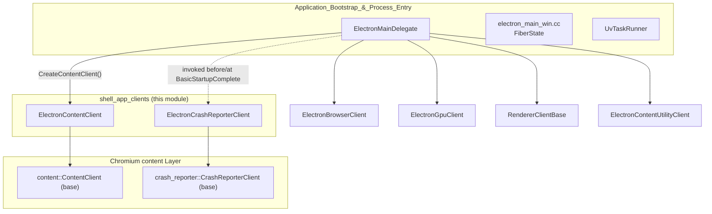
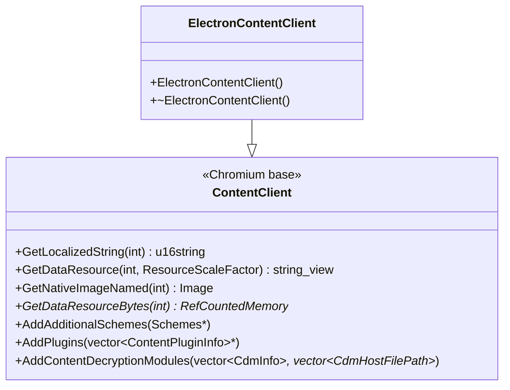
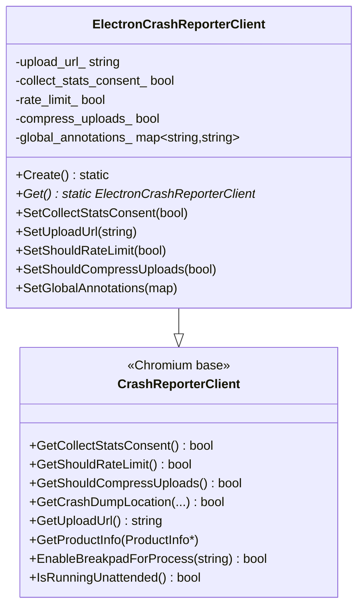
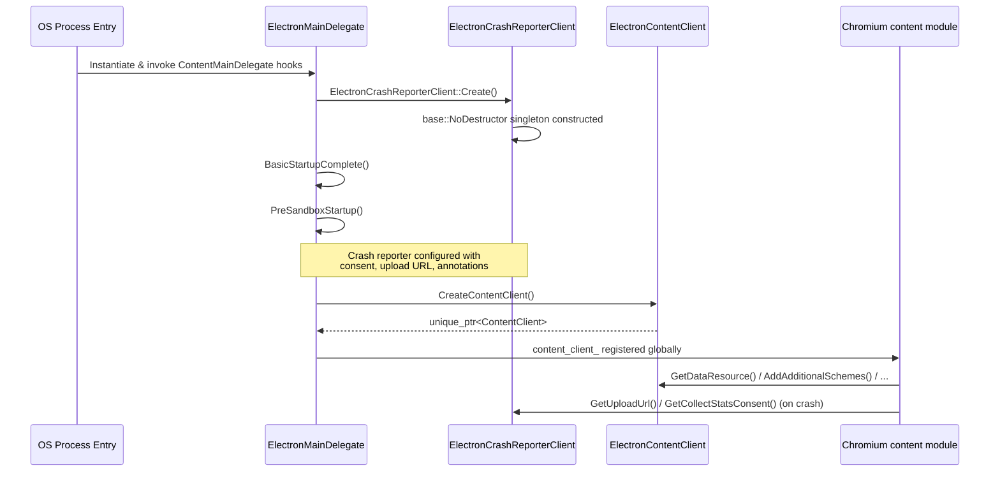
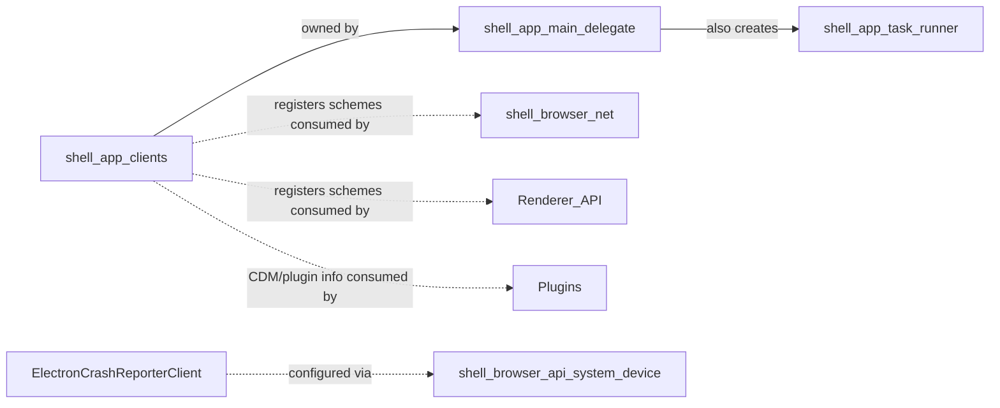

# Shell App Clients

## Introduction

The **shell_app_clients** module provides two foundational "client" classes that Electron's Chromium `content` layer and crash-reporting infrastructure use to customize behavior at the very earliest stage of process startup: `ElectronContentClient` and `ElectronCrashReporterClient`. These classes are instantiated by [Application_Bootstrap_&_Process_Entry](shell_app.md) code — most notably by `ElectronMainDelegate` (see [shell_app_main_delegate.md](shell_app_main_delegate.md)) — before any browser, renderer, GPU, or utility process logic runs. They act as the glue between Electron and Chromium's `content` module contract, supplying resources, scheme registrations, plugin/CDM metadata, and crash-reporting configuration that Chromium expects every embedder to provide.

This module is intentionally small and low-level: it contains no business logic of its own, but rather implements interfaces defined by Chromium (`content::ContentClient` and `crash_reporter::CrashReporterClient`) so that the rest of Electron's process machinery can rely on consistent, centralized configuration.

---

## Module Purpose & Responsibilities

| Component | Base Class | Responsibility |
|---|---|---|
| `ElectronContentClient` | `content::ContentClient` | Supplies localized strings, packaged data resources, native images, additional URL schemes, plugin info, and Content Decryption Module (CDM) registrations to the Chromium `content` layer. |
| `ElectronCrashReporterClient` | `crash_reporter::CrashReporterClient` | Configures and answers queries from Chromium's crash reporting subsystem: upload URL, consent, rate limiting, compression, annotations, and platform-specific crash dump behavior. |

Both classes are **singleton-style, per-process client objects**. They are created once during process bootstrap and queried repeatedly (often on hot paths, e.g. crash time) by Chromium internals — hence they must be lightweight, robust, and thread-safe where required.

---

## Architecture Overview

`ElectronMainDelegate` (documented in [shell_app_main_delegate.md](shell_app_main_delegate.md)) is the orchestrator: its `CreateContentClient()` override constructs and owns an `ElectronContentClient` instance, while `ElectronCrashReporterClient::Create()` is invoked as a static, process-wide singleton setup — typically extremely early, before other subsystems such as the sandbox or feature list are initialized.

---

## Component Details

### ElectronContentClient

`ElectronContentClient` extends `content::ContentClient`, which is Chromium's primary embedder hook for exposing static/packaged content (localized strings, resource bytes, images) and registering custom behaviors (URL schemes, plugins, CDMs).

Key overridden hooks:
- **`GetLocalizedString`** — returns localized UI strings for resource IDs used by Chromium internals (e.g., default dialog text).
- **`GetDataResource` / `GetDataResourceBytes`** — surfaces packaged `.pak` resource data (icons, HTML, CSS) bundled with Electron.
- **`GetNativeImageNamed`** — resolves platform-native images (icons) requested by Chromium UI code.
- **`AddAdditionalSchemes`** — registers Electron's custom/privileged URL schemes (e.g., `app://`, `file://` variants) so the network and renderer layers treat them correctly. This directly affects behavior documented in [shell_browser_net.md](shell_browser_net.md) (URL loader factories) and [Renderer_API.md](Renderer_API.md) (scheme-aware fetch/XHR).
- **`AddPlugins` / `AddContentDecryptionModules`** — registers built-in plugin metadata and CDM (e.g., Widevine) host paths, relevant to playback features and the [Plugins](Plugins.md) submodule.

The class disables copy semantics (deleted copy constructor/assignment) since it's meant to be a single owned instance per `ContentMainDelegate`.

### ElectronCrashReporterClient

`ElectronCrashReporterClient` extends `crash_reporter::CrashReporterClient` and centralizes all decisions the crash-reporting pipeline needs across platforms (Windows, macOS, Linux).

Design characteristics:
- **Singleton access pattern** — `Create()` constructs the process-wide instance (via `base::NoDestructor`), and `Get()` retrieves it. This mirrors common Chromium embedder patterns to avoid static-destruction-order issues.
- **Mutable configuration surface** — setters (`SetCollectStatsConsent`, `SetUploadUrl`, `SetShouldRateLimit`, `SetShouldCompressUploads`, `SetGlobalAnnotations`) allow the JS-facing `crashReporter` API (see [shell_browser_api_system_device.md](shell_browser_api_system_device.md) — conceptually related to app-level services) to reconfigure crash behavior at runtime, e.g. in response to `app.setUploadURL` or consent dialogs.
- **Platform-conditional overrides** — methods like `GetReporterLogFilename` (Linux), `GetProductNameAndVersion` / `GetCrashDumpLocation` (Windows), and `ReportingIsEnforcedByPolicy` (macOS) are compiled only for their respective `BUILDFLAG`, keeping platform-specific crash semantics isolated while sharing the common configuration state (`upload_url_`, `collect_stats_consent_`, etc.).
- **Private constructor/destructor** — enforced via `friend class base::NoDestructor<ElectronCrashReporterClient>`, preventing external instantiation outside the singleton accessor.

---

## Process Bootstrap Data Flow

1. **Process entry** — the OS-level `main()` (see `shell/app/electron_main_win.cc` and platform equivalents in [shell_app_main_delegate.md](shell_app_main_delegate.md)) creates a `content::ContentMainRunner` configured with `ElectronMainDelegate`.
2. **Crash reporter setup** — very early (often before sandbox initialization), `ElectronCrashReporterClient::Create()` is called so that any crash occurring during startup can still be captured and reported.
3. **Content client creation** — `ElectronMainDelegate::CreateContentClient()` returns an `ElectronContentClient`, which `content::ContentMainRunner` stores and uses throughout the process lifetime to resolve resources and schemes.
4. **Ongoing queries** — throughout the process's life, Chromium internals call back into these two clients: `ElectronContentClient` for resource/scheme/plugin queries, and `ElectronCrashReporterClient` for crash-handling decisions (upload URL, consent, annotations) whenever a crash dump is generated.

---

## Relationship to Other Modules

- **[shell_app_main_delegate.md](shell_app_main_delegate.md)** — `ElectronMainDelegate` is the direct consumer/owner of `ElectronContentClient` and the trigger point for `ElectronCrashReporterClient::Create()`. Refer there for the full process startup sequence, sandbox initialization, and per-process-type dispatch (`RunProcess`).
- **[shell_app_task_runner.md](shell_app_task_runner.md)** — sibling module providing `UvTaskRunner`, used to bridge libuv's event loop with Chromium's `base::SingleThreadTaskRunner` abstraction; instantiated in the same bootstrap phase but serves an unrelated concern (task scheduling rather than client configuration).
- **[shell_browser_net.md](shell_browser_net.md)** — the custom/privileged schemes registered via `AddAdditionalSchemes` are enforced and interpreted by the networking layer's URL loader factories.
- **[Renderer_API.md](Renderer_API.md)** — renderer-side code relies on the same scheme registrations for consistent fetch/XHR/CORS behavior.
- **[Plugins.md](Plugins.md)** — `AddPlugins`/`AddContentDecryptionModules` feed into plugin resolution utilities.
- **[shell_browser_api_system_device.md](shell_browser_api_system_device.md)** — the JavaScript-facing `crashReporter`/`app` APIs (e.g., `App` in `electron_api_app.h`) call into `ElectronCrashReporterClient::Get()` and its setters to apply user/application-level crash reporting configuration at runtime.

---

## Design Notes & Conventions

- **Non-copyable clients**: Both classes explicitly delete their copy constructor and copy-assignment operator, reflecting their role as unique, process-scoped singletons rather than value types.
- **Minimal footprint**: Neither class contains complex business logic — they are thin adapters that delegate to Electron's broader configuration (packaged resources, command-line flags, user consent state) which lives in other modules (e.g., [Common_Infra.md](Common_Infra.md) for command-line parsing via `ElectronCommandLine`).
- **Platform conditionals via `BUILDFLAG`**: `ElectronCrashReporterClient` uses `#if BUILDFLAG(IS_WIN)/IS_MAC/IS_LINUX` extensively, since crash dump mechanics differ significantly per OS (Windows uses wide-string paths, breakpad-style flows on Mac/Linux use `base::FilePath`).
- **Static singleton lifetime management**: `base::NoDestructor` is used for `ElectronCrashReporterClient` to guarantee the object is never destructed during process teardown, avoiding races with crash-handling that might occur during shutdown.

---

## Summary

The `shell_app_clients` module is a small but critical seam between Electron and Chromium's `content`/crash-reporting subsystems. It has no downstream logic of its own — its value lies in correctly implementing Chromium's embedder contracts so that resource loading, scheme handling, plugin/CDM registration, and crash reporting behave consistently across all Electron processes (browser, renderer, GPU, utility). Understanding this module is a prerequisite for understanding process bootstrap (see [shell_app_main_delegate.md](shell_app_main_delegate.md)) and for tracing how custom schemes/resources propagate into networking ([shell_browser_net.md](shell_browser_net.md)) and rendering ([Renderer_API.md](Renderer_API.md)) layers.
