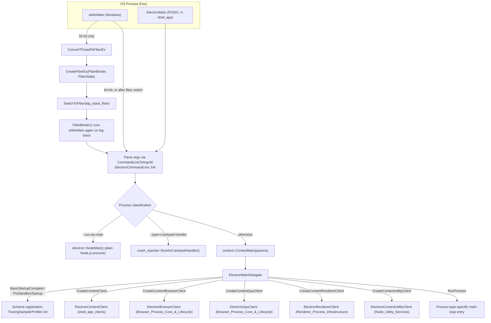
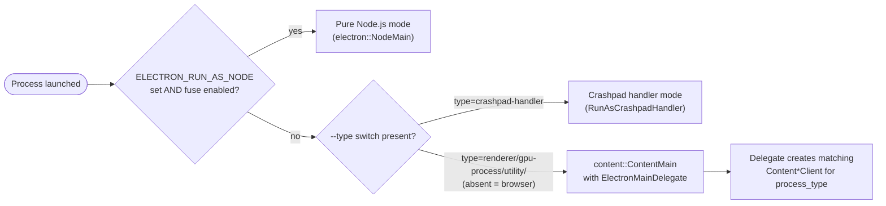
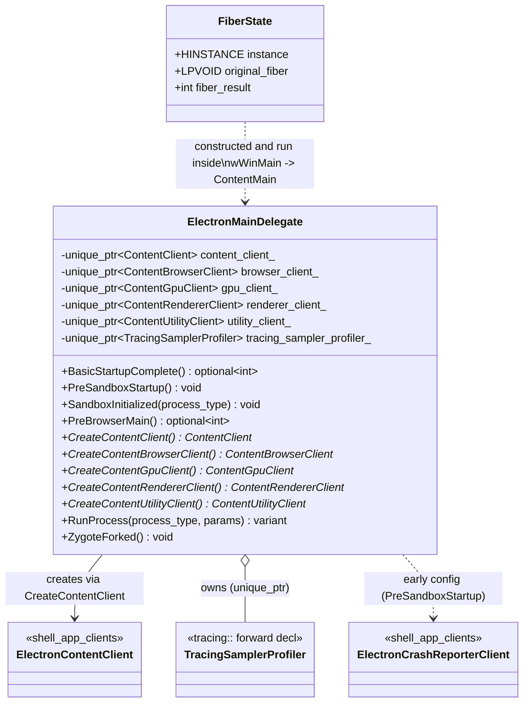

# Main Delegate & Process Entry (`shell_app_main_delegate`)

## 1. Purpose

`shell_app_main_delegate` is the **outermost startup layer** of Electron's C++ runtime. It contains:

- **`ElectronMainDelegate`** — Electron's implementation of Chromium's `content::ContentMainDelegate` interface.
  This is the object that `//content` calls into at every stage of multi-process startup (basic startup,
  sandbox initialization, pre-browser-main, process running, zygote forking on Linux, etc.) in *every* Electron
  process type: browser, renderer, GPU, and utility.
- **The Windows native entry point** (`wWinMain`, implemented in `shell/app/electron_main_win.cc`) together with
  its **`FiberState`** helper struct, used only on 32-bit Windows builds to move execution onto a fiber with a
  larger stack before Chromium/Electron startup proceeds.
- Forward-declared collaborators **`Client`** (a forward declaration of `content::Client`, unused directly but
  present in the header's namespace scaffolding) and **`TracingSamplerProfiler`** (from `tracing::`), which
  `ElectronMainDelegate` owns a `std::unique_ptr` to for CPU sampling profiler support during early startup.

This sub-module is a child of [shell_app](shell_app.md) and is the first code in that module (and arguably in
the entire Electron codebase) to execute for any process. It intentionally contains almost no business logic of
its own — its job is to **classify the process** being launched and **dispatch** to the correct Chromium
`Content*Client` implementation, most of which live in other modules.

## 2. Core Components

| Component | File | Role |
|---|---|---|
| `ElectronMainDelegate` | `shell/app/electron_main_delegate.h` | `content::ContentMainDelegate` implementation; central dispatcher for all process types |
| `FiberState` | `shell/app/electron_main_win.cc` | Transient struct carrying state across a fiber switch on 32-bit Windows |
| `TracingSamplerProfiler` (fwd decl) | `tracing::` namespace, referenced by `electron_main_delegate.h` | CPU sampling profiler owned by the delegate for tracing early process activity |
| `Client` (fwd decl) | `content::` namespace, referenced by `electron_main_delegate.h` | Unused forward declaration retained for header compatibility |
| `wWinMain` | `shell/app/electron_main_win.cc` | Windows GUI-subsystem process entry point (functionally the same role as `main()`/`ElectronMain()` on other platforms) |

### 2.1 `ElectronMainDelegate`

```cpp
class ElectronMainDelegate : public content::ContentMainDelegate {
 public:
  static const char* const kNonWildcardDomainNonPortSchemes[];
  static const size_t kNonWildcardDomainNonPortSchemesSize;
  ElectronMainDelegate();
  ~ElectronMainDelegate() override;

 protected:
  std::string_view GetBrowserV8SnapshotFilename() override;
  std::optional<int> BasicStartupComplete() override;
  void PreSandboxStartup() override;
  void SandboxInitialized(const std::string& process_type) override;
  std::optional<int> PreBrowserMain() override;
  content::ContentClient* CreateContentClient() override;
  content::ContentBrowserClient* CreateContentBrowserClient() override;
  content::ContentGpuClient* CreateContentGpuClient() override;
  content::ContentRendererClient* CreateContentRendererClient() override;
  content::ContentUtilityClient* CreateContentUtilityClient() override;
  std::variant<int, content::MainFunctionParams> RunProcess(...) override;
  bool ShouldCreateFeatureList(InvokedIn invoked_in) override;
  bool ShouldInitializeMojo(InvokedIn invoked_in) override;
  bool ShouldLockSchemeRegistry() override;
#if BUILDFLAG(IS_LINUX)
  void ZygoteForked() override;
#endif

 private:
  std::unique_ptr<content::ContentBrowserClient> browser_client_;
  std::unique_ptr<content::ContentClient> content_client_;
  std::unique_ptr<content::ContentGpuClient> gpu_client_;
  std::unique_ptr<content::ContentRendererClient> renderer_client_;
  std::unique_ptr<content::ContentUtilityClient> utility_client_;
  std::unique_ptr<tracing::TracingSamplerProfiler> tracing_sampler_profiler_;
};
```

Key characteristics:

- **Lazily-constructed clients**: `browser_client_`, `content_client_`, `gpu_client_`, `renderer_client_`, and
  `utility_client_` are all `unique_ptr`s that stay null until the corresponding `Create*Client()` override is
  invoked by `//content`, which only happens for the client type matching the current process's `--type` switch.
  This keeps per-process memory/startup cost minimal (a renderer process never constructs a
  `ContentBrowserClient`, etc.).
- **Platform hooks**: On macOS, `OverrideChildProcessPath()`, `OverrideFrameworkBundlePath()`, and
  `SetUpBundleOverrides()` adjust bundle/framework paths so that helper processes (renderer, GPU) resolve
  resources from the correct `.app` bundle location — details covered in
  [Platform-Specific_Integration](Mac_Util.md).
- **Scheme registration**: `kNonWildcardDomainNonPortSchemes` / `kNonWildcardDomainNonPortSchemesSize` register
  Electron's custom `protocol` schemes with Chromium's URL parsing layer before almost any other startup code
  runs, ensuring schemes registered via the `protocol` API behave consistently across processes.
- **Tracing**: `tracing_sampler_profiler_` is initialized during early startup stages (`PreSandboxStartup` /
  `BasicStartupComplete`) to allow CPU-sampling based performance tracing before the full tracing service is
  available.

### 2.2 `FiberState` and 32-bit Windows Fiber Workaround

```cpp
struct FiberState {
  HINSTANCE instance;
  LPVOID original_fiber;
  int fiber_result;
};

void WINAPI FiberBinder(void* params) {
  auto* fiber_state = static_cast<FiberState*>(params);
  fiber_state->fiber_result = wWinMain(fiber_state->instance, nullptr, nullptr, 0);
  ::SwitchToFiber(fiber_state->original_fiber);
}
```

On 32-bit Windows builds, the OS gives the main thread a small default stack. Because Chromium/Electron's call
stacks (especially with V8 + Node.js + Chromium nested together) can be deep, `wWinMain` converts the main
thread into a fiber and creates a second fiber with a larger (4 MiB) stack via `CreateFiberEx`, running the
*real* `wWinMain` logic (recursively, via `FiberBinder`) on that larger-stack fiber. `FiberState` is the small
piece of shared state used to:
1. Pass the `HINSTANCE` into the new fiber.
2. Remember the `original_fiber` handle so control can be switched back.
3. Carry the eventual process exit code (`fiber_result`) back to the original fiber for return from `wWinMain`.

This mechanism is only compiled under `ARCH_CPU_32_BITS` and is transparent to the rest of the startup
sequence — once switched, execution proceeds exactly as it would on 64-bit builds.

## 3. Architecture Overview



## 4. Startup Sequence Diagram

The following sequence illustrates the concrete decision path taken inside `wWinMain` on Windows (the
POSIX equivalent in `shell_app` follows the same logical branches minus the fiber step):

```mermaid
sequenceDiagram
    participant OS
    participant wWinMain
    participant Fiber as Big-Stack Fiber
    participant CmdLine as ElectronCommandLine
    participant Delegate as ElectronMainDelegate
    participant Content as content::ContentMain

    OS->>wWinMain: process start (argv via GetCommandLineW)
    alt 32-bit build, not already a fiber
        wWinMain->>Fiber: ConvertThreadToFiberEx + CreateFiberEx(FiberBinder)
        Fiber->>wWinMain: SwitchToFiber() re-enters wWinMain on large stack
    end
    wWinMain->>CmdLine: Init(argc, argv)
    wWinMain->>wWinMain: check ELECTRON_RUN_AS_NODE env / fuse
    alt run_as_node
        wWinMain->>wWinMain: NodeMain() and return
    else process_type == crashpad-handler
        wWinMain->>wWinMain: RunAsCrashpadHandler() and return
    else normal Electron process
        wWinMain->>wWinMain: CheckCommandLineArguments()
        wWinMain->>Delegate: construct ElectronMainDelegate
        wWinMain->>Content: ContentMain(params{delegate, instance, sandbox_info})
        Content->>Delegate: BasicStartupComplete()
        Content->>Delegate: PreSandboxStartup()
        Content->>Delegate: SandboxInitialized(process_type)
        Content->>Delegate: PreBrowserMain()
        Content->>Delegate: CreateContent*Client() (per process_type)
        Content->>Delegate: RunProcess(process_type, params)
        Delegate-->>Content: exit code / MainFunctionParams
        Content-->>wWinMain: exit code
    end
    wWinMain-->>OS: return exit code
```



## 5. Process Classification Logic

`ElectronMainDelegate` itself does not decide *which* process type is running — that decision starts even
earlier, in the platform entry function, based on command-line switches and environment variables, before
`content::ContentMain` is invoked at all:



This mirrors (and is shared logic with) the POSIX entry point documented in [shell_app](shell_app.md); the
Windows-specific file adds the fiber-stack workaround, ICU initialization ordering, dark-mode enablement, and
`ExitCodeWatcher` wiring for the Crashpad handler process.

## 6. Component Interaction



## 7. Relationship to Other Modules

As the entry point layer, this sub-module's primary job is *dispatch*; the actual behavior for each process
type is implemented elsewhere:

| `ElectronMainDelegate` hook | Delegates to |
|---|---|
| `CreateContentClient()` | [Content & Crash Reporter Clients](shell_app_clients.md) — `ElectronContentClient` |
| `CreateContentBrowserClient()` | [Browser_Process_Core_&_Lifecycle](shell_browser_main_parts.md) — `ElectronBrowserClient`, which in turn owns `ElectronBrowserMainParts` |
| `CreateContentGpuClient()` | [Browser_Process_Core_&_Lifecycle](shell_browser_main_parts.md) — `ElectronGpuClient` |
| `CreateContentRendererClient()` | [Renderer_Process_Infrastructure](Renderer_Client.md) — `ElectronRendererClient` / `ElectronSandboxedRendererClient` |
| `CreateContentUtilityClient()` | [Node_Utility_Services](Utility_Content_Client.md) — `ElectronContentUtilityClient` |
| Crash reporting configuration invoked during early startup | [Content & Crash Reporter Clients](shell_app_clients.md) — `ElectronCrashReporterClient` |
| Node-only process mode (`--run-as-node`) | `electron::NodeMain()`, see [Node_Bindings](Node_Bindings.md) |
| Crashpad handler process mode | Chromium's `components/crash` (external); coordinated with [Content & Crash Reporter Clients](shell_app_clients.md) |
| Command-line initialization (`ElectronCommandLine::Init`) | [Common_Infra](Common_Infra.md) (part of Common Native Gin Infrastructure) |
| macOS bundle path overrides | [Platform-Specific_Integration](Mac_Util.md) |
| Separate helper-executable relaunch flow | [Relauncher](Relauncher.md) |

Within its own parent module, this sub-module is one of three siblings:

- **[Content & Crash Reporter Clients](shell_app_clients.md)** — objects that `ElectronMainDelegate` constructs
  and configures very early (`ElectronContentClient`, `ElectronCrashReporterClient`).
- **[UV Task Runner](shell_app_task_runner.md)** — infrastructure (`UvTaskRunner`) that becomes relevant once
  Node.js integration begins, typically after the browser or renderer process's `Content*Client` has been
  created by this delegate.

See [shell_app](shell_app.md) for the full picture of how these three sibling sub-modules combine to form the
process bootstrap layer.

## 8. Notes for Maintainers

- **Ordering matters.** Overrides like `BasicStartupComplete`, `PreSandboxStartup`, and `SandboxInitialized` run
  in a strict, Chromium-defined order *before* the sandbox is locked down on the given process. Any code added
  to these methods must avoid assuming filesystem/network access is unrestricted beyond what Chromium already
  permits at that stage.
- **Never eagerly construct all `Content*Client`s.** The lazy-construction pattern (`unique_ptr`, populated only
  in the matching `Create*Client()` override) is intentional and keeps non-browser processes lightweight. Avoid
  refactors that instantiate every client unconditionally in the constructor.
- **32-bit Windows fiber code is fragile.** `FiberState`/`FiberBinder` interact directly with low-level Win32
  fiber APIs (`ConvertThreadToFiberEx`, `CreateFiberEx`, `SwitchToFiber`). Both fibers are intentionally leaked
  (per the inline comments) to avoid TLS-related shutdown crashes — do not "clean this up" without fully
  understanding the TLS implications documented in the source comments.
- **This is the first place to look** when diagnosing: a process launched with an unexpected/missing `--type`
  switch, crashes that occur before any Electron JS runs, or crash-reporter initialization failures (since
  `ElectronCrashReporterClient` setup happens through hooks in this delegate).
- Changes to scheme registration (`kNonWildcardDomainNonPortSchemes`) affect *all* processes and must remain in
  sync with the JS-level `protocol` module's scheme registration options.
