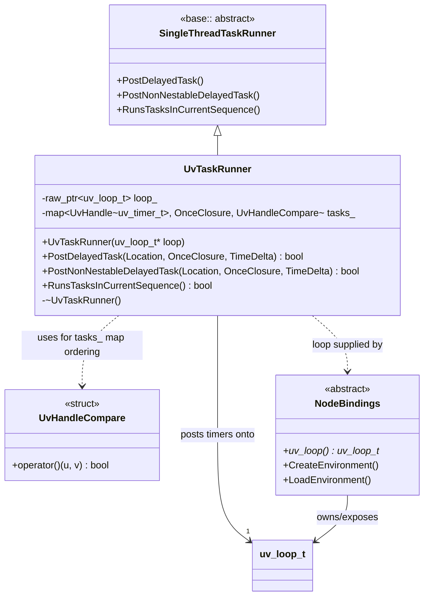
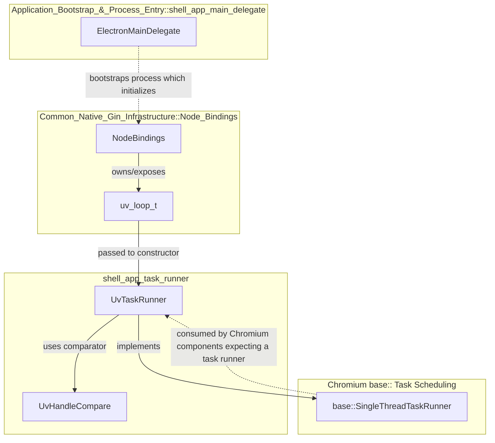
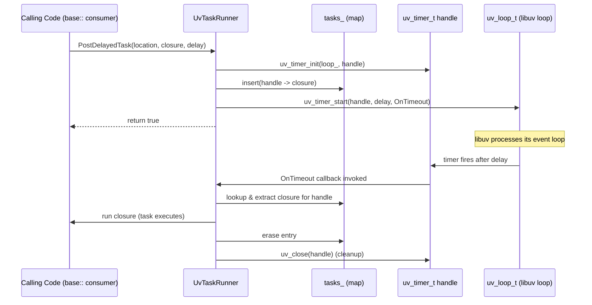
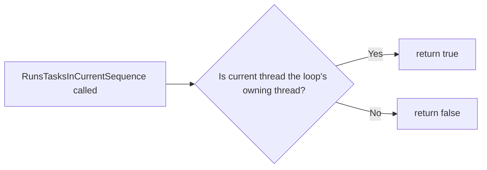

# Shell App Task Runner

## Introduction

The **Shell App Task Runner** module provides a `base::SingleThreadTaskRunner` implementation, `UvTaskRunner`, that bridges Chromium's task-scheduling abstractions with libuv's event loop. It allows Chromium/Electron code that expects a standard `base::SingleThreadTaskRunner` interface to schedule work (including delayed work) directly onto libuv's default loop — the same loop that Node.js uses internally.

This module is a small but critical piece of Electron's **Application Bootstrap & Process Entry** layer. It lives alongside the main process entry point (`electron_main_delegate`) and the process-level client implementations (`electron_content_client`, `electron_crash_reporter_client`), all under `shell/app`. Its purpose is purely infrastructural: enabling libuv-driven task posting so that Node.js's event loop and Chromium's task-posting APIs can interoperate seamlessly during Electron's early startup and throughout the lifetime of the process where a `uv_loop_t` is available.

## Purpose & Core Functionality

Electron embeds Node.js inside Chromium. Node.js relies on libuv (`uv_loop_t`) for its event loop, while Chromium relies on `base::SingleThreadTaskRunner` / `base::TaskRunner` abstractions for scheduling tasks on specific threads. To let Chromium-style code (and any component that accepts a `scoped_refptr<base::SingleThreadTaskRunner>`) schedule callbacks that execute as part of libuv's loop, Electron needs an adapter.

`UvTaskRunner` is that adapter:

- It implements the three key virtual methods required by `base::SingleThreadTaskRunner`:
  - `PostDelayedTask` — schedules a task to run after `delay` on the associated libuv loop.
  - `PostNonNestableDelayedTask` — same semantics as above (libuv is single-threaded per loop and does not support nested task execution distinctions, so this mirrors `PostDelayedTask`).
  - `RunsTasksInCurrentSequence` — reports whether the calling code is running on the thread that owns the associated `uv_loop_t`.
- Internally, each scheduled task is bound to a `uv_timer_t` handle (even for zero-delay tasks, using a zero timeout), and the runner keeps a map from timer handles to their associated `base::OnceClosure` callbacks (`tasks_`) so that when libuv fires the timer callback, the runner can look up and invoke the correct closure and then clean up the timer handle.
- The `UvHandleCompare` comparator (defined in `shell/common/node_bindings.h`) allows the `std::map` of `UvHandle<uv_timer_t>` keys to be ordered/looked-up transparently by raw pointer address, avoiding unnecessary copies or lookups by value.

### Key Responsibilities

| Responsibility | Description |
|---|---|
| Task scheduling | Converts a `base::OnceClosure` + delay into a `uv_timer_t` scheduled on a specific `uv_loop_t` |
| Sequence identity | Determines whether current execution context is on the loop's owning thread |
| Lifecycle management | Owns and cleans up `uv_timer_t` handles once tasks complete |
| Interop | Provides the "glue" that lets Chromium base:: APIs and libuv coexist on the same thread |

## Architecture

`UvTaskRunner` is a thin, self-contained wrapper. Its main external dependency is `uv_loop_t` (from libuv, typically supplied by the `NodeBindings` class) and the `UvHandleCompare`/`UvHandle` utilities also declared in `shell/common/node_bindings.h` (part of the [Common_Native_Gin_Infrastructure](Common_Native_Gin_Infrastructure.md) module's Node Bindings sub-area).

## Component Relationships

`UvTaskRunner` does not exist in isolation — it is typically constructed with the `uv_loop_t*` obtained from a `NodeBindings` instance (see [Common_Native_Gin_Infrastructure](Common_Native_Gin_Infrastructure.md)'s Node Bindings sub-module), which manages the libuv event loop lifecycle for a given process/thread (browser, renderer, worker, or utility environment).

## Data Flow: Posting and Executing a Task

The following sequence illustrates how a task submitted through `UvTaskRunner` is ultimately executed by libuv.

## Process Flow: RunsTasksInCurrentSequence

## Key Types

| Type | Origin | Role |
|---|---|---|
| `UvTaskRunner` | `shell/app/uv_task_runner.h` | Concrete `base::SingleThreadTaskRunner` backed by a libuv loop |
| `base::Location` | Chromium `base::` | Identifies call-site for diagnostics/tracing of posted tasks |
| `base::TimeDelta` | Chromium `base::` | Represents the delay before a task should run |
| `UvHandleCompare` | `shell/common/node_bindings.h` | Transparent comparator enabling pointer-based lookups in `tasks_` map |
| `uv_loop_t` | libuv (external) | The underlying event loop onto which timers/tasks are scheduled |

## Placement in the Broader System

`shell_app_task_runner` is a child of the [shell_app](Application_Bootstrap_&_Process_Entry.md) grouping, which is itself part of the larger **Application Bootstrap & Process Entry** module. Sibling components within `shell_app` include:

- `electron_main_delegate.h` (`ElectronMainDelegate`, `TracingSamplerProfiler`) — the top-level `content::ContentMainDelegate` responsible for initializing per-process clients, sandboxing, and bootstrapping the appropriate process type (browser/renderer/utility/etc.). See [shell_app_main_delegate](Application_Bootstrap_&_Process_Entry.md).
- `electron_content_client.h` / `electron_crash_reporter_client.h` — process-wide `content::ContentClient` and crash-reporting client implementations. See [shell_app_clients](Application_Bootstrap_&_Process_Entry.md).

`UvTaskRunner` complements these by giving any subsystem that needs a `base::SingleThreadTaskRunner`-compatible interface a way to piggyback on the libuv loop already managed by [NodeBindings](Common_Native_Gin_Infrastructure.md) — a core dependency for embedding Node.js, described in the **Common Native/Gin Infrastructure** module documentation. This is especially relevant for scenarios such as:

- Early browser-process startup, before Chromium's full task-scheduling infrastructure is available.
- Utility/Node service processes (see [Node_Utility_Services](Node_Utility_Services.md)) that run primarily driven by libuv.
- Any Electron-internal code that must schedule delayed callbacks consistently with Node.js's own event loop timing.

## Design Notes & Considerations

- **Single loop ownership**: `UvTaskRunner` holds a raw, non-owning pointer (`raw_ptr<uv_loop_t> loop_`) to the loop; the loop's lifetime is managed elsewhere (typically by `NodeBindings`). Callers must ensure the loop outlives the `UvTaskRunner` instance.
- **No true "non-nestable" distinction**: Because libuv's single loop model processes callbacks sequentially without Chromium's nested run-loop semantics, `PostNonNestableDelayedTask` is implemented with the same underlying mechanism as `PostDelayedTask`.
- **Copy-disabled**: The class explicitly disables copy construction/assignment, reflecting its role as a unique adapter tied to one loop and one internal task map.
- **Private destructor**: Following `base::RefCountedThreadSafe`-style patterns used by `SingleThreadTaskRunner` implementations, the destructor is private, requiring `UvTaskRunner` instances to be managed via `scoped_refptr`.

## Related Documentation

- [Application_Bootstrap_&_Process_Entry](Application_Bootstrap_&_Process_Entry.md) — parent module covering main delegate and process entry clients.
- [Common_Native_Gin_Infrastructure](Common_Native_Gin_Infrastructure.md) — home of `NodeBindings`, `UvHandleCompare`, and other Node/V8 integration utilities that `UvTaskRunner` depends on.
- [Node_Utility_Services](Node_Utility_Services.md) — services (e.g., `NodeService`) that run in dedicated utility processes and rely on Node/libuv integration similar to what `UvTaskRunner` supports.
