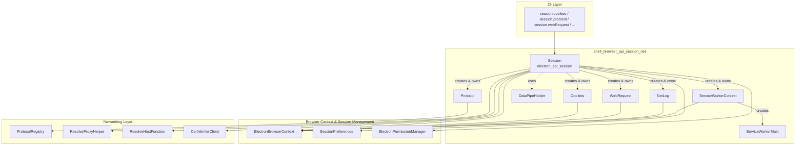
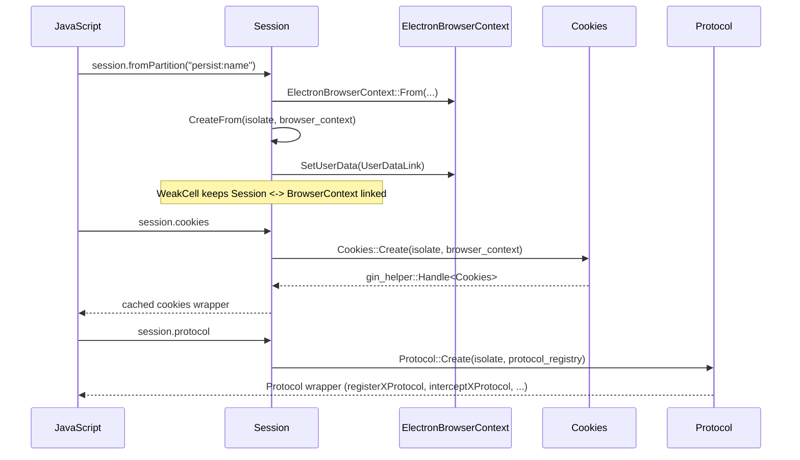
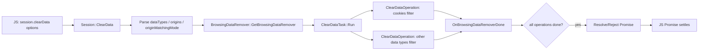

# Shell Browser API: Session & Networking

## Introduction

The **Session & Networking API** module implements the C++/V8 (gin) bindings that back Electron's
JavaScript `session` module and its networking sub-systems. It is the glue layer between Chromium's
`content::BrowserContext` networking stack and the scripting surface exposed to Electron app
developers (`session.cookies`, `session.protocol`, `session.webRequest`, `session.netLog`,
`session.serviceWorkers`, etc.).

At the center of the module is the **`Session`** class (`electron_api_session.h/.cc`), a
`gin::Wrappable` object that is 1:1 with an `ElectronBrowserContext`. `Session` acts as a facade /
service locator: it lazily creates and owns the other API objects in this module (`Cookies`,
`Protocol`, `NetLog`, `ServiceWorkerContext`, `WebRequest`) and exposes storage, proxy, cache,
spellchecker, and preload-script management methods directly.

This module is a child of [Browser_Context_&_Session_Management](shell_browser_context.md) and works
closely with the lower-level networking primitives in the
[Networking Layer](shell_browser_net.md) module.

## Purpose & Scope

* Expose per-`BrowserContext` networking and storage controls to JavaScript (`Session` object).
* Manage HTTP cookies (`Cookies`), custom protocol registration/interception (`Protocol`), network
  event tracing (`NetLog`), request/response interception (`WebRequest`), and Service Worker
  introspection (`ServiceWorkerContext`, `ServiceWorkerMain`).
* Provide storage/cache management (clear cache, clear storage data, clear browsing data), proxy
  configuration, network emulation, SSL config, spellchecker dictionary management, and preload
  script registration — all scoped to a single `Session`/`BrowserContext`.
* Bridge Mojo-based data transport (`DataPipeHolder`) used for reading Blob/data-pipe payloads back
  into V8 buffers.

## Architecture Overview

### Object Lifecycle

## Sub-modules

This module is organized into five closely related but independently documented sub-modules:

| Sub-module | Description | Documentation |
|---|---|---|
| **Session Core** | The `Session` class itself: lifecycle, storage/cache management, proxy & SSL configuration, network emulation, spellchecker, preload scripts, and shared-dictionary cache APIs. | [shell_browser_api_session_net_session_core.md](shell_browser_api_session_net_session_core.md) |
| **Cookies & Data Pipe** | `Cookies` (get/set/remove/flush cookies, change notifications) and `DataPipeHolder` (Mojo data pipe → Blob data bridging). | [shell_browser_api_session_net_cookies_datapipe.md](shell_browser_api_session_net_cookies_datapipe.md) |
| **Protocol & NetLog** | `Protocol` (custom scheme registration/interception, privileged scheme setup) and `NetLog` (network event capture to file). | [shell_browser_api_session_net_protocol_netlog.md](shell_browser_api_session_net_protocol_netlog.md) |
| **WebRequest** | `WebRequest` and its `RequestFilter`/listener infrastructure for intercepting and modifying network requests at various lifecycle stages. | [shell_browser_api_session_net_web_request.md](shell_browser_api_session_net_web_request.md) |
| **Service Workers** | `ServiceWorkerContext` (enumerate/start/stop workers for a partition) and `ServiceWorkerMain` (per-worker wrapper exposing lifecycle events and IPC). | [shell_browser_api_session_net_service_workers.md](shell_browser_api_session_net_service_workers.md) |

## Relationship to Other Modules

* **[Browser_Context_&_Session_Management / shell_browser_context](shell_browser_context.md)** —
  `ElectronBrowserContext` is the Chromium `BrowserContext` subclass that every object in this
  module operates against. `Session::browser_context()` returns a reference to it, and
  `Session::FromBrowserContext` performs the reverse lookup via `UserData` attached to the context.
* **[Session_Storage](Session_Storage.md)** — `SessionPreferences` (attached to the
  `BrowserContext`) stores preload script registrations that `Session::RegisterPreloadScript` /
  `GetPreloadScripts` manipulate.
* **[Networking Layer / shell_browser_net](shell_browser_net.md)** — `ProtocolRegistry` backs the
  `Protocol` API; `ResolveProxyHelper` and `ResolveHostFunction` back `Session::ResolveProxy` /
  `Session::ResolveHost`; `CertVerifierClient` backs `Session::SetCertVerifyProc`.
* **[Protocol_Registry](Protocol_Registry.md)** — dedicated registry object consulted/mutated by
  `Protocol::RegisterProtocol`/`InterceptProtocol`.
* **[WebContents_Rendering_&_Communication / shell_browser_api_webcontents](shell_browser_api_webcontents.md)** —
  `WebRequest` details include the originating `WebContents`/`WebFrameMain`; downloads triggered via
  `Session::DownloadURL` surface through `DownloadItem`.
* **[System_&_App-Level_Services_API / shell_browser_api_system_device](shell_browser_api_system_device.md)** —
  `Session` emits `session-created` on the global `App` object and creates `DownloadItem` and
  (when extensions are enabled) `Extensions` wrapper objects.
* **[Extensions_Subsystem](shell_browser_extensions_api.md)** — `Session::Extensions()` exposes the
  `Extensions` API object when `ENABLE_ELECTRON_EXTENSIONS` is set.
* **[Common_Native_Gin_Infrastructure / Gin_Helper](Gin_Helper.md)** — all classes in this module
  build on `gin_helper::Wrappable`/`DeprecatedWrappable`, `gin_helper::Promise`,
  `gin_helper::Constructible`, and `EventEmitterMixin` for exposing themselves to JavaScript.

## Key Design Patterns

1. **Facade / Service Locator (`Session`)** — Rather than exposing `Cookies`, `Protocol`, etc. as
   independently constructible JS classes, `Session` lazily instantiates and caches them as
   properties (`session.cookies`, `session.protocol`, ...), storing `v8::TracedReference`s to keep
   them alive as long as the `Session` itself.
2. **One object per `BrowserContext`** — `Session::CreateFrom` ensures a single `Session` (and
   therefore single `Cookies`/`Protocol`/`WebRequest`/etc. set) exists per `ElectronBrowserContext`,
   using `UserData` (`UserDataLink`) + `gin::WeakCell` for a safe reverse lookup and lifetime
   management under Oilpan/cppgc garbage collection.
3. **Promise-based async APIs** — Most operations that hit disk or the network service
   (`ClearCache`, `ResolveHost`, `GetCacheSize`, `NetLog::StartLogging`, service worker start/stop)
   return `v8::Promise` via `gin_helper::Promise<T>`.
4. **Filterable request interception (`WebRequest`)** — `RequestFilter` (URL patterns + resource
   types) gates whether a registered JS listener is invoked for a given `WebRequestInfo`; blocking
   listeners (`onBeforeRequest`, `onBeforeSendHeaders`, `onHeadersReceived`) hold the request
   (`net::ERR_IO_PENDING`) until the JS callback replies.
5. **Self-cleanup tasks** — `ClearDataTask`/`ClearDataOperation` in `electron_api_session.cc`
   demonstrate a self-owned, reference-counted task object pattern (deletes itself when all
   sub-operations complete) combined with `gin_helper::CleanedUpAtExit` for safe shutdown ordering.

## Typical Data Flow: Clearing Browsing Data

