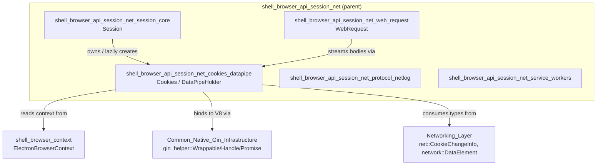
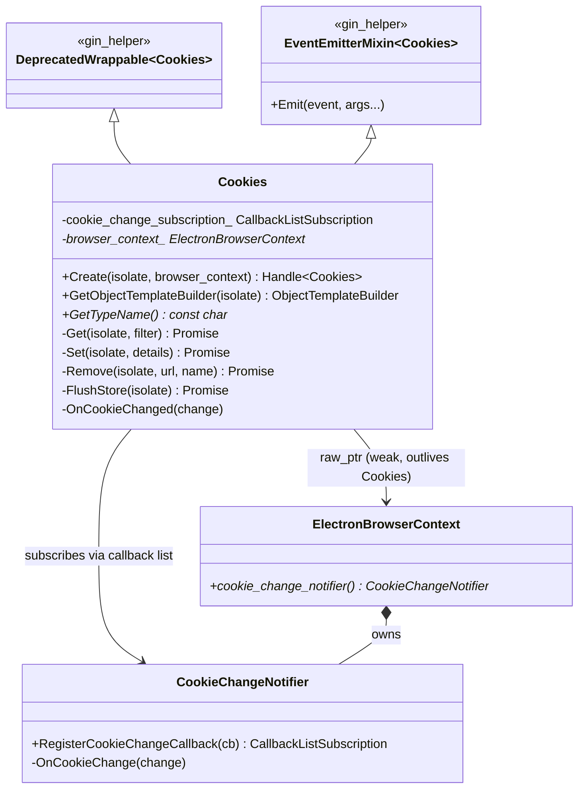
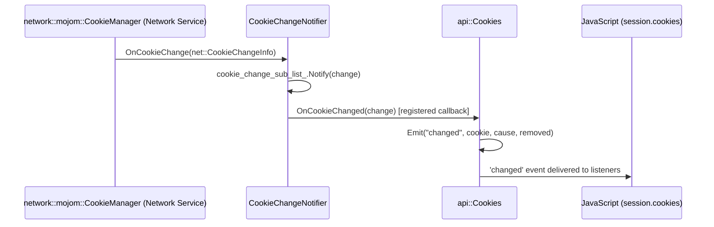
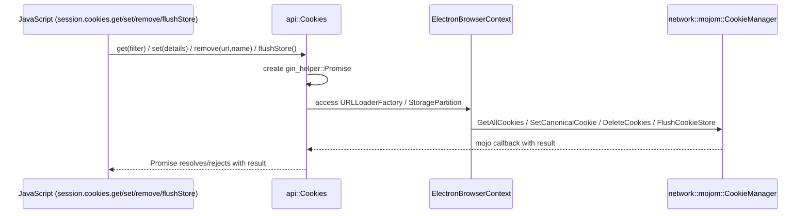
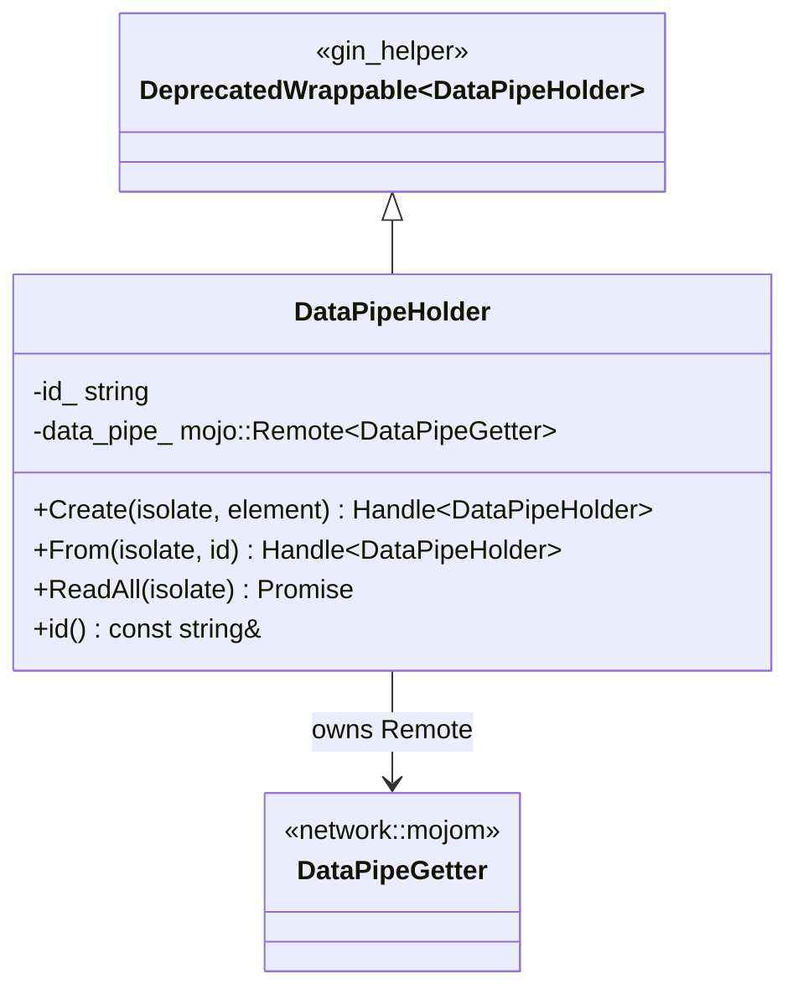
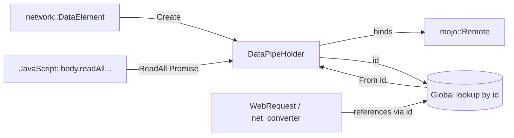
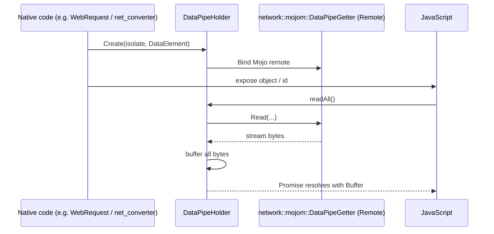
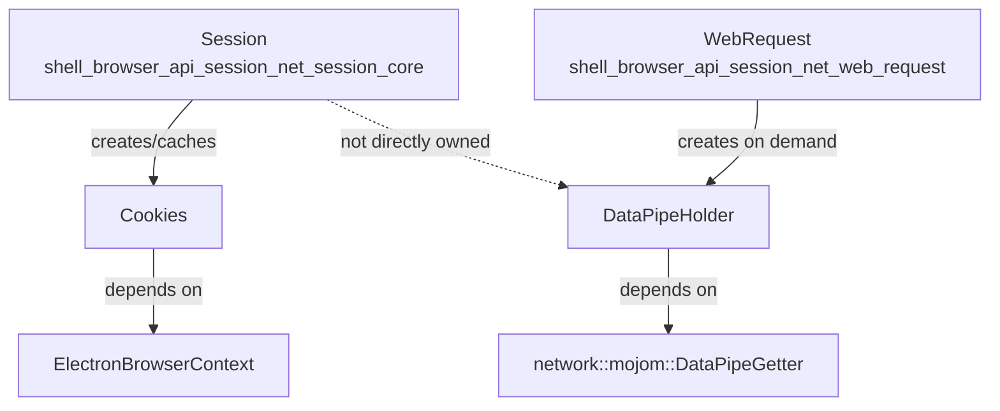

# Cookies & DataPipe APIs (`shell_browser_api_session_net_cookies_datapipe`)

## Introduction

This module provides two closely related, browser-process-side JavaScript-exposed (Gin-wrapped) APIs that are part of Electron's `Session` networking surface:

- **`Cookies`** (`shell/browser/api/electron_api_cookies.h`) — the native backing object for `session.cookies`, exposing cookie CRUD operations and change notifications to JavaScript.
- **`DataPipeHolder`** (`shell/browser/api/electron_api_data_pipe_holder.h`) — a small utility wrapper that retains a Mojo `DataPipeGetter` remote so that streamed body data (e.g. from `net::UploadDataStream` / `network::DataElement`) can be read back into JavaScript as a `Buffer`/`ArrayBuffer` via a Promise.

Both classes are thin C++/Gin bindings that sit at the boundary between Chromium's networking stack (`//net`, `//services/network`) and Electron's V8/Node-based JavaScript API. They are owned indirectly by a `Session`/`ElectronBrowserContext` and are consumed by higher level networking APIs such as `WebRequest` and the URL loader factories.

This document describes their responsibilities, relationships to sibling modules, and the data flow for cookie change notification and data-pipe reading.

---

## Module Position in the System

This module is a child of [shell_browser_api_session_net](shell_browser_api_session_net.md), which groups all of the native `Session`-scoped networking API bindings. Its sibling modules are:

- [shell_browser_api_session_net_session_core](shell_browser_api_session_net_session_core.md) — the `Session` object itself, which owns/exposes a `Cookies` instance.
- [shell_browser_api_session_net_protocol_netlog](shell_browser_api_session_net_protocol_netlog.md) — custom protocol registration and NetLog capture.
- [shell_browser_api_session_net_web_request](shell_browser_api_session_net_web_request.md) — the `WebRequest` API, which uses `DataPipeHolder`-style body streaming for intercepted request/response bodies.
- [shell_browser_api_session_net_service_workers](shell_browser_api_session_net_service_workers.md) — Service Worker context/registration bindings.

It also depends directly on components from:

- [shell_browser_context](shell_browser_context.md) — `ElectronBrowserContext` and `CookieChangeNotifier`, which back the `Cookies` object.
- [Common_Native_Gin_Infrastructure](Common_Native_Gin_Infrastructure.md) — `gin_helper::Wrappable`, `Handle<T>`, `Dictionary`, `Promise`, and the event emitter mixin used to bind these C++ objects into V8.
- [Networking_Layer](Networking_Layer.md) — the Mojo `network::mojom::DataPipeGetter` and `network::DataElement` types consumed by `DataPipeHolder`, and network cookie types (`net::CookieChangeInfo`) consumed by `Cookies`.

---

## Component: `Cookies`

### Purpose

`Cookies` is the native implementation behind the renderer/main-process-facing `session.cookies` JavaScript API. It:

1. Provides Promise-based methods to **get**, **set**, **remove**, and **flush** cookies against the underlying `network::mojom::CookieManager` (accessed indirectly through `ElectronBrowserContext`).
2. Emits a `'changed'` JavaScript event whenever the underlying cookie store changes, by subscribing to `CookieChangeNotifier`.

### Class Structure

### Key Responsibilities

| Method | Description |
|---|---|
| `Create(isolate, browser_context)` | Factory that constructs a `gin_helper::Handle<Cookies>` wrapping a new `Cookies` instance for the given browser context. Called once per `Session` (lazily, on first access to `session.cookies`). |
| `Get(isolate, filter)` | Returns a `Promise` resolving to an array of cookies matching a filter dictionary (url, name, domain, path, secure, session, httpOnly, etc.), delegating to the network cookie manager. |
| `Set(isolate, details)` | Returns a `Promise` that sets/updates a cookie described by a `base::Value::Dict`. |
| `Remove(isolate, url, name)` | Returns a `Promise` that deletes a cookie identified by URL and name. |
| `FlushStore(isolate)` | Returns a `Promise` that forces any pending cookie writes to be flushed to persistent storage. |
| `OnCookieChanged(change)` | Callback invoked by `CookieChangeNotifier` whenever any cookie in the store changes; converts the `net::CookieChangeInfo` into a JS-friendly payload and emits the `'changed'` event via `EventEmitterMixin`. |

### Ownership & Lifetime

- `Cookies` holds a **weak, non-owning `raw_ptr<ElectronBrowserContext>`** — the browser context is guaranteed to outlive the `Cookies` instance since it is owned/created through the browser context or `Session` (see [shell_browser_api_session_net_session_core](shell_browser_api_session_net_session_core.md)).
- On construction, `Cookies` registers a callback with `browser_context->cookie_change_notifier()->RegisterCookieChangeCallback(...)`, storing the returned `base::CallbackListSubscription` (`cookie_change_subscription_`). Destruction automatically unregisters the callback (RAII).
- `CookieChangeNotifier` itself is a `network::mojom::CookieChangeListener` Mojo receiver owned by `ElectronBrowserContext`, that listens for cookie-store-wide changes and fans them out to all registered callbacks (of which `Cookies::OnCookieChanged` is one).

### Data Flow: Cookie Change Notification

### Data Flow: Get/Set/Remove/Flush (Promise-based)

---

## Component: `DataPipeHolder`

### Purpose

`DataPipeHolder` wraps a Mojo `network::mojom::DataPipeGetter` remote (obtained from a `network::DataElement`, typically representing a chunked/streamed upload or response body) and exposes a single JavaScript-facing operation: read the entire pipe content into memory and resolve it as a Promise. It also supports being looked up later by a unique string ID, which allows other native code (e.g. `WebRequest`, `net_converter`) to hand off a reference to JS without transferring the whole Mojo object.

### Class Structure

### Key Responsibilities

| Member | Description |
|---|---|
| `Create(isolate, element)` | Factory constructing a `DataPipeHolder` from a `network::DataElement` (e.g. extracted from a `ResourceRequestBody`/upload data), binding its Mojo `DataPipeGetter` remote and generating a new unique `id_`. |
| `From(isolate, id)` | Look up a previously created, still-alive `DataPipeHolder` instance by its `id()` — used so that an object handle created in one place (e.g. native network code) can be referenced from JavaScript by ID rather than needing the original C++/JS handle to be passed through every layer. |
| `ReadAll(isolate)` | Drains the entire data pipe into memory and resolves the returned `Promise` with the resulting bytes as a `Buffer`. Documented as potentially unsuitable for very large payloads since it buffers the whole stream. |
| `id()` | Accessor for the unique string identifier used by `From()`. |

### Relationship to Networking & WebRequest

`DataPipeHolder` is the mechanism by which streamed body data (represented natively as `network::DataElement`/`network::mojom::DataPipeGetter`) crosses into the JS world as an awaitable `Buffer`. It is primarily used by:

- [shell_browser_api_session_net_web_request](shell_browser_api_session_net_web_request.md)'s `WebRequest`, when intercepted request/response bodies need to be surfaced to JS listeners.
- The [Common_Native_Gin_Infrastructure](Common_Native_Gin_Infrastructure.md) `net_converter` (`shell/common/gin_converters/net_converter.h`), which is responsible for converting `ResourceRequestBody`/`DataElement` structures to/from JS values and would create/reference `DataPipeHolder` instances during that conversion.

### Data Flow: Reading a Data Pipe

---

## Interaction with `Session`

Both `Cookies` and `DataPipeHolder` are consumed at the `Session` level, but in different ways:

- `Session` (see [shell_browser_api_session_net_session_core](shell_browser_api_session_net_session_core.md)) lazily instantiates and caches a single `Cookies` handle per session, exposed as the read-only `session.cookies` property.
- `DataPipeHolder` is not directly owned by `Session`; instead, individual instances are created on demand wherever a streamed body needs to be surfaced to JS (e.g. during `WebRequest` body inspection), and are looked up transiently by ID.

---

## Summary

| Component | JS-facing surface | Backing Chromium primitive | Lifetime owner |
|---|---|---|---|
| `Cookies` | `session.cookies.{get,set,remove,flushStore}`, `'changed'` event | `network::mojom::CookieManager`, `CookieChangeNotifier` | `Session` / `ElectronBrowserContext` |
| `DataPipeHolder` | Internal helper for streamed body Buffers, referenced by ID | `network::mojom::DataPipeGetter` | Created ad hoc, looked up by ID |

Both classes follow Electron's standard native-API pattern: subclassing `gin_helper::DeprecatedWrappable<T>` (see [Common_Native_Gin_Infrastructure](Common_Native_Gin_Infrastructure.md)) to expose themselves to V8, using `gin_helper::Handle<T>` for reference-counted JS object handles, and returning `v8::Promise` (via `gin_helper::Promise`) for asynchronous operations that must cross the Mojo IPC boundary into the network service.
