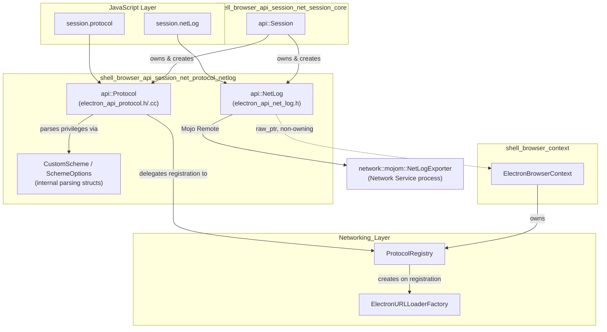
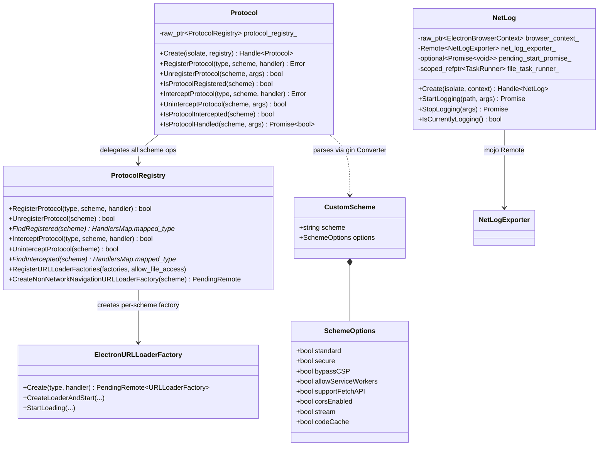
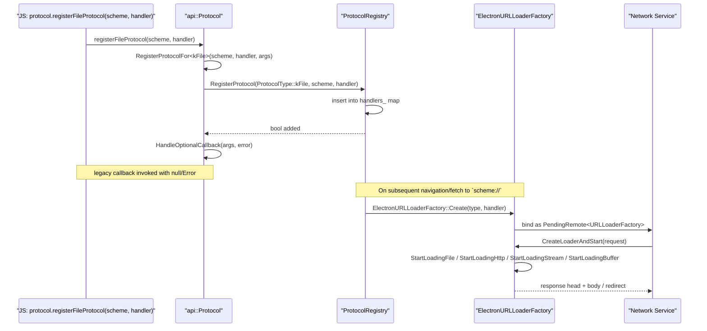
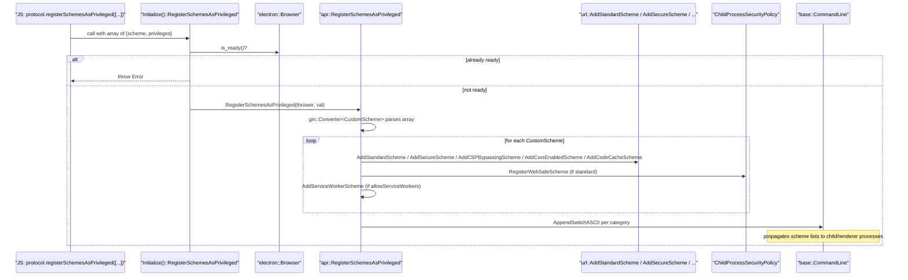
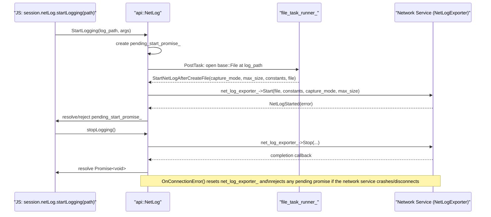

# Protocol & NetLog APIs (`shell_browser_api_session_net_protocol_netlog`)

## Introduction

This module implements two of the JavaScript-facing networking APIs that are exposed on Electron's `Session` object: the **`protocol`** module (custom/standard scheme registration and interception) and the **`net-log`** module (capturing Chromium NetLog diagnostic traces to disk). Both APIs are thin Gin/V8 wrappers around native Chromium/Electron networking primitives, and both are owned indirectly by a `Session`/`ElectronBrowserContext` instance.

The module is one of four siblings under `shell_browser_api_session_net` (the browser-context-scoped networking API family), alongside:
- [shell_browser_api_session_net_session_core](shell_browser_api_session_net_session_core.md) — the `Session` object that owns/exposes `protocol` and `netLog`
- [shell_browser_api_session_net_cookies_datapipe](shell_browser_api_session_net_cookies_datapipe.md) — `Cookies` and `DataPipeHolder`
- [shell_browser_api_session_net_web_request](shell_browser_api_session_net_web_request.md) — `WebRequest` interception API
- [shell_browser_api_session_net_service_workers](shell_browser_api_session_net_service_workers.md) — Service Worker context/main bindings

It depends heavily on the lower-level networking infrastructure documented in [Networking_Layer](Networking_Layer.md) (specifically `ProtocolRegistry` and `ElectronURLLoaderFactory`), and on the generic native-binding scaffolding described in [Gin_Helper](Gin_Helper.md).

---

## Purpose & Core Functionality

### 1. `Protocol` API (`electron_api_protocol.h/.cc`)

Exposes the `session.protocol` object to JavaScript, allowing applications to:
- **Register custom protocol schemes as privileged** (`protocol.registerSchemesAsPrivileged`) — must be called before `app.whenReady()`, since it configures Chromium's `url::AddStandardScheme`, CSP-bypass lists, CORS-enabled schemes, fetch-API support, service-worker eligibility, streaming, and V8 code-cache eligibility, and mirrors these flags to child processes via command-line switches.
- **Register handlers for a scheme** — `registerStringProtocol`, `registerBufferProtocol`, `registerFileProtocol`, `registerHttpProtocol`, `registerStreamProtocol`, and the unified `registerProtocol`. Each of these installs a `ProtocolHandler` into the browser-context-scoped `ProtocolRegistry`.
- **Intercept an already-handled scheme** (e.g. override `file://` handling) via the parallel `interceptXProtocol` family, which delegates to `ProtocolRegistry::InterceptProtocol`.
- **Query/undo registration** — `unregisterProtocol`, `isProtocolRegistered`, `uninterceptProtocol`, `isProtocolIntercepted`, and the deprecated `isProtocolHandled` (kept for backward compatibility, checks both registries plus a hard-coded builtin scheme list).

The `Protocol` class itself holds only a `raw_ptr<ProtocolRegistry>` — all actual scheme bookkeeping and Mojo `URLLoaderFactory` wiring lives in `ProtocolRegistry` (see [Networking_Layer](Networking_Layer.md)). This keeps the JS-facing wrapper stateless with respect to the underlying scheme tables, while `ProtocolRegistry`'s lifetime (owned per `ElectronBrowserContext`) is guaranteed to outlive the wrapper.

### 2. `NetLog` API (`electron_api_net_log.h`)

Exposes `session.netLog`, mirroring the behavior of `net_log::NetExportFileWriter`:
- **`startLogging(path[, options])`** — opens a log file and instructs the network service (via a Mojo `network::mojom::NetLogExporter` remote) to begin writing a Chromium NetLog trace, with a configurable `net::NetLogCaptureMode` and optional maximum file size / custom constants JSON.
- **`stopLogging()`** — asynchronously halts the exporter and resolves a `gin_helper::Promise<void>`.
- **`isCurrentlyLogging()`** — synchronous check of whether the exporter Mojo remote is bound.

Both `startLogging`/`stopLogging` are asynchronous, backed by `gin_helper::Promise`, since they hop across the file-I/O thread (`file_task_runner_`) to open/close the log file and across the Mojo IPC boundary to the network service process.

---

## Architecture



---

## Component Relationships



---

## Data Flow: Registering a Protocol Handler



---

## Data Flow: Registering Privileged Schemes (Startup)



---

## Data Flow: NetLog Capture Lifecycle



---

## Key Design Notes

- **Non-owning pointers, context-scoped lifetime.** Both `Protocol` and `NetLog` hold raw, non-owning pointers (`raw_ptr<ProtocolRegistry>`, `raw_ptr<ElectronBrowserContext>`) back to their owning `ElectronBrowserContext`/`ProtocolRegistry`. These native objects are guaranteed to outlive the JS wrapper because the wrapper is always created *from* and *owned by* the `Session`/`ElectronBrowserContext` (see [shell_browser_api_session_net_session_core](shell_browser_api_session_net_session_core.md) and [shell_browser_context](shell_browser_context.md)).

- **`gin_helper::Constructible` vs plain `Wrappable`.** `Protocol` uses `gin_helper::Constructible<Protocol>` so it can define a `FillObjectTemplate` (method table) shared across instances, while blocking direct JS construction (`New()` throws — instances are only created internally via `Protocol::Create`). `NetLog` uses the simpler `gin_helper::DeprecatedWrappable<NetLog>` pattern with an instance-level `GetObjectTemplateBuilder`. Both patterns are part of the shared native-binding infrastructure in [Gin_Helper](Gin_Helper.md).

- **Legacy API compatibility layer.** Much of `electron_api_protocol.cc`'s complexity (the `RegisterProtocolFor<T>`/`InterceptProtocolFor<T>` templates, `HandleOptionalCallback`, and `IsProtocolHandled`) exists purely to preserve Electron's pre-Promise, per-type (`registerFileProtocol`, `registerBufferProtocol`, etc.) API shape while funneling everything into the unified `ProtocolType` enum and `ProtocolRegistry` internally. Deprecation warnings (`util::EmitWarning`) are emitted for the callback-style and `isProtocolHandled` usages.

- **Scheme privileges vs handler registration are separate concerns.** `registerSchemesAsPrivileged` operates on process-wide/global Chromium scheme tables (`url::AddStandardScheme`, `ChildProcessSecurityPolicy`) and must run before app-ready; it does **not** install any handler. Handler registration (`registerFileProtocol` etc.) operates per-`ProtocolRegistry` (i.e., per `Session`) and can happen at any time. This split is enforced by `Browser::is_ready()` checks in the `Initialize()`-scoped wrapper function.

- **NetLog capture modes and file size limiting** mirror upstream Chromium's `net_log::NetExportFileWriter`, reusing `net::NetLogCaptureMode` and delegating the actual trace serialization to the network service process via Mojo (`network::mojom::NetLogExporter`), rather than doing it in-process — consistent with Electron/Chromium's out-of-process Network Service architecture (see [Networking_Layer](Networking_Layer.md) for `SystemNetworkContextManager` / `NetworkContextService`).

---

## Native Module Registration

`electron_api_protocol.cc` registers itself as a Node.js context-aware linked binding:

```cpp
NODE_LINKED_BINDING_CONTEXT_AWARE(electron_browser_protocol, Initialize)
```

`Initialize()` exposes on the native binding's `exports` object:
- `Protocol` — the constructor/class template (instances created only via `Protocol::Create`, invoked by `Session`)
- `registerSchemesAsPrivileged` — the free function, gated by `Browser::is_ready()`
- `getStandardSchemes` — returns the accumulated `g_standard_schemes` list

`NetLog` does not define its own `Initialize`; instead, `NetLog::Create(isolate, browser_context)` is invoked directly by `Session` (see [shell_browser_api_session_net_session_core](shell_browser_api_session_net_session_core.md)) to construct the `session.netLog` property lazily.

---

## Related Modules

| Module | Relationship |
|---|---|
| [shell_browser_api_session_net_session_core](shell_browser_api_session_net_session_core.md) | Owns and lazily instantiates `Protocol` and `NetLog` as `session.protocol` / `session.netLog` |
| [shell_browser_context](shell_browser_context.md) | Owns the `ProtocolRegistry` per `ElectronBrowserContext`; the ultimate backing store for scheme handlers |
| [Networking_Layer](Networking_Layer.md) | Defines `ProtocolRegistry`, `ElectronURLLoaderFactory`, and the broader Mojo `URLLoaderFactory`/network-context plumbing consumed here |
| [shell_browser_api_session_net_cookies_datapipe](shell_browser_api_session_net_cookies_datapipe.md) | Sibling session-scoped networking API (`Cookies`, `DataPipeHolder`) |
| [shell_browser_api_session_net_web_request](shell_browser_api_session_net_web_request.md) | Sibling session-scoped networking API (`WebRequest` interception) |
| [Gin_Helper](Gin_Helper.md) | Provides `Wrappable`, `Constructible`, `Handle`, `Promise`, `ObjectTemplateBuilder` used to bind these classes to V8 |
| [Common_API](Common_API.md) | `shell/common/gin_converters/net_converter.h` supplies Gin converters for network types used indirectly by protocol handler callbacks |
