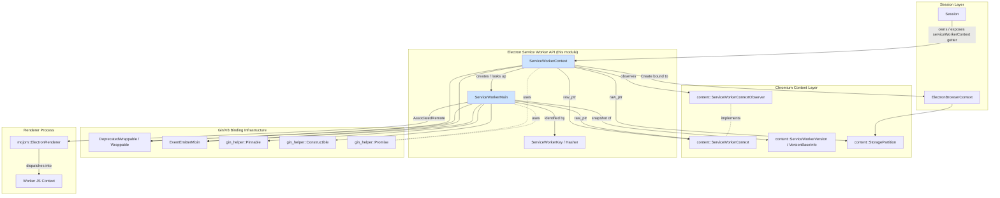
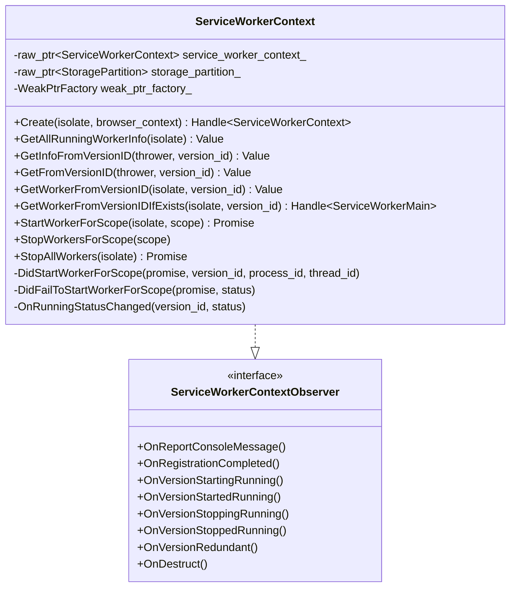
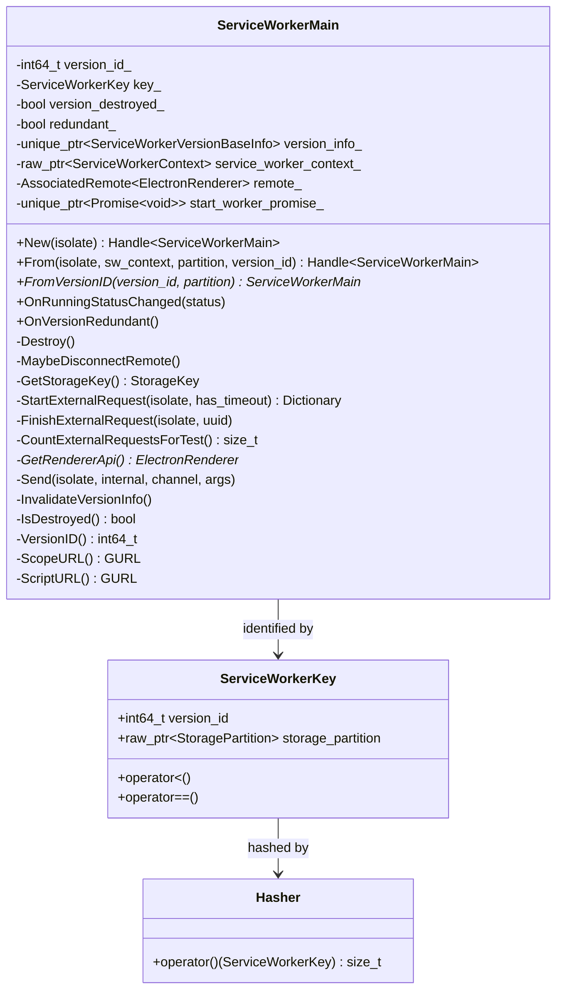
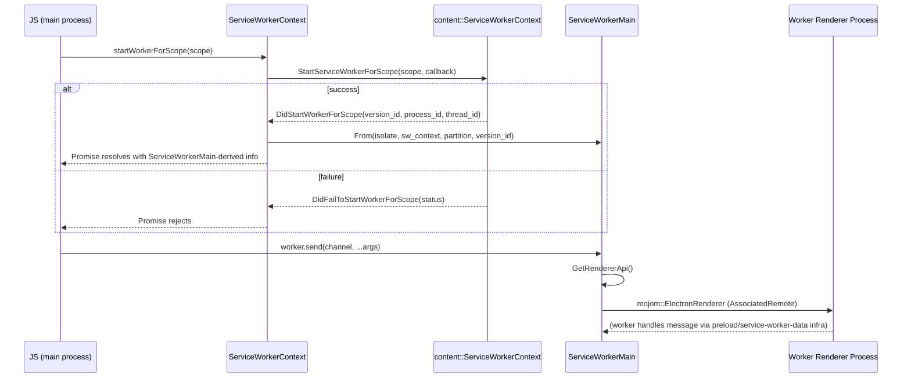
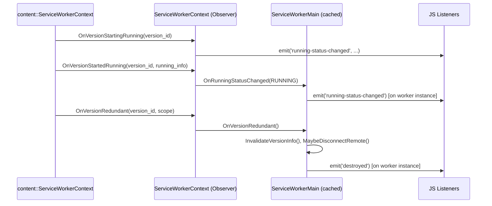
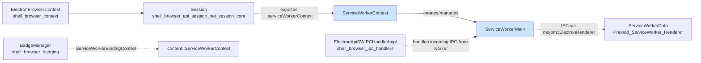

# Service Workers API Module (`shell_browser_api_session_net_service_workers`)

## Introduction

This module implements Electron's main-process JavaScript bindings for **inspecting and controlling Service Workers** registered by web content loaded in a `Session`. It exposes two closely related, cooperating classes:

- **`ServiceWorkerContext`** — a per-`Session` singleton (accessible via `session.serviceWorkerContext`) that acts as a registry/dispatcher: it observes Chromium's `content::ServiceWorkerContext`, enumerates running workers, starts/stops workers for a given scope, and creates/caches `ServiceWorkerMain` wrapper instances.
- **`ServiceWorkerMain`** — a wrapper object representing a *single* Service Worker version. It exposes lifecycle state, scope/script URLs, and IPC (`postMessage`-style) communication with the worker's renderer process, plus "external request" keep-alive semantics used to prevent Chromium from terminating a worker while Electron-side code depends on it.

Together these classes let Electron/Node.js code introspect, message, and manage the lifecycle of Service Workers running inside a `Session`, mirroring the DevTools/Application panel functionality but exposed programmatically to app developers.

This module is a child of [shell_browser_api_session_net](shell_browser_api_session_net.md), sitting alongside sibling modules that expose other network/session-related JS APIs: [shell_browser_api_session_net_session_core](shell_browser_api_session_net_session_core.md) (the `Session` object itself), [shell_browser_api_session_net_cookies_datapipe](shell_browser_api_session_net_cookies_datapipe.md), [shell_browser_api_session_net_protocol_netlog](shell_browser_api_session_net_protocol_netlog.md), and [shell_browser_api_session_net_web_request](shell_browser_api_session_net_web_request.md).

---

## Purpose & Core Functionality

| Responsibility | Component |
|---|---|
| Enumerate all currently running Service Workers in a partition | `ServiceWorkerContext::GetAllRunningWorkerInfo` |
| Look up worker metadata by Chromium's internal `version_id` | `ServiceWorkerContext::GetInfoFromVersionID` / `GetFromVersionID` / `GetWorkerFromVersionID` |
| Get or lazily create a `ServiceWorkerMain` wrapper for a version | `ServiceWorkerContext::GetWorkerFromVersionIDIfExists`, `ServiceWorkerMain::From` |
| Force-start/stop a worker for a given scope URL | `ServiceWorkerContext::StartWorkerForScope`, `StopWorkersForScope`, `StopAllWorkers` |
| Forward Chromium lifecycle/console events as JS events | `ServiceWorkerContext::On*` observer overrides |
| Represent a single worker's identity, scope, script URL, and running status | `ServiceWorkerMain` (`ScopeURL`, `ScriptURL`, `VersionID`, `OnRunningStatusChanged`) |
| Send/receive IPC messages to/from the worker's renderer | `ServiceWorkerMain::Send`, `GetRendererApi` (via `mojom::ElectronRenderer`) |
| Keep a worker alive across async Electron operations | `ServiceWorkerMain::StartExternalRequest` / `FinishExternalRequest` |
| Clean up when the underlying worker version is destroyed/redundant | `ServiceWorkerMain::Destroy`, `OnVersionRedundant`, `InvalidateVersionInfo` |

### Why two classes?

Chromium's `content::ServiceWorkerContext` is a **partition-scoped registry** — it doesn't provide a stable, ref-counted per-worker object suitable for direct exposure to JS. Electron bridges this gap with:

- `ServiceWorkerContext`: thin **event-emitting facade** over the Chromium context, one per `ElectronBrowserContext`/`StoragePartition`.
- `ServiceWorkerMain`: a **pinned, uniquely-keyed wrapper** per worker *version*, identified by `ServiceWorkerKey{version_id, storage_partition}` (see below), which survives for the lifetime of the underlying `content::ServiceWorkerVersion` so registered IPC listeners keep working even if V8 GC would otherwise reclaim it (`gin_helper::Pinnable`).

---

## Architecture

### Key relationships

- `ServiceWorkerContext` is created via `Session::ServiceWorkerContext()` (see [shell_browser_api_session_net_session_core](shell_browser_api_session_net_session_core.md)), which lazily instantiates and caches it as a `v8::TracedReference` on the `Session` object.
- `ServiceWorkerContext` privately implements `content::ServiceWorkerContextObserver` to receive lifecycle callbacks (`OnVersionStartingRunning`, `OnVersionStoppedRunning`, etc.) directly from Chromium and re-emits them as JS events via `EventEmitterMixin`.
- `ServiceWorkerMain` instances are **not** created ad-hoc by JS `new` in normal flow — they are produced by `ServiceWorkerContext::GetWorkerFromVersionID(IfExists)` / `ServiceWorkerMain::From`, keyed by `ServiceWorkerKey` so the same worker version always maps to the same JS wrapper object within a partition.
- Both classes use the shared [Gin_Helper](Gin_Helper.md) wrapping infrastructure (`DeprecatedWrappable`, `EventEmitterMixin`, `Constructible`, `Pinnable`, `Promise`) documented in [Common_Native_Gin_Infrastructure](Common_Native_Gin_Infrastructure.md).

---

## Component Details

### `ServiceWorkerContext`

**Construction**: `Create(isolate, browser_context)` is invoked lazily from `Session`, binding to the browser context's default `StoragePartition`'s `content::ServiceWorkerContext`.

**Enumeration & lookup**:
- `GetAllRunningWorkerInfo` — returns a map/array of info for every currently-running worker in the partition.
- `GetInfoFromVersionID` / `GetFromVersionID` / `GetWorkerFromVersionID` — three variants returning raw info, a `ServiceWorkerMain`-wrapped value, or an equivalent, differing mainly in return shape and whether a wrapper is force-created.
- `GetWorkerFromVersionIDIfExists` — non-creating lookup; returns an empty handle if no live wrapper for that version exists yet.

**Lifecycle control**:
- `StartWorkerForScope(isolate, scope)` returns a `Promise` resolved via `DidStartWorkerForScope` (success) or `DidFailToStartWorkerForScope` (failure) — these are invoked as Chromium callbacks and settle the JS promise with worker startup details (version id, process id, thread id) or an error status.
- `StopWorkersForScope(scope)` / `StopAllWorkers(isolate)` — force worker shutdown, the latter returning a `Promise` for completion of stopping every worker in the partition.

**Event forwarding**: The `ServiceWorkerContextObserver` overrides translate Chromium-side callbacks into `EventEmitterMixin`-based JS events (e.g. `'running-status-changed'`, `'console-message'`, `'registration-completed'`), letting JS consumers react to global worker registry changes without polling.

### `ServiceWorkerMain`

**Identity — `ServiceWorkerKey`**: Because a single `content::ServiceWorkerContext` may (in theory) map version IDs that aren't globally unique across `StoragePartition`s, Electron composes a key of `(version_id, storage_partition)` with a custom `operator<`, `operator==`, and `Hasher`, used as the map key for caching `ServiceWorkerMain` instances (so `From`/`FromVersionID` return the same wrapper for the same worker).

**Construction pattern**:
- `New(isolate)` — supports being instantiated via `Constructible` (for internal/test use); most real instances are produced through:
- `From(isolate, sw_context, storage_partition, version_id)` — the primary factory used by `ServiceWorkerContext`, returning a cached or newly-created `Handle<ServiceWorkerMain>`.
- `FromVersionID(version_id, storage_partition)` — raw pointer lookup without creating a new V8 handle, used internally.

**Pinning**: `ServiceWorkerMain` inherits `gin_helper::Pinnable<ServiceWorkerMain>` so that even though it's a garbage-collected V8 wrapper, it stays alive (pinned) as long as the underlying worker version is running and has registered listeners — otherwise IPC events dispatched from the renderer would have nowhere to land.

**State snapshotting**: `version_info_` holds a `content::ServiceWorkerVersionBaseInfo` snapshot so `ScopeURL()`/`ScriptURL()`/`VersionID()` remain queryable even when the worker isn't currently running (Chromium only guarantees richer live info while running). `InvalidateVersionInfo()` and `version_destroyed_` / `redundant_` flags track terminal states signaled by `OnVersionRedundant()`.

**IPC bridge**: `GetRendererApi()` lazily establishes an `AssociatedRemote<mojom::ElectronRenderer>` to the worker's render process, used by `Send()` to deliver `postMessage`-style events into the worker's JS context — mirroring the IPC mechanism used for `WebContents`/`WebFrameMain` (see [shell_browser_api_webcontents](shell_browser_api_webcontents.md)) but targeted at a background Service Worker rather than a document frame.

**External Request keep-alive**: `StartExternalRequest`/`FinishExternalRequest` map to Chromium's service worker "external request" API, which increments/decrements a ref count that prevents the worker from being shut down mid-operation (e.g., while Electron-side native code awaits worker-provided results). `CountExternalRequestsForTest` supports test instrumentation only.

---

## Data Flow

### Starting a worker and messaging it

### Lifecycle event propagation

---

## Integration with the Broader System

- **[shell_browser_api_session_net_session_core](shell_browser_api_session_net_session_core.md)** — `Session::ServiceWorkerContext()` is the JS-facing entry point that lazily constructs and caches the `ServiceWorkerContext` for a session.
- **[shell_browser_context](shell_browser_context.md)** — `ElectronBrowserContext` supplies the `StoragePartition` that scopes both the `content::ServiceWorkerContext` and the `ServiceWorkerKey` used to identify individual workers.
- **[shell_browser_ipc_handlers](shell_browser_ipc_handlers.md)** (`ElectronApiSWIPCHandlerImpl`) — handles the *incoming* side of IPC from a Service Worker's render process, complementing `ServiceWorkerMain::Send`'s outgoing path.
- **[Preload_ServiceWorker_(Renderer)](Preload_ServiceWorker_Renderer.md)** (`ServiceWorkerData`, `preload_realm_context.h`) — the renderer-side counterpart that sets up the preload environment inside the worker's V8 context, receiving messages dispatched by `ServiceWorkerMain::Send`.
- **[shell_browser_badging](shell_browser_badging.md)** (`BadgeManager`, `ServiceWorkerBindingContext`) — a separate Chromium subsystem that also observes `content::ServiceWorkerContext` for badge-related APIs; conceptually parallel to this module but independent.
- **[Common_Native_Gin_Infrastructure](Common_Native_Gin_Infrastructure.md)** — supplies the `Wrappable`, `Constructible`, `EventEmitterMixin`, `Pinnable`, `Handle`, and `Promise` primitives that both classes build upon.

---

## Key Design Notes

1. **Partition-scoped identity**: All lookups (`GetFromVersionID`, `FromVersionID`, etc.) are implicitly scoped to a `StoragePartition`, since raw Chromium version IDs are only unique *within* a partition — hence the composite `ServiceWorkerKey`.
2. **Pinning vs. GC**: `ServiceWorkerMain` uses `gin_helper::Pinnable` (unlike plain `EventEmitterMixin`-only objects) because it must remain reachable to receive async IPC/lifecycle callbacks even if no JS code currently holds a reference to it.
3. **Promise-based async APIs**: Worker start/stop operations are inherently asynchronous (may require spinning up a full render process), so they are modeled as `v8::Promise`-returning methods backed by `gin_helper::Promise`, consistent with the rest of Electron's session/network APIs (see [shell_browser_api_session_net_web_request](shell_browser_api_session_net_web_request.md) for a similar async-handler pattern).
4. **External requests mirror Chromium's own keep-alive mechanism** rather than reinventing one, ensuring behavior stays consistent with Chromium's internal service worker timeout/idle-termination logic.
