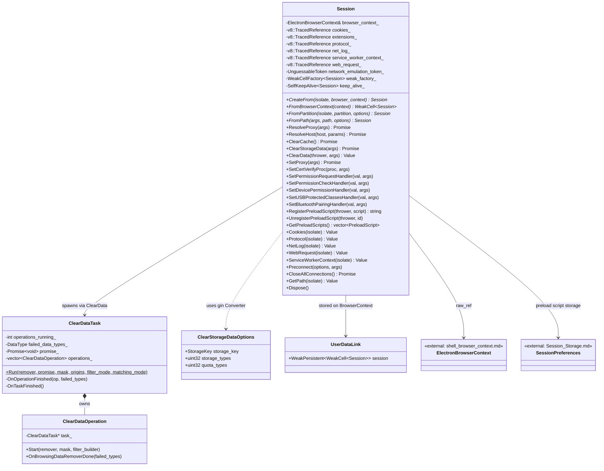
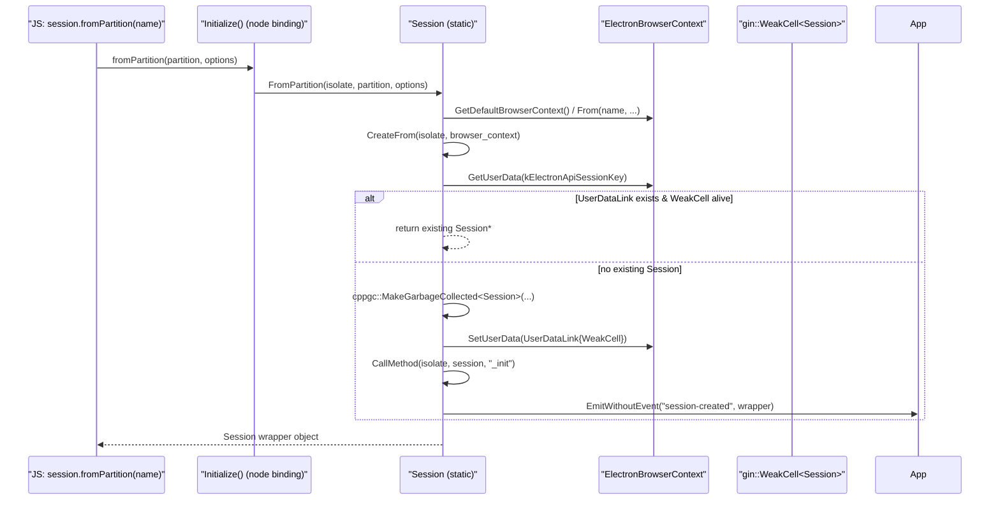
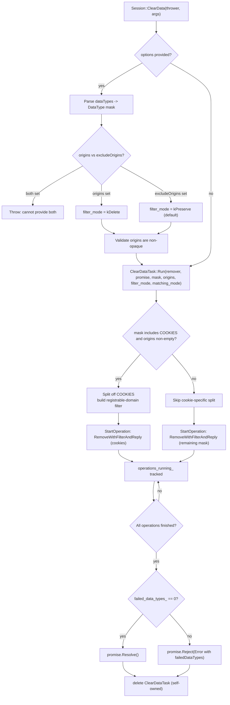
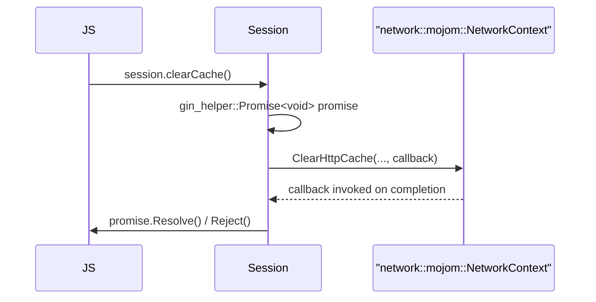
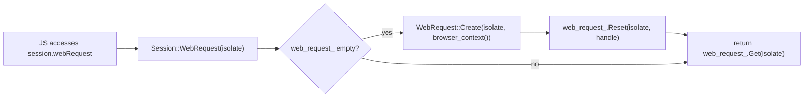
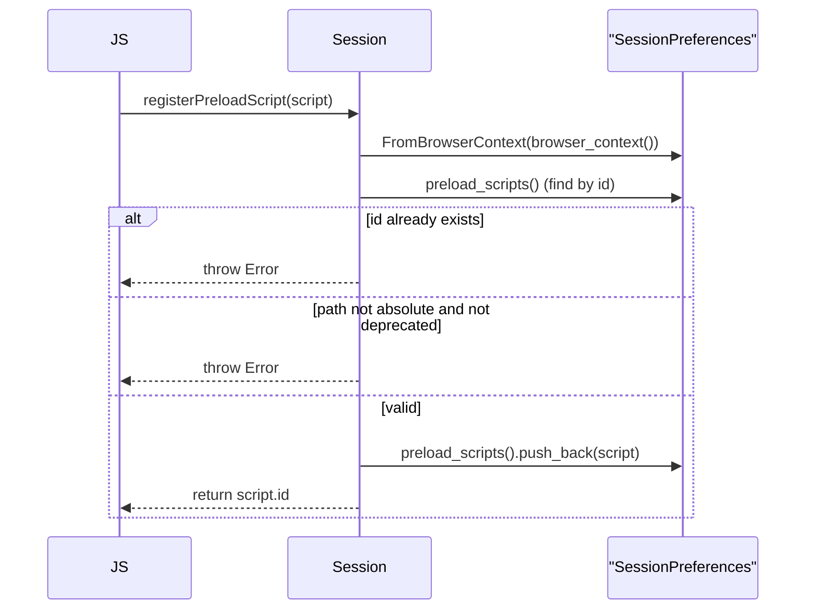
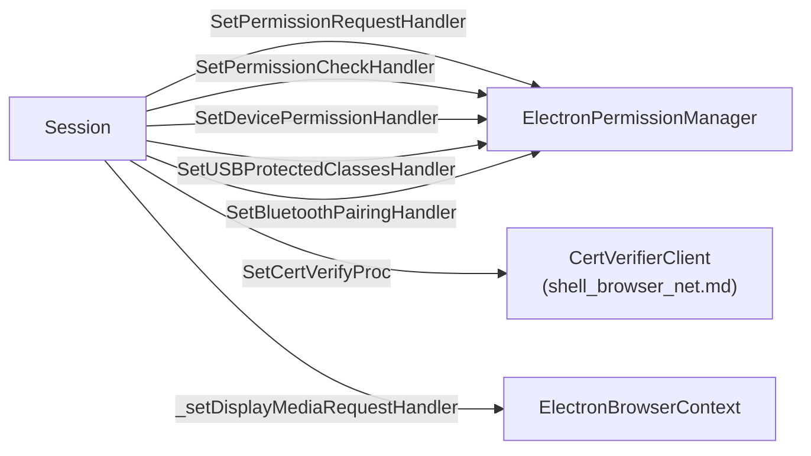
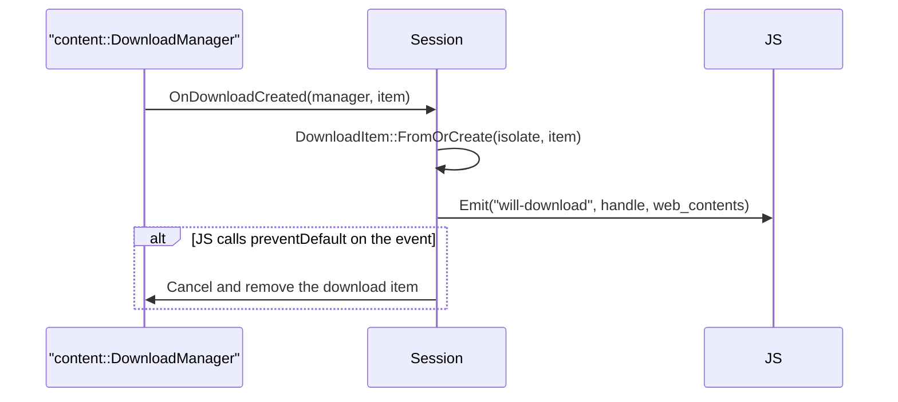
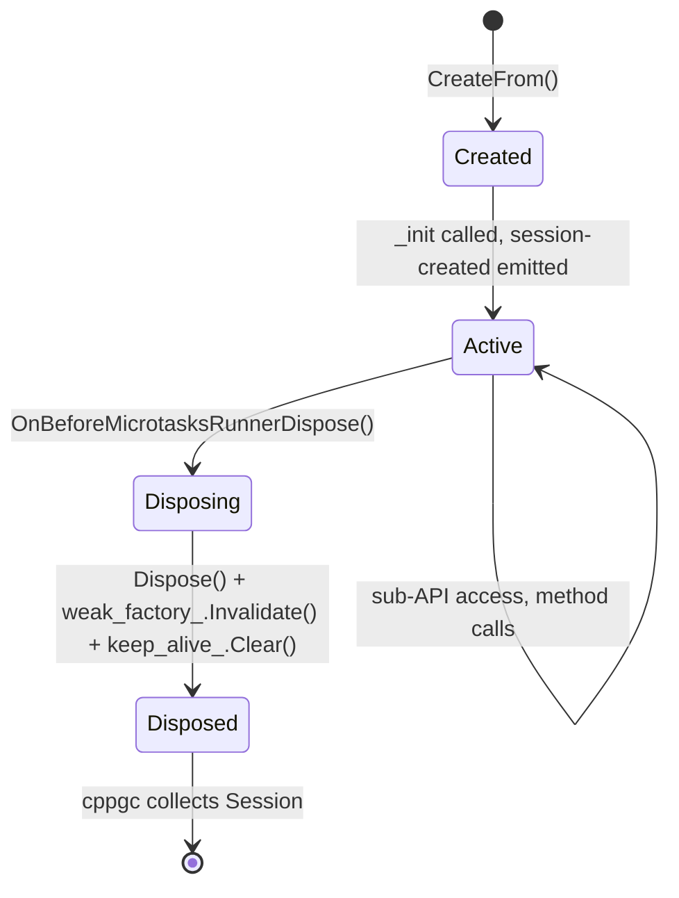

# Session Core (`shell_browser_api_session_net_session_core`)

## Introduction

The **Session Core** module implements `electron::api::Session`, the native
backing object for Electron's public `Session` JavaScript API
(`session.fromPartition()`, `session.defaultSession`, etc.). A `Session`
object is the primary handle through which application code configures and
inspects everything network- and storage-related for a given
`ElectronBrowserContext` (cookies, cache, proxy, downloads, permissions,
storage clearing, preload scripts, spellchecker, shared dictionaries, and
more).

This module is a **child of** [shell_browser_api_session_net.md](shell_browser_api_session_net.md)
and sits alongside four sibling modules that implement specific
sub-APIs exposed as properties on `Session`:

- [shell_browser_api_session_net_cookies_datapipe.md](shell_browser_api_session_net_cookies_datapipe.md) — `session.cookies`
- [shell_browser_api_session_net_protocol_netlog.md](shell_browser_api_session_net_protocol_netlog.md) — `session.protocol`, `session.netLog`
- [shell_browser_api_session_net_web_request.md](shell_browser_api_session_net_web_request.md) — `session.webRequest`
- [shell_browser_api_session_net_service_workers.md](shell_browser_api_session_net_service_workers.md) — `session.serviceWorkers`

The `Session` class itself does not implement these sub-features; instead it
lazily instantiates and caches the corresponding native wrapper objects and
exposes them as JS properties.

## Purpose & Core Functionality

`Session` is a `gin::Wrappable` object with a 1:1 (weakly-linked) relationship
to an `ElectronBrowserContext` (see
[shell_browser_context.md](shell_browser_context.md)). Its responsibilities
include:

1. **Lifecycle management** — creating/finding the `Session` for a given
   `BrowserContext`/partition/path, and tearing it down safely when the
   V8 isolate or browser context is disposed.
2. **Network configuration** — proxy settings, SSL config, certificate
   verification callbacks, user agent, NTLM domains, network emulation
   (throttling), host resolution.
3. **Storage & cache management** — `clearCache`, `clearStorageData`,
   `clearData` (browsing-data removal with filters), `clearCodeCaches`,
   Shared Dictionary cache inspection/clearing, download path/handling.
4. **Permission handlers** — registering JS callbacks for permission
   requests/checks, device permissions, USB protected classes, Bluetooth
   pairing (delegates to `ElectronPermissionManager`).
5. **Preload script registry** — register/unregister per-session preload
   scripts, backed by `SessionPreferences` (see
   [Session_Storage.md](Session_Storage.md)).
6. **Sub-API accessors** — exposes `cookies`, `protocol`, `netLog`,
   `webRequest`, `serviceWorkers`, and (when enabled) `extensions` as
   lazily-created, cached properties.
7. **Spellchecker integration** — language management, custom dictionary
   words, and Hunspell dictionary download event forwarding (behind the
   `ENABLE_BUILTIN_SPELLCHECKER` buildflag).
8. **Download interception** — observes `content::DownloadManager` and
   emits `will-download`, and supports creating synthetic "interrupted"
   downloads for resumption scenarios.

## Architecture

```mermaid
graph TB
    subgraph "Session Core (this module)"
        Session["Session\n(gin::Wrappable, EventEmitter)"]
        ClearDataTask["ClearDataTask\n(internal, CleanedUpAtExit)"]
        ClearDataOperation["ClearDataTask::ClearDataOperation\n(BrowsingDataRemover::Observer)"]
        ClearStorageDataOptions["ClearStorageDataOptions\n(gin::Converter)"]
        UserDataLink["UserDataLink\n(base::SupportsUserData::Data)"]
    end

    subgraph "Browser Context & Session Management"
        EBC["ElectronBrowserContext"]
        SessPrefs["SessionPreferences"]
        PermMgr["ElectronPermissionManager"]
        PreloadScript["PreloadScript struct"]
    end

    subgraph "Sibling Sub-API Modules"
        Cookies["Cookies"]
        Protocol["Protocol"]
        NetLog["NetLog"]
        WebRequest["WebRequest"]
        SWContext["ServiceWorkerContext"]
        Extensions["Extensions (optional)"]
    end

    Session -->|creates/caches| Cookies
    Session -->|creates/caches| Protocol
    Session -->|creates/caches| NetLog
    Session -->|creates/caches| WebRequest
    Session -->|creates/caches| SWContext
    Session -->|creates/caches, buildflag| Extensions

    Session -->|owns raw_ref| EBC
    EBC -.->|SetUserData| UserDataLink
    UserDataLink -.->|WeakCell reference| Session
    Session --> SessPrefs
    Session --> PermMgr
    Session -->|RegisterPreloadScript| PreloadScript

    Session -->|"ClearData()"| ClearDataTask
    ClearDataTask --> ClearDataOperation
    ClearDataOperation -->|observes| BDR["content::BrowsingDataRemover"]
```

## Component Relationships

## Session Creation & Lookup Flow

`Session` objects are created lazily and cached per `BrowserContext` via a
`UserDataLink` holding a `gin::WeakCell<Session>`. This avoids creating
duplicate `Session` wrappers for the same underlying context and allows the
JS wrapper to be garbage collected while the native browser context outlives
it.

Key entry points:

- `Session::FromPartition()` — resolves the (possibly `persist:`-prefixed)
  partition name to an `ElectronBrowserContext` and delegates to
  `CreateFrom`.
- `Session::FromPath()` — resolves a `Session` from an absolute filesystem
  path (used for out-of-band/managed sessions), enforcing that the app is
  ready and the path is absolute.
- `Session::CreateFrom()` — the shared "get-or-create" logic that checks
  `FromBrowserContext()` first before allocating a new cppgc-managed
  `Session`.
- `Session::New()` — a deliberate dummy that throws, since `Session` cannot
  be constructed directly with `new Session()` from JS; instances must be
  obtained via `fromPartition`/`fromPath`/`defaultSession`.

## Data & Storage Clearing Flow

`ClearData` is the most involved operation in this module. It builds a
`BrowsingDataRemover::DataType` mask from a JS options object, optionally
scopes the removal to a list of origins (or excludes some), and dispatches
one or more concurrent `BrowsingDataRemover::RemoveWithFilterAndReply`
operations, tracked by a self-owned `ClearDataTask`.

Related, simpler storage operations follow a common promise-based pattern
(illustrated once, applicable to `ClearCache`, `ClearStorageData`,
`ClearHostResolverCache`, `ClearAuthCache`, `ClearCodeCaches`,
`CloseAllConnections`, `ForceReloadProxyConfig`,
`ClearSharedDictionaryCache*`, `GetCacheSize`):

`ClearStorageData` additionally resets the `MediaDeviceIDSalt`
(see [shell_browser_media.md](shell_browser_media.md)) whenever cookies are
included in the storage types being cleared, since device IDs are derived
from cookie-scoped salts per the MediaCapture spec.

## Sub-API Property Accessors

`Session::Cookies()`, `Protocol()`, `NetLog()`, `WebRequest()`,
`ServiceWorkerContext()`, and `Extensions()` all follow the same
lazy-cache-on-`v8::TracedReference` pattern:

This pattern minimizes allocation cost for sub-APIs that are never accessed,
while guaranteeing a stable, cached wrapper object identity across repeated
accesses. `protocol_` is the one exception, being eagerly created in the
`Session` constructor because `ElectronBrowserContext::protocol_registry()`
must be wired up immediately (see
[shell_browser_api_session_net_protocol_netlog.md](shell_browser_api_session_net_protocol_netlog.md)).

## Preload Script Registration

`RegisterPreloadScript` / `UnregisterPreloadScript` / `GetPreloadScripts`
manage the ordered list of `PreloadScript` entries
(see [Preload_Script.md](Preload_Script.md)) stored on
`SessionPreferences` (see [Session_Storage.md](Session_Storage.md)),
enforcing:

- Unique script IDs (throws if a duplicate ID is registered).
- Absolute file paths for non-deprecated scripts (deprecated scripts only
  log an error, for backward compatibility).

## Permission & Security Handler Wiring

`Session` acts as a thin JS-callback registration facade over
`ElectronPermissionManager` (owned by `ElectronBrowserContext`, documented in
[shell_browser_context.md](shell_browser_context.md)):

`SetCertVerifyProc` wraps the supplied JS callback in a
`network::mojom::CertVerifierClient` mojo receiver
(`CertVerifierClient`, see [shell_browser_net.md](shell_browser_net.md)) and
installs it on the storage partition's `NetworkContext`.

## Download Handling

`Session` observes `content::DownloadManager` for the lifetime of the
underlying `ElectronBrowserContext`:

`DownloadURL` and `CreateInterruptedDownload` provide programmatic ways to
start a download or seed a resumable/interrupted download record (used for
resuming downloads across app restarts), independent of a real network
fetch — see also [shell_browser_api_system_device.md](shell_browser_api_system_device.md)
for the `DownloadItem` wrapper.

## Object Lifecycle & Disposal

`Session` participates in three overlapping lifecycle mechanisms:

1. **cppgc garbage collection** — `Session` is a `cppgc`-managed
   `gin::Wrappable`; `Trace()` marks all `v8::TracedReference` sub-API
   handles and the `weak_factory_` for GC visibility.
2. **`gin::PerIsolateData::DisposeObserver`** — on
   `OnBeforeMicrotasksRunnerDispose`, the object removes itself as an
   observer, calls `Dispose()` (unhooking from `DownloadManager` and the
   spellchecker service), invalidates its `WeakCellFactory`, and clears its
   `SelfKeepAlive`, allowing final collection.
3. **`UserDataLink` on `ElectronBrowserContext`** — provides the
   `FromBrowserContext()` fast lookup path; since it stores a
   `WeakPersistent<gin::WeakCell<Session>>`, it does not keep the `Session`
   alive by itself.

## Key Data Structures

| Component | Kind | Purpose |
|---|---|---|
| `Session` | `gin::Wrappable` class | Native backing for the JS `Session` object; central hub for network/storage/permission configuration. |
| `ClearDataTask` (`.cc`, internal) | Self-owned task | Orchestrates one or more `BrowsingDataRemover` operations for `clearData()`, resolving/rejecting a single JS promise when all finish. |
| `ClearDataOperation` | `BrowsingDataRemover::Observer` | Tracks a single `RemoveWithFilterAndReply` call as part of a `ClearDataTask`. |
| `ClearStorageDataOptions` | `gin::Converter<>` specialization | Parses the options object for `clearStorageData()` into a `StorageKey` + storage/quota masks. |
| `UserDataLink` | `base::SupportsUserData::Data` | Attaches a weak reference to the `Session` wrapper onto the `ElectronBrowserContext`, enabling get-or-create semantics. |

## Relationship to Other Modules

- **Parent module:** [shell_browser_api_session_net.md](shell_browser_api_session_net.md) —
  groups this module together with cookies/data-pipe, protocol/netlog,
  web-request, and service-worker sub-APIs, all hanging off `Session`.
- **[shell_browser_context.md](shell_browser_context.md)** — `Session` wraps
  exactly one `ElectronBrowserContext`; most operations ultimately delegate
  to browser-context-owned services (`ResolveProxyHelper`,
  `ElectronPermissionManager`, `ProtocolRegistry`, storage partitions).
- **[Session_Storage.md](Session_Storage.md)** — `SessionPreferences`
  backs the preload script registry; `SpecialStoragePolicy` is used
  transitively by the storage partition APIs this module drives.
- **[shell_browser_net.md](shell_browser_net.md)** — proxy resolution
  (`ResolveProxyHelper`), certificate verification
  (`CertVerifierClient`), and host resolution (`ResolveHostFunction`) are
  implemented there and merely invoked from `Session`.
- **[Preload_Script.md](Preload_Script.md)** — defines the `PreloadScript`
  data structure managed by `RegisterPreloadScript`/`GetPreloadScripts`.
- **[shell_browser_media.md](shell_browser_media.md)** — `MediaDeviceIDSalt`
  is reset from `ClearStorageData` when cookies are cleared.
- **[Gin_Helper.md](Gin_Helper.md)** and **[Gin_Converters.md](Gin_Converters.md)** —
  provide the `gin_helper::Promise`, `gin_helper::Dictionary`,
  `gin_helper::ErrorThrower`, `SelfKeepAlive`, `Constructible`, and the
  various `gin::Converter<>` specializations that this module relies on
  heavily for its JS↔C++ bridging.
- **[shell_browser_api_system_device.md](shell_browser_api_system_device.md)** —
  home of `App` (session-created event emission target) and `DownloadItem`
  (created in response to `OnDownloadCreated`), as well as `Extensions`
  when the extensions buildflag is enabled.
