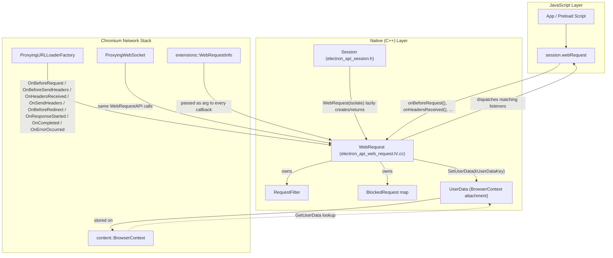
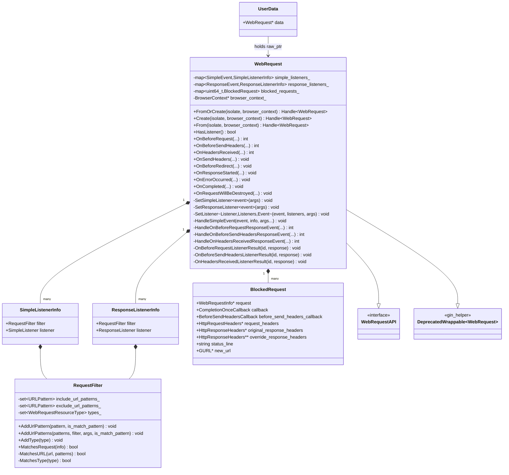
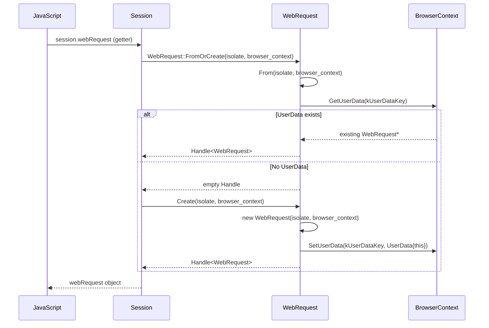
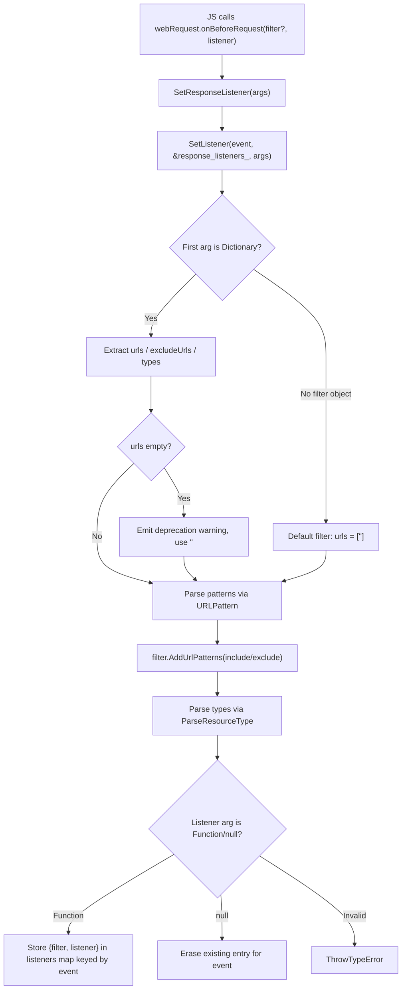
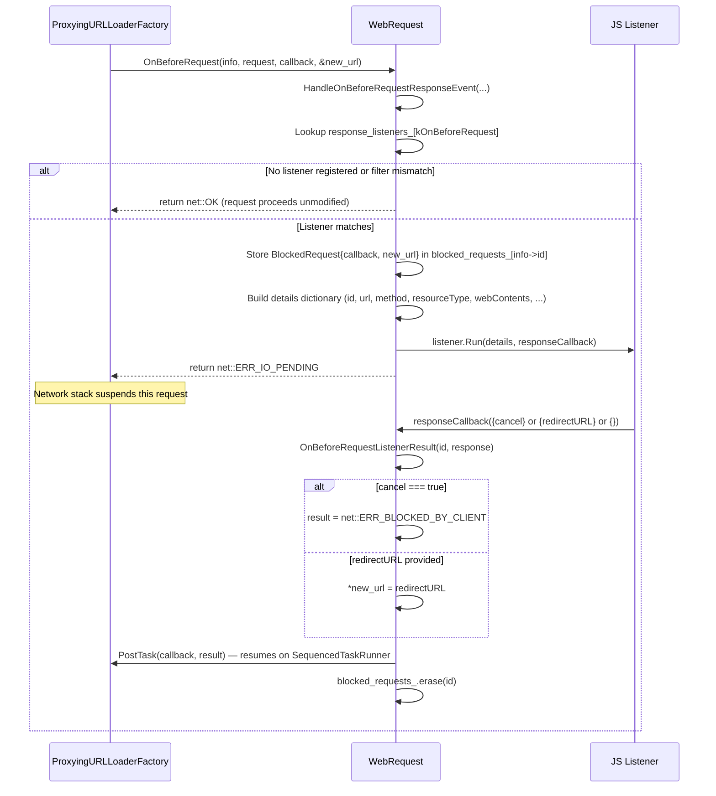
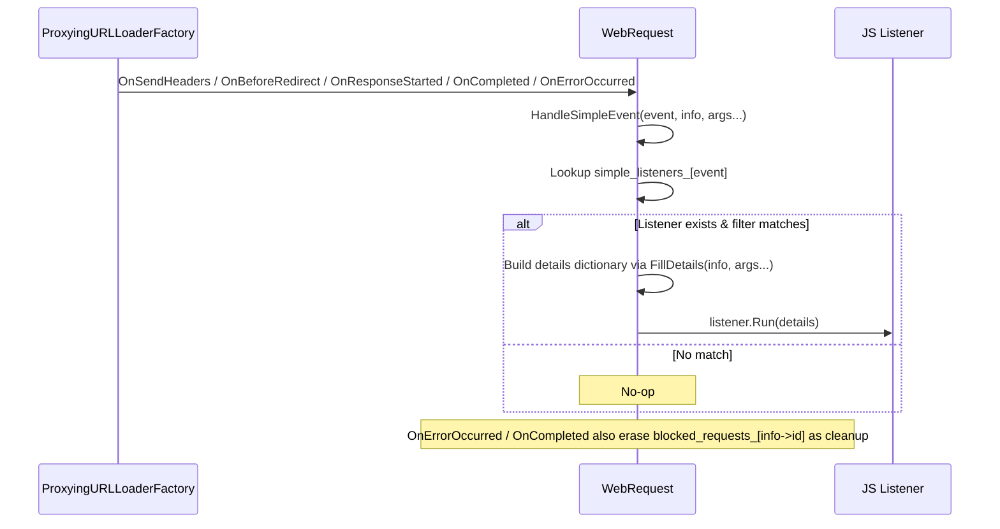
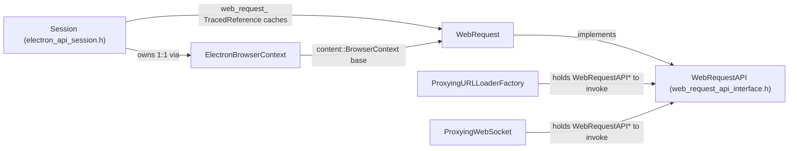

# WebRequest API Module (`shell_browser_api_session_net_web_request`)

## Introduction

This module implements Electron's `session.webRequest` API — the native (C++) side of the JavaScript-facing interface that lets application code observe and intercept HTTP(S)/WebSocket network traffic flowing through a `Session`. It exposes lifecycle-stage listener registration methods (`onBeforeRequest`, `onBeforeSendHeaders`, `onHeadersReceived`, `onSendHeaders`, `onBeforeRedirect`, `onResponseStarted`, `onCompleted`, `onErrorOccurred`) to JavaScript, and implements the `WebRequestAPI` interface that Chromium's extensions/network stack calls into for every request that passes through a `BrowserContext`.

Each `Session` object owns exactly one `WebRequest` instance (lazily created), which is attached to the underlying `content::BrowserContext` via `base::SupportsUserData`. The `WebRequest` object translates low-level Chromium request/response data structures into V8/JavaScript dictionaries, dispatches them to registered JS listeners, and — for "blocking" (response) events — pauses the network stack pending a response from JavaScript (e.g. to cancel, redirect, or modify headers).

This module is a child of [shell_browser_api_session_net](shell_browser_api_session_net.md), which is itself part of [Browser_Context_&_Session_Management](Browser_Context_&_Session_Management.md). It works closely with:
- [shell_browser_api_session_net_session_core](shell_browser_api_session_net_session_core.md) — the owning `Session` object.
- [shell_browser_net](shell_browser_net.md) — `WebRequestInfo` and the proxying URL loader factory that actually invokes the `WebRequestAPI` callbacks.
- [Gin_Helper](Gin_Helper.md) — `DeprecatedWrappable`, `Handle`, `ObjectTemplateBuilder` used to bridge C++ objects into V8.
- [Gin_Converters](Gin_Converters.md) — conversions for `net::HttpRequestHeaders`, `net::HttpResponseHeaders`, `GURL`, `ResourceRequestBody`, etc.
- [shell_browser_api_webcontents](shell_browser_api_webcontents.md) — `WebContents` lookup used to populate request details (`webContents`, `frame`).

---

## Purpose & Core Functionality

`WebRequest` serves two roles simultaneously:

1. **JS-facing API object** (`gin_helper::DeprecatedWrappable<WebRequest>`): exposes `onBeforeRequest`/`onHeadersReceived`/etc. as callable methods on `session.webRequest`, each accepting an optional `RequestFilter` (`{urls, excludeUrls, types}`) and a listener function (or `null` to unregister).

2. **Native callback sink** (`WebRequestAPI` interface, declared in [shell_browser_net](shell_browser_net.md)'s `web_request_api_interface.h`): Chromium's `ProxyingURLLoaderFactory`/`ProxyingWebSocket` (see [shell_browser_net](shell_browser_net.md)) call into `OnBeforeRequest`, `OnBeforeSendHeaders`, `OnHeadersReceived`, `OnSendHeaders`, `OnBeforeRedirect`, `OnResponseStarted`, `OnErrorOccurred`, `OnCompleted`, and `OnRequestWillBeDestroyed` for every intercepted request.

### Two Listener Categories

| Category | Events | Blocking? | Listener signature |
|---|---|---|---|
| **Response (blocking) events** | `onBeforeRequest`, `onBeforeSendHeaders`, `onHeadersReceived` | Yes — network stack waits (`net::ERR_IO_PENDING`) until JS calls back | `(details, callback)` |
| **Simple (informational) events** | `onSendHeaders`, `onBeforeRedirect`, `onResponseStarted`, `onCompleted`, `onErrorOccurred` | No — fire-and-forget | `(details)` |

### RequestFilter

Each listener registration carries a `RequestFilter` composed of:
- `include_url_patterns_` — `URLPattern` set (from the `urls` option; defaults to `<all_urls>` if omitted/empty, emitting a deprecation warning when explicitly empty).
- `exclude_url_patterns_` — `URLPattern` set (from `excludeUrls`).
- `types_` — set of `extensions::WebRequestResourceType` (from `types`, e.g. `"mainFrame"`, `"xhr"`, `"image"`).

`RequestFilter::MatchesRequest()` is evaluated per-request per-listener; a request is delivered to a listener only if it matches an include pattern, does **not** match an exclude pattern, and matches the type filter (or the type filter is empty).

### Blocked Request Bookkeeping

For blocking events, a `BlockedRequest` struct is stashed in `blocked_requests_` (keyed by `WebRequestInfo::id`) holding the pending Chromium callback plus mutable pointers into the request/response (e.g. `new_url`, `request_headers`, `override_response_headers`). When JS invokes the response callback, the corresponding `On*ListenerResult` handler parses the returned object (`cancel`, `redirectURL`, `requestHeaders`, `responseHeaders`, `statusLine`), mutates the underlying Chromium structures, and resumes the network stack by running the stored callback on the current sequenced task runner.

---

## Architecture

---

## Class Structure

---

## Lifecycle: Creation & Lookup

`WebRequest` instances are never created directly by JS; they are managed through `Session`, keyed off `content::BrowserContext` via `base::SupportsUserData`.

- **`FromOrCreate`** — used by callers (e.g. `Session::WebRequest()`) that need the object to exist; triggers `Session::CreateFrom` if not yet created.
- **`Create`** — called once by `Session` during its own construction of the cached `web_request_` property; asserts no prior instance exists.
- **`From`** — pure lookup, returns an empty handle if none exists; used internally by the network stack to fetch an existing `WebRequest` for a given `BrowserContext` without creating one.

Destruction (`~WebRequest`) removes the `UserData` from the `BrowserContext`, breaking the association.

---

## Listener Registration Flow

Both `SetSimpleListener<Event>` and `SetResponseListener<Event>` funnel through the shared templated `SetListener()`, which handles filter parsing/validation identically regardless of listener category — only the stored map (`simple_listeners_` vs `response_listeners_`) and listener type differ.

---

## Blocking Request Interception Flow (`onBeforeRequest` example)

The `onBeforeSendHeaders` and `onHeadersReceived` flows follow the same shape:
- `onBeforeSendHeaders`: passes/receives `requestHeaders`; computes header deltas (`modified_request_headers`, `deleted_request_headers`) via `CalculateOnBeforeSendHeadersDelta()` before invoking `BeforeSendHeadersCallback`.
- `onHeadersReceived`: passes response `statusLine`/`responseHeaders`; can override status line and headers via `override_response_headers`.

For all three, a `cancel: true` response short-circuits to `net::ERR_BLOCKED_BY_CLIENT` and skips header/URL mutation.

---

## Simple (Non-Blocking) Event Flow

`OnRequestWillBeDestroyed` is a pure cleanup hook — it removes any lingering `BlockedRequest` for a request that is being torn down without completing normally, preventing dangling callbacks.

---

## Details Dictionary Construction

The `FillDetails`/`ToDictionary` overload set (variadic, compile-time dispatched) assembles the JS-visible `details` object for every event by combining however many of the following are relevant to that event:

| Source | Fields added |
|---|---|
| `extensions::WebRequestInfo*` | `id`, `url`, `method`, `timestamp`, `resourceType`, `ip`, `fromCache`, `statusLine`, `statusCode`, `responseHeaders`, `frame` (getter), `webContents`, `webContentsId` |
| `network::ResourceRequest&` | `referrer`, `uploadData` |
| `net::HttpRequestHeaders&` | `requestHeaders` |
| `GURL&` (redirect location) | `redirectURL` |
| `int` (net_error) | `error` (via `net::ErrorToString`) |

`resourceType` is converted through a custom `gin::Converter<extensions::WebRequestResourceType>` specialization backed by the `ResourceTypes` fixed flat map (e.g. `mainFrame`, `xhr`, `stylesheet`, `webSocket`, defaulting to `"other"`). `frame`/`webContents` population depends on resolving `content::RenderFrameHost::FromID()` and then `WebContents::From()` (see [shell_browser_api_webcontents](shell_browser_api_webcontents.md)).

`HttpResponseHeadersToV8()` is used instead of the generic net converter (see [Gin_Converters](Gin_Converters.md)) because the generic converter lowercases header names, whereas `webRequest` must preserve original casing.

---

## Integration with Session and BrowserContext

- `Session::WebRequest(v8::Isolate*)` is the sole JS-visible entry point that lazily instantiates and caches the `WebRequest` wrapper (see [shell_browser_api_session_net_session_core](shell_browser_api_session_net_session_core.md)).
- The actual invocation of `WebRequestAPI` methods happens deep in the networking layer's `ProxyingURLLoaderFactory` and `ProxyingWebSocket` (see [shell_browser_net](shell_browser_net.md)), which look up the `WebRequest` instance for the relevant `BrowserContext` via `WebRequest::From()` before dispatching each network-stage callback.
- Because `WebRequest` is a `gin_helper::DeprecatedWrappable`, its lifetime in V8 is tied to the `Session`'s cached `TracedReference`; the native object itself is deleted when the `BrowserContext` releases its `UserData`, per the `~WebRequest()` destructor.

---

## Key Design Notes

- **Non-owning `BrowserContext` pointer**: `WebRequest` holds a `raw_ptr<content::BrowserContext> browser_context_` and explicitly documents that lifetime is managed by `Session`/`BrowserContext`, not by the `WebRequest` object itself.
- **`net::ERR_IO_PENDING` contract**: Any blocking event handler that dispatches to a JS listener must return `ERR_IO_PENDING` and guarantee that the stored Chromium callback is eventually invoked (success or cancellation) — enforced by the `blocked_requests_` map and the `On*ListenerResult` handlers.
- **Filter defaults**: Omitting a filter (or passing only a listener) implicitly matches `<all_urls>`; explicitly passing an empty `urls` array is treated the same way but triggers a deprecation warning (see `util::EmitDeprecationWarning`).
- **Type safety on resource types**: Both a static `ResourceTypes` map (`.cc`) and `ParseResourceType()` centralize the string ↔ `extensions::WebRequestResourceType` mapping used for both filter parsing and details serialization.
- **Single point of failure isolation**: `HandleSimpleEvent` and each `Handle*ResponseEvent` independently check `response_listeners_`/`simple_listeners_` for the specific event and filter match before doing any V8 allocation — avoiding needless `HandleScope`/dictionary construction for unlistened events.

---

## Related Documentation

- [shell_browser_api_session_net](shell_browser_api_session_net.md) — parent module grouping Session/Cookies/Protocol/NetLog/WebRequest/ServiceWorker APIs.
- [shell_browser_api_session_net_session_core](shell_browser_api_session_net_session_core.md) — the `Session` class that owns and exposes `WebRequest`.
- [shell_browser_api_session_net_cookies_datapipe](shell_browser_api_session_net_cookies_datapipe.md) — sibling `Cookies` API sharing the `ElectronBrowserContext` association pattern.
- [shell_browser_api_session_net_protocol_netlog](shell_browser_api_session_net_protocol_netlog.md) — sibling `Protocol`/`NetLog` APIs.
- [shell_browser_api_session_net_service_workers](shell_browser_api_session_net_service_workers.md) — sibling Service Worker context/main APIs.
- [shell_browser_net](shell_browser_net.md) — `WebRequestInfo`, `ProxyingURLLoaderFactory`, `ProxyingWebSocket` — the actual network-stack callers of this module's `WebRequestAPI` implementation.
- [shell_browser_context](shell_browser_context.md) — `ElectronBrowserContext`, the `BrowserContext` subclass this module attaches to.
- [shell_browser_api_webcontents](shell_browser_api_webcontents.md) — `WebContents::From()` used to populate request details.
- [Gin_Helper](Gin_Helper.md) — `DeprecatedWrappable`, `Handle`, `ObjectTemplateBuilder`, `Dictionary` used throughout for the native/V8 boundary.
- [Gin_Converters](Gin_Converters.md) — `net_converter.h` (headers/requests), `gurl_converter.h`, `frame_converter.h`, `callback_converter.h`, `value_converter.h`.
