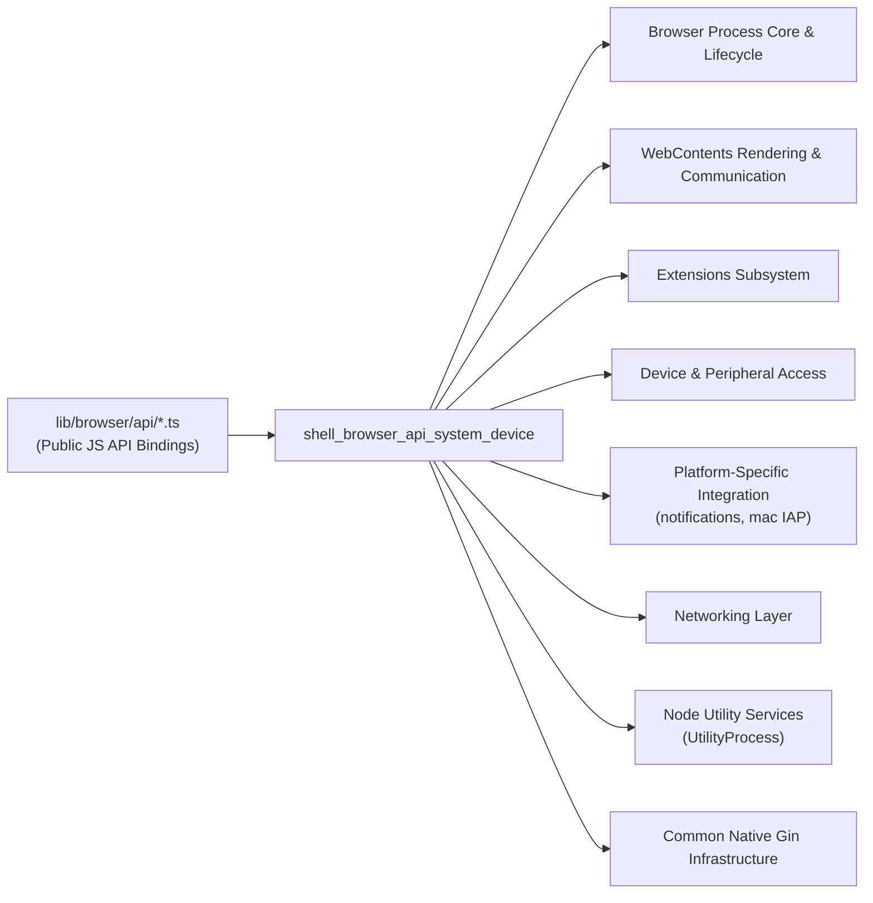

# System & Device API Bindings (`shell_browser_api_system_device`)

## Introduction

This module contains the browser-process Gin/V8 bindings that expose **application-level and
system/device-level capabilities** to Electron's main-process JavaScript API. It is the native
(C++) backing for globally-available singleton and factory-created objects such as `app`,
`autoUpdater`, `globalShortcut`, `powerMonitor`, `nativeTheme`, `screen`,
`systemPreferences`, `Notification`, `DesktopCapturer`, `Debugger`, `DownloadItem`,
`UtilityProcess`, and GPU introspection helpers.

Each class in this module is a `gin_helper::Wrappable` (or `gin::Wrappable`) that:
1. Wraps a native Chromium/Electron subsystem (power monitor, GPU data manager, wake lock
   service, extension registry, etc.).
2. Exposes a JS-friendly API surface via `GetObjectTemplateBuilder`.
3. Frequently emits events into JS through `gin_helper::EventEmitterMixin`.

This module sits at the top of Electron's public JS API surface for "system" concerns — as
opposed to window/UI (`shell_browser_api_window_ui`), web content
(`shell_browser_api_webcontents_core`), or session/network concerns
(`shell_browser_api_session_net`). It is a direct sibling of
[shell_browser_badging](shell_browser_badging.md) inside the broader
**System & App-Level Services API** area of the codebase.

## Architecture Overview

```mermaid
graph TB
    subgraph "shell_browser_api_system_device"
        App["App\n(electron_api_app.h)"]
        AutoUpdater["AutoUpdater"]
        Extensions["Extensions"]
        Debugger["Debugger"]
        DesktopCapturer["DesktopCapturer"]
        DownloadItem["DownloadItem"]
        GlobalShortcut["GlobalShortcut"]
        NativeTheme["NativeTheme"]
        Notification["Notification (JS API)"]
        PowerMonitor["PowerMonitor"]
        PowerSaveBlocker["PowerSaveBlocker"]
        PushNotifications["PushNotifications"]
        Screen["Screen"]
        SystemPreferences["SystemPreferences"]
        UtilityProcessWrapper["UtilityProcessWrapper"]
        ProcessMetric["ProcessMetric"]
        GPUInfoEnumerator["GPUInfoEnumerator"]
        GPUInfoManager["GPUInfoManager"]
    end

    App -->|owns/queries| ProcessMetric
    App -->|delegates GPU queries| GPUInfoManager
    GPUInfoManager -->|serializes gpu::GPUInfo via| GPUInfoEnumerator
    App -.->|BrowserObserver| Browser["Browser\n(shell_browser_core_lifecycle)"]
    App -.->|ElectronBrowserClient::Delegate| EBC["ElectronBrowserClient\n(shell_browser_main_parts_client_core_browser_client)"]
    PushNotifications -.->|BrowserObserver /\nElectronBrowserClient::Delegate| Browser
    AutoUpdater -.->|WindowListObserver| WindowList["WindowList\n(Window_List)"]
    Extensions -.->|ExtensionRegistryObserver| ExtSys["ElectronExtensionSystem\n(shell_browser_extensions_core_system)"]
    Notification -.->|delegates to| NotifPresenter["NotificationPresenter\n(shell_browser_notifications)"]
    DownloadItem -.->|wraps| DLItem["download::DownloadItem\n(Chromium)"]
    Debugger -.->|wraps| WebContentsCore["content::WebContents /\nDevToolsAgentHost"]
    DesktopCapturer -.->|wraps| DesktopMediaList["DesktopMediaList\n(Chromium)"]
    UtilityProcessWrapper -.->|spawns via| NodeService["NodeService\n(Node_Service)"]
    PowerMonitor -.->|Linux only| PowerObsLinux["PowerObserverLinux\n(shell_browser_lib)"]
```

## Sub-modules

For readability the module is documented as four focused sub-modules, grouped by the
sub-system they wrap:

| Sub-module | Focus | Doc |
|---|---|---|
| App, Process & GPU Info | Application singleton (`app`), child-process metrics, utility processes, GPU info plumbing | [shell_browser_api_system_device_app_process.md](shell_browser_api_system_device_app_process.md) |
| Updater & Extensions | Auto-update lifecycle and the `Extensions` manager for loading/tracking extensions | [shell_browser_api_system_device_updater_extensions.md](shell_browser_api_system_device_updater_extensions.md) |
| Capture & Debug | Screen/window capture source enumeration, remote debugging protocol, and download tracking | [shell_browser_api_system_device_capture_debug.md](shell_browser_api_system_device_capture_debug.md) |
| System Integration | OS-level integration: shortcuts, theming, power state, displays, system preferences, notifications, and in-app purchases | [shell_browser_api_system_device_system_integration.md](shell_browser_api_system_device_system_integration.md) |

## How this module fits into the overall system

Most classes in this module derive from shared infrastructure documented in
[Gin_Helper.md](Gin_Helper.md) (`Wrappable`, `EventEmitterMixin`, `Handle`, `Promise`) and the
Browser-process lifecycle described in
[shell_browser_core_lifecycle.md](shell_browser_core_lifecycle.md) (`Browser`, `BrowserObserver`).
GPU/child-process observation ties into
[shell_browser_main_parts_client_core_browser_client.md](shell_browser_main_parts_client_core_browser_client.md)
(`ElectronBrowserClient`), while `UtilityProcessWrapper` launches out-of-process Node
environments documented in [Node_Service.md](Node_Service.md).

## Key Design Patterns

- **Wrappable + EventEmitterMixin**: virtually every class exposes itself to JS as an
  `EventEmitter`-like object, forwarding native OS/Chromium callbacks (e.g.
  `OnSuspend`, `OnDisplayAdded`, `NotificationClick`) into `Emit(...)` calls consumed by JS
  listeners.
- **Singleton accessors**: `App::Get()`, `PushNotifications::Get()`, and
  `GPUInfoManager::GetInstance()` provide process-wide singletons reachable from native code
  outside the JS binding layer.
- **Delegate/Observer bridging**: classes such as `App` and `PushNotifications` implement
  `BrowserObserver` and `ElectronBrowserClient::Delegate` to receive lifecycle and
  content-layer callbacks and re-emit them as JS events.
- **Platform conditional compilation**: many classes (`PowerMonitor`, `SystemPreferences`,
  `InAppPurchase`, `UtilityProcessWrapper`) have significant `BUILDFLAG(IS_WIN/IS_MAC/IS_LINUX)`
  branches, reflecting that this module is the primary place OS-specific system integration is
  surfaced to JS.
