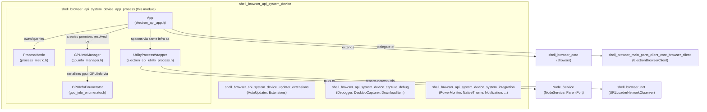
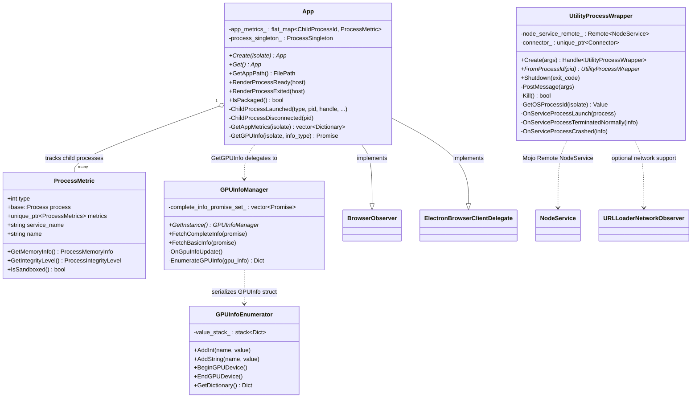
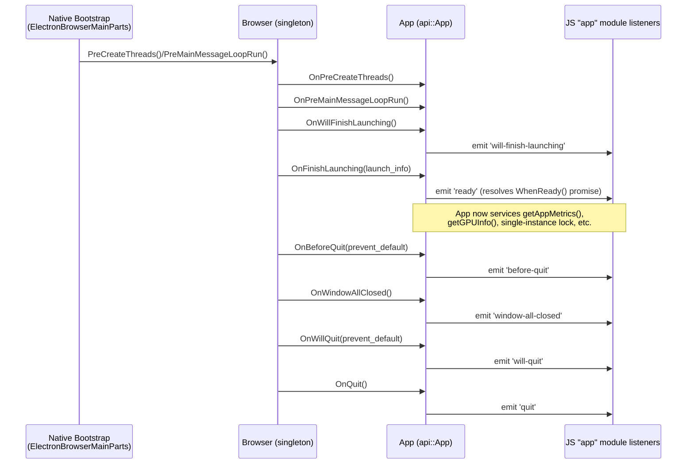
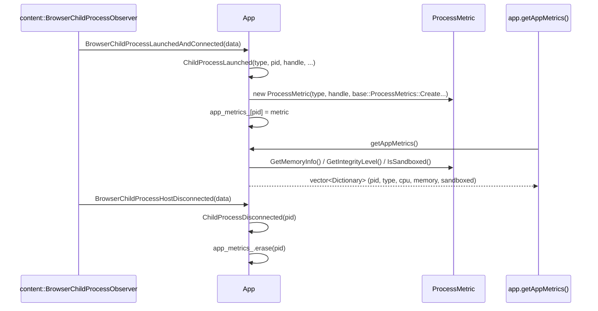
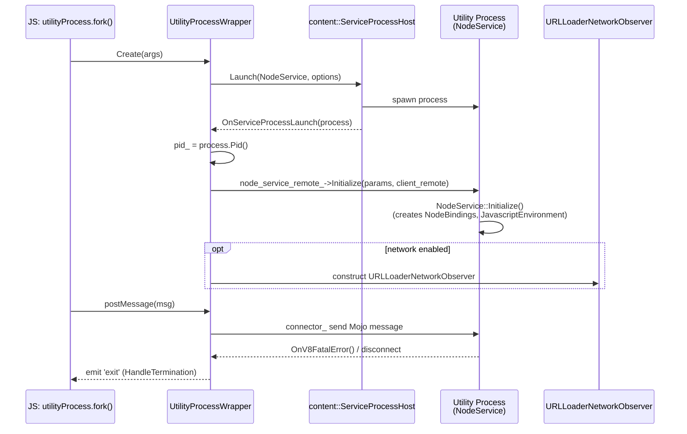
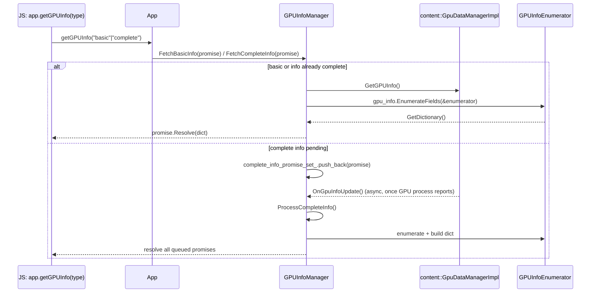
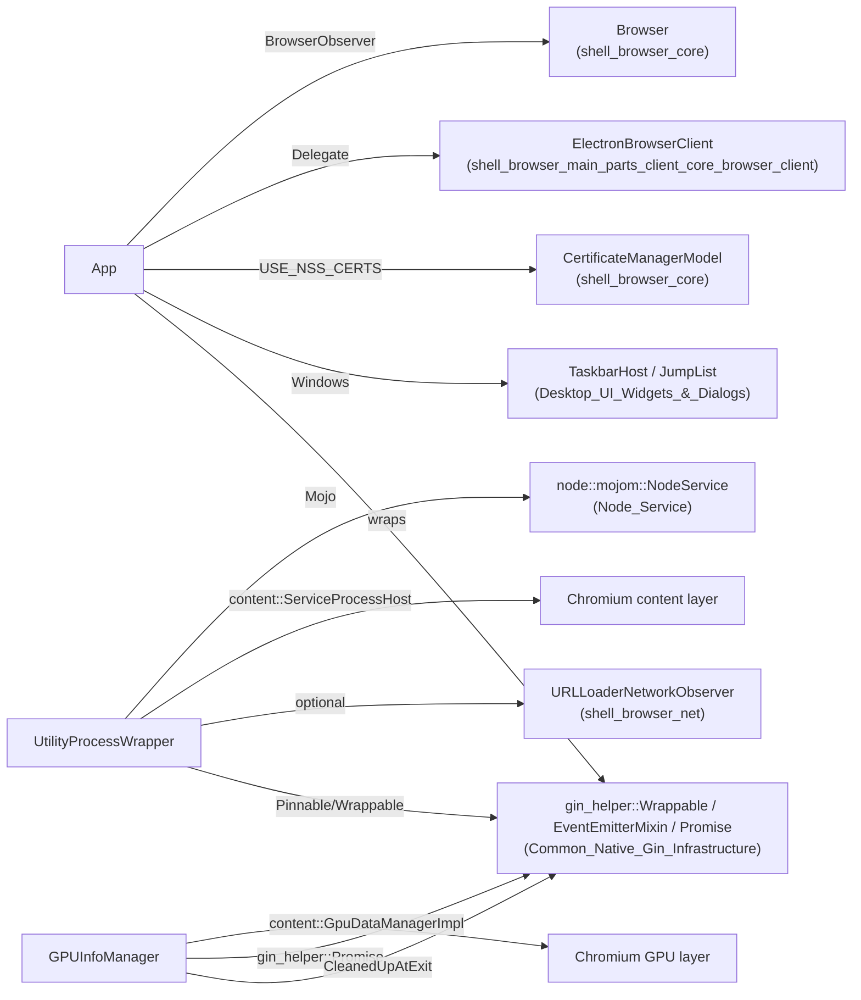

# Shell Browser API — System Device: App & Process (`shell_browser_api_system_device_app_process`)

## Introduction

This module implements the **core application (`app`) and process-management surface** of Electron's browser-process JavaScript API. It is the native (C++/gin) backing for the `app` module that Electron scripts consume in the main process, plus the supporting infrastructure needed to:

- Track the application's lifecycle (ready, quit, activation, single-instance locking, login items, recent documents, protocol handlers, etc.) — `App`.
- Spawn and manage independent Node.js-based **utility processes** launched via `utilityProcess.fork()` — `UtilityProcessWrapper`.
- Track OS-level process metrics (memory, sandboxing/integrity level) for the main process and any child processes (renderer, GPU, utility, extensions) — `ProcessMetric`.
- Query and serialize GPU information (`app.getGPUInfo()`) from Chromium's `gpu::GPUInfo` structure — `GPUInfoEnumerator` and `GPUInfoManager`.

Together these components form the **"App & Process"** sub-area of the larger [`shell_browser_api_system_device`](shell_browser_api_system_device.md) module, which itself groups all system/device-facing `app.*`-adjacent Electron APIs (updater, extensions, debugger, desktop capture, notifications, power monitor, etc.).

This document focuses on how the module is structured internally, how its pieces interact, and how it plugs into the rest of the Electron browser process.

---

## Module Scope & Position in the System

Related documentation:

- [`shell_browser_api_system_device.md`](shell_browser_api_system_device.md) — parent module, sibling sub-areas (updater/extensions, capture/debug, system integration).
- [`shell_browser_core.md`](shell_browser_core.md) — `Browser` singleton (application lifecycle events consumed by `App`).
- [`shell_browser_main_parts_client_core_browser_client.md`](shell_browser_main_parts_client_core_browser_client.md) — `ElectronBrowserClient`, whose `Delegate` interface `App` implements.
- [`Node_Service.md`](Node_Service.md) — `NodeService`/`ParentPort`, the Mojo service that backs each utility process's Node.js environment.
- [`shell_browser_net.md`](shell_browser_net.md) — networking primitives (`URLLoaderNetworkObserver`) used by utility processes needing network access.
- [`Common_Native_Gin_Infrastructure.md`](Common_Native_Gin_Infrastructure.md) — `gin_helper::Wrappable`, `Promise`, `EventEmitterMixin`, `Handle<T>` used throughout this module.

---

## Component Overview

| Component | File | Responsibility |
|---|---|---|
| `App` | `shell/browser/api/electron_api_app.h` | gin-wrapped singleton exposing the `app` JS module; orchestrates lifecycle, certificates, GPU queries, child-process tracking, single-instance lock, Jump List (Windows), Dock (macOS). |
| `ProcessMetric` | `shell/browser/api/process_metric.h` | Lightweight struct pairing a `base::Process` with `base::ProcessMetrics`, used to compute memory/CPU/sandbox info per tracked process. |
| `UtilityProcessWrapper` | `shell/browser/api/electron_api_utility_process.h` | gin-wrapped object backing `UtilityProcess` instances created by `utilityProcess.fork()`; manages the Mojo connection to a spawned Node service process, stdio piping, and lifecycle events. |
| `GPUInfoEnumerator` | `shell/browser/api/gpu_info_enumerator.h` | Implements `gpu::GPUInfo::Enumerator` to walk Chromium's GPU info structure and build a nested `base::Value::Dict`. |
| `GPUInfoManager` | `shell/browser/api/gpuinfo_manager.h` | Singleton that fetches "basic" or "complete" GPU info asynchronously (waiting on `GpuDataManager` updates as needed) and resolves JS promises with the result. |

---

## Architecture & Class Relationships

---

## `App`: Application Lifecycle & Facade

`App` is a singleton (`cppgc::Persistent<App> instance_`) exposed to JavaScript as the `app` module via `gin::Wrappable` + `gin_helper::EventEmitterMixin`. It is the largest and most central component in this module, acting as a **facade** over several browser-process subsystems:

- **Lifecycle events** — implements `BrowserObserver` to receive callbacks from [`Browser`](shell_browser_core.md) (`OnBeforeQuit`, `OnWillQuit`, `OnWindowAllClosed`, `OnQuit`, `OnActivate`, `OnFinishLaunching`, `OnPreMainMessageLoopRun`, `OnPreCreateThreads`, plus macOS-specific Handoff/user-activity callbacks) and re-emits them as `app` events to JS.
- **Content browser integration** — implements `ElectronBrowserClient::Delegate` methods such as `AllowCertificateError`, `SelectClientCertificate`, and `CanCreateWindow`, allowing JS-level `app` event handlers (`certificate-error`, `select-client-certificate`) to influence Chromium's content layer decisions. See [`shell_browser_main_parts_client_core_browser_client.md`](shell_browser_main_parts_client_core_browser_client.md).
- **GPU observation** — implements `content::GpuDataManagerObserver` (`OnGpuInfoUpdate`) and `content::BrowserChildProcessObserver` (`BrowserChildProcessLaunchedAndConnected/Disconnected/Crashed/Killed`) to track GPU process state and surface `gpu-info-update`/`child-process-gone` style events.
- **Process metric tracking** — maintains `app_metrics_`, a map from `content::ChildProcessId` to `std::unique_ptr<electron::ProcessMetric>`, populated in `ChildProcessLaunched` and cleared in `ChildProcessDisconnected`. `GetAppMetrics()` converts this map into the array of dictionaries returned by `app.getAppMetrics()`.
- **Single instance lock** — owns a `std::unique_ptr<ProcessSingleton> process_singleton_` and exposes `RequestSingleInstanceLock`/`ReleaseSingleInstanceLock`/`HasSingleInstanceLock`, plus `OnSecondInstance` as the callback invoked when a second app instance signals the first.
- **Platform-specific facades** — Windows Jump List (`GetJumpListSettings`/`SetJumpList`, backed by [Desktop UI Widgets & Dialogs → Windows UI](Desktop_UI_Widgets_&_Dialogs.md) `JumpList`), macOS Dock API and Handoff/user-activity (guarded by `BUILDFLAG(IS_MAC)`), certificate import via NSS (`ImportCertificate`, using [`CertificateManagerModel`](shell_browser_core.md)).
- **GPU info retrieval** — `GetGPUInfo(isolate, info_type)` returns a `v8::Local<v8::Promise>` fulfilled by delegating to `GPUInfoManager` (see below).

### App Lifecycle Sequence

### Child Process Tracking Flow

---

## `ProcessMetric`: Per-Process Resource Data

`ProcessMetric` is a plain data holder (not gin-wrapped itself) combining:

- `type` — child process type (renderer, GPU, utility, etc.), used by `App` for categorization in `getAppMetrics()`.
- `process` (`base::Process`) and `metrics` (`std::unique_ptr<base::ProcessMetrics>`) — Chromium primitives for sampling CPU/memory.
- `service_name` / `name` — optional identifiers, primarily populated for utility processes (correlates with `UtilityProcessWrapper` naming).
- Platform-conditional helpers:
  - Non-Linux: `GetMemoryInfo()` returning `ProcessMemoryInfo` (working set, peak working set, and on Windows, private bytes).
  - Windows: `GetIntegrityLevel()` / static `IsSandboxed(level)`.
  - macOS: `IsSandboxed()`.

`ProcessMetric` instances are exclusively owned by `App::app_metrics_`; there is a 1:1 mapping between a live child process and a `ProcessMetric` entry for the lifetime of that process.

---

## `UtilityProcessWrapper`: Node.js Utility Processes

`UtilityProcessWrapper` is the native backing object for `UtilityProcess` returned by `utilityProcess.fork()`. Unlike `App`/`GPUInfoManager` (singletons), each JS `UtilityProcess` instance corresponds to one `UtilityProcessWrapper`, created via the static `Create(gin::Arguments*)` factory and reference-managed through `gin_helper::Pinnable` (keeps the wrapper alive as long as the underlying process is running, even without JS references).

Key responsibilities:

- **Process spawning** — uses `content::ServiceProcessHost` to launch a sandboxed helper process running the `node_service` Mojo service (see [`Node_Service.md`](Node_Service.md)), observing launch via `OnServiceProcessLaunch(const base::Process&)`.
- **Mojo communication** — holds `mojo::Remote<node::mojom::NodeService> node_service_remote_` to send `Initialize()` with `NodeServiceParamsPtr`, and implements `node::mojom::NodeServiceClient` to receive callbacks (`OnV8FatalError`) from the child.
- **Message passing** — `mojo::Connector connector_` plus `mojo::MessageReceiver::Accept()` implement the low-level channel used by `PostMessage()`/`parentPort` in the child (paired with [`Node_Service.md`](Node_Service.md)'s `ParentPort`).
- **Stdio piping** — `IOHandle`/`IOType` enums configure whether stdin/stdout/stderr are piped, inherited, or ignored; platform-specific read handles/fds are stored for piped streams.
- **Lifecycle & termination** — implements `content::ServiceProcessHost::Observer` (`OnServiceProcessTerminatedNormally`, `OnServiceProcessCrashed`) and exposes `Kill()`/`Shutdown(exit_code)` to JS, emitting `exit`/`spawn` events via `EventEmitterMixin`.
- **Networking** — optionally constructs an `electron::URLLoaderNetworkObserver` (`url_loader_network_observer_`) when the utility process is created with network access enabled, connecting it into [`shell_browser_net`](shell_browser_net.md).
- **Lookup by PID** — static `FromProcessId(base::ProcessId)` allows other subsystems (e.g. `App::GetAppMetrics()`'s `name`/`service_name` enrichment) to resolve a running utility process wrapper.

### Utility Process Spawn Flow

---

## GPU Information: `GPUInfoManager` + `GPUInfoEnumerator`

These two classes implement `app.getGPUInfo(infoType)`:

1. `App::GetGPUInfo(isolate, info_type)` creates a `gin_helper::Promise<base::Value>` and calls either `GPUInfoManager::FetchBasicInfo()` or `FetchCompleteInfo()` depending on whether `info_type == "complete"`.
2. `GPUInfoManager` (a `gin_helper::CleanedUpAtExit` singleton) queries `content::GpuDataManagerImpl`:
   - **Basic info** is available immediately and resolved synchronously via `EnumerateGPUInfo`.
   - **Complete info** may require waiting for the GPU process to report full capabilities; if not yet available, the promise is queued in `complete_info_promise_set_` and resolved later inside `OnGpuInfoUpdate()` (triggered by `content::GpuDataManagerObserver`) via `ProcessCompleteInfo()`.
3. `EnumerateGPUInfo(gpu_info)` drives a `GPUInfoEnumerator` (implementing `gpu::GPUInfo::Enumerator`) which walks the GPU info structure field-by-field (`AddInt`, `AddString`, `AddBool`, `BeginGPUDevice/EndGPUDevice`, etc.), pushing/popping nested dictionaries on an internal `std::stack<base::Value::Dict>` to reconstruct the correct nesting (GPU devices, video/image codec profiles, overlay info, auxiliary attributes) before returning a flat `base::Value::Dict` via `GetDictionary()`.

### GPU Info Fetch Flow

---

## Cross-Module Dependencies

- **[`shell_browser_core`](shell_browser_core.md)** — provides the `Browser` singleton and `BrowserObserver` interface that drives `App`'s lifecycle event emission; also `CertificateManagerModel` used for NSS certificate import.
- **[`shell_browser_main_parts_client_core_browser_client`](shell_browser_main_parts_client_core_browser_client.md)** — `ElectronBrowserClient` invokes `App` as its `Delegate` for certificate errors, client cert selection, and window-creation policy.
- **[`Node_Service`](Node_Service.md)** — the Mojo service (`NodeService`, `ParentPort`) running inside each spawned utility process; `UtilityProcessWrapper` is the browser-side counterpart.
- **[`shell_browser_net`](shell_browser_net.md)** — supplies `URLLoaderNetworkObserver` used by utility processes that request network access.
- **[`Desktop_UI_Widgets_&_Dialogs`](Desktop_UI_Widgets_&_Dialogs.md)** — Windows `TaskbarHost`/`JumpList` types referenced by `App`'s Jump List APIs.
- **[`Common_Native_Gin_Infrastructure`](Common_Native_Gin_Infrastructure.md)** — shared `gin_helper` primitives (`Wrappable`, `DeprecatedWrappable`, `Pinnable`, `EventEmitterMixin`, `Promise`, `Handle<T>`, `CleanedUpAtExit`) used by all classes in this module to bridge C++ objects into the JS `app`/`UtilityProcess` API surface.
- **Sibling sub-modules** under [`shell_browser_api_system_device`](shell_browser_api_system_device.md): `shell_browser_api_system_device_updater_extensions` (AutoUpdater/Extensions, also reachable from `app`), `shell_browser_api_system_device_capture_debug` (Debugger/DesktopCapturer), and `shell_browser_api_system_device_system_integration` (PowerMonitor, NativeTheme, Notification) — these are exposed as separate JS singletons but are conceptually part of the same "system device" API family as `app`.

---

## Summary

The `shell_browser_api_system_device_app_process` module is the backbone of Electron's `app` object and its process-management capabilities:

- `App` centralizes lifecycle orchestration, delegating to `Browser` for platform lifecycle plumbing and to `ElectronBrowserClient` for content-layer policy decisions.
- `ProcessMetric` gives `App` a uniform way to report memory/sandbox statistics for every child process type.
- `UtilityProcessWrapper` extends process management beyond built-in Chromium process types, enabling arbitrary Node.js utility processes with full IPC, stdio, and network integration.
- `GPUInfoManager`/`GPUInfoEnumerator` provide the asynchronous, promise-based bridge between Chromium's internal GPU info structures and the JSON-like data returned by `app.getGPUInfo()`.

Together, these pieces let JavaScript code running in Electron's main process observe and control the application's lifecycle, spawn and monitor auxiliary processes, and introspect system/GPU state — all while integrating cleanly with Chromium's content and GPU subsystems.
