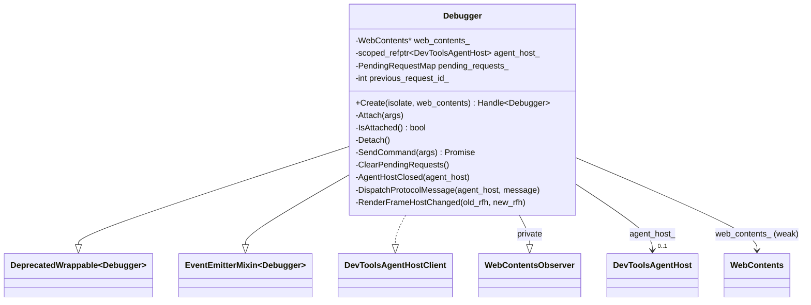
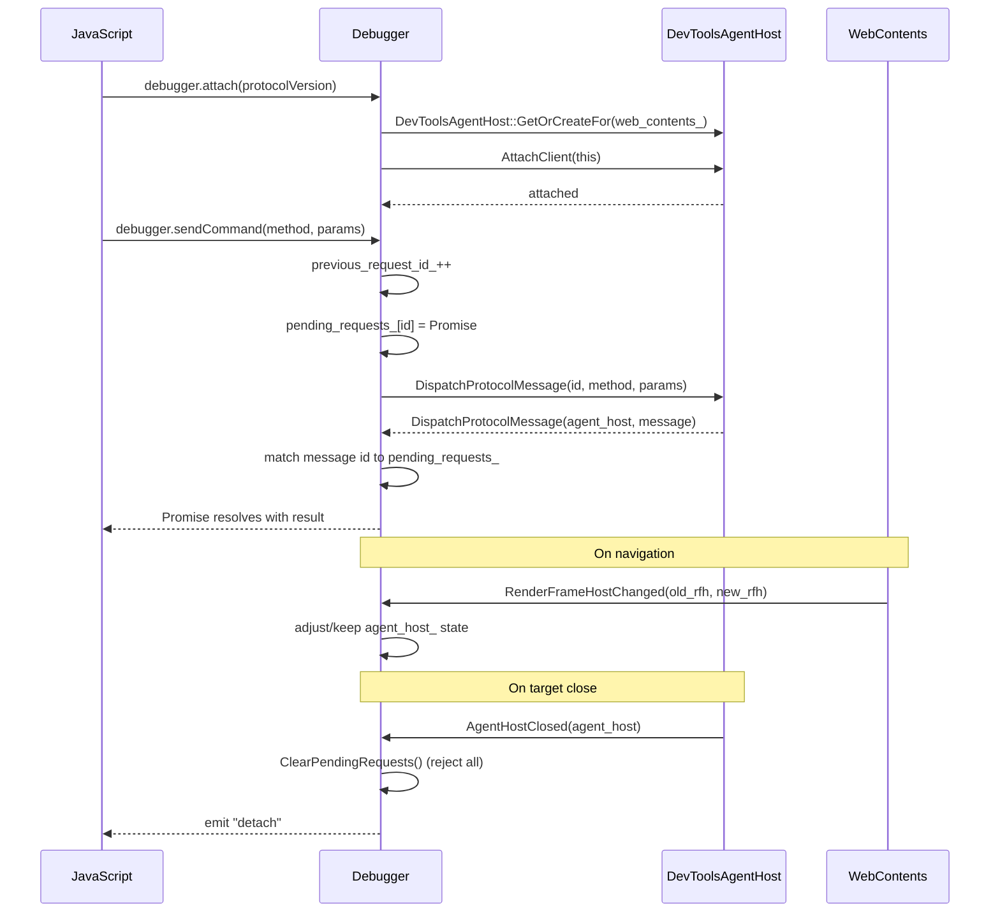
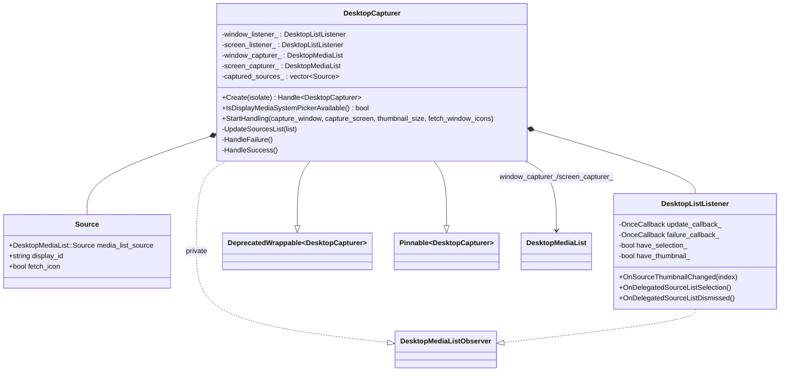
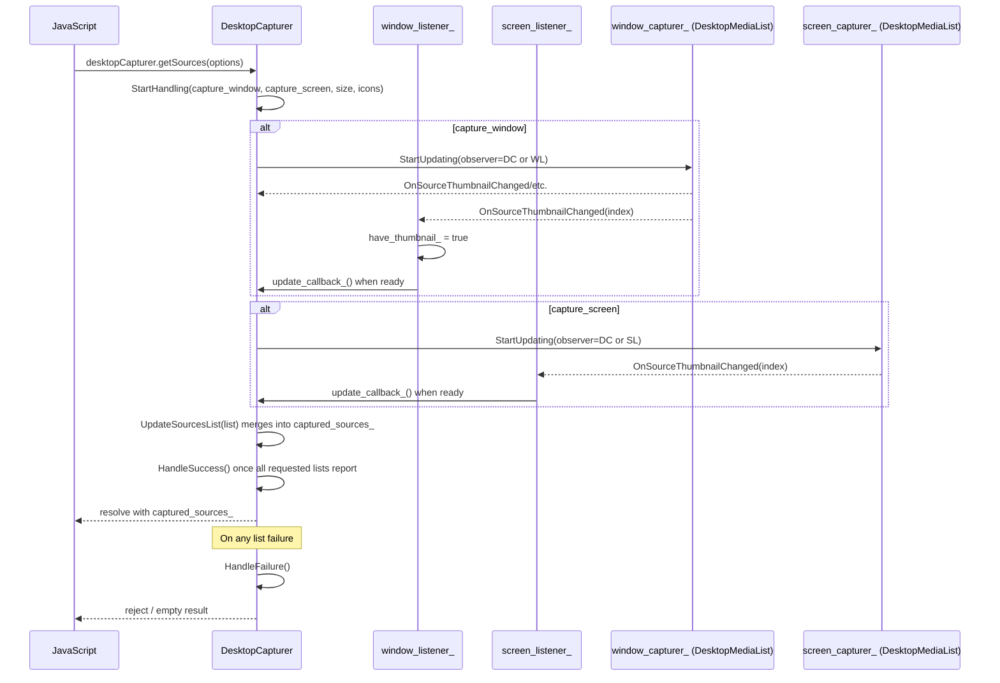
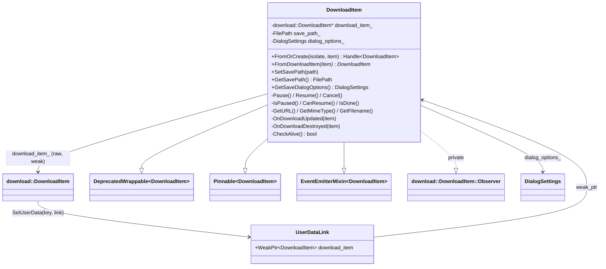
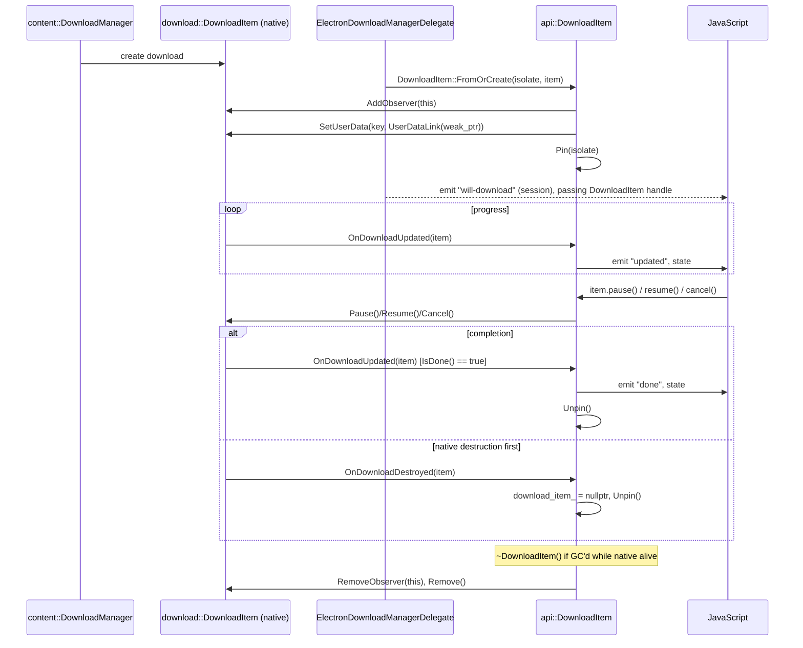
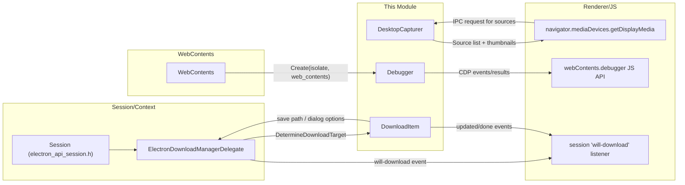

# Device Capture & Debug APIs (`shell_browser_api_system_device_capture_debug`)

## Introduction

This module implements three related, browser-process JavaScript APIs that Electron exposes to
application code for **inspecting**, **capturing**, and **downloading** content from
`WebContents` and the operating system:

| Class | Public API | Purpose |
|---|---|---|
| `Debugger` | `webContents.debugger` | Attaches to the Chrome DevTools Protocol (CDP) for a given `WebContents` and lets JS send/receive CDP commands and events. |
| `DesktopCapturer` | `desktopCapturer.getSources()` | Enumerates capturable screens/windows (with thumbnails) for use with `getUserMedia`/`getDisplayMedia`. |
| `DownloadItem` | `session.on('will-download', item => ...)` | Wraps a native `download::DownloadItem`, exposing pause/resume/cancel and progress/completion events to JS. |

All three classes follow Electron's standard **gin/gin_helper wrappable** pattern: they are
native C++ objects backed by Chromium subsystems (DevTools, `DesktopMediaList`,
`download::DownloadItem`), exposed to V8/JavaScript through `gin_helper::Wrappable` and
`gin_helper::EventEmitterMixin`, and (where relevant) kept alive across GC via
`gin_helper::Pinnable`.

This module is a child of
[`shell_browser_api_system_device`](shell_browser_api_system_device.md), sitting alongside
[`shell_browser_api_system_device_app_process`](shell_browser_api_system_device_app_process.md),
[`shell_browser_api_system_device_updater_extensions`](shell_browser_api_system_device_updater_extensions.md),
and [`shell_browser_api_system_device_system_integration`](shell_browser_api_system_device_system_integration.md).
It relies heavily on the common native infrastructure documented in
[`Gin_Helper`](Gin_Helper.md) and [`Common_API`](Common_API.md), and interacts with
[`shell_browser_api_webcontents`](shell_browser_api_webcontents.md) and
[`shell_browser_context`](shell_browser_context.md) for the `WebContents`/`BrowserContext` objects
it operates on.

---

## Module Purpose & Scope

The three components share a common theme: they bridge **native, event-driven Chromium
subsystems** into **promise/event-based JavaScript APIs**, while managing native object
lifetimes that are independent of the V8 garbage collector.

- **`Debugger`** — a thin CDP client bound to one `WebContents`. It implements
  `content::DevToolsAgentHostClient` to receive protocol messages and
  `content::WebContentsObserver` to detect frame changes, forwarding both to JS listeners.
- **`DesktopCapturer`** — an aggregator around Chromium's `DesktopMediaList` (for windows and
  for screens), listening for source changes via `DesktopMediaListObserver` and reporting a
  unified list of sources (with optional thumbnails/icons) back to JS.
- **`DownloadItem`** — a JS-facing wrapper around `download::DownloadItem` that observes
  download state transitions and exposes control methods (`pause`, `resume`, `cancel`) and
  metadata accessors (`getURL`, `getMimeType`, `getTotalBytes`, etc.).

## Architecture Overview

```mermaid
graph TB
    subgraph "JavaScript Layer"
        JS_Debugger[webContents.debugger]
        JS_Capturer[desktopCapturer.getSources]
        JS_DLItem[DownloadItem instance]
    end

    subgraph "shell_browser_api_system_device_capture_debug"
        Debugger[Debugger]
        DesktopCapturer[DesktopCapturer]
        DesktopListListener[DesktopCapturer::DesktopListListener]
        DownloadItem[DownloadItem]
        UserDataLink["UserDataLink (weak link helper)"]
    end

    subgraph "Chromium Native Subsystems"
        DevToolsAgentHost[content::DevToolsAgentHost]
        WebContentsObs[content::WebContentsObserver]
        DesktopMediaList["DesktopMediaList (window/screen)"]
        NativeDownloadItem[download::DownloadItem]
    end

    subgraph "gin_helper Infrastructure"
        Wrappable[gin_helper::Wrappable /\nDeprecatedWrappable]
        EventEmitterMixin[gin_helper::EventEmitterMixin]
        Pinnable[gin_helper::Pinnable]
        Promise[gin_helper::Promise]
        Handle[gin_helper::Handle]
    end

    JS_Debugger --> Debugger
    JS_Capturer --> DesktopCapturer
    JS_DLItem --> DownloadItem

    Debugger --> DevToolsAgentHost
    Debugger --> WebContentsObs
    Debugger --> EventEmitterMixin
    Debugger --> Wrappable
    Debugger --> Promise

    DesktopCapturer --> DesktopMediaList
    DesktopCapturer --> DesktopListListener
    DesktopCapturer --> Wrappable
    DesktopCapturer --> Pinnable

    DownloadItem --> NativeDownloadItem
    DownloadItem --> UserDataLink
    DownloadItem --> EventEmitterMixin
    DownloadItem --> Wrappable
    DownloadItem --> Pinnable

    Wrappable -.-> Handle
```

See [`Gin_Helper`](Gin_Helper.md) for details on `Wrappable`, `EventEmitterMixin`, `Pinnable`,
`Handle`, and `Promise`.

---

## Component: `Debugger`

### Overview

`Debugger` (`shell/browser/api/electron_api_debugger.h`) exposes the Chrome DevTools Protocol to
JavaScript on a per-`WebContents` basis. It is created lazily (typically the first time
`webContents.debugger` is accessed) via `Debugger::Create`.

Key responsibilities:
- **Attach/Detach** to a `content::DevToolsAgentHost` for the owning `WebContents`.
- **Send commands** (`sendCommand`) — returns a `v8::Promise` that resolves/rejects based on the
  CDP response, tracked in `pending_requests_` keyed by request id.
- **Receive events/responses** — via `DispatchProtocolMessage`, parsed and either resolved against
  a pending request or emitted as a `"message"` event.
- **React to navigation** — `RenderFrameHostChanged` is observed (via `WebContentsObserver`) to
  handle transitions like OOPIF/cross-process navigations that may affect the agent host.
- **Cleanup** — `AgentHostClosed` and `ClearPendingRequests` ensure no dangling promises when the
  target closes or crashes.

### Class Relationships

### Sequence: Attach & Send Command

### Notes
- `Debugger` privately inherits `content::WebContentsObserver` — it only reacts to
  `WebContents` lifecycle/navigation events, it does not expose observer methods publicly.
- Because CDP responses are asynchronous, every `sendCommand` call is backed by a
  `gin_helper::Promise<base::Value::Dict>` stored in `pending_requests_`; this is the same
  `Promise` type documented in [`Gin_Helper`](Gin_Helper.md).
- Related higher-level web contents concepts (the `WebContents` this class attaches to) are
  documented in [`shell_browser_api_webcontents_core`](shell_browser_api_webcontents_core.md).

---

## Component: `DesktopCapturer`

### Overview

`DesktopCapturer` (`shell/browser/api/electron_api_desktop_capturer.h`) implements the native
side of `desktopCapturer.getSources()`. It wraps two `DesktopMediaList` instances — one for
windows, one for screens — driving them through Chromium's `NativeDesktopMediaList` and
aggregating results into a single JS-visible list of `Source` structs.

Key responsibilities:
- **`StartHandling`** — configures which capturer(s) to run (`capture_window`,
  `capture_screen`), sets thumbnail size, and whether window icons should be fetched.
- **Nested `DesktopListListener`** — a private `DesktopMediaListObserver` implementation used to
  detect when a list has produced enough information (selection made / thumbnails ready) to
  invoke `update_callback_`, or signal failure via `failure_callback_`.
- **`UpdateSourcesList` / `HandleSuccess` / `HandleFailure`** — merge results from both listeners
  into `captured_sources_` and resolve the outstanding JS call, or report an error.
- **Pinning** — inherits `gin_helper::Pinnable` so the object survives GC while asynchronous
  capture/thumbnail work is in flight, even with no other live JS references.
- Static `IsDisplayMediaSystemPickerAvailable()` exposes whether the OS offers a native
  display-media picker (relevant on newer macOS/Windows).

### Class Relationships

### Sequence: Enumerating Sources

### Notes
- On Windows, `using_directx_capturer_` tracks whether the DirectX-based screen capturer is in
  use, which affects icon/thumbnail behavior.
- This component underpins the renderer-facing `getUserMedia`/`getDisplayMedia` flows; related
  media device concepts live in
  [`shell_browser_media`](shell_browser_media.md) (`MediaCaptureDevicesDispatcher`,
  `MediaDeviceIDSalt`).

---

## Component: `DownloadItem`

### Overview

`DownloadItem` (`shell/browser/api/electron_api_download_item.h/.cc`) wraps a native
`download::DownloadItem` so JavaScript can observe and control an in-progress or completed
download. Because the native download item and the JS wrapper have **independent lifetimes**
(the JS object is owned by V8, the native item by Chromium's download subsystem), the file uses
a `UserDataLink` (`base::SupportsUserData::Data`) to create a **weak** link from the native item
back to the `api::DownloadItem`, retrievable via `DownloadItem::FromDownloadItem`.

Key responsibilities:
- **`FromOrCreate`** — the standard factory: returns the existing wrapper if one is already
  attached to the native item (via `UserDataLink`), otherwise constructs a new one and `Pin`s it
  so it isn't GC'd while the download is active.
- **Observing native state** — implements `download::DownloadItem::Observer`:
  - `OnDownloadUpdated` emits `"updated"` while in progress, or `"done"` (and unpins) once
    `IsDone()`.
  - `OnDownloadDestroyed` clears the native pointer and unpins, guarding against use-after-free
    via `CheckAlive()`.
- **Control methods** — `Pause`, `Resume`, `Cancel`, guarded by `CheckAlive()` so calls after
  native destruction throw a JS error instead of crashing.
- **Metadata accessors** — URL, MIME type, byte counts/percent complete, filename (via
  `net::GenerateFileName`), timestamps, ETag, last-modified, and the associated save path /
  save-dialog options (`file_dialog::DialogSettings`, see
  [`UI_Dialogs`](UI_Dialogs.md)) which are consumed by
  `ElectronDownloadManagerDelegate` when determining where to save the file.

### Class Relationships

### Sequence: Download Lifecycle

### Notes
- `DownloadItem::GetSaveDialogOptions`/`SetSaveDialogOptions` and `GetSavePath`/`SetSavePath`
  are consumed by `ElectronDownloadManagerDelegate::GetItemSavePath` /
  `GetItemSaveDialogOptions` (in [`shell_browser_context`](shell_browser_context.md)) when
  determining the on-disk save location for a download — this is the primary integration point
  between this module and browser-context/session download management
  (`shell/browser/api/electron_api_session.h`, documented in
  [`shell_browser_api_session_net_session_core`](shell_browser_api_session_net_session_core.md)).
- The `GURL` type used for `GetURL`/`GetURLChain` is the shared Chromium URL type used
  throughout the codebase (see also [`Common_API`](Common_API.md) gin converters for
  URL/GURL marshaling).

---

## Cross-Module Data Flow

---

## Relationship to Sibling & Parent Modules

- **Parent:** [`shell_browser_api_system_device`](shell_browser_api_system_device.md) — groups
  this module together with process/GPU APIs
  ([`shell_browser_api_system_device_app_process`](shell_browser_api_system_device_app_process.md)),
  auto-update/extensions APIs
  ([`shell_browser_api_system_device_updater_extensions`](shell_browser_api_system_device_updater_extensions.md)),
  and OS integration APIs
  ([`shell_browser_api_system_device_system_integration`](shell_browser_api_system_device_system_integration.md)).
- **`WebContents` dependency:** `Debugger` and the download flow both key off a `WebContents`
  instance; see [`shell_browser_api_webcontents_core`](shell_browser_api_webcontents_core.md).
- **Session/BrowserContext dependency:** downloads are surfaced through `Session`'s
  `will-download` event and the `ElectronDownloadManagerDelegate`; see
  [`shell_browser_context`](shell_browser_context.md) and
  [`shell_browser_api_session_net_session_core`](shell_browser_api_session_net_session_core.md).
  Both the `Session` type and `ElectronBrowserContext` are declared in the parent
  [`shell_browser_context`](shell_browser_context.md) headers.
- **Native infrastructure:** all three classes build on
  [`Gin_Helper`](Gin_Helper.md) (`Wrappable`, `EventEmitterMixin`, `Pinnable`, `Handle`,
  `Promise`) and rely on gin type converters documented in
  [`Gin_Converters`](Gin_Converters.md) and [`Common_API`](Common_API.md) for marshaling
  values (URLs, dictionaries, file paths) between C++ and JS.
- **UI dialogs:** `DownloadItem`'s save dialog integration references
  `file_dialog::DialogSettings`, documented in [`UI_Dialogs`](UI_Dialogs.md).
- **Media devices:** `DesktopCapturer` results feed into WebRTC/getUserMedia flows alongside
  [`shell_browser_media`](shell_browser_media.md).

---

## Summary

| Aspect | Debugger | DesktopCapturer | DownloadItem |
|---|---|---|---|
| Native backing object | `content::DevToolsAgentHost` | `DesktopMediaList` (x2) | `download::DownloadItem` |
| Lifecycle management | Owned by `WebContents` accessor; not pinned | `Pinnable` — pinned during active enumeration | `Pinnable` — pinned until download is done/destroyed |
| Async completion mechanism | `gin_helper::Promise` per CDP request | Callback-driven (`DesktopListListener`) resolving overall `getSources` call | Observer-driven events (`updated`/`done`) |
| Key failure-safety mechanism | `ClearPendingRequests` on agent close | `HandleFailure()` on listener failure | `CheckAlive()` guarding all methods after native destruction |
| Cross-module consumer | `webContents.debugger` (DevTools protocol clients) | `desktopCapturer.getSources()` (renderer media picker) | `session.on('will-download')`, `ElectronDownloadManagerDelegate` |
