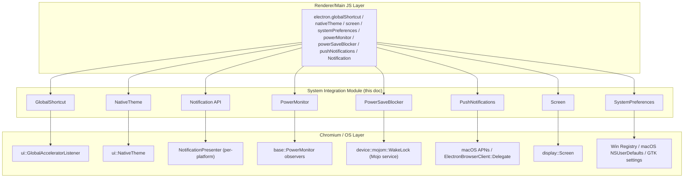
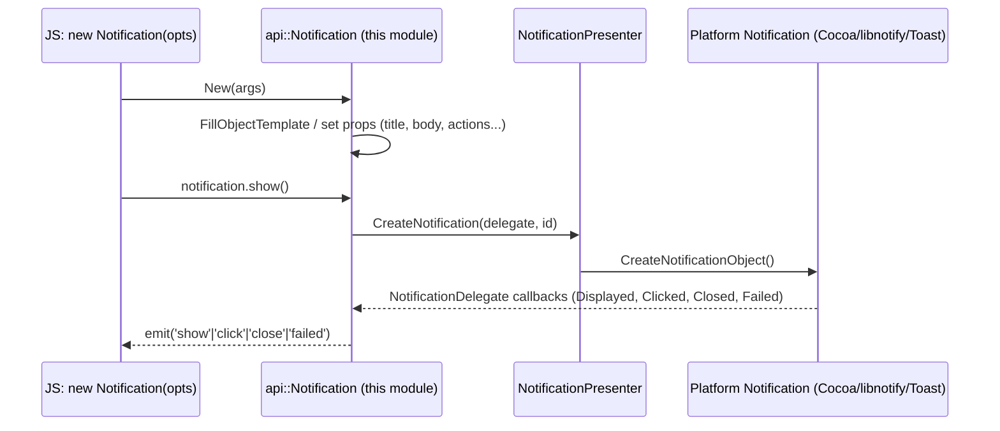

# Shell Browser API — System & Device Integration

## Introduction

The **System & Device Integration** module is a collection of native (C++/Gin-bound) API surfaces exposed to Electron's JavaScript layer that let applications interact with **operating-system-level facilities** that are not tied to a specific `BrowserWindow`, `WebContents`, or device peripheral. These are global, singleton-style services surfaced on the main process `electron` module, such as:

- Registering system-wide keyboard shortcuts (`globalShortcut`)
- Reading/observing OS light/dark theme and accessibility settings (`nativeTheme`)
- Displaying native OS notifications (`Notification`)
- Observing power state changes such as suspend/resume/battery status (`powerMonitor`)
- Preventing the system from sleeping (`powerSaveBlocker`)
- Registering for and receiving Apple Push Notification Service (APNs) tokens/messages (`pushNotifications`, macOS only)
- Querying multi-monitor display geometry and DPI scaling (`screen`)
- Reading miscellaneous OS/desktop-environment preferences such as accent colors, media access permissions, and Windows/macOS specific settings (`systemPreferences`)

This module sits inside the broader **System & App-Level Services API** family (see [shell_browser_api_system_device.md](shell_browser_api_system_device.md)), which is itself one of four sibling groupings under that parent:

- [shell_browser_api_system_device_app_process.md](shell_browser_api_system_device_app_process.md) — app lifecycle, process metrics, utility processes, GPU info
- [shell_browser_api_system_device_updater_extensions.md](shell_browser_api_system_device_updater_extensions.md) — auto-updater & extensions API surface
- [shell_browser_api_system_device_capture_debug.md](shell_browser_api_system_device_capture_debug.md) — debugger protocol, desktop capture, downloads
- **shell_browser_api_system_device_system_integration** (this module) — OS shortcuts, theme, notifications, power, screens, system preferences

All of these components are implemented using Electron's shared native-binding infrastructure documented in [Gin_Helper.md](Gin_Helper.md) (wrappable objects, object template builders, event emitter mixins) and [Common_API.md](Common_API.md) / [Gin_Converters.md](Gin_Converters.md) for marshalling values between V8 and native types.

## Architecture Overview

Each component in this module is an independent, mostly-singleton "gin wrappable" object that is instantiated once per app lifetime (or per isolate) and exposed to JS as a plain object/EventEmitter. None of these components depend on each other directly; instead they each independently plug into:

1. **`gin_helper::Wrappable` / `DeprecatedWrappable`** — provides the V8 object wrapping plumbing (see [Gin_Helper.md](Gin_Helper.md)).
2. **`gin_helper::EventEmitterMixin`** — gives the object Node.js-style `.on()/.emit()` semantics used to surface OS events (theme changed, display added, suspend, etc.) back into JS.
3. **Chromium/`//base` and `//ui` platform abstractions** — e.g. `display::Screen`, `ui::NativeTheme`, `base::PowerMonitor`, `device::mojom::WakeLock`, `ui::GlobalAcceleratorListener` — which are the actual cross-platform OS integration points that Chromium provides and that these classes observe or wrap.

Notification presentation itself (platform-specific rendering: libnotify on Linux, Cocoa/UNNotification on macOS, Toast on Windows) is implemented outside this module in the [shell_browser_notifications.md](shell_browser_notifications.md) module (part of [Platform-Specific Integration](Platform_Util.md)); the `Notification` class documented here is the **cross-platform Gin-wrapped facade** consumed from JS, delegating actual display work to a `NotificationPresenter`/`electron::Notification` pair.

`PushNotifications` additionally implements `ElectronBrowserClient::Delegate` and `BrowserObserver`, tying it into the browser process lifecycle described in [shell_browser_core_lifecycle.md](shell_browser_core_lifecycle.md) and [shell_browser_main_parts_client_core_browser_client.md](shell_browser_main_parts_client_core_browser_client.md).

`SystemPreferences` on Windows also implements `BrowserObserver` and `gfx::SysColorChangeListener`, tying its lifecycle to `OnFinishLaunching` from the `Browser` singleton (see [shell_browser_core_lifecycle.md](shell_browser_core_lifecycle.md)).

## Sub-modules

Given the relatively small size and flat nature of this module (8 largely independent header files, each defining a single top-level Gin-wrapped class with no cross-dependencies between them), the module is documented as logically grouped sub-modules rather than split into many files, to avoid fragmenting closely related, small components:

| Sub-module | Components | Description |
|---|---|---|
| [shell_browser_api_system_device_system_integration_input_display.md](shell_browser_api_system_device_system_integration_input_display.md) | `GlobalShortcut`, `Screen` | Global keyboard accelerator registration and multi-display geometry/DPI querying. |
| [shell_browser_api_system_device_system_integration_power.md](shell_browser_api_system_device_system_integration_power.md) | `PowerMonitor`, `PowerSaveBlocker` | OS power-state observation (suspend/resume, battery, thermal) and preventing sleep via wake locks. |
| [shell_browser_api_system_device_system_integration_notifications_theme.md](shell_browser_api_system_device_system_integration_notifications_theme.md) | `Notification`, `PushNotifications`, `NativeTheme`, `SystemPreferences` | Native OS notifications (local + APNs push), OS/UI theme observation, and miscellaneous system preference queries. |

## Component Interaction Example: Notification Lifecycle

## Cross-Module References

- Parent module: [shell_browser_api_system_device.md](shell_browser_api_system_device.md)
- Sibling modules: [shell_browser_api_system_device_app_process.md](shell_browser_api_system_device_app_process.md), [shell_browser_api_system_device_updater_extensions.md](shell_browser_api_system_device_updater_extensions.md), [shell_browser_api_system_device_capture_debug.md](shell_browser_api_system_device_capture_debug.md)
- Native binding infrastructure: [Gin_Helper.md](Gin_Helper.md), [Common_API.md](Common_API.md), [Gin_Converters.md](Gin_Converters.md)
- Browser process lifecycle used by `PushNotifications`/`SystemPreferences`: [shell_browser_core_lifecycle.md](shell_browser_core_lifecycle.md), [shell_browser_main_parts_client_core_browser_client.md](shell_browser_main_parts_client_core_browser_client.md)
- Platform-specific notification rendering: [shell_browser_notifications.md](shell_browser_notifications.md)
- Device/peripheral APIs (Bluetooth/HID/USB/Serial), a related but distinct concern: [shell_browser_bluetooth.md](shell_browser_bluetooth.md)
