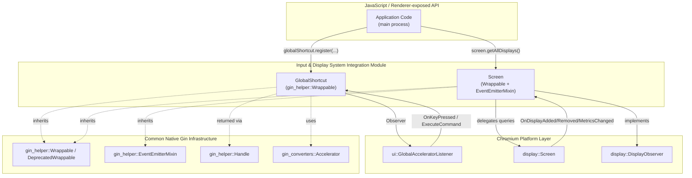
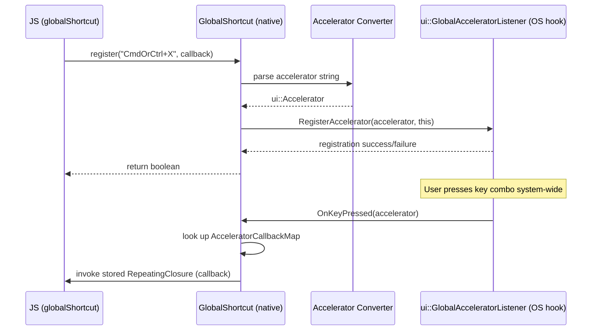
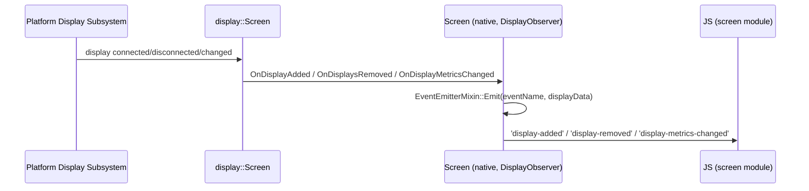
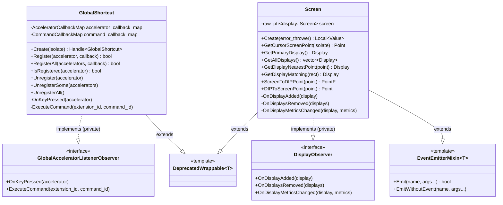

# Input & Display System Integration Module

## Introduction

The **Input & Display System Integration** module provides Electron's JavaScript API bindings for two core operating-system integration surfaces:

- **Global keyboard shortcuts** — registering, unregistering, and listening for system-wide (OS-level) keyboard accelerators that work even when the Electron application does not have focus.
- **Display/screen enumeration** — querying connected monitors, cursor position, DPI scaling, and reacting to display topology changes (added/removed/metrics-changed).

Both features are exposed to application JavaScript through the `electron` main-process API (`globalShortcut` and `screen`), and both sit on top of Chromium's low-level platform abstractions (`ui::GlobalAcceleratorListener` and `display::Screen`).

This module is a leaf component within the broader [System & App-Level Services API](shell_browser_api_system_device.md) subsystem, specifically nested under `shell_browser_api_system_device_system_integration`, alongside sibling modules for [power management](shell_browser_api_system_device_system_integration_power.md) and [notifications/theme](shell_browser_api_system_device_system_integration_notifications_theme.md).

---

## Module Purpose & Core Functionality

| Component | Responsibility |
|---|---|
| `GlobalShortcut` | Registers/unregisters OS-wide keyboard accelerators and dispatches callbacks when they are pressed. Also supports handling extension "commands" (used by the Extensions subsystem's `chrome.commands` API). |
| `Screen` | Wraps `display::Screen`, exposing display enumeration, cursor coordinate queries, and DPI conversion helpers. Emits events when displays are added, removed, or have metric changes (e.g., resolution/rotation/scale-factor changes). |

Both classes are **gin-wrappable** native objects (see [Common Native Gin Infrastructure](Common_Native_Gin_Infrastructure.md)), meaning they are constructed once in the browser process and exposed to JS via V8 object templates. `Screen` additionally mixes in `EventEmitterMixin`, allowing it to emit Node.js-style events (`'display-added'`, `'display-removed'`, `'display-metrics-changed'`) directly to JavaScript listeners.

---

## Architecture Overview

---

## Component Details

### GlobalShortcut

`GlobalShortcut` (`shell/browser/api/electron_api_global_shortcut.h`) is the native backing for the `globalShortcut` JS module. It is a singleton-style object created once via `GlobalShortcut::Create(isolate)`.

**Key responsibilities:**
- Maintains two internal maps:
  - `AcceleratorCallbackMap` — maps `ui::Accelerator` → `base::RepeatingClosure` for standard shortcut registrations.
  - `CommandCallbackMap` — maps extension command IDs → callbacks, supporting the Extensions subsystem's `chrome.commands` API.
- Implements `ui::GlobalAcceleratorListener::Observer` to receive OS-level key press notifications (`OnKeyPressed`) and extension command execution events (`ExecuteCommand`).
- Exposes register/unregister operations (`Register`, `RegisterAll`, `Unregister`, `UnregisterSome`, `UnregisterAll`, `IsRegistered`) to JavaScript through its `ObjectTemplateBuilder`.

**Dependencies:**
- `ui::Accelerator` and its gin conversion via [`accelerator_converter.h`](Common_Native_Gin_Infrastructure.md) (Gin Converters) — translates JS-level shortcut strings (e.g. `"CommandOrControl+Shift+K"`) to native `ui::Accelerator` objects.
- `extensions::ExtensionId` — ties into the [Extensions Subsystem](Extensions_Subsystem.md) for command-based shortcuts.
- `gin_helper::DeprecatedWrappable<GlobalShortcut>` — see [Common Native Gin Infrastructure](Common_Native_Gin_Infrastructure.md).

### Screen

`Screen` (`shell/browser/api/electron_api_screen.h`) is the native backing for the `screen` JS module, and is unusual among Electron API objects in that it must be available very early (before `app.whenReady()`), since Chromium's display subsystem initializes early in startup.

**Key responsibilities:**
- Wraps a raw, non-owned pointer to `display::Screen` (the platform's singleton screen implementation) via `raw_ptr<display::Screen>`.
- Provides query methods:
  - `GetCursorScreenPoint` — current mouse cursor location.
  - `GetPrimaryDisplay` — the primary/default monitor.
  - `GetAllDisplays` — full list of connected displays.
  - `GetDisplayNearestPoint` / `GetDisplayMatching` — geometry-based display lookup.
  - `ScreenToDIPPoint` / `DIPToScreenPoint` — pixel ↔ device-independent-pixel coordinate conversion (important for HiDPI/Retina support).
- Implements `display::DisplayObserver` to receive `OnDisplayAdded`, `OnDisplaysRemoved`, and `OnDisplayMetricsChanged` callbacks, which it turns into JS events via its `EventEmitterMixin` base class.

**Dependencies:**
- `display::Screen`, `display::Display`, `display::DisplayObserver` — Chromium's cross-platform display abstraction.
- `gfx::Point`, `gfx::PointF`, `gfx::Rect` — Chromium geometry primitives, also converted for JS consumption via [`gfx_converter.h`](Common_Native_Gin_Infrastructure.md) (Gin Converters).
- `gin_helper::EventEmitterMixin<Screen>` and `gin_helper::DeprecatedWrappable<Screen>` — see [Common Native Gin Infrastructure](Common_Native_Gin_Infrastructure.md).
- `gin_helper::ErrorThrower` — used during creation to surface initialization errors to JS.

---

## Data Flow

### Global Shortcut Registration & Firing

### Display Change Propagation

---

## Component Interaction (Class Relationships)

---

## Integration with the Broader System

- **Parent module:** [System & App-Level Services API](shell_browser_api_system_device.md) — groups this module with app lifecycle, power, capture/debug, and updater/extension APIs.
- **Sibling modules:**
  - [Power System Integration](shell_browser_api_system_device_system_integration_power.md) — `PowerMonitor` / `PowerSaveBlocker`, another OS-integration surface following the same Wrappable pattern.
  - [Notifications & Theme System Integration](shell_browser_api_system_device_system_integration_notifications_theme.md) — `Notification`, `NativeTheme`, `SystemPreferences`.
- **Infrastructure dependency:** [Common Native Gin Infrastructure](Common_Native_Gin_Infrastructure.md) supplies the `Wrappable`/`DeprecatedWrappable` base classes, `EventEmitterMixin`, `Handle<T>`, `ObjectTemplateBuilder`, and the gin converters (`accelerator_converter.h`, `gfx_converter.h`) that translate between V8 values and native Chromium types used by both `GlobalShortcut` and `Screen`.
- **Cross-cutting consumer:** The [Extensions Subsystem](Extensions_Subsystem.md) relies on `GlobalShortcut`'s `CommandCallbackMap`/`ExecuteCommand` path to implement the `chrome.commands` extension API surface.
- **Window/UI consumers:** [Native Window & Menu Management](Native_Window_%26_Menu_Management.md) and [Desktop UI Widgets & Dialogs](Desktop_UI_Widgets_%26_Dialogs.md) commonly query `Screen` (e.g., for display bounds when positioning windows, trays, or dialogs).

---

## Lifecycle Notes

- **`GlobalShortcut`** is created lazily on first access from JS (`Create(isolate)`) and is automatically un-registered from the OS hook when unregister APIs are called or the object is destroyed, preventing dangling system-wide hooks after app shutdown.
- **`Screen`** must be initialized after Chromium's `display::Screen` singleton exists, which is typically very early in browser startup (before most other Electron main-process modules are ready). Because of this, `screen` is one of the few Electron modules usable immediately after `app` module load, without waiting for `app.whenReady()`.
- Both classes use **raw/non-owning pointers or observer patterns** rather than owning the underlying platform objects (`ui::GlobalAcceleratorListener`, `display::Screen` are Chromium-managed singletons), keeping this module a thin JS-facing adapter layer.
